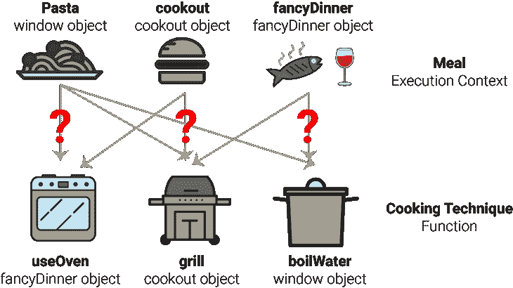
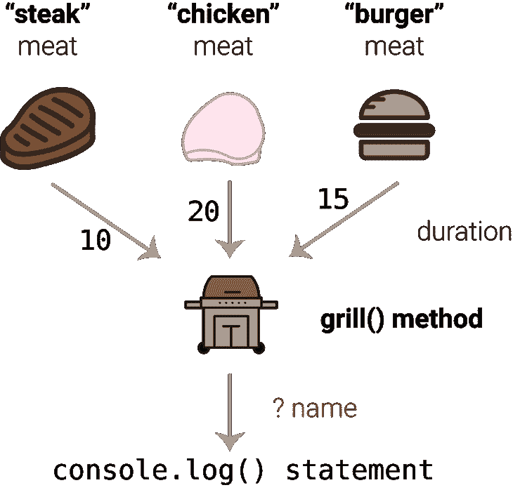
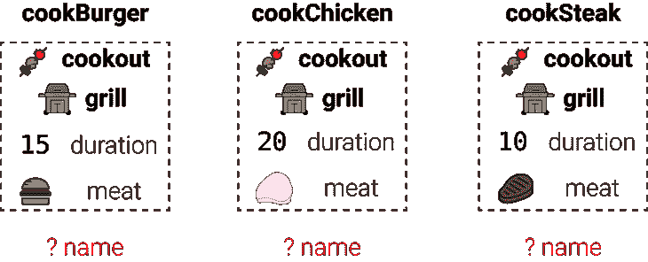
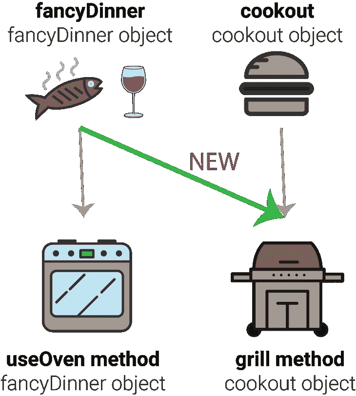
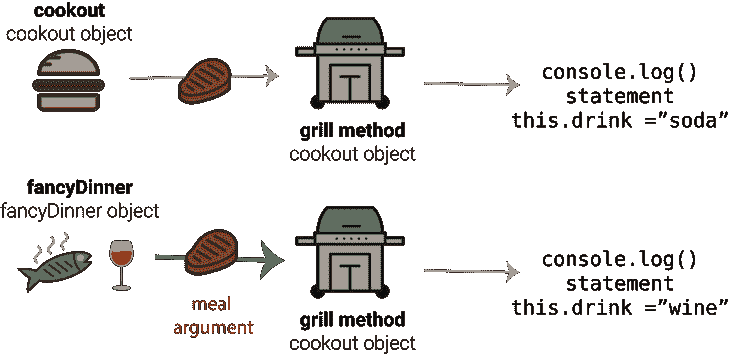
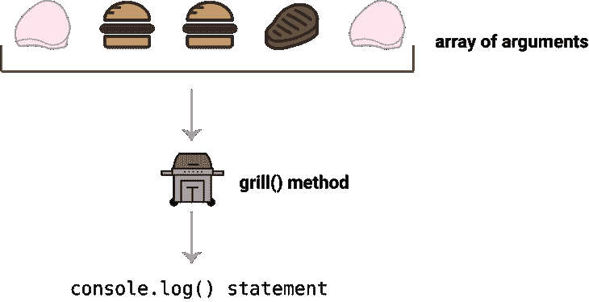

# JavaScript 的 apply、call 和 bind 通过举办一次户外活动来解释

> 原文：<https://www.freecodecamp.org/news/javascripts-apply-call-and-bind-explained-by-hosting-a-cookout-84b85977ee11/>

凯文·科诺年科

# JavaScript 的 apply、call 和 bind 通过举办一次户外活动来解释

如果你曾经在家庭活动或聚会上负责操作烤架，那么你就能理解 JavaScript 中的应用、调用和绑定。

如果你想写出清晰的代码，让你(或你的队友)以后可以重读，这里有一个通用的规则:不要重复你自己！

如果您创建重复的方法或函数，您的代码将更难维护。你会因为忘记更新同一代码的多个版本而产生错误。

如果你对 JavaScript 中 *this* 的[概念有很深的理解，你就会知道当你试图跟踪**的执行上下文**时，这可能特别具有挑战性。这就是**函数**和被调用的**对象**之间的关系。](https://blog.codeanalogies.com/2018/03/12/javascripts-this-explained-by-starting-a-high-school-band/)

为了编写更干净的代码，您可以使用 **apply、call 和 bind 方法**有目的地操纵执行上下文。不同的对象可以共享方法，而无需为每个单独的对象重写它们。

Apply、call 和 bind 有时被称为**函数方法**，因为它们与函数一起被调用。

如果你在寻找更技术性的解释，我推荐来自 [JavaScriptIsSexy](http://javascriptissexy.com/javascript-apply-call-and-bind-methods-are-essential-for-javascript-professionals/) 的指南。

### 这和烹饪有什么关系？

这三种方法有点像运用烹饪技巧来为户外烹饪准备食物。想想你可能需要烹饪的不同环境:

1.  你可以随时做一顿普通的饭，让每个人都开心(意大利面和调味汁)
2.  野餐也可能是聚会(汉堡、热狗等)。)
3.  专为你和你的伴侣准备的豪华晚餐(鱼和酒)
4.  为家常便饭制作甜点(蛋糕)

每一种都需要不同的烹饪技巧。有些是特定环境下特有的，而有些则更为普遍。一会儿我会解释更多。

在这种情况下，每个烹饪上下文都有点像一个对象。例如，如果你说你要在烤架上烹饪，这意味着你有一些技能…比如操作烤架！

因此，如果我们对你可能使用的每一种烹饪技术都有一个单独的方法，那么对每一个物体都会有一些独特的方法，在某些情况下，一种方法可以应用于多个物体。

在上面的代码中，烧水是一个通用的技能，可能适用于任何环境。

我们来举个例子。grill() **方法**在 cookout **对象**的上下文中。这意味着，如果你正在举行一次户外烧烤，你期望你将需要调用这些烧烤技能。

但是等等。当野餐结束时，你不会忘记如何使用烤架！假设你是你的伴侣，想要为一顿丰盛的晚餐做一块牛排，就像你喜欢的一样。您仍然希望能够从 cookout 对象借用 grill()方法。这就是应用、调用和绑定的用武之地。

烹饪技能(方法)和烹饪环境(对象)之间的这种关系将是我展示如何使用 apply、call 和 bind()的主要方式。

为了理解本教程，你需要理解 JavaScript 中的*这个*。如果你需要复习的话，可以看看我的关于 JavaScript 的*的[教程。](https://blog.codeanalogies.com/2018/03/12/javascripts-this-explained-by-starting-a-high-school-band/)*

### *Bind 方法简介*

*让我们想象一下，你正在为你儿子或女儿的 10 岁生日聚会举办一次户外野餐。你想在烤架上烹饪三种肉来满足每个人:鸡肉、汉堡和牛排。在这个聚会上，他们显然都是肉食者。*

*然而，你不知道每个人想要什么！所以你需要问每个出席者他们什么时候到达聚会。每种肉类通常需要相同的步骤:*

1.  *加入调味料*
2.  *把它放在烤架上*
3.  *一定时间后从烤架上取下*

*所以没有必要为每种肉编写单独的方法。唯一不同的是烹饪时间。汉堡需要 15 分钟，鸡肉需要 20 分钟，牛排需要 10 分钟。*

*我们希望对所有这些类型的肉类使用相同的一般流程。细节会有所不同。*

*你可能会想，“哦，这是一个函数的伟大时刻！”但是事情比这要复杂一点。正如我们上面所说，我们正在尝试使用**执行上下文**的概念来展示我们的烹饪技巧。你不会想第一次为整个聚会做汉堡、鸡肉和牛排。所以，我们必须展示你在多年烹饪中获得的技能，以及你将如何把它们应用到这个特定的场景中。*

**

*在这种情况下，我们的 grill 方法只是记录一个句子，告诉我们这个人的食物什么时候准备好。我们将使用 bind()存储一个**执行上下文**。明确地说，执行上下文将有两个重要的细节。*

1.  *对 *cookout* 对象的引用，以确保我们使用正确的对象*
2.  *烹饪的分钟数*

*这代表了我们现有的关于如何烹饪不同种类肉类的知识。在每种情况下，我们都存储对象和分钟数，因此我们可以快速处理来自所有聚会参与者的请求。*

*每个变量——cook burger、cookChicken 和 cook steak——都是一个新的函数，可以在任何时候通过多一个参数来执行:人名。这是三个人和他们的食物要求:*

1.  *杰克想要一个汉堡*
2.  *吉尔想要牛排*
3.  *大卫想要鸡肉*

*通过使用我们的新函数，我们可以快速接受这些请求，而无需重写 grill 方法。下面的每个示例都采用函数在 cookout 对象的上下文中执行所需的最后一个参数。*

**

*想象一下，如果您不能在这里使用 bind 方法！这有点像聚会开始时你第一次做汉堡、鸡肉和牛排。您将向一个通用的 grill()方法输入三个参数，而没有预先计划。*

*相反，我们使用**部分函数应用**来表明我们知道如何烹饪每一种肉。我们只需要知道每位客人想吃什么。这种分裂代表了你的实际烹饪经验。*

### *呼叫方法介绍*

*这是另一个场景。比方说，当你和你的伴侣做一顿丰盛的晚餐时，你通常喜欢做一些鱼和酒。从第一个代码片段中可以看出，您通常喜欢在烤箱中烹饪鱼。*

*但是，有一天晚上，你决定改做牛排。显然，你需要用烤架来做牛排。*

**

*问题就在这里:你的 grill() **方法**在 cooking out**对象**的上下文中！但是现在，您想在 fancyDinner 对象中使用这些烹饪技巧。记住，**你不希望重写 grill 方法—** 那会使你的代码更难维护。*

*相反，您可以使用 JavaScript 的 call()方法在 *fancyDinner* 对象的上下文中调用 grill 方法。通过使用这个新的上下文，您不需要重写它。在我们进入细节之前，这里是完整的代码。*

**

*所以，我们户外野餐的默认饮料是苏打水，高级晚餐的默认饮料是葡萄酒。现在，我们只需要在 call()方法中添加不寻常的部分作为**参数**—“steak”下面是正常使用方法和使用 call()之间的区别。*

**

*第一个例子应该非常简单:这都是在 cookout 对象的上下文中。但是在第二个例子中，第一个参数将*这个*的上下文更改为 *fancyDinner* 对象！*

*当您使用 grill()方法中的 console.log 语句时，您可以看到它引用了一个参数， *meal，*以及 *this.drink.**

*当使用 fancyDinner 作为 call 方法的第一个参数时，会将上下文设置为 fancyDinner 对象。现在，你可以在另一个环境中使用这些烧烤技巧。*

### *应用方法的介绍*

*apply()方法与 call()非常相似，除了一个重要的区别。它可以接受一组参数，而不是声明单个参数。这意味着您可以创建一个**可变函数**——也就是说，一个具有任意数量参数的函数。因此，它只能接受两个参数:上下文和一组参数。*

*让我们回到最初的生日聚会例子。你正在为你儿子或女儿的 10 岁生日聚会举办一次户外野餐。12 个孩子回答说他们会去，但你不知道有多少会真的出现。所以，你需要准备好为未知数量的人烧烤。*

*然而，与 bind()不同，用 apply()调用的函数将被立即调用。*

*因此，我们需要创建一个函数，它可以处理数量未知的餐单数组，并返回您需要放在烤架上的食物的完整列表。我们可以保留阵列的组织结构，这有助于为我们提供请求进入的顺序。*

*这里有几件重要的事情需要注意。首先，注意 grill 方法没有任何参数。这和过去不一样！为了解决这个问题，我们在第 4 行使用 arguments 对象。JavaScript 中的 [arguments 对象为我们提供了一个类似数组的对象，其中充满了函数的参数。](https://developer.mozilla.org/en-US/docs/Web/JavaScript/Reference/Functions/arguments)*

*要将其转换为实际的数组，我们必须使用数组原型中的 slice()方法。这是 call()方法的另一个方便的应用，因为 slice()方法不是对象固有的。*

*最后，我们必须使用 apply()调用函数，以便访问 mealOrders 属性中的数组。以下是如何做到这一点。*

**

*我们仍然必须使用 *cookout* 作为第一个参数，因为就像 call()一样，我们必须声明执行上下文。然后，我们可以从 mealOrders 属性获取数组。*

*这允许我们在 grill()方法中使用无限数量的元素，因为我们可以将一个数组作为第二个参数传入。*

### *获取最新教程*

*你喜欢这个教程吗？为它鼓掌，这样其他人也能找到它。或者，在这里注册从 [CodeAnalogies 博客](http://codeanalogies.com)获取我最新的可视化教程:*