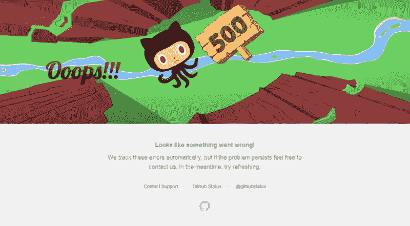

# 如何用 Javascript 创建一个类似 Python 的装饰器

> 原文：<https://www.freecodecamp.org/news/creating-a-python-like-decorator-in-javascript-dce3415115c8/>

由 sam galizia

# 如何用 Javascript 创建一个类似 Python 的装饰器

在本文中，我想向您展示我如何用 JavaScript 创建一个类似 Python 的装饰函数，并且在这个过程中，展示至少一个实际的用例。

最后，我想展示一下我是如何用它来解决一个更深入的问题的，也许会启发你们中的一些人也这样做！

#### 入门指南

让我们从 Python 中 decorators 的快速复习(或课程)开始。在 Python 中，有一些叫做 decorators 的函数遵循这个语法，`@decorator`。

在代码中，它们后面会跟另一个函数，如下所示:

上面的代码片段使用了 Python 中使用 decorators 的语法糖版本。为了更好地理解这里发生了什么，让我们去掉这个语法糖。

在第二个片段中，我们正在看装饰器的定义，以及如何在没有语法糖的情况下装饰一个函数。

最重要的一点是，装饰者只是将我们的原始函数包装在一个包装函数中并调用它。

通过使用这种包装函数的技术，我们能够在函数运行前后执行任务。让我们来看一个用例，它将进一步阐明这一切是如何工作的。

#### 创建我们的室内设计师

我们将创建一个计时装饰器，它将告诉我们一个函数运行需要多长时间。

在 timing decorator 中，我们从记录当前时间并将其保存为 start 开始。然后我们执行原来的函数，完成后，将当前时间标记为 end。最后，我们返回开始时间和结束时间之间的差值，这实际上给出了运行该函数所花费的时间。

对于装饰者来说，这个简单的用例只是冰山一角。在我们更深入地研究用例之前，我想展示一下在 JavaScript 中实现同样的结果是多么容易。

你在上面看到的是我们用 Python 制作的相同的时序装饰器，但是是用 Javascript 编写的。我想强调一些与 Python 版本不同的小语法变化。

首先，在我们的装饰函数中，我们使用了 JavaScript 中的匿名函数。使用匿名函数也允许我们在定义它的时候返回它。

其次，我们还在第 10 行的函数表达式语法中使用了匿名函数。我们将匿名函数作为参数传递给`timing`，而不是使用命名函数。

这些是语言中的小语法差异，如果您不熟悉它们，希望不会让您犯太多错误。

#### 潜得更深

既然我们已经看了一个简单的例子，我想深入一个更有用的例子。在这个过程中，我们将逐步解决我在决定采用这个解决方案时遇到的问题。

这是一个分为两部分的问题，所以让我们看看第一部分:失败的网络调用。

GitHub’s 500 Internal Server Error Page

使用 API 时，您无疑会发现自己在处理由于各种原因而失败的网络调用。如果我们能让这些网络呼叫自己重试，那不是很好吗？

正好你可以！在下面的代码片段中，我们将在 Javascript 中创建一个装饰器，它将使用一个名为 retry 的 npm 库来完成这项工作。

*另外，完全可以自己编写重试代码。我选择使用一个库来简化事情，因为这不是本文的重点。

好吧，这是很难接受的！我试图对部分内容进行注释，以帮助解释正在发生的事情，但是让我们一步一步地分解它。

首先，我们需要重试库，可以在这里找到，然后继续创建我们的装饰函数。

在我们的装饰器中，我们要做的第一件事是创建一个操作。操作是重试库的一部分，表示我们想要做的事情可能需要多次尝试。

在操作设置中，您可以看到我已经设置了`{retries: 2}`。选项可以作为包含要更改的配置选项的对象传递到操作构造函数中。设置`retries`可以指定最大尝试次数。

重试库有相当多的配置，您可以利用它来定制您的重试功能，但我不想被它误导。查看 [npm 库](https://www.npmjs.com/package/retry)了解更多信息！

接下来，我们设置匿名函数来包装我们的原始函数。当你看第 9 行`const args = arguments;`时，你可能有点困惑。我知道我第一次看到这个的时候很困惑，所以我来解释一下。

基本上，由于我们在更低的范围内调用函数内部的`wrapped`,我们现在需要从它那里获取参数，以便我们以后可以访问它们。关键字`arguments`从当前函数范围中获取参数作为数组。我们将当前的`arguments`存储在`args`中，以便以后使用。

接下来的部分是事情开始变得有点混乱的地方。我正在使用一个返回承诺的网络库，正因为如此，我们需要在装饰器内部拦截承诺。拦截它允许我们检查它是成功还是失败，然后对它做一些事情。

下面只是我们的装饰包装函数的内部部分。

为了拦截来自网络调用的响应，我们将我们的操作(包含我们想要重试的函数)包装在另一个承诺中。对于那些以前使用过承诺的人来说，我知道这可能很奇怪，但这是必要的，以确保我们在这里处理那个调用的结果。当我展示最后一个例子时，原因会更加明显，所以请继续关注！

继续，现在我们已经包装了原始函数和承诺中的操作重试，我们实际上可以调用`wrapped`。当我们调用它时，我们需要确保使用`apply(context, args...)`,以便可以使用我们传递给它的原始参数。

一旦我们得到网络调用的响应，我们就处理成功和错误案例。这里的成功案例很无聊:基本上，如果我们得到了成功的回应，我们就用结果解决了外部承诺。

错误案例有趣多了！如果请求失败，我们想再试一次，对吗？这个片段`if (operation.retry(err)) { return; }`很有趣，因为它是重试库的核心。我们基本上是在尝试再次调用这个函数。这样做时，我们将当前错误传递给重试函数。

该操作有一个内部错误数组，调用带有错误的 retry 会将该错误推送到数组上，然后再次调用该操作。这就是为什么我们必须在`operation.attempt()`中调用我们的原始函数。

起初，我对大括号内的`return;`语句有点困惑。不过，我通过玩这个游戏学到的是，在调用了`retry()`之后，函数必须返回，这样`operation`才能再次被执行。否则，在没有回报的情况下，它会陷入执行中，并因未解决的承诺而失败。

上面代码中最后一个有趣的部分是当我们不能进行另一次尝试时——也就是说，我们刚刚执行了最后一次尝试。在这种情况下，当您尝试调用`retry()`时，if 语句将会失败，我们绕过该块到最后一个部分，在那里我们`reject(err)`。这一点非常重要，因为如果不包含这个最终的错误处理，外部承诺将永远无法解决。

#### 拼图的最后一块

哇，要解释的东西太多了，我相信你也很难理解。我想展示最后一个片段，直接来自我的代码库，它展示了我如何利用这个功能来处理网络调用期间过期的令牌。

一个简单的背景故事:我正在使用 Spotify API，他们的授权令牌只能使用 60 分钟。因为寿命短，我发现自己在开发过程中不得不频繁刷新。意识到这对用户来说可能是一个真正的问题，我回想起在我实习期间我们是如何解决这个问题的。

我以前在类似情况下的经历(在 iOS 上的 Swift 中)让我在这里写下了最后一段代码。我已经测试过了，效果非常好！用户可能永远也不会知道他们的令牌过期了，这是应该的，我想补充一下。

在上面的函数中有很多分支代码路径，其中大部分都不是新的。我尽了最大努力在评论里解释所有的逻辑。我使用了这段代码，并进行了无数次测试，令牌刷新了，响应也如预期的那样返回了！

下面是一个简短的用例，说明了我是如何使用这个函数的。

我真的很喜欢写这篇文章，我希望听到任何人的反馈。上面的代码可能可以以某种方式进一步优化，但这是我目前正在使用的，它的工作:)

我希望这至少帮助一个人解决了类似的问题。如果是这样，我很想听听你是如何使用它的！