# 我从 Stack Overflow 对 64，000 名开发人员的大规模调查中了解到

> 原文：<https://www.freecodecamp.org/news/73-of-programmers-are-web-developers-and-other-insights-from-stack-overflows-massive-2017-survey-89a13b11e370/>

今天，Stack Overflow 发布了他们 2017 年对超过 64，000 名开发者的调查结果。

[就像 2016 年](https://medium.freecodecamp.com/2-out-of-3-developers-are-self-taught-and-other-insights-from-stack-overflow-s-2016-survey-of-50-8cf0ee5d4c21#.lkodanohw)一样，我把这些结果梳理了一下，给你总结了一下。

这里有一张软件开发职业在 2017 年的闪电般快照。

#### 绝大多数开发人员认为自己是“web 开发人员”

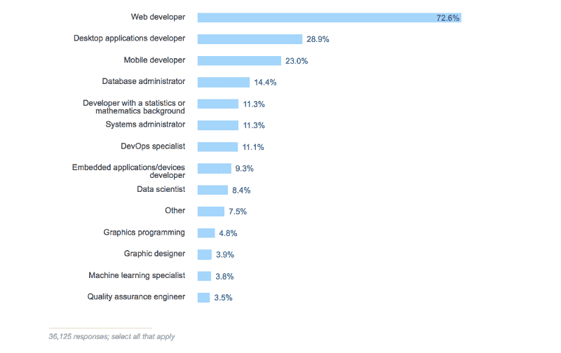

#### 大多数 web 开发人员认为自己是“全栈开发人员”

#### JavaScript 是目前程序员使用的最流行的工具。

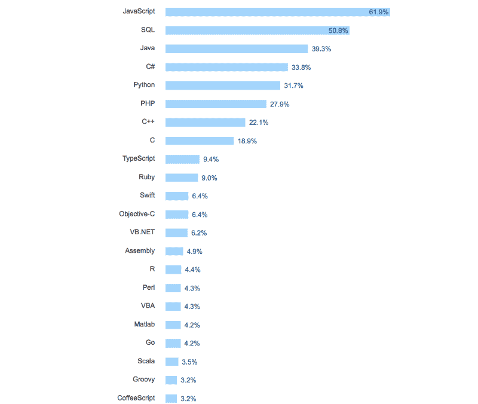

#### 开发人员在各种各样的行业工作——他们中的大多数都不属于我们传统上所说的“技术”

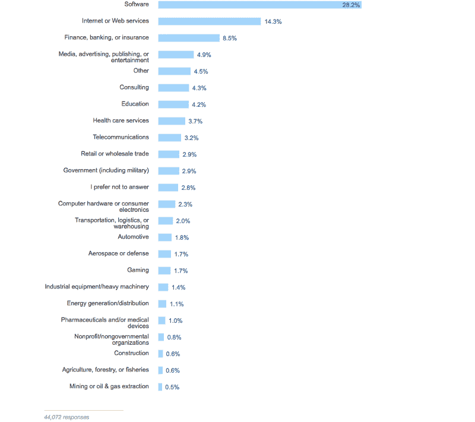

#### 他们中的大多数人在员工少于 500 人的公司工作。

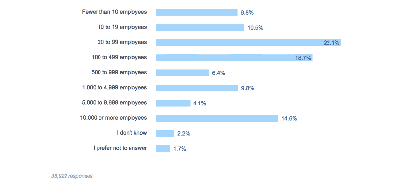

#### 但是只有不到五分之一的人在创业公司工作。

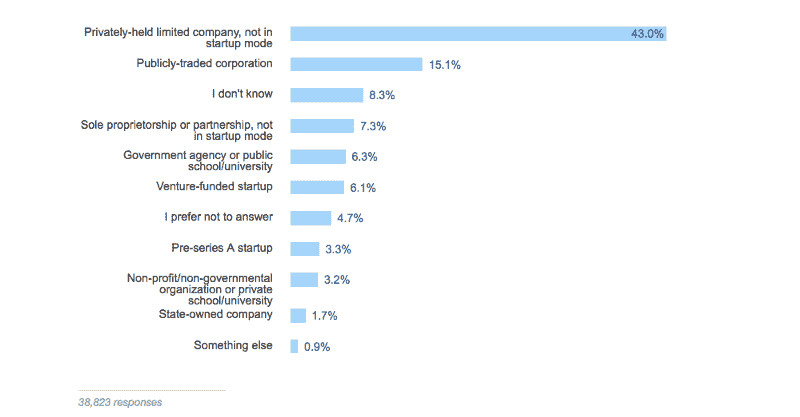

#### 他们大多是全职员工。

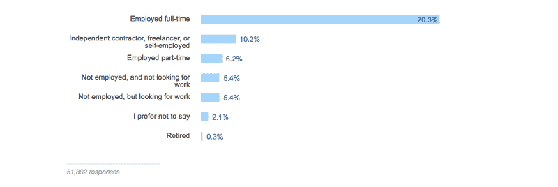

#### 其中三分之二的人是通过熟人或者招聘人员找到现在的工作的。

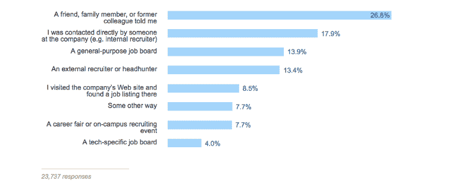

#### 不管他们的专业是什么，开发者都赚了很多钱。

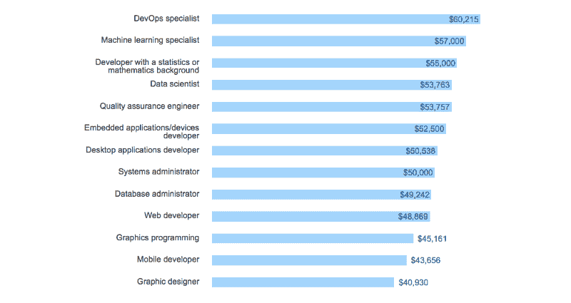

#### 如果他们碰巧在美国，他们会赚更多的钱。

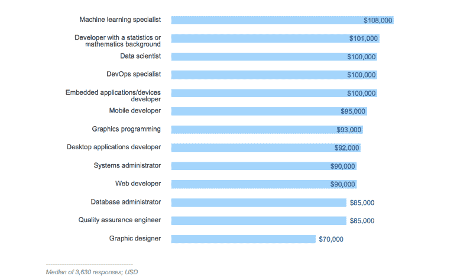

#### 也就是说，他们中的大多数人觉得他们的工作水平报酬过低。

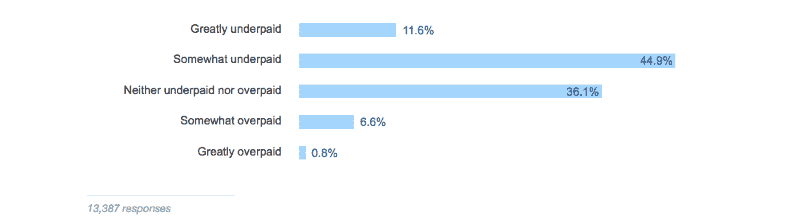

#### 三分之二的开发人员每月至少有几天在家工作。

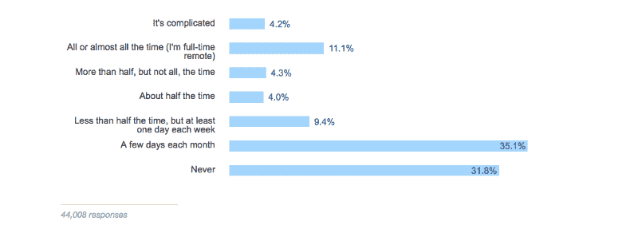

#### 他们喜欢在工作的时候听音乐。

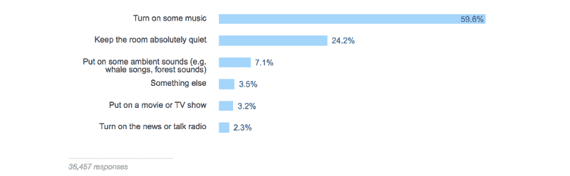

#### 30%的开发人员从事编码工作不到 5 年。

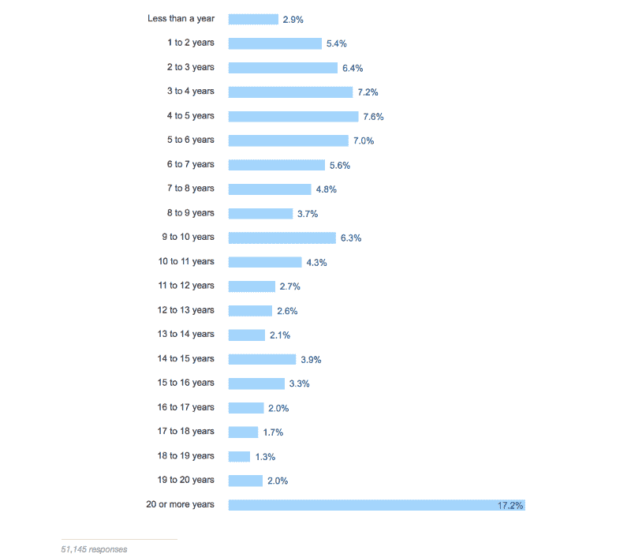

#### 大多数开发人员上过大学，但近四分之一的在职开发人员从未完成 4 年制学位。

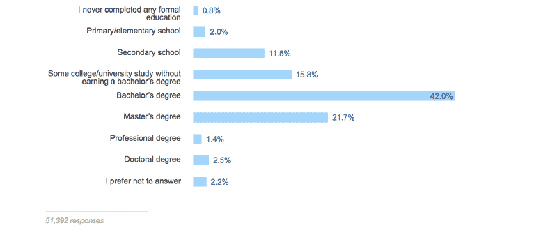

#### 80%受过大学教育的开发人员学习了某种技术相关的专业。

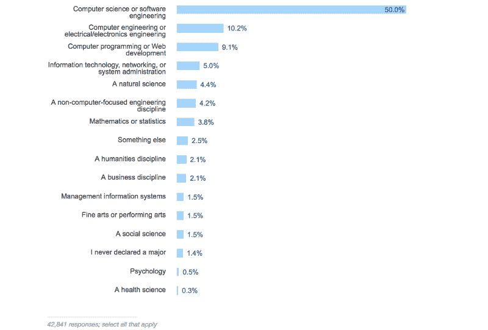

#### 尽管如此，不到一半的开发人员认为他们的正规教育对他们的工作“重要”或“非常重要”。

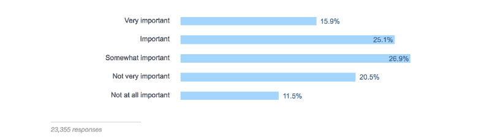

#### 尽管软件开发由男性主导，但它正变得越来越多样化。就在一年前，93%的受访者是男性。这一次，只有 89%是正确的。

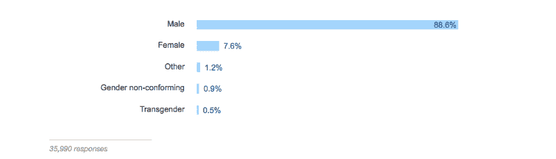

#### 100 个开发者中有 1 个是盲人，200 个开发者中有 1 个是聋子。

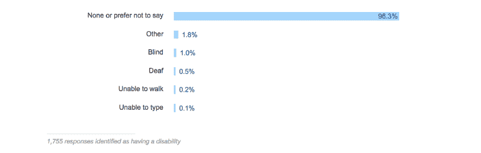

freeCodeCamp 贡献者 [Florian Beijers](https://www.freecodecamp.org/news/73-of-programmers-are-web-developers-and-other-insights-from-stack-overflows-massive-2017-survey-89a13b11e370/undefined) 天生失明。你可以阅读他如何使用标准笔记本电脑编写[程序。](https://medium.freecodecamp.com/looking-back-to-what-started-it-all-731ef5424aec#.1amcxxdrq)

感谢阅读。如果您有时间，可以通读一下[完整的调查结果](https://stackoverflow.com/insights/survey/2017)，并在下面的评论部分分享您的见解。