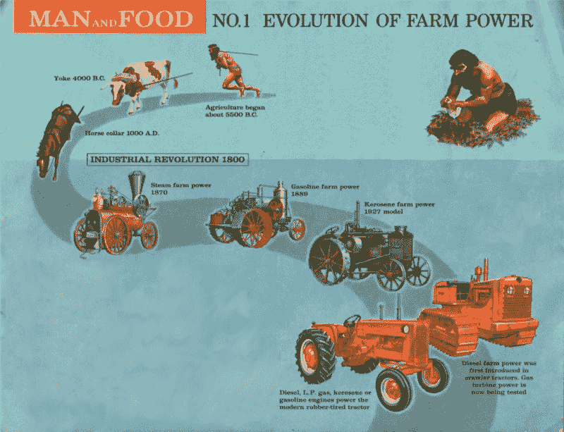
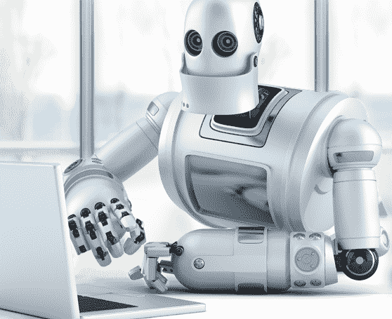

# 人工智能正在取代人们的工作——开发者是下一个吗？

> 原文：<https://www.freecodecamp.org/news/ai-is-taking-peoples-jobs-are-developers-next-61a4802b7cb3/>

最近有人问我，现在成为一名开发人员是否有任何意义，因为人工智能可能很快就会取代你的工作。

下面是我被要求评论的[引文](https://www.quora.com/Where-do-you-see-yourself-being-a-web-developer-in-the-next-5-10-years):

> 在接下来的几年里，开发网站，尤其是那些静态内容或简单内容管理的网站，将不再是一项相关的技能。开发网站可以归结为选择一个调色板，决定你的内容，然后让一个网站创建工具为你做剩下的事情。大部分已经自动化了。由于亚马逊、谷歌、微软和其他公司提供的云计算平台，甚至像部署可扩展的 web 服务和 API 这样的事情也变得更加容易。

我也一直在阅读更多关于人工智能的文章，其中一些重新点燃了我对对话的兴趣。我读过的最好的文章之一是[开发者应该关心他们的人工智能产品可能会夺走人们的工作吗？](https://medium.freecodecamp.org/the-ai-solution-youre-building-might-cost-people-their-jobs-here-s-why-you-should-care-eec7e66ed4e3)

### 人工智能接受工作

毫无疑问，AI 现在正在做更早由人做的事情。最明显的是聊天机器人夺走了客户服务工作，但还有很多其他的例子:面部识别护照门，自动物流规划，甚至创造艺术。

#### 技术人员抢走工作是正常的

纵观历史，技术一直在夺走人们的工作。马拉犁夺走了农田挖掘者的工作，马掌工因为拖拉机而失业，最近生产线工人的工作被机器人工人抢走了。

人工智能取代人们的工作只是这个持续过程的下一步。

### AI 会接开发者的活吗？

是的，而且已经开始了。

这句话谈到了那些涉及编写 HTML 和 CSS 的工作，我认为其中很多已经消失了。像 SquareSpace 这样的服务可以让你不用任何编码就能设计和建立一个网站。你可以随心所欲地拥有它，而不必雇佣开发人员。这甚至不是人工智能，这只是设计良好的软件。

AI 也在这个领域得到了应用。已经有项目让人工智能用 PhotoShop 设计制作一个网站。它使用图像分析和特征检测从实体模型建立一个完整的网站。

#### 更技术性的工作呢？

技术性工作，如创建动态网站、编写软件或数据科学，目前看起来很安全，但我认为他们会越来越多地在工作场所看到人工智能。

我不相信人工智能会夺走工作，而是会给开发者一个难以置信的强大工具来创造更好的产品。在我的工作生活中，有很多地方我喜欢使用人工智能，比如自动化一些无聊的过程。

我认为用不了多久，我们就会有模板编译器，它接受简单的命令，并把它们编译成你想要的任何语言。这将是一个如此强大的工具，因为它可以消除对通用样板代码的需求，减少重复的键入任务，并给开发人员时间来做我们最擅长的事情:解决问题。

我希望在开发中有很多用例可以让生活变得更好。如果你能想到任何好的例子，请在评论中告诉我。

人工智能理解和复制软技能会困难得多。与您的客户建立关系，有效地激励团队并与之合作，以及理解人类的需求都是将一名优秀的开发人员变成一名伟大的开发人员的技能。

### 100 年后呢？

100 年后，我毫不怀疑目前的许多开发工作将会过时。人工智能将有可能从对其特征的描述中创造出难以置信的复杂软件。也可能存在有感知能力的人工智能，它能够找出你想要的任何东西，然后去做。你不再需要独特的软件包。

还会有大量的新工作来取代我们目前的工作。100 年前没有人会想到网页设计师、JavaScript 开发者、机器学习开发者会是未来的乔布斯。100 年后，会有我们想象不到的新工作。

你可能是一名外星设计师——设计合成生命形式，使遥远的星球适合人类居住——或者是一名 warpdrive 操作员。谁知道呢！

### 那么现在成为开发者值得吗？

是的，它是！如果你想成为一名开发者，我认为这是一个很好的职业选择。

你可能开始学习做人工智能已经可以做的事情，但很快你就会从事人工智能还不能做的项目。未来十年，对开发人员的需求将大幅增加，你可以工作的领域数量也同样巨大。

你还将身处一个不断进步的行业。你可以不断增长技能，采用人工智能使你的生活更轻松，更有效率，并了解技术的前沿。

感谢阅读这篇文章！如果你喜欢，就鼓掌吧。如果你喜欢，请每周关注我，获取更多技术内容。

