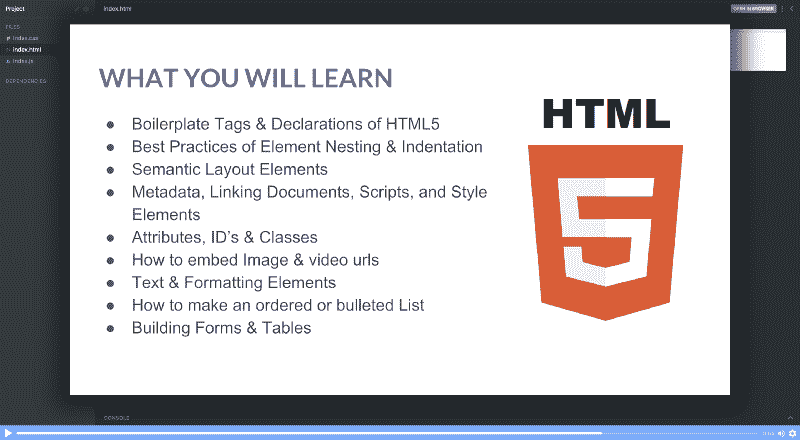
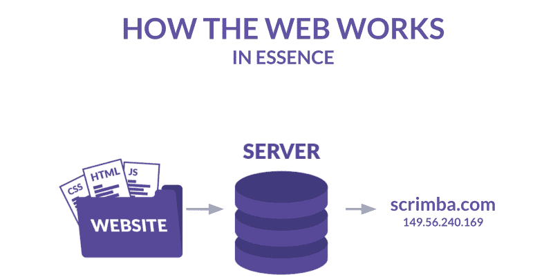
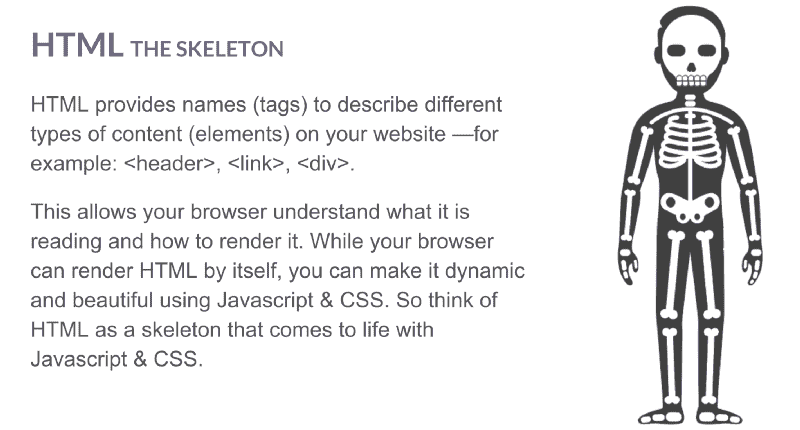
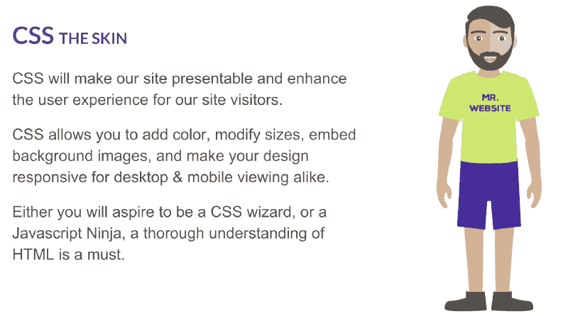
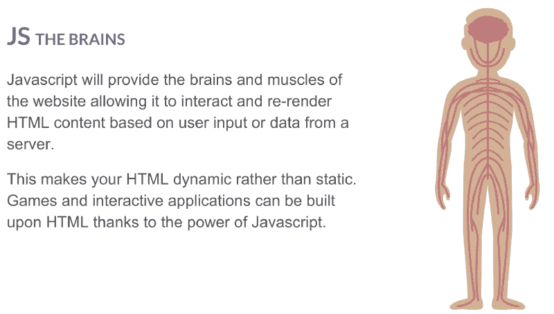
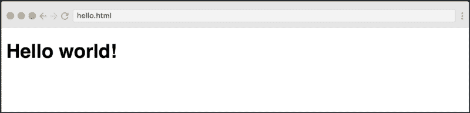
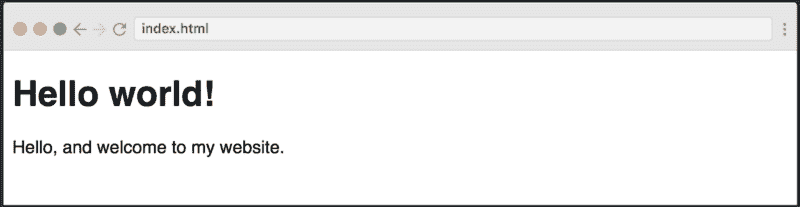
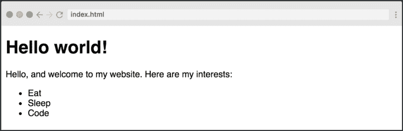
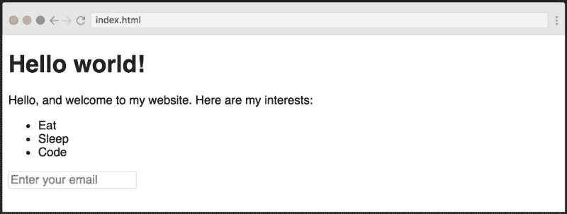

# 5 分钟学会 HTML

> 原文：<https://www.freecodecamp.org/news/learn-html-in-5-minutes-ccd378d2ab72/>

埃里克·提拉多

# 5 分钟学会 HTML

#### 帮助你开始建立网站的快速教程。

HTML 是用于在万维网上构建和呈现内容的标记语言。与 CSS 和 JavaScript 一起，它使我们能够拥有漂亮的交互式网站。

由于 HTML 是 web 的基础，它也是任何 web 开发职业道路上最重要的语言。在这个快节奏的教程中，我将教你最基本的知识。

> 当你完成后，**我已经在 Scrimba.com**上推出了一个关于 HTML5 的免费 [14 节课程——这是一个互动平台，你可以在任何给定时间跳转到正在播放的截屏代码。](https://scrimba.com/g/ghtml)

你可以在这里查看第一堂课:



好的，在我们进入 HTML 之前，我想先告诉你一点关于网络的架构。这将使我们正确看待 HTML 的作用。

### 基本 web 架构

一旦你开发了一个网站，你需要把它托管在一个服务器上，使它可以在万维网上访问。所有的服务器都有一个 IP 地址(即 149.56.240.169)，你可以把它想象成一个电话号码。我们通常在 IP 地址上加一个域名(比如 scrimba.com)，这样更容易记住。

当你在浏览器中输入域名时，它会给服务器一个呼叫。然后，服务器会发送一堆 HTML、CSS 和 JavaScript 文件，如下所示:



浏览器首先加载主 HTML 文件，然后继续加载 CSS 和 JavaScript。这些文件使浏览器能够呈现一个漂亮的交互式网站。

现在让我们仔细看看这三种语言所扮演的角色。

#### 什么是 HTML？

我们把一个网站想象成一个人。我们将用这个类比来理解我们的网站。HTML 最好被描述为框架:



#### 什么是 CSS？

然而，一个普通的 HTML 网站看起来很丑，所以你需要用 CSS 来设计它。它可以被看作是网站的皮肤和衣服。



#### JavaScript 是什么？

一旦掌握了 CSS，就要继续 JavaScript。在我们的类比中，这就像是我们网站的大脑和肌肉:



### 编写您的第一个 HTML 文件

为了能够编写 HTML，您将需要一个 HTML 文档，它只是一个带有*的文档。html* 扩展名。你用哪个文本编辑器并不重要，但最近最流行的是[崇高文本](https://www.sublimetext.com/3)、 [VS 代码](https://code.visualstudio.com/download)和 [Atom](https://atom.io/) 。你也可以使用 [Scrimba](http://scrimba.com) 作为浏览器内编辑器。

让我们创建一个新文件，命名为*index.html，*，并在其中写入`Hello world!`。

```
Hello world!
```

如果我们将这个文件拖到浏览器中，或者将浏览器指向这个文件的地址，我们将得到如下结果。


How it looks in Scrimba when you open our *index.html file in a browser window.*

恭喜你，你已经创建了你的第一个网站！

### 你的第一个 HTML 标签

然而，我们还没有写任何 HTML 标签。为此，让我们将`Hello world!`文本包装在`<` h1 >标签中，如下所示:

```
<h1>Hello world!</h1>
```

第一个`<` h1 >是开始标签，第二个 `one,` < /h1 >，是结束标签。正如您所看到的，不同之处仅在于结束标记中的反斜杠。这将导致页面上出现以下内容:



现在你已经告诉浏览器你想让`Hello world!`文本成为标题。因此，浏览器对其应用了一些样式，基本上增加了文本的大小。

所以开始写 HTML 就是这么简单。

### 编写合适的 HTML 文档

但是这实际上不是一个有效的 HTML 文档，因为它们应该遵循一个明确定义的结构。出于本教程的目的，我将简单地向您展示它，然后我们将继续有趣的东西。

我们的`Hello world!`示例应该是这样的:

```
<!DOCTYPE html><html>  <head>  </head>  <body>    <h1>Hello world!</h1>  </body></html>
```

你不用担心`<!DOCTY`PE`>,` T4【h】T2；和< head >标签，因为我们将简单地在< body >标签中写 o `ur con` tent。让我们继续吧！

#### 段落

在 h1 标签下面，我们将添加一个段落。这个标签通常用于文本的段落。

```
<h1>Hello world!</h1><p>Hello, and welcome to my website!<p>
```

它看起来是这样的:



#### 列表

现在我们来添加一个列表。为此，我们需要添加两个不同的标签，`<`ul>d<Li>。前者*代表 uno* 有序列表，后者*代表 f* 或列表项。我们将需要`to w`在< ul >标签内说唱<李>GS。

```
<ul>  <li>Eat</li>  <li>Sleep</li>  <li>Code</li></ul>
```



如果你改变了`<`ul>T1【n】T5【ol】T6【那么项目符号将会被数字代替，因为它*代表 o* 有序列表。

#### 输入字段

从用户那里获取信息是网站的一项重要活动。让我们添加一个输入字段。

```
<input type="text" placeholder="Enter your email" />
```

这将在我们站点的底部添加输入字段:



现在这里要学习两个新概念:*属性*和*自结束标签*。第一个，*属性*，提供了关于 HTML 元素的附加信息。

在我们的例子中，我们添加了两个属性:*类型*和*占位符。**类型*告诉浏览器这应该是一个文本字段。在这里，我们可以在一系列类型(单选、选择、复选框、日期)之间进行选择，这会将它变成完全不同的元素。

*占位符*规定了元素内部的帮助文本。

最后，输入标签也是一个*自结束*元素*(也称为 void 元素。)*，意思是它不是由一个开始和结束标签组成，而是只有一个结束自己的标签。

### 后续步骤

HTML 中有太多的东西需要学习，而且一点也不难。我的全部课程可以在不到一个小时内完成，它会给你一个坚实的基础知识的理解，使你能够开始建立真正的网站！

> 如果你还想吃，我们有免费的 14 道菜...在我的[Scrimba.com 大学的免费学习 HTML5】课程上。](https://scrimba.com/g/ghtml)

在那里见。？