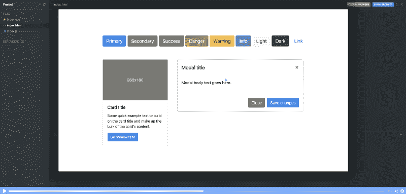
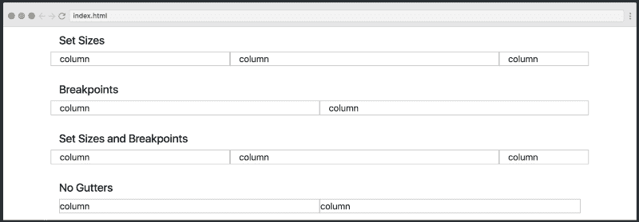
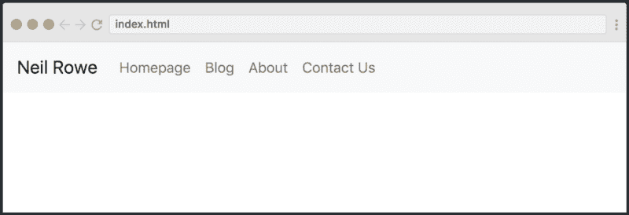
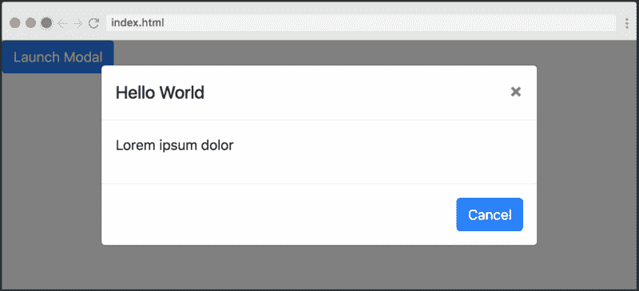
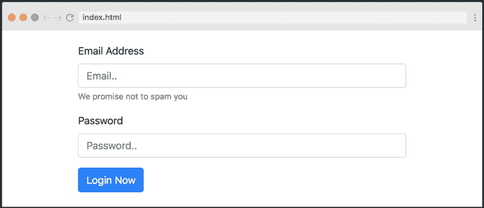
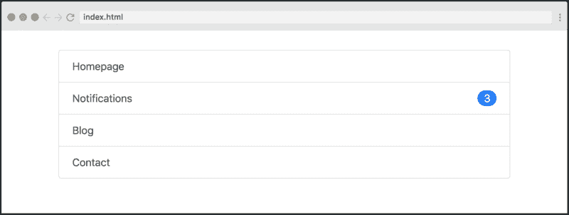
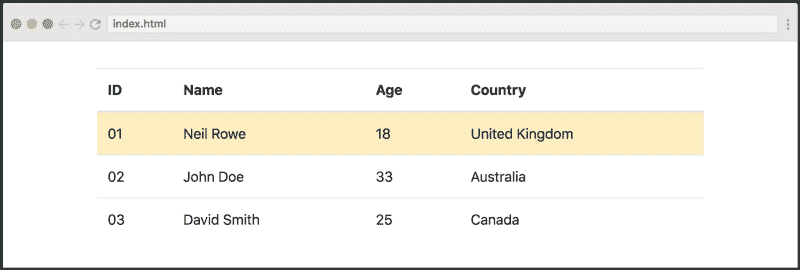
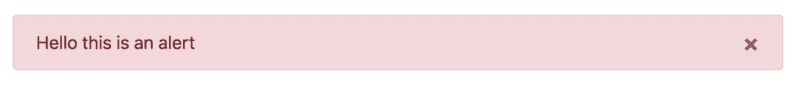
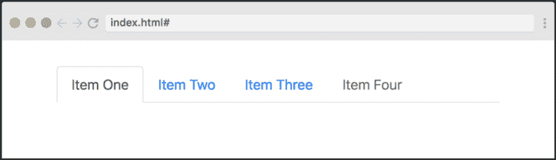

# 学习引导 4 在这个自由的 10 部分课程

> 原文：<https://www.freecodecamp.org/news/want-to-learn-bootstrap-4-heres-our-free-10-part-course-happy-easter-35c004dc45a4/>

[Click here to get to the course.](https://scrimba.com/g/gbootstrap4?utm_source=freecodecamp.org&utm_medium=referral&utm_campaign=gbootstrap4_launch_article)

Bootstrap 4 代表了整个库的完全重写，它带来了几个新的特性和概念，让您目不暇接。因此，为了学习它而一头扎进文档中可能会让人感到力不从心。

这就是为什么我们与[尼尔·罗](https://twitter.com/neil_rowe_)(之前被称为[程序员指南](https://www.youtube.com/user/CodersGuide))合作，并在 Bootstrap 4 上创建了一个[免费全程课程。尼尔之前在 YouTube 上创建了最受欢迎的 Bootstrap 3 课程之一，所以我们很高兴他选择使用 Scrimba 进行后续课程。](https://scrimba.com/g/gbootstrap4?utm_source=freecodecamp.org&utm_medium=referral&utm_campaign=gbootstrap4_launch_article)

你今天可以选修这门课。只要浏览课程页面，你将在一小时内成为 Bootstrap 4 大师。

现在让我们仔细看看你将学到什么！

#### #1 课程介绍

在第一个截屏中，您将了解 Bootstrap 本身的概况，以及它附带的实用程序和组件。Neil 还介绍了 v4 带来的主要好处。

#### #2 响应式电网系统

本课程接着介绍 Bootstrap 最重要的组成部分之一，即响应式网格系统。Neil 解释了如何创建各种网格，具有不同的断点、列大小和偏移量。

#### #3 响应式导航条

navbar 组件是很多人使用 Bootstrap 的一大原因。在这个讲座中，你将学习如何建立一个反应灵敏的导航条，它可以在小屏幕上折叠成一个汉堡菜单。

#### #4 模态

Bootstrap 还使得创建模态变得非常容易，这经常会派上用场。在这节课中，你将一步一步地学习如何构建它们。

#### #5 表格

表单对大多数网站来说都是至关重要的，所以知道如何创建表单是很好的。所以在这个讲座中，你将学习如何创建一个响应注册表单。在这里，您从响应式网格讲座中学到的技能也将派上用场。

#### #6 列表组

列表组可以用于许多不同的目的。例如，它们基本上可以用作侧边栏、菜单、文章列表或任何你想要的东西。

#### #7 张卡片

Bootstrap 4 引入了一个名为 cards 的全新组件，它取代了[面板](https://getbootstrap.com/docs/3.3/components/#panels)、[威尔斯](https://getbootstrap.com/docs/3.3/components/#wells)和[缩略图](https://getbootstrap.com/docs/3.3/components/#thumbnails)。卡片是一种灵活且可扩展的内容容器。在这堂课中，你将学习如何使用通常构成卡片的各种组件来构建卡片。

#### #8 张桌子

Bootstrap 4 还附带了一堆用于修改表格的类，本次讲座将演示其中的大部分。它们是可选的，这意味着您必须主动添加一个表类来将一个表转换成一个引导表。这与常规的 HTML 表被自动转换成引导表之前的情况不同。

#### #9 警报

警报并不特别令人兴奋，与以前版本的库相比也没有太多变化，所以如果您使用过 Bootstrap 2 或 3，您应该对这一切非常熟悉。然而，了解这些是很重要的，因为通过提醒给你的用户消息和通知有助于使你的网站更加用户友好。

#### #10 导航选项

最后，本课程从它开始的地方结束，当涉及到导航栏时，给你更多的工具，如选项卡和下拉框。这是很容易知道的，但没有第二课的内容重要，这也是为什么它会在课程的最后出现。

通过紧接着所有这些讲座，你应该能够开始用 Bootstrap 4 建立网站。如果你陷入困境，你将有充分的准备去钻研文档来解决你可能遇到的任何问题。

### 辛巴格式

最后，让我们也快速了解一下课程背后的技术。它是使用 Scrimba 构建的，Scrimba 是一种交互式编码截屏工具。“稀松布”看起来像普通视频，然而，它是完全交互式的。这意味着您可以编辑截屏中的代码。

这里有一张解释这个概念的 gif 图:

暂停截屏→编辑代码→运行！→查看您的变化

当您觉得需要试验代码以便正确理解它时，或者当您只想复制一段代码时，这是非常有用的。

你还在等什么？今天就去参加[课程](https://scrimba.com/g/gbootstrap4?utm_source=freecodecamp.org&utm_medium=referral&utm_campaign=gbootstrap4_launch_article)吧！

感谢阅读！我叫 Per，我是 Scrimba 的联合创始人，我喜欢帮助人们学习新技能。如果你想获得关于新文章和资源的通知，请在 [Twitter](https://twitter.com/perborgen) 上关注我。

* * *

感谢阅读！我的名字叫 Per Borgen，我是最简单的学习编码方法——Scrimba 的联合创始人。如果你想学习建立专业水平的现代网站，你应该看看我们的[响应式网页设计训练营](https://scrimba.com/g/gresponsive?utm_source=freecodecamp.org&utm_medium=referral&utm_campaign=gbootstrap4_launch_article)。

[Click here to get to the advanced bootcamp.](https://scrimba.com/g/gresponsive?utm_source=freecodecamp.org&utm_medium=referral&utm_campaign=gbootstrap4_launch_article)