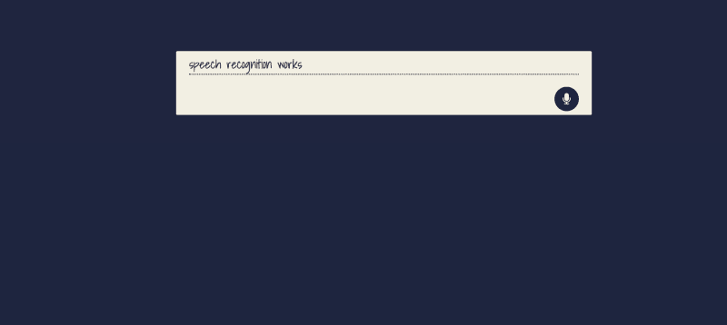

# 如何构建一个简单的语音识别应用程序

> 原文：<https://www.freecodecamp.org/news/how-to-build-a-simple-speech-recognition-app-a65860da6108/>

> “在这 10 年的时间框架内，我相信我们将不仅使用键盘和鼠标进行交互，而且在此期间，我们将完善语音识别和语音输出，使其成为界面的标准部分。”比尔·盖茨，1997 年 10 月 1 日

技术已经走过了漫长的道路，随着每一个新的进步，人类变得更加依恋它，并渴望所有设备都有这些新的酷功能。

随着 Siri、Alexa 和谷歌助手的出现，技术用户在日常使用互联网时渴望语音识别。在这篇文章中，我将介绍如何使用 JavaScript [WebSpeech API](https://developer.mozilla.org/en-US/docs/Web/API/Web_Speech_API) 在浏览器中集成原生语音识别和语音合成。

根据 Mozilla 网络文档:

> Web Speech API 使您能够将语音数据整合到 Web 应用程序中。Web 语音 API 有两个部分:语音合成(文本到语音)和语音识别(异步语音识别)。)

### 构建我们的应用程序所需的需求

对于这个简单的语音识别应用程序，我们将只处理三个文件，它们都位于同一个目录中:

*   `index.html`包含应用程序的 HTML。
*   `style.css`包含 CSS 样式。
*   `index.js`包含 JavaScript 代码。

此外，我们需要准备一些东西。它们如下:

*   JavaScript 基础知识。
*   运行应用程序的网络服务器。Chrome 的[网络服务器足以满足这个目的。](https://chrome.google.com/webstore/detail/web-server-for-chrome/ofhbbkphhbklhfoeikjpcbhemlocgigb?hl=en)

### 设置我们的语音识别应用

让我们从设置应用程序的 HTML 和 CSS 开始。下面是 HTML 标记:

```
<!DOCTYPE html>
<html lang="en">
<head>
  <meta charset="UTF-8">
  <meta name="viewport" content="width=device-width, initial-scale=1.0">
  <meta http-equiv="X-UA-Compatible" content="ie=edge">
  <title>Speech Recognition</title>
  <link rel="stylesheet" href="style.css">
  <link href="https://fonts.googleapis.com/css?family=Shadows+Into+Light" rel="stylesheet">
  <!-- load font awesome here for icon used on the page -->
</head>
<body>
  <div class="container"> <!--page container -->
    <div class="text-box" contenteditable="true"></div> <!--text box which will contain spoken text -->
    <i class="fa fa-microphone"></i> <!-- microphone icon to be clicked before speaking -->
  </div>
  <audio class="sound" src="chime.mp3"></audio> <!-- sound to be played when we click icon => http://soundbible.com/1598-Electronic-Chime.html -->
  <script src="index.js"></script> <!-- link to index.js script -->
</body>
</html>
```

以下是其附带的 CSS 样式:

```
body {
  background: #1e2440;
  color: #f2efe2;
  font-size: 16px;
  font-family: 'Kaushan Script', cursive;
  font-family: 'Shadows Into Light', cursive;
}
.container {
  position: relative;
  border: 1px solid #f2efe2;
  width: 40vw;
  max-width: 60vw;
  margin: 0 auto;
  border-radius: 0.1rem;
  background: #f2efe2;
  padding: 0.2rem 1rem;
  color: #1e2440;
  overflow: scroll;
  margin-top: 10vh;
}
.text-box {
  max-height: 70vh;
  overflow: scroll;
}
.text-box:focus {
  outline: none;
}
.text-box p {
  border-bottom: 1px dotted black;
  margin: 0px !important;
}
.fa {
  color: white;
  background: #1e2440;
  border-radius: 50%;
  cursor: pointer;
  margin-top: 1rem;
  float: right;
  width: 2rem;
  height: 2rem;
  display: flex !important;
  align-items: center;
  justify-content: center;
}
@media (max-width: 768px) {
  .container {
    width: 85vw;
    max-width: 85vw;
  }
.text-box {
    max-height: 55vh;
  }
}
```

复制上面的代码应该会产生类似如下的结果:


Web interface for the simple speech recognition app

### 使用 WebSpeech API 启动我们的语音识别应用程序

截至本文撰写之时，WebSpeech API 仅在 Firefox 和 Chrome 中可用。它的语音合成界面作为`speechSynthesis`存在于浏览器的`window`对象上，而它的语音识别界面作为`SpeechRecognition`存在于浏览器的`window`对象上，在火狐浏览器中是`SpeechRecognition`，在 Chrome 浏览器中是`webkitSpeechRecognition`。

我们将把识别界面设置为`SpeechRecognition`，而不考虑我们使用的浏览器:

```
window.SpeechRecognition = window.webkitSpeechRecognition || window.SpeechRecognition;
```

接下来，我们将实例化语音识别接口:

```
const recognition = new SpeechRecognition();
const icon = document.querySelector('i.fa.fa-microphone')
let paragraph = document.createElement('p');
let container = document.querySelector('.text-box');
container.appendChild(paragraph);
const sound = document.querySelector('.sound');
```

在上面的代码中，除了实例化语音识别，我们还选择了页面上的`icon`、`text-box,`和`sound`元素。我们还创建了一个段落元素来保存我们所说的话，并将它附加到了`text-box`。

每当单击页面上的麦克风图标时，我们都希望播放我们的声音并启动语音识别服务。为此，我们向图标添加了一个点击事件监听器:

```
icon.addEventListener('click', () => {
  sound.play();
  dictate();
});
const dictate = () => {
  recognition.start();
}
```

在事件监听器中，播放完声音后，我们继续创建并调用了一个`dictate`函数。`dictate`函数通过调用语音识别实例上的`start`方法来启动语音识别服务。

为了返回用户所说内容的结果，我们需要向语音识别实例添加一个`result`事件。然后，`dictate`函数将如下所示:

```
const dictate = () => {
  recognition.start();
  recognition.onresult = (event) => {
    const speechToText = event.results[0][0].transcript;

    paragraph.textContent = speechToText;
  }
}
```

结果`event`返回一个包含一个`results`对象的`SpeechRecognitionEvent`。这又包含了保存文本中已识别语音的`transcript`属性。我们将识别出的文本保存在一个名为`speechToText`的变量中，并将其放入页面上的`paragraph`元素中。

如果我们此时运行应用程序，单击`icon`并说些什么，它应该会在页面上弹出。



Speech to text in full effect

### 用文本到语音来总结它

为了给我们的应用程序添加文本到语音，我们将利用 WebSpeech API 的`speechSynthesis`接口。我们将从实例化它开始:

```
const synth = window.speechSynthesis;
```

接下来，我们将创建一个函数`speak`,每当我们希望应用程序说些什么时，我们都会调用它:

```
const speak = (action) => {
  utterThis = new SpeechSynthesisUtterance(action());
  synth.speak(utterThis);
};
```

`speak`函数接受一个名为`action`的函数作为参数。该函数返回一个传递给`SpeechSynthesisUtterance`的字符串。`SpeechSynthesisUtterance`是 WebSpeech API 接口，保存语音识别服务应该读取的内容。然后在其实例上调用 speechSynthesis `speak`方法，并将内容传递给 read。

为了测试这一点，我们需要知道用户什么时候结束讲话并说了一个`keyword.`幸运的是有一个方法可以检查:

```
const dictate = () => {
  ...
  if (event.results[0].isFinal) {
    if (speechToText.includes('what is the time')) {
        speak(getTime);
    };

    if (speechToText.includes('what is today\'s date
')) {
        speak(getDate);
    };

    if (speechToText.includes('what is the weather in')) {
        getTheWeather(speechToText);
    };
  }
  ...
}
const getTime = () => {
  const time = new Date(Date.now());
  return `the time is ${time.toLocaleString('en-US', { hour: 'numeric', minute: 'numeric', hour12: true })}`
};
const getDate = () => {
  const time = new Date(Date.now())
  return `today is ${time.toLocaleDateString()}`;
};
const getTheWeather = (speech) => {
fetch(`http://api.openweathermap.org/data/2.5/weather?q=${speech.split(' ')[5]}&appid=58b6f7c78582bffab3936dac99c31b25&units=metric`)
.then(function(response){
  return response.json();
})
.then(function(weather){
  if (weather.cod === '404') {
    utterThis = new SpeechSynthesisUtterance(`I cannot find the weather for ${speech.split(' ')[5]}`);
    synth.speak(utterThis);
    return;
  }
  utterThis = new SpeechSynthesisUtterance(`the weather condition in ${weather.name} is mostly full of ${weather.weather[0].description} at a temperature of ${weather.main.temp} degrees Celcius`);
  synth.speak(utterThis);
  });
};
```

在上面的代码中，我们对事件结果调用了`isFinal`方法，该方法根据用户是否说完话返回`true`或`false`。

如果用户说完了，我们检查他所说的文字记录是否包含关键字，如`what is the time`等等。如果有，我们调用我们的`speak`函数，并传递给它三个函数`getTime`、`getDate`或`getTheWeather`中的一个，它们都返回一个字符串供浏览器读取。

我们的`index.js`文件现在应该是这样的:

```
window.SpeechRecognition = window.webkitSpeechRecognition || window.SpeechRecognition;
const synth = window.speechSynthesis;
const recognition = new SpeechRecognition();

const icon = document.querySelector('i.fa.fa-microphone')
let paragraph = document.createElement('p');
let container = document.querySelector('.text-box');
container.appendChild(paragraph);
const sound = document.querySelector('.sound');

icon.addEventListener('click', () => {
  sound.play();
  dictate();
});

const dictate = () => {
  recognition.start();
  recognition.onresult = (event) => {
    const speechToText = event.results[0][0].transcript;

    paragraph.textContent = speechToText;

    if (event.results[0].isFinal) {

      if (speechToText.includes('what is the time')) {
          speak(getTime);
      };

      if (speechToText.includes('what is today\'s date')) {
          speak(getDate);
      };

      if (speechToText.includes('what is the weather in')) {
          getTheWeather(speechToText);
      };
    }
  }
}

const speak = (action) => {
  utterThis = new SpeechSynthesisUtterance(action());
  synth.speak(utterThis);
};

const getTime = () => {
  const time = new Date(Date.now());
  return `the time is ${time.toLocaleString('en-US', { hour: 'numeric', minute: 'numeric', hour12: true })}`
};

const getDate = () => {
  const time = new Date(Date.now())
  return `today is ${time.toLocaleDateString()}`;
};

const getTheWeather = (speech) => {
  fetch(`http://api.openweathermap.org/data/2.5/weather?q=${speech.split(' ')[5]}&appid=58b6f7c78582bffab3936dac99c31b25&units=metric`) 
  .then(function(response){
    return response.json();
  })
  .then(function(weather){
    if (weather.cod === '404') {
      utterThis = new SpeechSynthesisUtterance(`I cannot find the weather for ${speech.split(' ')[5]}`);
      synth.speak(utterThis);
      return;
    }
    utterThis = new SpeechSynthesisUtterance(`the weather condition in ${weather.name} is mostly full of ${weather.weather[0].description} at a temperature of ${weather.main.temp} degrees Celcius`);
    synth.speak(utterThis);
  });
};
```

让我们点击图标，尝试以下短语之一:

*   几点了？
*   今天是几号？
*   拉各斯的天气怎么样？

我们应该会得到应用程序的回复。

### 结论

在本文中，我们已经能够构建一个简单的语音识别应用程序。我们还可以做一些更酷的事情，比如选择不同的声音读给用户听，但是我会把这个留给你去做。

如果您有问题或反馈，请在下面留言。我迫不及待地想看看你用这个做了什么。你可以在推特上联系我。