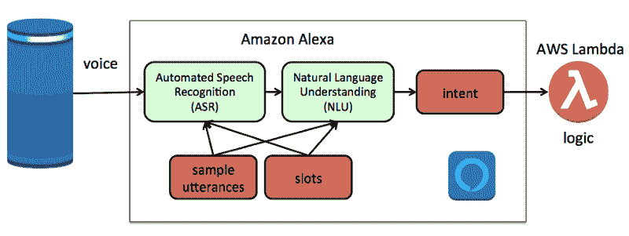
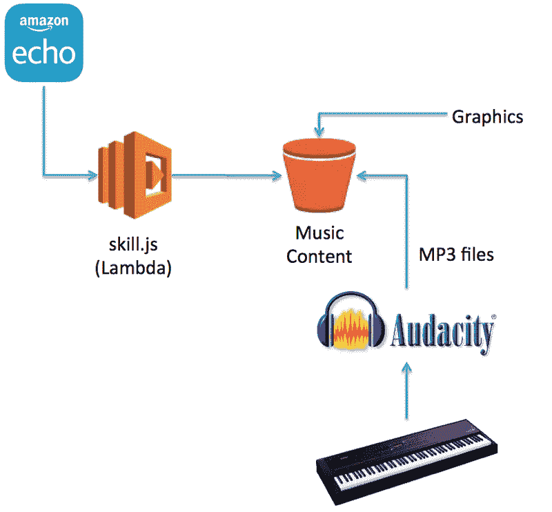
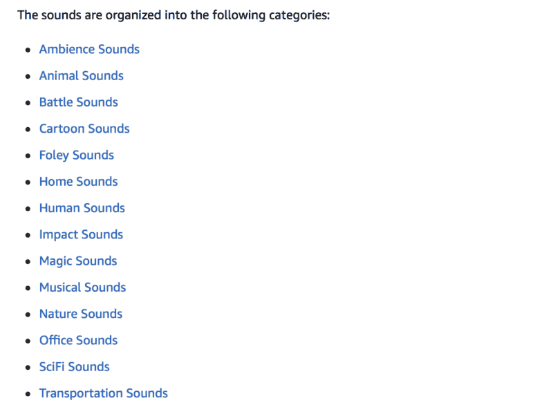

# 亚马逊让给自定义 Alexa 技能添加声音变得更加容易

> 原文：<https://www.freecodecamp.org/news/amazon-has-made-it-easier-to-add-sounds-to-custom-alexa-skills-513b865d7528/>

特伦·彼得森

# 亚马逊让给自定义 Alexa 技能添加声音变得更加容易


Image from [Pixabay](https://pixabay.com/en/musician-country-song-banjo-ukulele-349790/)

我被公认为亚马逊 [Alexa 冠军](https://developer.amazon.com/alexa/champions/terren-peterson)，并在平台上发布了二十多个自定义技能。我继续寻找扩展这项技术的新方法，我发现改善用户体验的最好方法之一就是添加声音。鉴于[亚马逊 Alexa 平台最近的改进](https://developer.amazon.com/docs/custom-skills/ask-soundlibrary.html)，这变得更加容易。这里有一个关于如何利用这个新特性的简短回顾。

### 亚马逊 Alexa 如何工作

Alexa 平台能够启用第三方开发者制作的定制技能。现在有超过 30k 个可用，数百万 Alexa 用户可以在他们的设备上启用它们。这些服务包括从受欢迎的连锁店订购比萨饼到播放声音帮助睡眠。

这些定制技能的架构有两个组成部分。首先是语音组件，它利用了 Alexa 平台的机器学习模型。这就是将口头请求翻译成一组指令的过程。

另一个组件是 if/then/else 逻辑，它决定应该向用户返回什么答案。这由 AWS Lambda 函数托管。



为了提高技能，可以使用额外的 AWS 服务以及第三方工具。这包括记录自定义 MP3 声音和图形，Lambda 函数可以利用这些声音和图形。



为了添加声音，MP3 文件被上传到 S3 桶中，并应用适当的访问策略，以便它可以被 Alexa 设备读取。

### 添加自定义声音的挑战

将声音纳入定制技能的障碍之一是录制高质量声音的能力。这些声音需要符合平台的确切标准，包括比特率和采样率。这可以通过使用 Audacity 等软件的声音编辑专业知识来完成，但会增加技能开发的时间。

录制高质量的声音也是一个挑战。有一些移动设备应用程序可以录音，但很难获取各种各样的声音。例如，记录飞机的轰鸣声，或者大象发出的声音。

或者，Alexa 开发者可以搜索其他人录制的声音。互联网上有一些存储库有这些，但大多数需要花钱许可，并且需要用 Audacity 这样的软件重新采样，以获得正确的声音属性。

### 免费 MP3 内容

亚马逊现在已经发布了一个目录，里面有数百种已经按照平台要求的标准录制的声音。就像上面的架构图一样，它们被发布到 AWS 上的 S3 桶中，可以被任何定制技能使用。

完整的列表在[开发者页面](https://developer.amazon.com/docs/custom-skills/ask-soundlibrary.html)上提供，这里是主要类别。



范围很广。摩托车引擎声、烟火声、熊的吼声都触手可及。使用这些不需要版税，下载声音剪辑的费用也不会从您的 AWS 帐户中扣除。

### 如何在一项基本功中运用声音

如果你刚刚开始使用亚马逊 Alexa，从 Alexa GitHub 页面的基本模板开始。这包括建立一个琐事技能，事实技能，或简单的猜谜游戏。例如，我最近发表了一个有趣的儿童技能，叫做寻找复活节彩蛋。[这是 GitHub 上完整的回购协议](https://github.com/terrenjpeterson/eastereggskill)，包括 Lambda 函数和意图模型。

对于任何消息响应，您都可以添加 SSML 语法，以便在 S3 桶中包含指向 MP3 文件的链接。这里有一个复活节彩蛋技能的欢迎处理程序的例子。

```
// This is the initial welcome message
var welcomeMessage = "<audio src=’https://s3.amazonaws.com/ask-soundlibrary/musical/amzn_sfx_trumpet_bugle_03.mp3'/>Welcome to the Easter Bunny Egg Hiding Game. I will ask you multiple questions that you should answer yes or no. Based on your choices, I will make a recommendation on where to hide an egg. Are you ready to begin?";

this.emit(':ask', welcomeMessage, repeatWelcomeMessage);
```

当用户第一次调用这个自定义技能时，Alexa 设备会播放小号的声音剪辑，然后用标准的声音读取语法。

### 准备好开始了吗？

继续前进，在亚马逊上注册一个[免费开发者账户](https://developer.amazon.com)，今天就开始培养你的第一项技能吧！亚马逊开发者博客在这个话题上有一些很好的资源可以利用，包括这个[最近的帖子](https://developer.amazon.com/blogs/alexa/post/c202ca98-ed68-440b-adb3-73ae9d8f36da/how-to-enhance-your-alexa-skill-with-audio-clips-from-the-ask-sound-library)给出了如何使用这个新内容的想法。