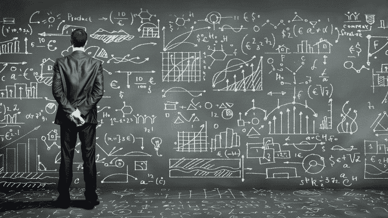
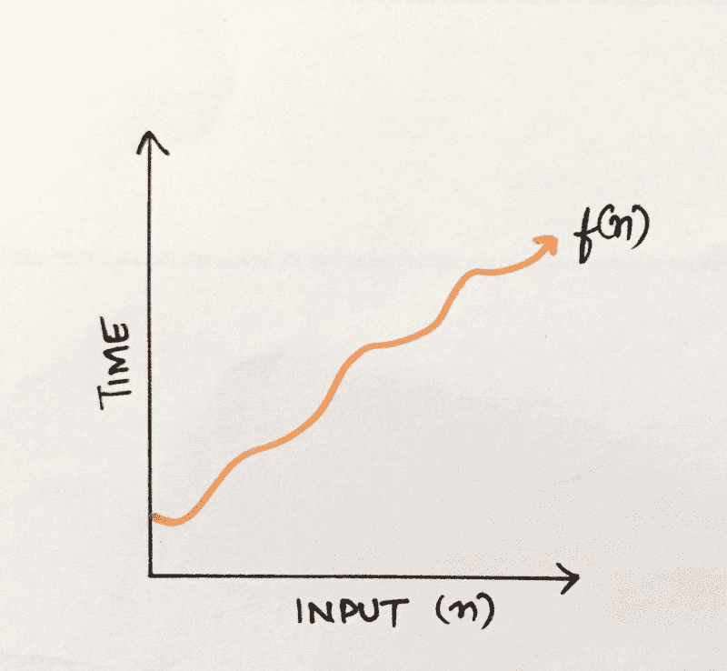
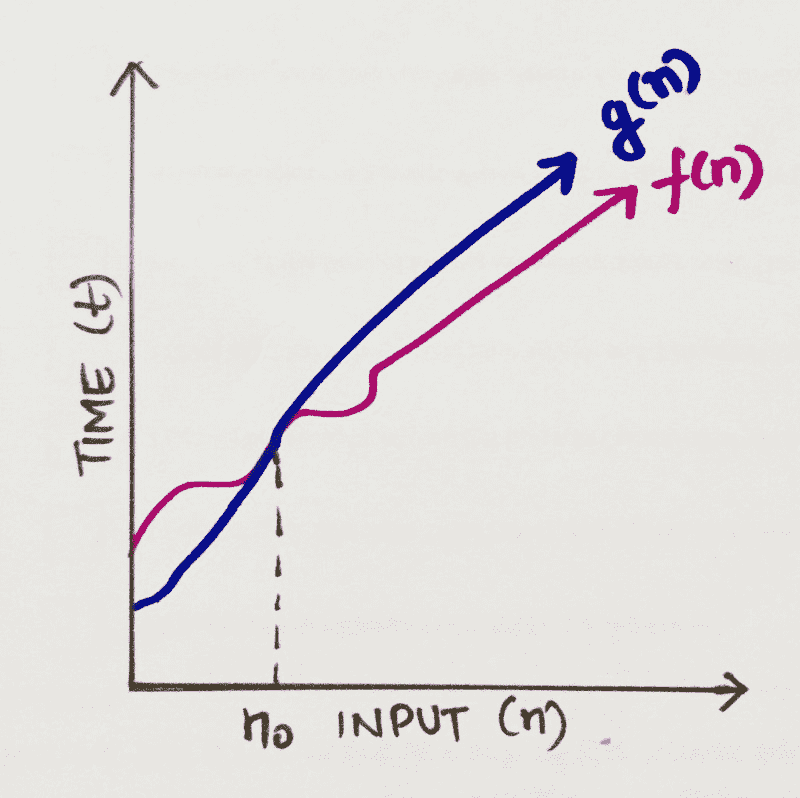
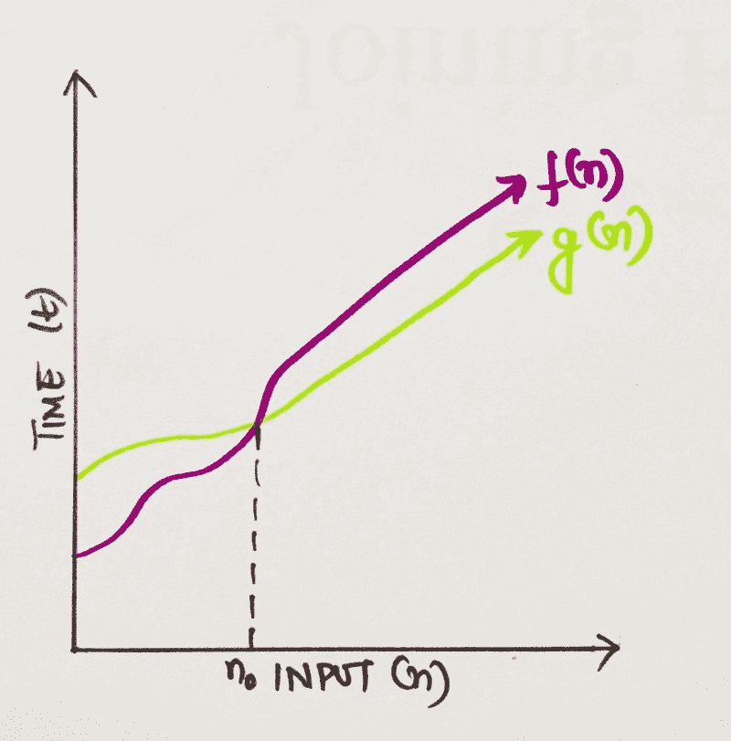
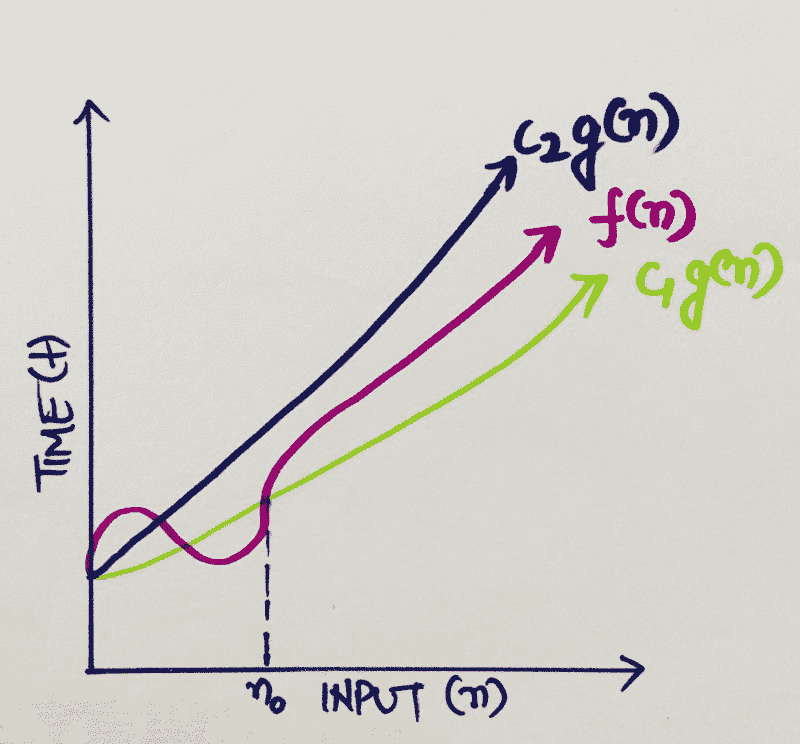
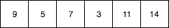

# 让我们简化算法的复杂性！

> 原文：<https://www.freecodecamp.org/news/lets-simplify-algorithm-complexities-25e75f37d03f/>

Shruti Tanwar

# 让我们简化算法的复杂性！



我已经有一段时间没有考虑回归基础，重温计算机科学的核心概念了。我想，在进入像数据结构、操作系统、OOP、数据库和系统设计这样的重量级主题池之前(说真的，这个列表是无穷无尽的)？，我可能应该拿起我们都不想触及的话题:算法复杂性分析。

没错。这个概念大部分时间都被忽视了，因为我们大多数开发人员都在想，“嗯，当我实际编码的时候，我可能不需要知道这些！”。？

嗯，我不确定你是否觉得有必要了解算法分析实际上是如何工作的。但如果你有，我会尽可能用最清晰的方式来解释。希望对我这样的人有帮助。？

#### **到底什么是算法分析，我们为什么需要它？**？

在深入算法复杂性分析之前，我们先简单了解一下什么是算法分析。算法分析处理基于每个算法使用的计算资源数量的算法比较。

我们希望通过这种实践来实现的是，能够就有效利用资源(时间或内存，取决于用例)做出关于哪种算法是赢家的明智决策。这有道理吗？

我们举个例子。假设我们有一个函数 *product()* ，它将一个数组的所有元素相乘，除了当前索引处的元素，并返回新的数组。如果我传递[1，2，3，4，5]作为输入，我应该得到[120，60，40，30，24]作为结果。

上面的函数利用两个嵌套的 *for* 循环来计算期望的结果。在第一遍中，它获取当前位置的元素。在第二次循环中，它将该元素与数组中的每个元素相乘，除非第一次循环的元素与第二次循环的当前元素匹配。在这种情况下，它只需将其乘以 1，以保持乘积不变。

你能跟上吗？太好了！

这是一个简单的方法，效果很好，但是我们能把它做得稍微好一点吗？我们能不能以这样一种方式修改它，使我们不必使用两次嵌套循环？也许存储每次传递的结果并加以利用？

让我们考虑下面的方法。在这个修改版本中，应用的原则是，对于每个元素，计算右边值的乘积，计算左边值的乘积，然后简单地将这两个值相乘。很可爱，不是吗？

这里，我们使用两个非嵌套循环，而不是使用嵌套循环来计算每次运行的值，这将整体复杂性降低了 O(n)(我们将在后面讨论)。

我们可以有把握地推断后一种算法比前一种算法执行得更好。到目前为止，一切顺利吗？完美！

此时，我们还可以快速浏览一下现有的不同类型的算法分析。我们不需要深入到分钟级别的细节，只需要对技术术语有一个基本的了解。

根据何时分析算法，即在实现之前或实现之后，算法分析可以分为两个阶段:

*   **先验分析**——顾名思义，在先验*(先验)，*我们在特定系统上运行算法之前对其进行分析(空间和时间)。所以从根本上来说，这是一个算法的理论分析。算法的效率是在假设所有其他因素(例如处理器速度)不变并且对实现没有影响的情况下测量的。
*   **旁注分析**—算法的旁注分析仅在物理系统上运行后进行。使用在目标计算机上执行的编程语言来实现所选择的算法。它直接取决于系统配置和系统间的变化。

在行业中，我们很少进行 Apostiari 分析，因为软件通常是为匿名用户开发的，他们可能在不同的系统上运行。由于时间和空间复杂性可能因系统而异，因此先验分析是发现算法复杂性的最实用的方法。这是因为我们只关注算法的渐近变化(我们将在后面讨论),它给出了基于输入大小而不是系统配置的复杂性。

现在我们对什么是算法分析有了一个基本的了解，我们可以前进到我们的主要话题:算法复杂性。我们将关注*先验分析*，记住这篇文章的范围，所以让我们开始吧。

#### **通过渐近分析深入探究复杂性**

算法复杂性分析是一种工具，它允许我们解释当输入变大时算法如何表现。

因此，如果你想用一个大小为 *n* 的数据集运行一个算法，例如，我们可以将复杂性定义为一个数值函数*f(n)*——时间对输入大小 *n* 。



Time vs Input

现在你一定想知道，一个算法是否可能在相同的输入上花费不同的时间，这取决于处理器速度、指令集、磁盘速度和编译器的品牌等因素？如果是，那么拍拍自己的背，因为你是绝对正确的！？

这就是渐近分析的由来。这里的概念是根据输入大小来评估算法的性能(不测量实际运行时间)。所以基本上，我们计算一个算法所花费的时间(或空间)是如何随着我们让输入大小变得无限大而增加的。

对两个参数进行复杂性分析:

1.  **时间**:时间复杂度给出了关于输入大小的算法需要多长时间来完成的指示。在这种情况下，我们关心的资源是 CPU(和挂钟时间)。
2.  **空间**:空间复杂度是相似的，但它表明相对于输入大小，执行算法“需要”多少内存。在这里，我们将系统 RAM 作为一种资源来处理。

你还和我在一起吗？很好！现在，有不同的符号，我们用来通过渐近分析来分析复杂性。我们将一个接一个地研究它们，并理解每一个背后的基本原理。

第一个也是最流行的用于复杂性分析的符号是 Big O 符号。这样做的原因是它给出了算法的最坏情况分析。书呆子世界最关心的是一个算法的表现有多糟糕，以及如何让它表现得更好。BigO 恰恰为我们提供了这一点。

让我们进入它的数学方面来理解事物的核心。



BigO (tightest upper bound of a function)

让我们考虑一个可以用函数 *f(n)描述的算法。*所以，要定义 *f(n)* 的 BigO，我们需要找一个函数，比方说， *g(n)* ，它给它上界。这意味着，在某个值 n0 之后， *g(n)* 的值将总是超过 *f(n)* 。

我们可以写成，
*f(n) ≤ C g(n)*
其中 n≥n0；c>0；n0≥1

如果满足以上条件，我们可以说 *g(n)* 是 *f(n)的 BigO，或者*
f(n)= O(g(n))

我们可以用同样的方法来分析一个算法吗？这基本上意味着在运行算法的最坏情况下，该值不应该超过某个点，在这种情况下是 *g(n)* 。因此， *g(n)* 是 *f(n)的 BigO。*

让我们浏览一些常用的 bigO 符号及其复杂性，并更好地理解它们。

*   **O(1):** 描述了一种无论输入数据集大小如何，都将始终在同一时间(或空间)执行的算法。

```
function firstItem(arr){      return arr[0];}
```

上面的函数 *firstItem()* ，将总是花费相同的时间来执行，因为它从数组中返回第一个项，而不管它的大小。这个函数的运行时间与输入大小无关，因此它的复杂度为 O(1)。

与上面的解释相关，即使在该算法的最坏情况下(假设输入非常大)，运行时间也将保持恒定，不会超过某个值。所以，它的 BigO 复杂度是常数，也就是 O(1)。

*   **O(N):** 描述了一种算法，其性能将线性增长，并与输入数据集的大小成正比。看看下面的例子。我们有一个名为 *matchValue(* )的函数，每当在数组中找到匹配的案例时，它都返回 true。在这里，由于我们必须遍历整个数组，所以运行时间与数组的大小成正比。

```
function matchValue(arr, k){   for(var i = 0; i < arr.length; i++){     if(arr[i]==k){       return true;     }     else{       return false;     }   }   }
```

这也证明了大 O 值对最差性能场景的偏好。在`for`循环的任何一次迭代中都能找到匹配的事例，函数会提前返回。但是大 O 符号将总是假设算法将执行最大迭代次数的上限(最坏情况)。

*   **O(N ):** 这代表一种算法，其性能与输入数据集大小的平方成正比。这在涉及数据集嵌套迭代的算法中很常见。更深的嵌套迭代将导致 O(N)，O(N⁴)，等等。

```
function containsDuplicates(arr){    for (var outer = 0; outer < arr.length; outer++){        for (var inner = 0; inner < arr.length; inner++){            if (outer == inner)                 continue;            if (arr[outer] == arr[inner])                return true;        }    }       return false;}
```

*   **O(2^N):** 表示一种算法，其增长随着输入数据集的每次增加而加倍。O(2^N 函数的增长曲线是指数型的——开始很浅，然后迅速上升。O(2^N 函数的一个例子是斐波那契数的递归计算:

```
function recursiveFibonacci(number){    if (number <= 1) return number;    return recursiveFibonacci(number - 2) + recursiveFibonacci(number - 1);}
```

你找到窍门了吗？完美。如果没有，请在下面的评论中提出你的问题。:)

继续，现在我们对 BigO 符号有了更好的理解，让我们进入下一种渐近分析，即大ω。

**大ω**？
**T** 何大ω(ω)为我们提供了运行一个算法的最佳案例场景。也就是说，它会给我们一个算法运行所需的最小资源量(时间或空间)。

让我们深入到它的数学中来进行图形化分析。



BigΩ (tightest lower bound of a function)

我们有一个可以用函数 *f(n)来描述的算法。*所以，要定义 *f(n)* 的 BigΩ，我们需要找一个函数，比方说 *g(n)* ，它与 *f(n)* 的下界最紧。意思是，在某个值 n0 之后， *f(n)* 的值将总是超过 g *(n)* 。

我们可以写成，
*f(n)≥ C g(n)*
其中 n≥n0；c>0；n0≥1

如果满足以上条件，我们可以说 *g(n)* 是 *f(n)的大ω，或者*
f(n)=ω*(g(n))*

能否推断ω(…)与 O(…)是互补的？继续这篇文章的最后一部分…

**大 Theta (θ)** ？
**他大θ(θ)是 BigO 和 Bigω的一种组合。它给出了运行算法的一般情况。也就是说，它会给出最好和最坏情况的平均值。让我们从数学上分析一下。**

**

Bigθ (tightest lower and upper bound of a function)** 

**考虑可以由函数 *f(n)描述的算法。**f(n)*的 Bigθ将是一个函数，比如说 *g(n)* ，它通过下界和上界来约束它，使得
*c₁g(n)≤f(n)≤c₂g(n)*
其中C₁，> 0，n≥ n0，
n0 ≥ 1**

**意思是，在某个值 n0 之后，*【c₁g(n】*的值将总是小于 *f(n)* ，而 *C₂ g(n)* 的值将总是超过 *f(n)* 。**

**现在我们对不同类型的渐近复杂性有了更好的理解，让我们举个例子来更清楚地了解所有这些是如何实际工作的。**

**考虑一个数组，大小为， *n，*，我们想做一个线性搜索来寻找其中的元素 *x* 。假设内存中的数组是这样的。**

**

Linear Search** 

**根据线性搜索的概念，如果 x=9，那么这将是下一种情况的最佳情况(因为我们不必迭代整个数组)。从我们刚刚了解到的情况来看，复杂度可以写成ω(1)。有道理？**

**类似地，如果 x 等于 14，这将是最坏的情况，复杂度将是 O(n)。**

**这种情况的平均复杂程度是多少？
θ(n/2) = > 1/2 θ(n) = > θ(n)(因为我们在计算渐近复杂度时忽略了常数)。**

**所以，你们走吧，伙计们。对算法复杂性的基本见解。你过得好吗？请在下面的评论中留下你的建议、问题和意见。感谢阅读！❤️**

****参考资料:-****

*   **Dionysis "dionyziz" Zindros 的精彩报道:【https://discrete.gr/complexity/】T2**
*   ****关于算法的好系列&数据结构:**[http://interactive python . org/rune stone/static/python ds/algorithm analysis/whatisalgorithmanalysis . html](http://interactivepython.org/runestone/static/pythonds/AlgorithmAnalysis/WhatIsAlgorithmAnalysis.html)**