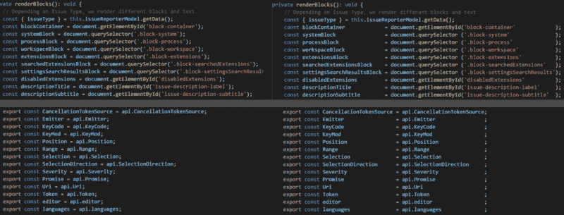
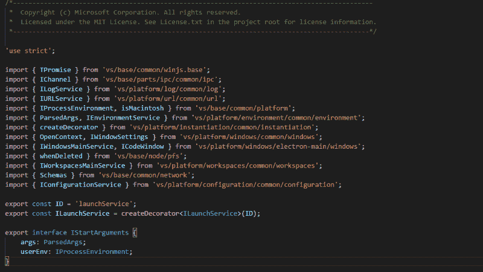

# 为什么应该使用列缩进来提高代码的可读性

> 原文：<https://www.freecodecamp.org/news/how-to-columnize-your-code-to-improve-readability-f1364e2e77ba/>

莱昂纳多·卡雷罗

# 为什么应该使用列缩进来提高代码的可读性

我认为编程最重要的方面是你编写或维护的源代码的可读性。这涉及到很多东西，从编程语言的语法到变量名、注释和缩进。这里我讨论其中的最后一个，**缩进**。

这不是关于缩进大小，或者制表符和空格之间的选择，或者在 Python 这样的语言中是否需要。很多人喜欢对每行代码使用最大长度，通常是 80 或 120 个字符。有了这个想法，没有最大长度，有时你需要使用水平滚动条。但是不要大惊小怪，这不是针对整个代码——这只是其中的一部分。

### 使用代码缩进的四个改进示例

#### 第一个例子

看一下这段代码:

可读性不是很好，为了避免混乱，您可以使用如下代码:

而你的 7 行变成了差不多 40 行。每个对象只有三四个属性。如果是八个属性，那就变成 70 行了。

我所说的想法是使用类似这样的东西(我称之为“列缩进”代码):

#### 第二个例子

它不仅仅适用于对象文字。它可以用于由一组相似的行组成的任何一段代码。这个过程可能很快。您可以复制第一行，粘贴它，然后覆盖每一行中的变化部分。

也可以用在 JS `import` 里。比较这两个版本:

这十三个导入是按路径的字母顺序排列的。它们都来自于`vs`文件夹——五个来自于`vs/base`，八个来自于`vs/platform`。

如果你的眼睛不在每条线上来回移动，你就看不到这一点。这样做很烦。当然，您不需要统计您的文件是如何导入其他文件的。但是有时您会阅读这段代码，以查看您是否从正确的文件中导入了某些内容，或者某个文件是否已经被导入。

现在看看同样的代码是如何缩进的:

这样不是更好吗？

#### 第三个例子

在此示例中，我们有一个来自 TypeScript 编译器的方法声明:

同样，你可以更容易地看出这两条线之间的区别。它帮助你同时阅读所有的五行，花费更少的精力。而且，如果您需要在这 5 行中的每一行添加参数，您可以只做一次，在几乎所有的代码编辑器中使用[多行光标](https://stackoverflow.com/a/30039968)。

#### 第四个例子

下面是最后一个例子，与原文和对比放在一起:

**优点**:

*   你的代码看起来更干净。
*   您的代码提高了可读性
*   您也许可以减少代码中的行数

**缺点**:

*   代码编辑器的自动格式化选项会干扰布局
*   当向一组行中添加一行时，有时您必须更改所有其他行
*   编写代码可能很耗时

### 什么工具可以帮助实现这一点？

我用这种方式手工缩进了一段时间。很无聊，但是一旦开始做，就停不下来了。你看着你的代码，所有那些重复的行都可以缩进以增加可读性，你不能不这样做。会上瘾的。

我使用 Visual Studio 和 Visual Studio 代码，所以我试图找到一个扩展或插件来帮助实现这一点。我没找到。因此，2017 年 11 月，我开始为 Visual Studio 代码创建自己的扩展，并将其命名为[智能列缩进器](https://marketplace.visualstudio.com/items?itemName=lmcarreiro.vscode-smart-column-indenter)。

同一个月，我发布了第一个可用的版本。看看它是如何工作的:

“Smart Column Indenter” for Visual Studio Code

该扩展还存在可以改进的地方。目前，它只适用于`*.ts`、`*.js`和`*.json`文件。我认为它对 XML 和 HTML 文件也有帮助，比如对重复标签的相同属性进行列缩进，或者对一组行中重复的不同标签进行列缩进。

一旦为列缩进选择了代码，该算法分三步工作:

1.  代码的词法分析(或标记化)。我安装了 [TypeScript npm 包](https://www.npmjs.com/package/typescript)作为依赖项，并使用编译器 API 来避免在这里重新发明轮子。
2.  执行[最长公共子序列(LCS)](https://en.wikipedia.org/wiki/Longest_common_subsequence_problem) 算法，将每一行代码作为令牌序列传递。这是最难的部分。网上很多参考资料都谈到了 LCS，只是两个序列作为输入，用**动态规划**很容易解决。因为我们通常希望对两行以上的代码进行列缩进，所以问题就变成了寻找多个字符串的最长公共序列(LCS)。[这是一个 NP 难问题](http://ieeexplore.ieee.org/document/5530316/?reload=true)。由于这是一个一般性的问题，我创建了一个独立的 npm 包( [multiple-lcs](https://www.npmjs.com/package/multiple-lcs) )和一个基本实现来完成这个任务。在某些情况下，这不是最好的解决方案，但却是可行的。
3.  重写代码以对 LCS 中出现的标记进行列缩进。LCS 中的每个令牌都放在一个新列中。

对于某些类型的标记，如字符串或变量名，在 LCS 算法中使用类型名代替内容。结果是一个更大的子序列。

我将所有的逻辑放在一个单独的 npm 包中( [smart-column-indenter](https://www.npmjs.com/package/smart-column-indenter) )。如果您想为另一个基于 JavaScript 的 IDE 创建这样的扩展或插件，您可以使用这个包。

我创建这个解决方案的最初原因是概念验证。我想知道其他程序员对我的解决方案有什么看法。如果你喜欢，请鼓掌。

如果你有建设性的批评，或者知道做同样事情的其他工具，请留下评论。这是我发现有用的的一篇[文章。](http://www.draconianoverlord.com/2016/09/16/one-true-way-of-indenting.html)

感谢阅读。

**更新(2018–03–29):**它前几天发表后，我得到了很多反馈，大部分都是负面的，但不管怎样，谢谢大家，知道为什么很多人不喜欢它很好。我后来发现，人们通常称之为“代码对齐”，你不会找到任何关于“列缩进”的内容，所以如果你想搜索更多关于这方面的内容，请搜索“代码对齐”。我照做了，并从特伦斯·伊登的博客中找到了一篇有趣的[博文，因为大多数负面评论都是关于 VCS 合并、历史和肮脏的差异的问题，我将复制他的结论:“如果我们的工具使理解这些想法变得更加困难，那么需要改变的是工具，而不是我们。”](https://shkspr.mobi/blog/2014/11/why-i-vertically-align-my-code-and-you-should-too/)

**更新(2018–05–03):**好像 GitHub 团队有人在这里看到了关于代码对齐的负面评论，[现在你可以忽略代码评审中的空格](https://blog.github.com/2018-05-01-ignore-white-space-in-code-review/)。

**更新(2018–05–20):**如果你用的是 Visual Studio(不是代码) [Shadman Kudchikar](https://www.freecodecamp.org/news/how-to-columnize-your-code-to-improve-readability-f1364e2e77ba/undefined) 做了类似的扩展，你可以在这里[了解](https://medium.com/@kudchikarsk/sharp-column-indenter-visual-studio-extension-d167aaddf11f)或者在这里下载[。](https://marketplace.visualstudio.com/items?itemName=kudchikarsk.sharp-column-indenter)

### 仿真陈述

我们现在有分辨率为 1920x1080 的 22 英寸屏幕。没有理由限制自己每行 80 个字符，尽管您需要决定最大限制。这一 80 个字符限制的由来是:

[More than one person has wondered this](https://softwareengineering.stackexchange.com/a/148678).