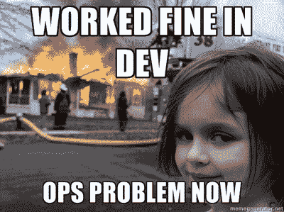

# 使用 TensorFlow 将机器学习作为服务

> 原文：<https://www.freecodecamp.org/news/machine-learning-as-a-service-with-tensorflow-9929e9ce3801/>

作者:基里尔·杜波维科夫

# 使用 TensorFlow 将机器学习作为服务


source — [https://www.dsgear.com](https://www.dsgear.com)

想象一下:你已经登上了人工智能宣传列车，并决定开发一个应用程序来分析不同筷子类型的有效性。为了将这个令人兴奋的人工智能应用货币化并打动风投，我们需要向全世界开放它。它最好是可扩展的，因为每个人都想使用它。

作为一个起点，我们将使用这个数据集，它包含使用不同长度筷子的不同个体的食物夹取效率的测量。

#### 体系结构

因为我们不仅是数据科学家，也是负责任的软件工程师，我们将首先起草我们的架构。首先，我们需要决定如何访问我们部署的模型来进行预测。对于 TensorFlow，一个天真的选择是使用 [TensorFlow 服务](https://www.tensorflow.org/serving/)。这个框架允许您部署经过训练的 TensorFlow 模型，支持模型版本控制，并在幕后使用 g [RPC](https://grpc.io) 。

关于 gRPC 的主要警告是，与 REST 服务相比，它不是非常公共友好的。任何使用最少工具的人都可以调用 REST 服务并快速获得结果。但是当您使用 gRPC 时，您必须首先使用特殊的实用程序从 proto 文件生成客户机代码，然后用您最喜欢的编程语言编写客户机。

TensorFlow 服务简化了这个管道中的许多事情，但它仍然不是在客户端消费 API 的最简单的框架。如果你需要闪电般快速、可靠、严格类型化的应用程序内部使用的 API(例如作为 web 或移动应用程序的后端服务)，考虑 TF 服务。

我们还需要满足系统的非功能性需求。如果很多用户想知道他们的筷子使用效率，我们需要系统具有容错性和可伸缩性。此外，UI 团队还需要在某个地方部署他们的筷子米 web 应用程序。我们将需要资源来构建新的机器学习模型，可能是在拥有强大计算能力的 Jupyter 实验室中。这些问题的最佳答案之一是使用 Kubernetes。

> Kubernetes 是一个用于自动化部署、扩展和管理容器化应用的开源系统。

有了 Kubernetes，有了知识和一些时间，我们可以创建一个可扩展的内部云 PaaS 解决方案，为全周期数据科学项目开发提供基础设施和软件。如果你不熟悉 Kubernetes，我建议你看看这个:

Kubernetes 运行在 [Docker](http://docker.com) 技术之上，所以如果你对它不熟悉，先看一下[官方教程](https://docs.docker.com/get-started/)可能会好一些。

总而言之，这是一个非常丰富的主题，值得几本书来完全涵盖，所以这里我们将专注于单一部分:将机器学习模型应用于生产。

#### 考虑

是的，这个数据集很小。是的，在这里应用深度学习可能不是最好的主意。请记住，我们是来学习的，这个数据集当然很有趣。本教程的建模部分将缺乏质量，因为主要焦点是在模型部署过程上。

此外，我们需要给我们的风投留下深刻印象，所以深度学习是必须的！:)


Image [source](https://xkcd.com/1838/).

#### 密码

本文中使用的所有代码和配置文件都可以在一个[配套的 GitHub repositor](https://github.com/kdubovikov/chopstick-serving) y 中获得。

#### 训练深度筷子分类器

首先，我们必须选择一个机器学习框架来使用。由于本文旨在展示 TensorFlow 服务功能，我们将选择 TensorFlow。

你可能知道，有两种方法可以训练我们的分类器:使用 TensorFlow 和使用 TensorFlow [Estimator API](https://www.tensorflow.org/versions/master/programmers_guide/estimators) 。Estimator API 试图以 scikit-learn 为一组经典 ML 模型所做的方式，为深度学习模型提供一个统一的接口。对于这个任务，我们可以使用`tf.estimator.LinearClassifier`快速实现逻辑回归，并在训练完成后导出模型。

另一种方法是使用普通 TensorFlow 来训练和导出分类器:

#### 设置 TensorFlow 服务


Serving, huh?

所以，你用 TensorFlow 有了一个很棒的深度学习模型，并渴望将其投入生产？现在是时候开始 TensorFlow 服务了。

TensorFlow 服务基于 gRPC——一个快速远程过程调用库，它使用了另一个 Google 项目——协议缓冲区。

Protocol Buffers 是一个序列化框架，它允许您将对象从内存转换为适合网络传输的高效二进制格式。

概括地说，gRPC 是一个支持通过网络进行远程函数调用的框架。它使用协议缓冲区来序列化和反序列化数据。

TensorFlow 服务的主要组件包括:

*   **Servable**——这基本上是你的训练模型的一个版本，以适合于 TF Serving 加载的格式导出
*   **加载器** — TF 服务组件，它碰巧将服务加载到内存中
*   **管理器** —实现 servable 的生命周期操作。它控制 servable 的出生(加载)、长期生存(服务)和死亡(卸载)
*   核心(Core)——让所有组件协同工作(官方文档对核心的实际内容有点模糊，但你可以随时[查看源代码](https://github.com/tensorflow/serving/blob/f34e79a1ef0315d0f2d86eb0751a4c3700f8a433/tensorflow_serving/model_servers/server_core.h)来了解它的功能)

你可以在[官方文档](https://www.tensorflow.org/serving/architecture_overview)中阅读关于 TF 服务架构的更深入的概述。

要启动并运行基于 TF 服务的服务，您需要:

1.  将模型导出为与 TensorFlow 服务兼容的格式。换句话说，创建一个可服务的。
2.  安装或编译 TensorFlow 服务
3.  运行 TensorFlow Serving 并加载导出模型的最新版本(servable)

[设置 TernsorFlow 服务](https://github.com/tensorflow/serving/blob/master/tensorflow_serving/g3doc/setup.md)有几种方式:

*   从源代码构建。这需要您安装 Bazel 并完成一个漫长的编译过程
*   使用预先构建的二进制包。TF 服务以 deb 包的形式提供。

为了自动化这个过程并简化 Kubernetes 的后续安装，我们为您创建了一个简单的 docker 文件。[请复制文章的存储库，并按照 README.md](https://github.com/kdubovikov/chopstick-serving) 文件中的说明构建 TensorFlow 服务 Docker 映像:

```
➜ make build_image
```

此映像预安装了 TensorFlow 服务和所有依赖项。默认情况下，它从 docker 容器中的`/models`目录加载模型。

#### 运行预测服务

要在新构建并准备使用的 TF Serving 映像中运行我们的服务，请确保首先训练并导出模型(或者，如果您正在使用一个配套的存储库，只需运行`make train_classifier`命令)。

在分类器被训练和导出之后，您可以通过使用快捷方式`make run_server`或者通过使用以下命令来运行服务容器:

```
➜ docker run -p8500:8500 -d --rm -v /path/to/exported/model:/models tfserve_bin
```

*   `-p`将端口从容器映射到本地机器
*   `-d`在后台模式下运行容器
*   `--rm`停止后移除容器
*   `-v`将本地目录映射到正在运行的容器中的一个目录。这样，我们将导出的模型传递给运行在容器内部的 TF 服务实例

#### 从客户端调用模型服务

为了调用我们的服务，我们将使用`grpc` `tensorflow-serving-api` Python 包。请注意，这个包目前只对 Python 2 可用，所以您应该为 TF 服务客户端拥有一个单独的虚拟环境。

要在 Python 3 中使用这个 API，你要么需要使用来自[这里](https://github.com/illagrenan/tensorflow-serving-api-python3)的一个非官方包，然后手动下载并解压缩这个包，要么从源代码构建 TensorFlow 服务(参见[文档](https://github.com/tensorflow/serving/blob/master/tensorflow_serving/g3doc/setup.md#tensorflow-serving-python-api-pip-package))。Estimator API 和 plain TensorFlow 的客户端示例如下:

#### 与 Kubernetes 一起投入生产

如果您没有可用的 Kubernetes 集群，您可以使用 [minikube](https://github.com/kubernetes/minikube) 创建一个用于本地实验，或者您可以使用 [kubeadm](https://kubernetes.io/docs/setup/independent/create-cluster-kubeadm/) 轻松部署一个真实的集群。

在这篇文章中，我们将选择 minikube。一旦您安装了它(Mac 上的`brew cask install minikube`),我们就可以启动一个本地集群，并与我们的机器共享它的 Docker 环境:

```
➜ minikube start...➜ eval $(minikube docker-env)
```

之后，我们将能够构建我们的映像，并使用

```
➜ make build_image
```

一个更成熟的选择是使用内部 docker 注册表，并将本地构建的映像推送到那里，但是为了更加简洁，我们将这一点排除在范围之外。

在构建了我们的映像并可用于 Minikube 实例之后，我们需要部署我们的模型服务器。为了利用 Kubernetes 的负载平衡和高可用性特性，我们将创建一个部署，将我们的模型服务器自动扩展到三个实例，并保持它们被监控和运行。你可以在这里阅读更多关于 Kubernetes 部署的信息。

所有的 Kubernetes 对象都可以配置成各种文本格式，然后传递给`kubectl apply -f file_name`命令(meh)将我们的配置应用到集群。这是我们的筷子服务器部署配置:

让我们使用`kubectl apply -f chopstick_deployment.yml`命令来应用这个部署。过一会儿，您会看到所有组件都在运行:

```
➜ kubectl get allNAME                          DESIRED   CURRENT   UP-TO-DATE   AVAILABLE   AGEdeploy/chopstick-classifier   3         3         3            3           1d
```

```
NAME                                 DESIRED   CURRENT   READY     AGErs/chopstick-classifier-745cbdf8cd   3         3         3         1d
```

```
NAME                          AGEdeploy/chopstick-classifier   1d
```

```
NAME                                 AGErs/chopstick-classifier-745cbdf8cd   1d
```

```
NAME                                       READY     STATUS    RESTARTS   AGEpo/chopstick-classifier-745cbdf8cd-5gx2g   1/1       Running   0          1dpo/chopstick-classifier-745cbdf8cd-dxq7g   1/1       Running   0          1dpo/chopstick-classifier-745cbdf8cd-pktzr   1/1       Running   0          1d
```

注意，根据部署配置，Kubernetes 为我们创建了:

*   部署
*   [副本集](https://kubernetes.io/docs/concepts/workloads/controllers/replicaset/)
*   三个豆荚运行我们的筷子分类器图像

现在我们想把我们新的闪亮服务叫做。要做到这一点，首先我们需要向外界公开它。在 Kubernetes 中，这可以通过定义[服务](https://kubernetes.io/docs/concepts/services-networking/service/)来实现。下面是我们模型的服务定义:

和往常一样，我们可以使用`kubectl apply -f chopstick_service.yml`来安装它。Kubernetes 将为我们的负载平衡器分配一个外部端口，我们可以通过运行

```
➜ kubectl get svcNAME                   TYPE           CLUSTER-IP       EXTERNAL-IP   PORT(S)          AGEchopstick-classifier   LoadBalancer   10.104.213.253   <pending>     8500:32372/TCP   1dkubernetes             ClusterIP      10.96.0.1        <none>        443/TCP          1d
```

如您所见，在我的例子中，我们的`chopstick-classifier`是通过端口`32372`可用的。在您的机器中可能会有所不同，所以别忘了检查一下。使用 Minikube 时，获取任何服务的 IP 和端口的一种便捷方法是运行以下命令:

```
➜ minikube service chopstick-classifier --urlhttp://192.168.99.100:32372
```

#### 推理

最后，我们能够调用我们的服务！

```
python tf_api/client.py 192.168.99.100:32372 1010.0Sending requestoutputs {  key: "classes_prob"  value {    dtype: DT_FLOAT    tensor_shape {      dim {        size: 1      }      dim {        size: 3      }    }    float_val: 3.98174306027e-11    float_val: 1.0    float_val: 1.83699980923e-18  }}
```

#### 在投入实际生产之前



因为这篇文章主要是为了教育目的，为了清楚起见做了一些简化，所以在投入生产之前有几个要点需要考虑:

*   使用类似 [linkerd.io](https://linkerd.io) 的服务网格。不建议在生产中从随机生成的节点端口访问服务。另外，linkerd 将为您的生产基础设施增加更多的价值:监控、服务发现、高速负载平衡等等
*   到处使用 Python 3，因为现在确实没有理由使用 Python 2
*   明智地应用深度学习。尽管深度学习是一个非常通用、壮观和广泛适用的框架，但它并不是数据科学家可以使用的唯一工具。它也不是解决任何问题的灵丹妙药。机器学习可以提供更多的东西。如果您有关系/表数据、小型数据集、对计算资源的严格限制，或者训练时间或模型可解释性，请考虑使用其他算法和方法。
*   如果您在解决机器学习挑战方面需要任何帮助，请联系我们:datalab@cinimex.ru