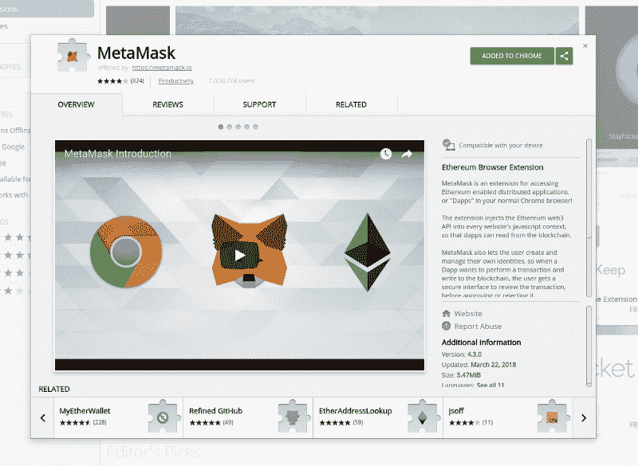
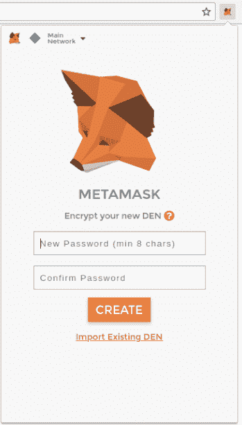
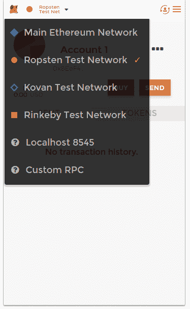
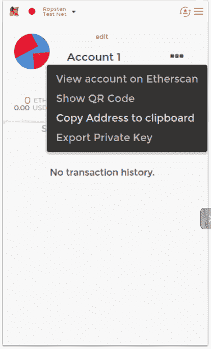

# 使用开源契约(open-zeppelin)创建以太坊令牌

> 原文：<https://www.freecodecamp.org/news/create-an-ethereum-token-using-open-source-contracts-open-zeppelin-1e132e6233ed/>

丹尼写的

# 使用开源契约(open-zeppelin)创建以太坊令牌


我想向您展示创建最佳实践令牌是一个简单的过程。老实说，我们会做一些编码，但不会太多。

我们将使用 Solidity 来创建我们的以太坊令牌。但是不要担心，有很多开源库和合同可以在这个过程中帮助我们。

我们想要的是一个符合 ERC-20 标准的令牌。这意味着以太坊的开发者们已经决定了一系列的功能，这些功能是你今天最常用的令牌所必需的。还有其他类型的 ERC 标准，但我们不会深入探讨。

**要求:**

*   开源代码库
*   末端的
*   NodeJS
*   NPM
*   元掩码(用于初始帐户创建)

好了，让我们开始编码吧！我们想做的第一件事是全球下载`truffle`。你可以在 [truffle](https://github.com/trufflesuite/truffle) 访问他们的回购，下面是要安装的代码片段:

```
npm install -g truffle
```

***注意**:如果你之前安装了这个版本，确保你有最新版本的 truffle

Truffle 将为我们处理智能合同编译、链接和部署。这是一个图书馆，将使我们的生活更容易为这个演示。

现在我们需要创建一个目录来存放我们的项目。在我的例子中，我称之为**以太坊 _ 令牌 _ 教程。**

所以我们有两个选择。您可以通过以下方式克隆我创建的回购:

```
git clone -b initial_step https://git@github.com/danieljoonlee/ethereum_token_tutorial.git
```

或者，您可以在新目录下的终端中执行此操作:

```
truffle init
```

如果你按照第二种选择做`truffle init`。该目录应该如下所示:

```
etherem_token_tutorial|___contracts| |_____ConvertLib.sol| |_____MetaCoin.sol| |_____Migrations.sol|___migrations| |_____1_initial_migrations.js| |_____2_deploy_contracts.js|___test| |_____TestMetacoin.sol| |_____metacoin.js|___truffle.js
```

继续删除`ConvertLib.sol`、`MetaCoin.sol`、`TestMetacoin.sol`、`metacoin.js`。

因此，您的目录现在应该如下所示:

```
etherem_token_tutorial|___contracts| |_____Migrations.sol|___migrations| |_____1_initial_migrations.js| |_____2_deploy_contracts.js|___test|___truffle.js
```

太好了。现在我们要搬家了。Truffle 帮助我们编制智能合同并部署它们。但是我们删除了除迁移助手之外的智能合同文件。别担心，这就是开放式齐柏林飞艇的用武之地。

`Open-Zeppelin`是一个开源的回购协议，在这里你可以找到具有最佳实践、良好测试覆盖率和最有可能被审计的智能合同*。

*   审计是让专业开发人员审查您的智能合同，寻找任何漏洞、错误或恶意攻击的可能性。

如果你对智能合约攻击感兴趣，这里有一个链接:[链接](https://medium.com/@merunasgrincalaitis/how-to-audit-a-smart-contract-most-dangerous-attacks-in-solidity-ae402a7e7868)

为了使用任何`Open-Zeppelin`合同，我们需要将它安装到我们的存储库中:

```
npm init -ynpm install -E zeppelin-solidity
```

我们用 npm init -y 初始化了 package.json。我们还安装了使用 Open-Zeppelin 契约的包。

好了，我们要写一些实性。我在前面的文章中提到过这不会有很多代码，我不是在开玩笑！

在`contracts`文件夹中创建一个新文件。在我的例子中，我将其命名为`TestToken.sol`

现在，您的目录应该如下所示:

```
etherem_token_tutorial|___contracts| |_____Migrations.sol| |_____TestToken.sol***(this one is new)|___migrations| |_____1_initial_migrations.js| |_____2_deploy_contracts.js|___test|___truffle.js
```

在`TestToken.sol`中，我们需要以下代码:

```
// TestToken.solpragma solidity ^0.4.18;
```

```
import "zeppelin-solidity/contracts/token/ERC20/MintableToken.sol";
```

```
contract TestToken is MintableToken {    string public constant name = "Test Token";    string public constant symbol = "TT";    uint8 public constant decimals = 18;}
```

让我们把它分解一下，因为它很长，尽管只有几行代码。

`pragma solidity ^0.4.18;`

它需要在文件的顶部，因为它指定了我们正在使用的 Solidity 的版本。

```
import "zeppelin-solidity/contracts/token/ERC20/MintableToken.sol";
```

上面的代码片段就是 Open-Zeppelin 如此有用的原因。如果你知道继承是如何工作的，我们的契约是从 MintableToken 继承的。如果你不知道继承是如何工作的，MintableToken 有很多功能保存在 inMintableToken.sol 中，我们可以使用这些功能来创建我们的令牌。如果你访问这个 [MintableToken](https://github.com/OpenZeppelin/zeppelin-solidity/blob/master/contracts/token/ERC20/MintableToken.sol) ，你会注意到大量的函数和更多的继承。这可能有点像兔子洞，但出于演示的目的，我希望我们向 testnet 中释放一个令牌。

对我们来说，Mintable 让我们创建尽可能多的令牌，所以我们不会从最初的供应开始。在我的下一篇文章中，我们将创建一个 nodejs 服务，它将创建新的令牌，并处理其他 ERC-20 标准功能。

下一段代码:

```
contract TestToken is MintableToken {    string public constant name = "Test Token";    string public constant symbol = "TT";    uint8 public constant decimals = 18;}
```

这是我们可以自定义令牌的地方。在我的例子中，我将我的令牌命名为“测试令牌”，符号为“TT”，小数位数为 18。但是为什么是 18 位小数呢？

18 位小数在这个社区相当普遍。因此，如果我们有一个测试令牌，它可能看起来像这样 1.1111111111111。

幼兽。这就是我们需要为这个令牌做的所有可靠性编码。我们从 Open-Zeppelin 继承了标准化 ERC 20 令牌的所有主要功能。之后，我们需要为名称、符号和小数设置常数。

在我们忘记之前，我们应该创建一个元掩码帐户，并用 testnet 以太坊为它提供资金。

继续搜索 Chrome 的`MetaMask`扩展，或者点击这个[链接](https://chrome.google.com/webstore/detail/metamask/nkbihfbeogaeaoehlefnkodbefgpgknn?hl=en)



Metamask Extension for Google Chrome

安装 MetaMask 后，您应该会看到一系列步骤。你可以通读类似的服务条款。最终你会到达:



Metamask Password Screen

输入您的密码并确认该密码。单击创建，您将看到另一个屏幕。


Metamask secret

请确保保存您的种子词或将它们复制到文本文件中。我们将需要这些种子词来将令牌部署到测试网上。

还有更重要的是将你的测试从 Mainnet 测试网改为 Ropsten 测试网。它位于元掩码选项卡的左上方。这是下拉菜单:



Testnet list

我们使用 Ropsten 测试网络的原因是因为它是最接近主以太网的 testnet/实现。

接下来，您需要从`...`菜单中复制您的地址到剪贴板，如下所示:



Metamask Account Screen

您应该有一个类似于以下地址的地址复制到您的剪贴板:

```
address: 0x8EeF4Fe428F8E56d2202170A0bEf62AAc93989dE
```

这是我们将要部署令牌契约的地址。现在你需要知道的一件事是，部署合同需要花费以太币，具体来说就是汽油。我们需要在我们的账户里放些以太网测试。

现在您已经有了自己的地址，请访问这个 Ropsten 水龙头链接:

[**以太网龙头**](http://faucet.ropsten.be:3001/)
[*编辑描述*龙头. ropsten.be](http://faucet.ropsten.be:3001/)

复制并粘贴您的地址，很快您的 MetaMask 钱包中就会有 1 个以太坊作为您的地址。


Account with 1 ethereum

在我们开始编码我们的部署过程之前，还有一件事！我们将使用一个名为`Infura.io`的免费 API:

[**Infura —可扩展的区块链基础设施**](https://infura.io/)
[*安全、可靠、可扩展地访问以太坊 API 和 IPFS 网关。* infura.io](https://infura.io/)

注册他们的服务。您应该会收到他们的电子邮件，或者被重定向到一个带有您的 API 密钥的站点。我们特别想要的是 Ropsten 网络的。

```
Test Ethereum Network (Ropsten)https://ropsten.infura.io/API_KEY
```

复制你的 API_KEY。

快到了！现在让我们开始我们的部署工作。让我们回到我们的代码中。

首先，我们来谈谈安全性。在根目录下创建一个名为`.env`的新文件。您的文件结构现在应该如下所示:

```
etherem_token_tutorial|___contracts| |_____Migrations.sol| |_____TestToken.sol|___migrations| |_____1_initial_migrations.js| |_____2_deploy_contracts.js|___test|___truffle.js|___.env**(new file)
```

在您的`.env`文件中，让我们添加一些环境变量(这些是您可以在代码目录中的任何地方访问的变量)

```
//.env fileINFURA_API_KEY=API_KEYMNENOMIC=MNEOMIC_FROM_METAMASK
```

首先将您复制的 API_KEY 添加到文件中。

还记得初始化 Metamask chrome 扩展时的 Mneomic(种子词)吗？我们现在需要它来部署合同。如果你下载或写下了你的记忆经济学，现在把它们写在你的`.env`文件`MNENOMIC=SOME KEY PHRASE YOU DONT WANT THE PUBLIC TO KNOW.`中

**重要*****

我们加了一个`.env`文件！！！我们现在需要添加一个`.gitignore`文件，以避免在您决定公开代码时将`.env`添加到公共存储库中！

在与您的`.env`相同的目录下创建一个`.gitignore`文件。现在它应该是这样的:

```
etherem_token_tutorial|___contracts| |_____Migrations.sol| |_____TestToken.sol|___migrations| |_____1_initial_migrations.js| |_____2_deploy_contracts.js|___test|___truffle.js|___.env|___.gitignore**(newfile)
```

在您的`.gitignore`文件中:

```
// .gitignorenode_modules/build/.env
```

我们想忽略`node_modules/`，因为当我们忽略`npm install`时，它会从我们的`package.json`下载包。我们想忽略`build`,因为稍后当我们运行脚本时，它会自动为我们创建目录。我们也想忽略`.env`，因为它有我们不想向公众发布的私人信息。

太好了！在我们的终端，我们需要增加两个模块。

```
npm install --save dotenv truffle-hdwallet-provider
```

因为我们正在放入私人信息，所以我们需要一种从`.env`访问这些变量的方法，而`dotenv`包将帮助我们。

第二个包 truffle-hdwallet-provider 是一个支持钱包的提供者。如果没有这一点，我们将需要下载所有的块或使用一个轻型钱包在以太坊网络中进行新的交易。钱包提供商和 Infura API。我们可以立即部署，也可以绕过痛苦的过程。

在根目录的`truffle.js`中，我们需要修改一些配置。

```
// truffle.jsrequire('dotenv').config();const HDWalletProvider = require("truffle-hdwallet-provider");
```

```
module.exports = {  networks: {    development: {      host: "localhost",      port: 7545,      gas: 6500000,      network_id: "5777"    },    ropsten: {        provider: new HDWalletProvider(process.env.MNENOMIC, "https://ropsten.infura.io/" + process.env.INFURA_API_KEY),        network_id: 3,        gas: 4500000    },  }};
```

第一行表示我们希望在这个回购中使用`.env`变量。一般来说，在大多数应用程序中，你只需要在启动配置文件中这样做一次。

大部分都是样板文件。我们要关注的主要部分是 ropsten 网络。

```
ropsten: {        provider: new HDWalletProvider(process.env.MNENOMIC, "https://ropsten.infura.io/" + process.env.INFURA_API_KEY),        network_id: 3,        gas: 4500000    },
```

提供商是我们的网络。在我们的例子中，我们希望将令牌部署到`Ropsten`网络中。使用`HDWalletProvider`，我们传入两个参数，`process.env.MNENOMIC, "https://ropsten.infura.io/" + process.env.INFURA_API_KEY`。我们通过引用`process.env.VARIABLE_NAME_IN_ENV`访问我们的`.env`变量。

我们设置`network_id: 3`是因为它代表 Ropsten。`1`是主要的以太网，`2`是旧的试验网。

最后，我们设置了`gas: 4500000`，这也是我们最初需要以太坊的原因。每当我们需要在以太坊网络中修改/添加某些东西时，我们都会使用`gas/ethereum`。

好了，进入部署前的最后一步！

在我们的合同中，我们需要做一些修改。

```
// 2_deploy_contract.js
```

```
const TestToken = artifacts.require("./TestToken.sol");
```

```
module.exports = function(deployer) {  deployer.deploy(TestToken);};
```

如果您将令牌合同文件命名为其他名称。您需要将`TestToken.sol`替换为您命名的任何文件。

```
truffle compile
```

这将在您的目录中创建一个新文件夹:

```
etherem_token_tutorial|___build| |_____contracts|    |_____BasicToken.json|    |_____ERC20.json|    |_____ERC20Basic.json|    |_____Migrations.json|    |_____MintableToken.json|    |_____Ownable.json|    |_____SafeMath.json|    |_____StandardToken.json|    |_____TestToken.json|___contracts| |_____Migrations.sol| |_____TestToken.sol|___migrations| |_____1_initial_migrations.js| |_____2_deploy_contracts.js|___test|___truffle.js|___.env|___.gitignore**(newfile)
```

在我们的构建文件夹中，我们有一堆从 Open-Zeppelin 库继承的契约。如果你想了解更多关于 ERC 20 标准的信息，我可以去维基百科看看。如果有足够多的人问我，我可以再写一篇博文。现在，这里是[维基的链接。](https://theethereum.wiki/w/index.php/ERC20_Token_Standard)

关键时刻到了。现在我们需要将合同部署到 Ropsten 网络中。在您的终端中输入以下行:

```
truffle migrate --network ropsten
```

您应该在终端中看到一系列行，如下所示:

```
Using network 'ropsten'.
```

```
Running migration: 1_initial_migration.js  Deploying Migrations...  ... 0x7494ee96ad7db4a560b6f3169e0666c3938f9f54208f7972ab902feb049a7f68  Migrations: 0x254466c5b09f141ce1f93689db6257b92133f51aSaving successful migration to network...  ... 0xd6bc06b3bce3d15dee4b733e5d4b09f0adb8f93f75ad980bad078484641d36e5Saving artifacts...Running migration: 2_deploy_contracts.js  Deploying TestToken...  ... 0x7e5c1b37f1e509aea59cd297417efe93eb49fdab2c72fa5c37dd2c63a3ba67b7  TestToken: 0x02ec6cbd89d3a435f8805e60e2703ef6d3147f96Saving successful migration to network...  ... 0x2fd6d699295d371ffd24aed815a13c5a44e01b62ca7dc6c9c24e2014b088a34eSaving artifacts...
```

这需要一些时间。一旦它完全部署，复制最后的 txid。就我而言:

```
0x2fd6d699295d371ffd24aed815a13c5a44e01b62ca7dc6c9c24e2014b088a34e
```

这将有一个地址到您的令牌合同。以下是我的 txid 的链接:

[**Ropsten 交易 0 x2 FD 6d 699295d 371 ffd 24 aed 815 a 13 C5 a 44 e 01 b 62 ca 7 DC 6 c 9 c 24 e 2014 b 088 a 34 e**](https://ropsten.etherscan.io/tx/0x2fd6d699295d371ffd24aed815a13c5a44e01b62ca7dc6c9c24e2014b088a34e)
[*Ropsten(ETH)详细交易信息为 0 x2 FD 6d 699295d 371 ffd 24 aed 815 a 13 C5 a 44 e 01 b 62 ca 7 DC 6 c 9 c 24 e 2014 b 088 a 34 e*Ropsten](https://ropsten.etherscan.io/tx/0x2fd6d699295d371ffd24aed815a13c5a44e01b62ca7dc6c9c24e2014b088a34e)

它有一个指向合同本身的地址:

[**Ropsten 账户、地址和合同**](https://ropsten.etherscan.io/address/0x254466c5b09f141ce1f93689db6257b92133f51a)
[*以太坊区块链资源管理器、API 和分析平台* ropsten.etherscan.io](https://ropsten.etherscan.io/address/0x254466c5b09f141ce1f93689db6257b92133f51a)

你可以在这里获得完整的 github repo [。](https://github.com/danieljoonlee/ethereum_token_tutorial)

这是创建令牌并与之交互系列的一部分。在下一篇博客中，我们将创建一个简单的节点微服务。我们将使用此服务调用您的令牌智能合约上的各种功能，如铸造新令牌、转移等。

如果你发现任何错误或错别字，请让我知道！此外，我一直在区块链寻找令人兴奋的项目。

如果你觉得这很有帮助，想请我喝杯啤酒:

BTC:3 kxz 6 zpweuiavg 28 w 78 px 9 doezvklhh 4 nt

BCH:qqwusc 2 peyvlh 3 wgl 0 tpt 3 ll 4 ug 9 zujfvy 9586 tgd 4

ETH:0x 96 ee 87 e 22d 899 BDC 27 EAD 4 Fe 3 FCA 8 e 9f 39176 b4c

LTC:mdhqubtgvzrdg 7 tyzzyk 2 a 2b 99 shyhaqq