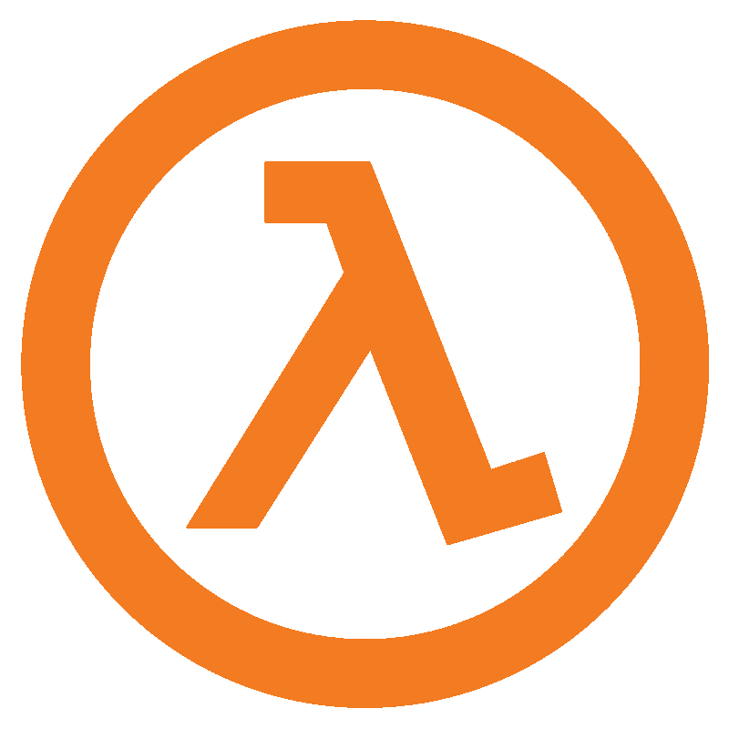
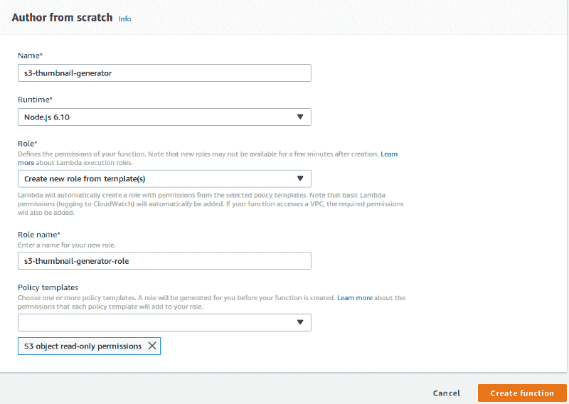
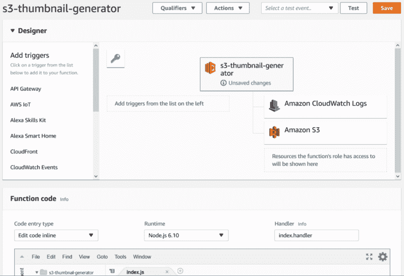
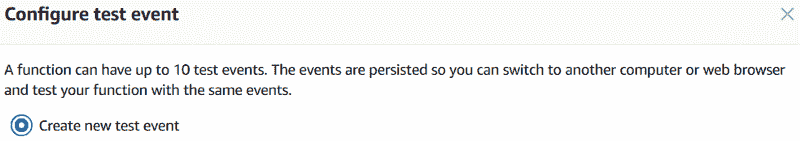
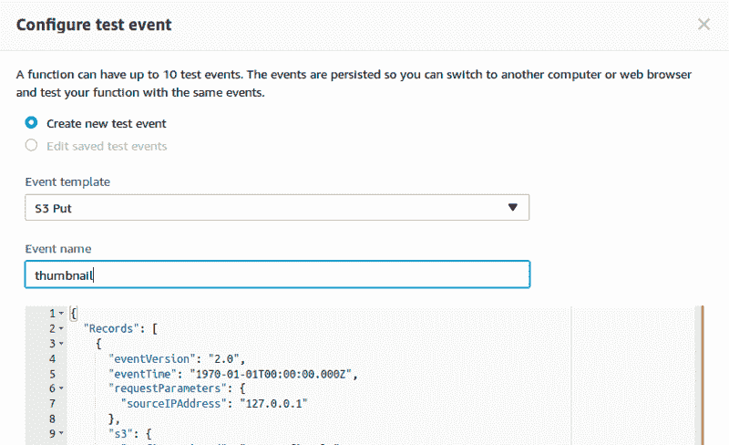
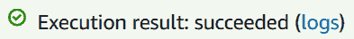
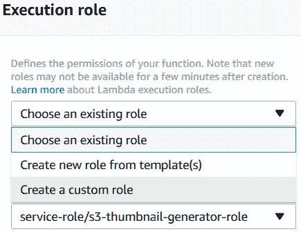
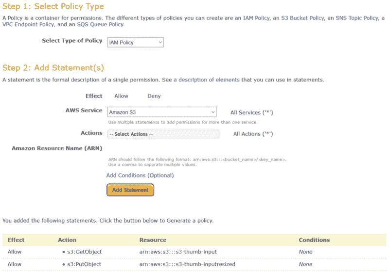
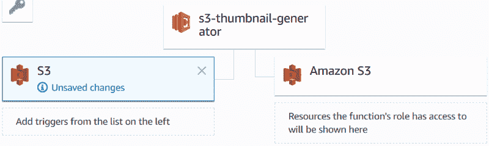

# 绕着街区跑:初学者遇到 AWS Lambda

> 原文：<https://www.freecodecamp.org/news/running-around-the-block-a-beginner-meets-aws-lambda-560a1f2849ae/>

by Janaka Bandara

# 绕着街区跑:初学者遇到 AWS Lambda


计算！它确实有一段非常漫长、生动(有时也很尴尬)的历史。一些重要的里程碑包括:

*   埃及人，他们在木架上滑动几颗弹珠来放松他们的大脑(T2 在一天的剩余时间里在数吨坚硬的花岗岩上流汗)
*   希腊人和他们的 [Antikythera 机制](https://simple.wikipedia.org/wiki/Antikythera_mechanism)能够以千分之二度的精度[追踪行星的运动](http://mentalfloss.com/article/81445/15-intriguing-facts-about-antikythera-mechanism)。
*   查尔斯·巴贝奇的[分析引擎](https://www.britannica.com/technology/Analytical-Engine)。
*   艾伦·图灵的[解谜者](https://www.iwm.org.uk/history/how-alan-turing-cracked-the-enigma-code)。
*   美国宇航局将人类送上月球的袖珍计算器。
*   深蓝[击败国际象棋大师加里·卡斯帕罗夫](http://theconversation.com/twenty-years-on-from-deep-blue-vs-kasparov-how-a-chess-match-started-the-big-data-revolution-76882)。


DSKY: NASA’s Apollo Guidance Computer

与所有这些相一致，软件应用范例也发生了巨大的变化。从纯基于硬件的编程开始，到单片、模块化、SOA、云，再到现在… **无服务器**。

此时，“无服务器”通常意味着 FaaS(功能即服务)。从[的受欢迎程度和采用](https://mobile.datamation.com/cloud-computing/aws-vs.-azure-vs.-google-cloud-comparison.html)的角度来看，FaaS 的字面意思是[AWSλ](https://aws.amazon.com/lambda/)。

因此，毫不夸张地说，无服务器开发的流行可能与 Lambdas 的易用性有关。或者是？



Lambda: leading the Serverless Revolution

嗯，Lambda 从 2015 年开始一直在[左右。它已经集成到 AWS 生态系统的大部分中，并在数百家(如果不是数千家)公司的生产中使用。所以，Lambda 应该非常直观和易于使用，对不对？](https://techcrunch.com/2014/11/13/amazon-launches-lambda-an-event-driven-compute-service/)

对我来说，似乎不是。

由于“我的情况”是 AWS 的官方例子之一，我不太相信 Lambda 对新手来说足够友好。

首先，我想实现 AWS 自己的[缩略图创建用例](https://docs.aws.amazon.com/lambda/latest/dg/with-s3-example.html) *，而不用*跟随[他们自己的指南](https://docs.aws.amazon.com/lambda/latest/dg/with-s3-example-create-test-manually.html)，看看我能走多远。

作为一名程序员，我很自然地从 [Lambda 管理控制台](https://console.aws.amazon.com/lambda/home?region=us-east-1)开始。代码已经由慷慨的 AWS 开发人员[写好了](https://docs.aws.amazon.com/lambda/latest/dg/with-s3-example-deployment-pkg.html#Node.js)，那么为什么要重新发明轮子呢？复制、粘贴、保存、运行。哒哒！

嗯，看起来我需要长大一点。

[“创建功能”向导](https://console.aws.amazon.com/lambda/home?region=us-east-1#/create)很抢眼，有这么多现成的蓝图。太糟糕了，它还没有 S3 缩略图生成的例子，否则这个故事可能已经结束了！

所以我选择了“从头开始创作”，使用的名字是`s3-thumbnail-generator`。

等等，这个“角色”是什么？这也是必须的。幸运的是，它有一个“从模板创建新角色”选项，这将拯救我的一天。

放轻松。「角色名称」:`s3-thumbnail-generator-role`。但是“政策模板”呢？

也许我应该找一些与 S3 相关的东西，因为我的 Lambda 是全 S3。

惊喜！当我搜索 S3 时，我得到的唯一东西是“S3 对象只读权限”。没有别的选择，我只是抓住了它。让我们看看在我摔个嘴啃泥之前我能走多远！

是时候点击“创建功能”了。



Create Function wizard

哇，他们的 Lambda 设计器看起来真酷！



AWS Lambda editor

> “恭喜恭喜！你的 Lambda 函数“S3-缩略图生成器”已经成功创建。您现在可以更改它的代码和配置。当您准备好测试您的功能时，单击“测试”按钮输入测试事件。

好了，我的复制粘贴任务开始了。“复制”Lambda 代码编辑器上的[样本源代码](https://docs.aws.amazon.com/lambda/latest/dg/with-s3-example-deployment-pkg.html#Node.js)、`Ctrl+A`和`Ctrl+V`。简单！

全绿(无红色)。很高兴知道。

“保存”和“测试”。



Configure test event

哦，我早该知道的。是的，如果我要“测试”，我需要一个“测试输入”。很明显。

我知道测试我全新的 Lambda 不会那么容易。但没想到还得手工拼凑一个 JSON 序列化的事件*。*

*谢天谢地，AWS devs 在这方面也做得很好，提供了一个现成的“S3 Put”事件模板。那么我还会选择什么呢？*

*

S3 Put test event* 

*不出所料，第一轮失败了:*

```
*`{  "errorMessage": "Cannot find module 'async'",  "errorType": "Error",  "stackTrace": [    "Function.Module._load (module.js:417:25)",    "Module.require (module.js:497:17)",    "require (internal/module.js:20:19)",    "Object. (/var/task/index.js:2:13)",    "Module._compile (module.js:570:32)",    "Object.Module._extensions..js (module.js:579:10)",    "Module.load (module.js:487:32)",    "tryModuleLoad (module.js:446:12)",    "Function.Module._load (module.js:438:3)"  ]}`*
```

*该死，我应该注意到那些线条的。*

*不管怎样，都是我的错。我复制示例代码的页面有一个很大的标题“创建一个 Lambda **部署包**，并清楚地解释了如何将示例捆绑到一个 Lambda 可部署的 zip 包中。*

*所以，我创建了一个包含我的代码和`package.json`的本地目录，并运行了一个`npm install`(还好我已经预装了`node`和`npm`！).*

*构建、压缩和上传应用程序相当容易，希望我不必经历无数次这样的循环来让我的 Lambda 工作。*

*(顺便说一句，我希望我能在他们的内置编辑器中做到这一点。糟糕的是，我想不出添加依赖项的方法。)*

*不管怎样，我第二次测试的时机已经成熟了。*

```
*`{  "errorMessage": "Cannot find module '/var/task/index'",  "errorType": "Error",  "stackTrace": [    "Function.Module._load (module.js:417:25)",    "Module.require (module.js:497:17)",    "require (internal/module.js:20:19)"  ]}`*
```

*`index`？那是从哪里来的？*

*等等…我的错，我的错。*

*

‘index.js not found’ warning* 

*似乎**处理程序**参数仍然保持默认值`index.handler`。在我这里应该是`CreateThumbnail.handler` ( `filename.method`)。*

*让我们再试一次。*

*

Success!?* 

*真的吗？不会吧！*

*啊，是的。木头不会说谎。*

```
*`2018-02-04T17:00:37.060Z	ea9f8010-09cc-11e8-b91c-53f9f669b596  Unable to resize sourcebucket/HappyFace.jpg and upload to  sourcebucketresized/resized-HappyFace.jpg due to an error:  AccessDenied: Access DeniedEND RequestId: ea9f8010-09cc-11e8-b91c-53f9f669b596`*
```

*很公平。我没有`sourcebucket`或`sourcebucketresized`，但可能别人有。因此拒绝进入。有道理。*

*所以我创建了自己的 buckets，`s3-thumb-input`和`s3-thumb-inputresized`，编辑了我的事件输入(感谢“配置测试事件”下拉菜单)并再次尝试。*

```
*`2018-02-04T17:06:26.698Z	bbf940c2-09cd-11e8-b0c7-f750301eb569  Unable to resize s3-thumb-input/HappyFace.jpg and upload to  s3-thumb-inputresized/resized-HappyFace.jpg due to an error:  AccessDenied: Access Denied`*
```

*拒绝访问？又来了？*

*幸运的是，根据事件输入，我发现 403 实际上可能表示 404(未找到)错误，因为我的 bucket 并不真正包含一个`HappyFace.jpg`文件。*

*亲爱的读者，等一下，我要冲到 S3 控制台，把我的笑脸上传到我的新桶里。就一分钟！*

*好了，准备下一轮测试。*

```
*`2018-02-04T17:12:53.028Z	a2420a1c-09ce-11e8-9506-d10b864e6462  Unable to resize s3-thumb-input/HappyFace.jpg and upload to  s3-thumb-inputresized/resized-HappyFace.jpg due to an error:  AccessDenied: Access Denied`*
```

*完全一样的错误？又来了？加油！*

*对我来说没有意义。究竟为什么我的*自己的* Lambda 在我的*自己的* AWS 账户中运行却不能访问我的*自己的* S3 桶？*

*等等，这和执行角色有关吗？我盲目赋予 S3 **只读**权限的部分？*

*谷歌搜索了一下，我找到了关于 Lambda 的极其全面的 [AWS IAM 文档。在那里，我了解到 Lambda 是在自己的 IAM 角色下执行的。我必须根据我将使用的 AWS 服务来手动配置角色。](https://docs.aws.amazon.com/lambda/latest/dg/intro-permission-model.html)*

*更糟糕的是，为了配置角色，我不得不一直走到 [IAM 管理控制台](https://console.aws.amazon.com/iam/home?#/roles)。幸运的是，这已经从执行角色下拉菜单中链接。更重要的是，它会在一个新标签页中打开。*

*

Custom role drop-down option* 

*手指交叉，直到自定义角色页面加载。*

*

Custom role creation* 

*哦不…更多的 JSON 编辑？*

*在最初的指南中，AWS devs 似乎已经[确定了执行角色部分](https://docs.aws.amazon.com/lambda/latest/dg/with-s3-example-create-iam-role.html)。但奇怪的是，里面没有提到 S3(除了名字)。他们错过了什么吗？*

*好了，有史以来第一次，我要创造我自己的 I am 角色！*

*祝福那些 AWS 工程师，快速的谷歌搜索揭示了他们的[政策生成器](https://awspolicygen.s3.amazonaws.com/policygen.html)宝石。这正是我需要的。*

*但是去掉 JSON 语法只解决了问题的一小部分。我如何知道我需要哪些权限？*

*谷歌，伙计？有发现吗？*

*哦…回到 AWS 文档？太好了…*

*嗯，还没那么糟糕，多亏了 [S3 权限指南](https://docs.aws.amazon.com/AmazonS3/latest/dev/using-with-s3-actions.html)。*

*虽然有些力不从心，但我猜我需要的是一些“对象操作”的权限。幸运的是，文档有一个很好的表格，提示我需要`s3:GetObject`和`s3:PutObject`(与代码中的`s3.getObject(...)`和`s3.putObject(...)`调用一致)。*

*

AWS policy generator* 

*经过一番思考，我最终得到了一个“IAM 策略”，在我的 bucket 上有上述权限(用冗长的语法`arn:aws:s3:::s3-thumb-input`命名):*

```
*`{  "Version": "2012-10-17",  "Statement": [    {      "Sid": "Stmt1517766308321",      "Action": [        "s3:PutObject"      ],      "Effect": "Allow",      "Resource": "arn:aws:s3:::s3-thumb-inputresized"    },    {      "Sid": "Stmt1517766328849",      "Action": [        "s3:GetObject"      ],      "Effect": "Allow",      "Resource": "arn:aws:s3:::s3-thumb-input"    }  ]}`*
```

*我将它粘贴并保存在 IAM 角色编辑器中(它自动将我带回 Lambda 控制台页面——多好啊！)*

*再试一次…*

*同样的错误？！*

*回头看一下 S3 权限文档，我注意到对象权限似乎在资源名称下有一个星号(`/*`后缀，可能表示文件)。因此，让我们也尝试一下新的自定义策略:*

```
*`{  "Version": "2012-10-17",  "Statement": [    {      "Sid": "Stmt1517766308321",      "Action": [        "s3:PutObject"      ],      "Effect": "Allow",      "Resource": "arn:aws:s3:::s3-thumb-inputresized/*"    },    {      "Sid": "Stmt1517766328849",      "Action": [        "s3:GetObject"      ],      "Effect": "Allow",      "Resource": "arn:aws:s3:::s3-thumb-input/*"    }  ]}`*
```

*又来了！(这开始听起来像是[鞭打](https://www.youtube.com/watch?v=xDAsABdkWSc)):*

```
*`2018-02-04T17:53:45.484Z	57ce3a71-09d4-11e8-a2c5-a30ce229e8b7  Successfully resized s3-thumb-input/HappyFace.jpg and uploaded to  s3-thumb-inputresized/resized-HappyFace.jpg`*
```

*呜-呼！！！*

*信不信由你，一个`resized-HappyFace.jpg`文件刚刚出现在我的`s3-thumb-inputresized`桶里！哦耶！*

*现在，当我把一个文件放入我的桶中时，我如何配置我的 Lambda 自动运行？*

*谢天谢地，Lambda 控制台(带有直观的“触发器-功能-权限”布局)非常清楚地表明我想要的是一个 S3 触发器。所以我添加了一个，以“Object Created (All)”作为“事件类型”，以“jpg”作为后缀，保存所有内容，并立即将一个 JPG 文件放入我的桶中。*

*

Trigger added* 

*是的，很管用。*

*为了查看整个过程花费了多长时间(在实际执行中，与“测试”相对)，我单击了(以前的)执行结果窗格上的“日志”链接，并进入了那里显示的最新“日志流”。没什么！*

*更可疑的是，最新日志流中的最后一个日志是一个“拒绝访问”日志，尽管我已经越过了那个点，甚至成功地调整了大小。*

*也许我的最新变化打破了 Lambda 的日志记录能力？*

*感谢 Google 和 [StackOverflow](https://stackoverflow.com/questions/37382889/cant-get-aws-lambda-function-to-log-text-output-to-cloudwatch) ，我发现我的执行角色也需要包含一些日志相关的权限。*

*现在，我记得当我开始创建自定义角色时，权限编辑器文本框中有一些权限。我又一次无知到把我的 S3 政策贴在他们身上。*

*另一轮策略编辑:*

```
*`{  "Version": "2012-10-17",  "Statement": [    {      "Sid": "Stmt1517766308321",      "Action": [        "s3:PutObject"      ],      "Effect": "Allow",      "Resource": "arn:aws:s3:::s3-thumb-inputresized/*"    },    {      "Sid": "Stmt1517766328849",      "Action": [        "s3:GetObject"      ],      "Effect": "Allow",      "Resource": "arn:aws:s3:::s3-thumb-input/*"    },    {      "Action": [        "logs:CreateLogGroup",        "logs:CreateLogStream",        "logs:PutLogEvents"      ],      "Effect": "Allow",      "Resource": "arn:aws:logs:*:*:*"    }  ]}`*
```

*又一次文件删除，这一次调整大小和日志都完美地工作了…终于！*

*现在一切都理顺了，我的缩略图在我的目的地桶里等着，我打开浏览器，输入`http://s3-thumb-inputresized.s3.amazonaws.com/resized-HappyFace.jpg`(根据 [S3 虚拟主机文档](https://docs.aws.amazon.com/AmazonS3/latest/dev/VirtualHosting.html))。我按下回车键，期待着一个漂亮的缩略图作为回报。*

```
*`<Error>  <Code>AccessDenied</Code>  <Message>Access Denied</Message>  <RequestId>C8BAC3D4EADFF577</RequestId>  <HostId>PRnGbZ2olpLi2eJ5cYCy0Wqliqq5j1OHGYvj/          HPmWqnBBWn5EMrfwSIrf2Y1LGfDT/7fgRjl5Io=</HostId></Error>`*
```

*已经厌倦了“拒绝访问”的消息！*

*显然，虽然我的代码生成了文件，但它并没有使文件可以公开访问(但是一个私有的缩略图有什么用呢，嗯？)*

*翻遍 AWS 文档，我很快发现了`putObject`操作的`[ACL](https://docs.aws.amazon.com/AWSJavaScriptSDK/latest/AWS/S3.html#putObject-property)` [参数，它允许 S3 上传的文件公开。希望这能解决这个星球上的所有问题，我迅速升级了我的代码，将文件的 ACL 设置为`public-read`:](https://docs.aws.amazon.com/AWSJavaScriptSDK/latest/AWS/S3.html#putObject-property)*

```
 *`s3.putObject({                  Bucket: dstBucket,                  Key: dstKey,                  Body: data,                  ContentType: contentType,                  ACL: 'public-read'                },                next);              }`*
```

*保存了函数，并点击测试:*

```
*`2018-02-04T18:06:40.271Z	12e44f61-19fe-11e8-92e1-3f4fff4227fa  Unable to resize s3-thumb-input/HappyFace.jpg and upload to  s3-thumb-inputresized/resized-HappyFace.jpg due to an error:  AccessDenied: Access Denied`*
```

*又来了？？你在开玩笑吗？！*

*幸运的是，这一次我知道的足够多，可以直接进入 [S3 权限指南](https://docs.aws.amazon.com/AmazonS3/latest/dev/using-with-s3-actions.html)，它及时显示我也需要在我的策略中拥有`s3:PutObjectAcl`权限，以便在我的`putObject`调用中使用`ACL`参数。*

*因此，又一次往返于策略编辑器、IAM 仪表板和 Lambda 控制台之间。*

```
*`2018-02-04T18:15:09.670Z	1d8dd7b0-19ff-11e8-afc0-138b93af2c40  Successfully resized s3-thumb-input/HappyFace.jpg and uploaded to  s3-thumb-inputresized/resized-HappyFace.jpg`*
```

*这一次，令我非常满意的是，当我把主机网址`http://s3-thumb-inputresized.s3.amazonaws.com/resized-HappyFace.jpg`输入浏览器时，浏览器愉快地向我展示了我的笑脸缩略图。*

*总的来说，我很满意我终于能够自己解决这个难题，把所有零散的碎片放在一起。*

*但我不禁想象，如果我能以自由式方式构建我的 Lambda，让 AWS 自己处理角色、权限等等，而不用让我跑来跑去，那该有多酷。*

*也许我应该从一开始就遵循那个官方指南…*

*…但是，话说回来，这有什么意思呢？！:)*