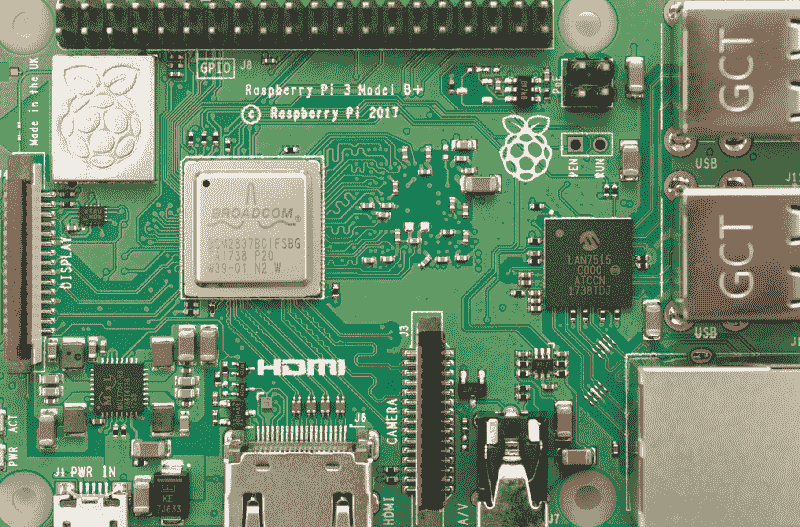
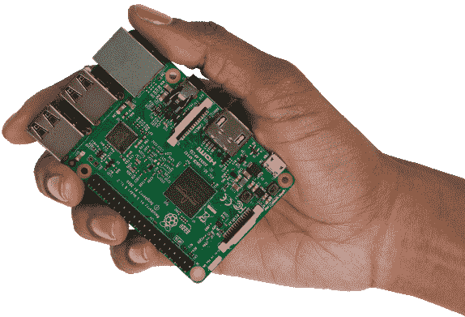
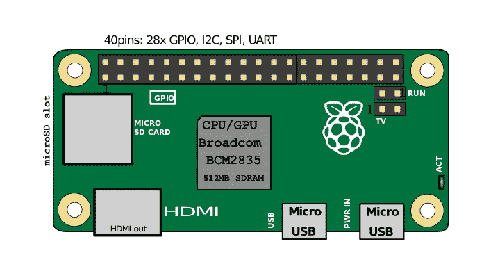
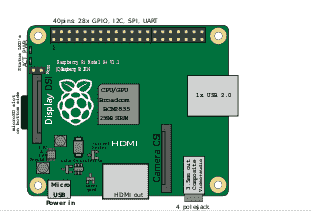
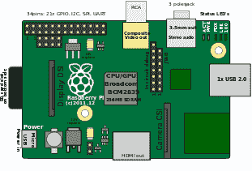
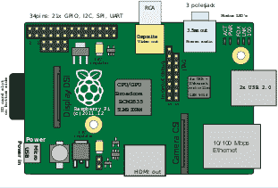
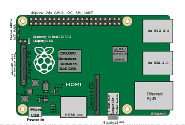
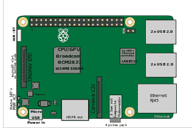
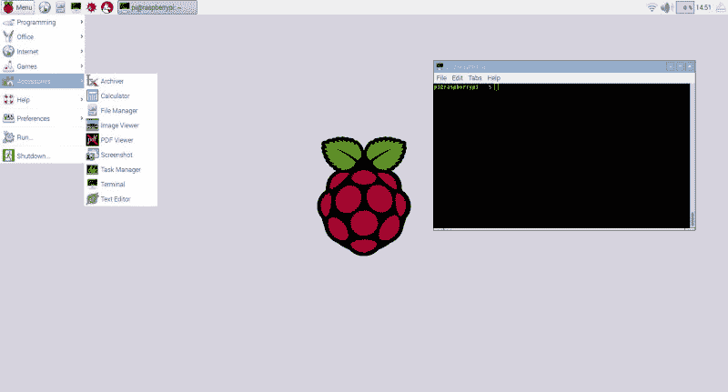
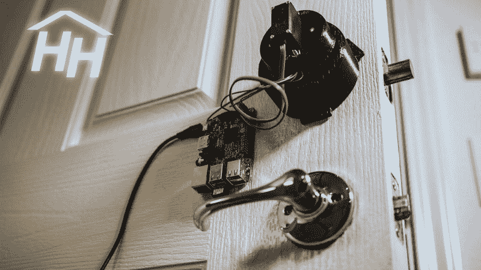

# 覆盆子酱初学者指南

> 原文：<https://www.freecodecamp.org/news/beginners-guide-to-raspberry-pi-6e55080fdaaf/>

肖恩·崔

# 树莓派初学者入门

#### 重要的是小事。

Raspberry Pi 3 Model B+

许多人质疑术语*物联网(IoT)* 是什么意思，或者它实际上代表了什么。简单来说，*物联网*是一个对任何可以连接到互联网的东西进行分类的术语。这包括你的 Alexa、HomePod、安卓手表、三星智能冰箱等等。即使你意识到物联网是一个术语，用来描述一组连接到互联网并相互对话的小设备，但仍然不清楚这些小设备实际上是如何做的。

相比之下，每个人都知道 Macbook 或电脑是做什么的，以及它们能够做什么。有趣的是，这些物联网设备的内部结构与我们日常使用的计算机非常相似，包括处理单元、内存、网络和/或蓝牙模块以及其他一些传感器。

许多人没有意识到的是，使用一台小型计算机制作自己的*物联网*设备是多么容易。事实上，你可能想知道是否存在现成的、廉价的、功能强大的小型计算机。好消息是它实际上**存在** 而且它的**真的** **强大。**

### 树莓派正是如此。

Raspberry Pi 3 (raspberrypi.org)

Raspberry Pi 是一款小巧的电脑，可以舒适地握在手中。不要被它的大小所迷惑，只要看看最新一代(3+)树莓 Pi 的硬件规格就知道了。

*   1.4 GHz 64 位四核 [ARM Cortex-A53](https://en.wikipedia.org/wiki/ARM_Cortex-A53) ，1GB RAM
*   2.4/5Ghz 双频 802.11ac 无线局域网，10/100/1000Mbps 以太网
*   蓝牙 4.2
*   4 个 USB 端口、全 HDMI 端口、组合式 3.5 毫米音频插孔和复合视频端口、40 个 GPIO 引脚
*   Micro SD 卡插槽，VideoCore IV 3D 图形核心，摄像头接口(CSI)，显示器接口(DSI)，

正如你所看到的，这个小家伙拥有一个四核 CPU，快速无线，蓝牙模块和足够的内存来做你在电脑上做的大多数事情。更好的是，[这只需要 35 美元](https://amzn.to/2PLBxk1)，或者一顿合理的晚餐(或者旧金山的 [3 片鳄梨面包)。](https://sf.eater.com/2017/5/23/15677684/avocado-toast-prices-menu-costs-san-francisco)

树莓派有一个有趣的命名惯例。它们按型号名称和代的组合进行分类。型号名称包括 A、A+、B、B+、Zero 和计算模块(计算模块主要用于工业应用，因此本文不涉及)。

每种型号都根据可用的连接器和主板的大小来区分。到目前为止，已经建立了各种代，这些代主要通过从 1 到 3 的数字来分类。每一代产品的主要区别在于芯片性能。最新最厉害的版本叫*树莓 Pi 3+ Model B+* 。

作为参考，这里有一些图片显示了每种型号都有哪些零件。

Raspberry Pi Model Zero

Raspberry Pi 1 Model A (left), Raspberry Pi 1 Model A+ revision 1.1 (right)

Raspberry Pi 1 Model B (left), Raspberry Pi 1,2 Model B+ (middle), Raspberry Pi 3Model B+ (right)

每种模式都有自己的权衡。例如，Raspberry Pi Model Zero 是其中最小的一款，平均功耗仅为 100 mA (0.5W)。(一个普通的台式机有一个 200 ~ 1400 瓦的电源)。但是，它只有一个单核 CPU，内存较低，并且没有完整的 HDMI 端口。

然而，它较小的尺寸允许它适应更多的空间，这使得它对于构建空间和功率受限的设备非常有用。因此，有多个模型可供选择增加了项目的选择。

### 它运行什么软件？

不幸的是，Raspberry Pi 不能运行 Mac OS X 或 Windows。相反，它运行一个名为 [Raspbian](https://www.raspberrypi.org/downloads/raspberry-pi-desktop/) 的 Linux 版本。你可以选择用 NOOBS 安装程序将 Raspbian 安装在一个微型 SD 卡上，或者购买一个预装的微型 SD 卡，就像这里看到的。一旦您插入安装了 Raspbian 的 micro SD 卡并打开 Raspberry Pi，您会看到以下加载屏幕:

Raspbian loading screen. Image from [https://alternativeto.net/software/raspbian/](https://alternativeto.net/software/raspbian/)

正如你所看到的，这个桌面看起来就像你的大型电脑上的普通桌面。默认情况下，你得到一个网络浏览器，终端，图像浏览器，计算器和许多其他功能。

Raspbian 还可以让你从它自己的开源软件库中免费安装大量软件。安装一个软件的过程也相当简单。您可以利用 *apt-get* 命令来安装任何可用的软件，这是一个流行的 Linux 命令，用于从各种存储库中安装软件。

比如`sudo apt-get install scratch2`会安装流行的 [scratch 编程语言](https://scratch.mit.edu/)。浏览各种存储库和 StackOverflow，您将很快意识到您可以使用这些设备做任何事情。

### 你能用这个做什么？

好了，现在你有了一台运行一堆自由软件的小电脑。你能用它做什么？这是一个简单有趣的 Python 项目，我在编程课上和一群中学生一起实现了这个项目。

使用一个 [Raspberry Pi 兼容的温度/湿度/压力传感器和 LED 屏幕](https://amzn.to/2NCMdwd)，我用 LED 屏幕上的随机颜色而不是数字来教授随机性的概念。我的学生很喜欢他们能够在视觉上和物理上与自己的代码进行交互的方式。你可以在这里看到这个项目的视频:

使用相同的设备，我们还建立了一个计算器，游戏设备，气象站等等。我发现它们是向年轻学生教授编程入门的一种非常有用且划算的方式。我计划改天在一篇文章中详细介绍我的课程。

我在斯坦福的一位同事制作了一台定制的树莓浓缩咖啡机来保护我们珍贵的咖啡。这个想法有点类似于树莓皮安全门锁，如图所示[这里](https://www.youtube.com/watch?v=bAcK80fm1_0)。

Raspberry Pi secured door lock by HackerHouse

有很多很多关于使用树莓 Pi 来构建有趣且有用的物联网设备的文章。下面是我找到的其中一些名单:[树莓派安全摄像头](https://pimylifeup.com/raspberry-pi-security-camera/)，[树莓派媒体中心](https://www.makeuseof.com/tag/kodi-raspberry-pi-media-center/)，[树莓派代码俱乐部](https://projects.raspberrypi.org/en/codeclub)。

### 包扎

我希望这篇文章能对什么是树莓 pi，它们是如何构建的，以及它们的用途给出一些基本的见解。此外，我希望这篇文章在某种程度上揭示了物联网的真正含义。

从本质上说，物联网是一场使用互联网连接数百万件小事的运动，树莓派是为这些小事提供动力的方式之一。我真的相信未来在于物联网，我希望每个人都努力参与进来，让它离我们更近一步。

> 重要的是小事，成百上千的小事。

> -克里夫·肖。

这是我第一篇关于媒体的文章！任何意见的纠正，改进和鼓掌是非常感谢！