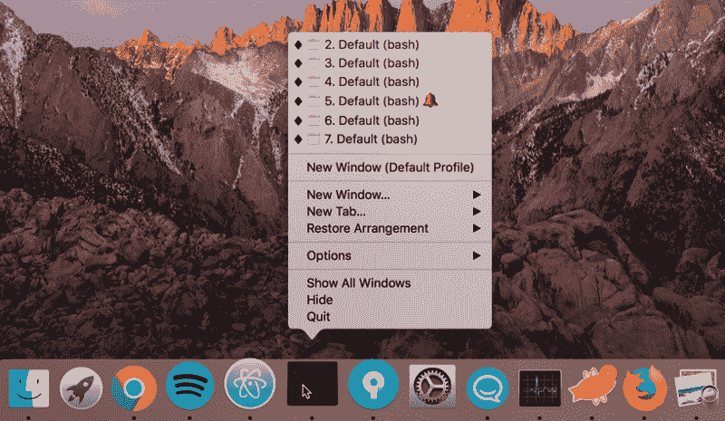
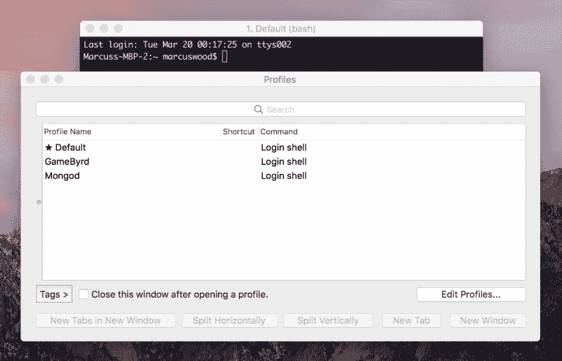
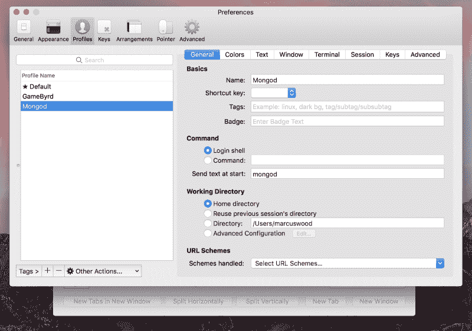
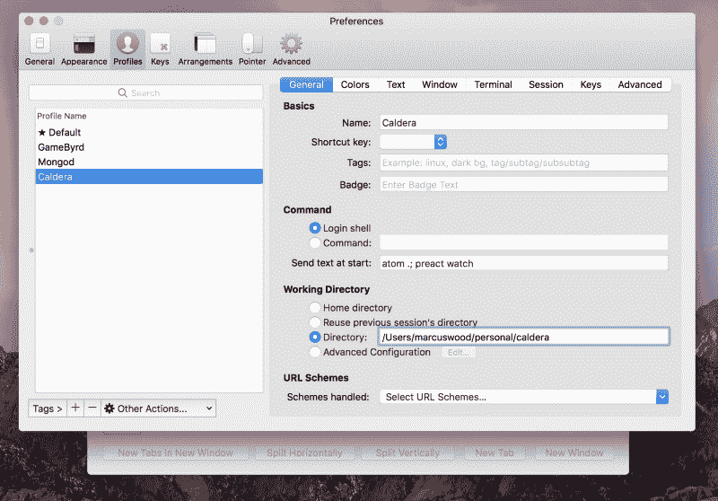
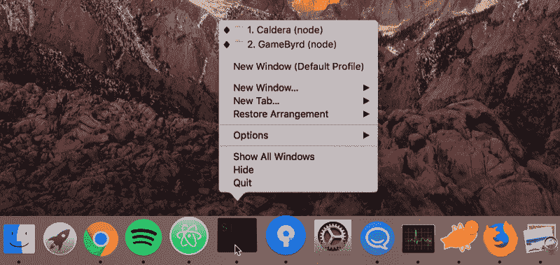

# 使用配置文件和安排来增强您的工作流程

> 原文：<https://www.freecodecamp.org/news/supercharge-your-workflow-with-profiles-and-arrangements-99099da313b5/>

马库斯·伍德

# 使用个人资料和安排增强您的工作流程


如果您曾经不得不管理多个项目，跟上命令行可能会很麻烦。这里有一些关于如何兼顾多个项目的热门建议，可以节省你大量的时间。

如果你使用的是普通的 Mac 终端，我强烈推荐切换到 [iTerm2](https://www.iterm2.com/) (这样更好)。稍后我会详细解释原因。

#### SSH 别名

有时，您需要 SSH 到某个地方的服务器。有时你有 20 个不同的服务器，你想用 SSH 连接。记住他们住在哪里，叫什么名字可能是一件痛苦的事。

为了节省时间，在不到一分钟的时间内为每台服务器创建别名。方法如下:

```
// Open a terminal windownano ~/.ssh/config
```

```
// Fill in the following to create an aliasHost <Name you want to assign>  Hostname <Where you want to ssh>  User <User you want to login as>  IdentityFile ~/.ssh/<pem file you want to use>
```

```
//Exit and save the filectrl + xyenter
```

```
// Now instead of doing this to connectssh -i "<pem file>" <user>@<hostname>
```

```
// You can do thisssh name-you-assigned
```

#### iTerm2 概况和布置

简介很棒，改变了我的日常工作流程。有时您的终端看起来像这样:



Which one did I want again? ?

问题是，你不知道你想点击哪个窗口。您也不希望关闭窗口，因为这样您将不得不打开一个新窗口，导航回正确的目录，并记住复制 pasta 来运行它。

有了配置文件和窗口排列，您就不必担心这些了。

如果你在这些步骤中迷路了，下面有一个快速的视频演示。

配置文件使您能够在某个目录中打开新的命令行窗口，并自动运行命令。我们做一个吧！

首先，关闭 iTerm 中所有打开的命令行窗口，并启动一个新的命令行窗口。接下来，您需要导航到菜单栏中的“配置文件”并单击“打开配置文件…”



You should see something like this

现在，单击“编辑个人资料…”将带您来到这里:



Gamebyrd and Mongod are some profiles I made so don’t worry if you don’t see them

单击左下角的+号创建一个新的配置文件。确保给它一个名称，并将目录更新为项目的根目录。

如果您想要在打开此描述文件时运行命令，请将它们添加到“开始时发送文本:”栏中。我最喜欢的方法之一是在我的代码编辑器中打开项目，并为开发构建它。

```
// Separate commands with a semi-colonatom .; preact watch
```



Make sure to click the Directory radio button

退出窗口将保存您的更改(没有按钮可以做到这一点)。

接下来，我们需要测试一下。点击菜单栏中的“配置文件”,选择您创建的配置文件以确保其有效。如果您遇到任何问题，请确保您的目录路径是正确的，并且您的命令是正确分隔的。

所有这些工作完成后，是时候创建一个窗口排列来轻松启动新创建的配置文件了。执行此步骤时，请确保没有打开任何延迟的终端窗口，否则它们会被存储为排列的一部分。

在新的终端窗口中，单击您刚刚创建的配置文件。如果它在新标签中打开，请确保关闭“默认”标签。导航到菜单栏中的“窗口”标签，选择“保存窗口排列”为其命名，然后单击确定。你可以走了！

现在你所有的终端窗口都将被命名。他们会自动记住您启动每个项目所需的命令。



??????

#### 包装东西

第一次这样做后，您将能够轻松地创建新的配置文件和安排。您也可以将多个描述文件组合成一种排列，使用标签式终端窗口来运行项目的多个部分，等等。

这有帮助吗？如果是这样，请鼓掌，让我知道你还想知道我的开发过程或掌握命令行的技巧。

我叫马库斯·伍德。我是 Caldera 的创始人，Caldera 是一家专注于网络应用的全方位服务数字机构。