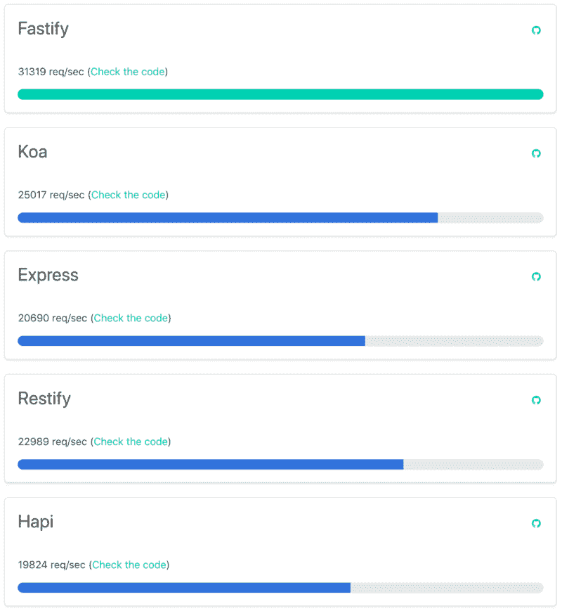

# 如何启动并运行 Fastify

> 原文：<https://www.freecodecamp.org/news/how-to-get-up-and-running-with-fastify-8b7e23781844/>

> Node.js 的快速低开销 web 框架

Fastify 版本 1 于 3 月 7 日发布[。这篇文章将向你展示如何设置它，我们将讨论 Fastify 提供的一些令人难以置信的功能。不需要任何配置——Fastify 的代码库将在 Node 版本 6.x、8.x 和 9.x 上运行。](https://medium.com/@fastifyjs/fastify-goes-lts-with-1-0-0-911112c64752)

#### 准备好了吗？

从`npm i fastify`开始，然后:

```
const fastify = require('fastify')()
```

```
fastify.get('/', (request, reply) => {  reply.send({ hello: 'world' })})
```

```
fastify.listen(3000, err => {  if (err) {    fastify.log.error(err)    process.exit(1)  }  fastify.log.info(    `server listening on ${fastify.server.address().port}`  )})
```

现在使用`node server`启动您的服务器

？就是这样！您已经安装并运行了第一台 Fastify 服务器。

### 这是怎么回事？

```
const fastify = require('fastify')()
```

第 1 行是将 Fastify 框架导入 JavaScript 项目并实例化它。您的服务器实例现在存储在`fastify`变量中。您可以向该行传递附加选项，如下所示:

```
const fastifyWithOptions = require('fastify')({  logger: {    prettyPrint: true   }})
```

由 [Pino 记录器](https://getpino.io/#/)供电，该选项使控制台输出易于阅读且丰富多彩。查看 Pino 文档以获得更多的记录器选项，查看 Fastify 文档以获得更多的 Fastify 实例选项。

#### 接下来:路由

```
fastify.get('/', (request, reply) => {  reply.send({ hello: 'world' })})
```

3 号线到 5 号线定义了一条非常基本的[路线](https://www.fastify.io/docs/latest/Routes/)。路由是任何 Node.js 后端服务器的核心。Fastify 支持两种定义路线的方法:上面使用的简写方法，或者如下所示的一般`.route`方法。

```
fastify.route({  method: 'GET',  url: '/',  handler: function (request, reply) {    reply.send({ hello: 'world' })  }})
```

这两种实现做完全相同的事情，并且具有相同的性能，所以只需使用对您来说最有意义的实现。

Route declaration 还有许多这里没有显示的选项。

*   为请求和响应对象提供一个 [JSON 模式](http://json-schema.org/)，这可以将吞吐量提高 10–20%
*   定义一个在`handler`函数之前调用的`beforeHandler`方法。这对于认证来说很棒，我在我的 [JWT 认证插件](https://github.com/Ethan-Arrowood/fastify-jwt-authz)中演示了如何使用它(稍后将详细介绍 Fastify 插件)。

#### 启动你的引擎！三…二…一…开始！

```
fastify.listen(3000, err => {  if (err) {    fastify.log.error(err)    process.exit(1)  }  fastify.log.info(    `server listening on ${fastify.server.address().port}`  )})
```

最后，在本地主机端口 3000 上启动 Fastify 实例。这是**创建自己的 Fastify 实例所需的最后一个**步骤。在内部，该方法将等待`.ready()`(在加载插件后调用)。调用`.listen()`方法后不能定义新的路由。

### 接下来是什么？插件！

Fastify 最好的特性之一是编写插件并将其合并到服务器实例中是多么容易。首先，定义一个函数:

```
function superPlugin (fastify, opts, next) {  fastify.decorate('superMethod', () => {    console.log(`Secret code: ${opts.secretCode}`)  })  next()}
```

现在使用`fastify-plugin`模块，导出你的新插件。

```
const fp = require('fastify-plugin')
```

```
module.exports = fp(superPlugin, {  fastify: '>=1.0.0',  name: 'super-plugin'})
```

最后，将插件注册到 Fastify 实例中:

```
/* Inside the main server.js file */const superPlugin = require('super-plugin')
```

```
fastify.register(superPlugin, {  secretCode: 'JavaScript is awesome!'})
```

现在，您可以在任何可以访问 Fastify 实例的地方调用`superMethod`。

```
/* server.js */
```

```
fastify.listen(3000, err => {  fastify.superMethod()})
```

注意:你可以在其他插件中注册插件，这将子插件的范围锁定在父插件上。对于本文来说，这个主题太高级了，所以我不会涉及更多的细节。你可以在这里阅读更多关于 [Fastify 插件的信息。点击](https://www.fastify.io/docs/latest/Plugins/)查看 [Github gist 中的完整示例文件。](https://gist.github.com/Ethan-Arrowood/35e54c688e290e8e6a996ccc5c711c2f)

### 勇往直前去征服

Fastify 很快。真的真的很快？？



[Fastify Benchmarks v1.1.x](https://www.fastify.io/benchmarks/)

在这个简短的介绍之后，我鼓励你去看看 [Fastify 所提供的](https://www.fastify.io/docs/latest/)。如果你喜欢开源编程，Fastify 也是[为](https://github.com/fastify/fastify/issues)做贡献的一个很好的项目。还有一个很棒的[插件生态系统](https://www.fastify.io/ecosystem/)可以查看并参与其中！

继续努力吧~伊森·阿罗伍德

[**伊森·阿罗伍德？？？(@ ArrowoodTech)| Twitter**](https://twitter.com/arrowoodtech)
[**Th**e*伊森·阿罗伍德最新推文？？？(@ArrowoodTech)。总是听音乐。大概有助于开放…twitte*r.com](https://twitter.com/arrowoodtech)[**伊森-阿罗伍德(Ethan Arrowood)**](https://github.com/Ethan-Arrowood)
[*伊森-阿罗伍德有 80 个可用的知识库。在 GitHub 上关注他们的代码。*github.com](https://github.com/Ethan-Arrowood)