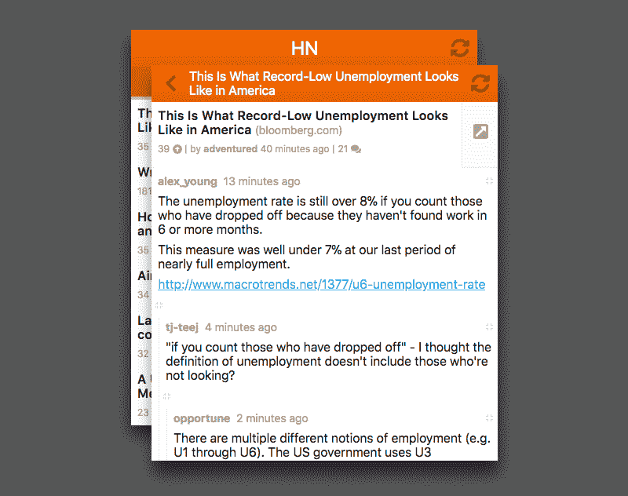

# 如何用 MobX 和 router5 像黑客一样路由

> 原文：<https://www.freecodecamp.org/news/how-to-route-like-a-hacker-with-mobx-and-router5-d79a5c7a56a/>

由欧根吻

# 如何用 MobX 和 router5 像黑客一样路由

#### **适合您应用的路由** —而不是相反

Photo by [Rob Bates](https://unsplash.com/photos/AyYW_bUWerc?utm_source=unsplash&utm_medium=referral&utm_content=creditCopyText) on [Unsplash](https://unsplash.com/search/photos/route?utm_source=unsplash&utm_medium=referral&utm_content=creditCopyText)

在客户端应用程序中有许多方法来处理路由。像 Android 这样的框架提供了强大但复杂且有时受限的路由机制。这同样适用于前端成熟的路由库，如 React 路由器。

好消息是，您可以编写自己的路由层，它更简单而无需放弃控制权:**适合您的应用程序**的路由，而不是相反！

为了说明这些概念，让我们编写一个 HackerNews 应用程序，**控制路由**。我们将使用 [React](https://reactjs.org/) 、 [MobX](https://mobx.js.org/) 和 [router5](http://router5.github.io/) 。

这是[直播](https://codesandbox.io/s/github/eugenkiss/hacker-routing-mobx-router5)结果:

该示例使用了 [HNPWA API](https://github.com/tastejs/hacker-news-pwas/blob/master/docs/api.md) 。[这里是 Github 项目](https://github.com/eugenkiss/hacker-routing-mobx-router5/)。

让我们从定义*进给*路线开始:

属性`name`、`path`、`comp`显而易见。有了`link`，你就有了**类型辅助的反向路由。在生命周期函数`activate`中，你更新全局状态并执行 API 请求。依赖关系`store`是你的中央状态管理和动作控制面板。在最后一行，您将`FeedRoute`添加到您的路由注册表`routes`中。**

关于`FeedRoute`很酷的一点是**所有与路由到 *Feed* 屏幕相关的东西都在一个地方**定义。另外，您不需要容器组件来执行 API 请求。

以下是渲染当前路线的方式:

可观察属性`store.route`包含当前路线。在您的路由注册表`store.routes`中，您可以找到相应的路由定义。所以，你知道要渲染哪个组件。如果你在`/`上，组件将会是`<FeedScree` n/ >。作为一个观察者`rve`，App 会在观察者`vable store`出现的任何时候重新呈现。路线变更。

**这就是要点！**

#### 正在设置

你如何用 [MobX](https://mobx.js.org/) 和 [router5](http://router5.github.io/) 来设置这一切？谁更新当前路线？`store`长什么样？要找到答案，请继续阅读！

*旁白*:虽然路由库不是必须的，但是我确实推荐 router5。它给你一个比浏览器自带的更方便的 API (+钩子和工具)。

router5 插件定义:

一个 [router5 插件](http://router5.github.io/docs/plugins.html)实现生命周期功能。成功过渡后，您可以取消激活之前的路线。然后你设置`store.route`到下一条路线，激活下一条路线。停用会执行清理。激活执行 API 请求和其他初始化逻辑。剩下的代码是 router5 API 特定的。

以下是`store`中的相关部分:

所选的提要是从 URL 派生的。**感谢 [MobX 的传播力](https://hackernoon.com/becoming-fully-reactive-an-in-depth-explanation-of-mobservable-55995262a254)** 没有重复状态！

旁白:我使用了一个特殊的抓取助手，这将是另一篇文章的主题。

在我自己的 [HackerNews 客户端](https://github.com/eugenkiss/hnclient/) ( [live](https://hn.eugenkiss.com/) )中，有一个历史堆栈记录了访问过的路线。它用于呈现上下重叠的屏幕。除了最上面的屏幕之外，所有的屏幕都将`display`设置为`none`。这使得在移动设备上返回上一个屏幕**要快得多**！

我的路由器还执行视图状态恢复。思考滚动位置。但是你也可以像这里显示的那样保持最小化。请记住，您控制着路由:以最适合您的应用程序的方式来做。另请参见 React 路由器的[滚动恢复](https://reacttraining.com/react-router/web/guides/scroll-restoration)讨论和 router5 的[加载异步数据](http://router5.github.io/docs/async-data.html)讨论。

本方法的灵感来自于:

*   [如何解耦状态和 UI(不需要 componentWillMount)](https://hackernoon.com/how-to-decouple-state-and-ui-a-k-a-you-dont-need-componentwillmount-cc90b787aa37)
*   [单页应用程序中不同的路由方法](https://vincent.is/testing-a-different-spa-routing/)

如果你喜欢这篇文章，请推荐和分享。 **快乐路由！**