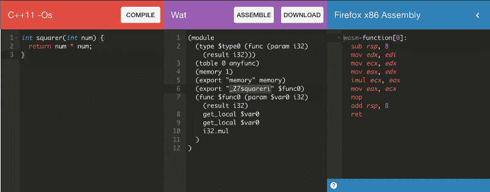
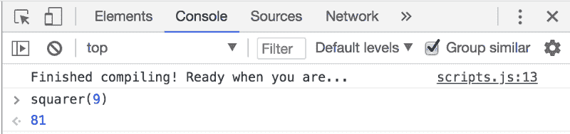

# 开始使用 WebAssembly —仅使用 14 行 JavaScript

> 原文：<https://www.freecodecamp.org/news/get-started-with-webassembly-using-only-14-lines-of-javascript-b37b6aaca1e4/>

丹尼尔·西蒙斯

# 开始使用 WebAssembly —仅使用 14 行 JavaScript


WebAssembly 是一种全新的 web 技术,具有巨大的潜力。它将对未来 web 应用程序的开发方式产生重大影响。

但是，有时候，我觉得它只是不想被理解…几乎是以一种奇怪的消极攻击的方式。

当我查看文档和已经发布的少数教程时，我不禁觉得自己就像一个祈求下雨的农民，结果却被洪水淹没了。从技术上来说，我得到了我想要的…只是不是以我希望的方式。“你想要下雨吗？！哦，我给你**雨**！”

这是因为 WebAssembly 使许多新事物成为可能，并且可以用许多不同的方式实现。但是，在二月份正式发布 MVP 的过程中，它发生了如此大的变化，以至于当你第一次开始了解它时，很容易淹没在细节的海洋中。

继续雨的比喻，这篇文章是我提供 WebAssembly 简介的尝试。不是概念或具体细节，而是实际的实现。

我将带您完成创建和实现一个极其简单的项目的步骤，尽可能消除复杂性。一旦你实现了它，不管多么简单，很多更高层次的想法都更容易理解。

#### 我们来分解一下

如果我们后退一步，看看在项目中实现 WebAssembly 所涉及的步骤列表，一切都会清楚得多。

当你第一次开始时，很容易看到 WebAssembly，只看到一大堆选项和流程。将它分解成离散的步骤将有助于我们清楚地了解正在发生的事情:

1.  **编写:**用 C、C++或 Rust 编写一些东西(或使用现有的项目)
2.  **编译:**编译成 WebAssembly(给你一个二进制。wasm 文件)
3.  **包含:**得到那个。wasm 文件到项目中
4.  **实例化:**编写一堆异步 JavaScript 代码来编译。wasm 二进制，并将其实例化成 JS 可以很好地处理的东西。

差不多就是这样。当然，这个过程有不同的排列，但这是它的要点。

概括地说，并不那么复杂。然而，it *可能*变得极其复杂，因为这些步骤中的大部分都考虑到了不同程度的复杂性。在每种情况下，我都倾向于简单明了。

对于我们的项目，我们将用 C++编写一个简单的函数(如果你不熟悉 C++，不用担心，它会非常简单*)。该函数将返回给定数字的平方。*

然后，我们将它编译成。wasm 使用在线工具(您不需要下载或使用任何命令行工具)。接下来，我们将用 14 行 JS 实例化它。

当我们完成后，你将能够调用一个用 C++编写的函数，就像它是一个 JS 函数一样，你将会大吃一惊！

这带来的大量可能性绝对令人震惊。

#### 写

让我们从我们的 C++代码开始。记住，我们不会使用本地开发环境来编写或编译这个。

相反，我们将使用名为 [WebAssembly Explorer](https://mbebenita.github.io/WasmExplorer/) 的在线工具。它有点像 WebAssembly 的 CodePen，它允许你在浏览器中编译 C 或 C++代码，并在一个地方下载一个. wasm 文件。

打开 WebAssembly Explorer 后，在最左边的窗口中键入以下 C++代码:

```
int squarer(int num) {  return num * num;}
```

就像我说的，我们用了一个非常简单的例子。即使你以前从未看过 C 或 C++，也不难看出这是怎么回事。

#### 编制

接下来，单击 C++代码上方红色栏中的“编译”按钮。以下是您将看到的内容:



中间一栏向您展示了人类可读版本的。你刚刚创建的 wasm 二进制文件。这被称为“WAT”或 [WebAssembly 文本格式](https://developer.mozilla.org/en-US/docs/WebAssembly/Understanding_the_text_format)。

右边是生成的汇编代码。相当酷。

我不会详细介绍这两个文件，但是您至少需要了解一点关于 w at 文件的知识，以便进行后续步骤。

水的存在是因为我们人类通常很难理解直接二进制。它本质上是一个抽象层，帮助您理解 WebAssembly 代码并与之交互。

在我们的例子中，我们想要理解的是我们的 WebAssembly 如何引用我们刚刚创建的函数。这是因为我们稍后需要在 JS 文件中使用完全相同的名称来引用它。

您在 C++代码中编写的任何函数都可以在 WebAssembly 中作为“导出”使用。我们稍后会对此进行更多的讨论，但是现在，您需要知道的是，导出是您能够与之交互和使用的东西。

查看一下 WAT 文件，查找单词“export”你会看到两次:一次在单词`memory`旁边，另一次在单词`_Z7squareri`旁边。我们现在不需要了解`memory`，但我们肯定对`_Z7squareri`感兴趣。

我们在 C++中使用了函数名`squarer`，但现在不知何故变成了`_z7squareri`。第一次看到它时，你肯定会感到困惑。

据我所知，“_Z7”前缀和“I”后缀是 C++编译器引入的[调试标记](https://docs.microsoft.com/en-us/cpp/build/reference/z7-zi-zi-debug-information-format)。不过，深入理解这一点并不重要。您只需要意识到这将会发生，因为您需要在 JS 文件中使用这个确切的名称来调用您的 C++函数。

#### 包括

现在只需点击紫窟部分顶部的“下载”按钮。你会得到。wasm 二进制文件。重命名为`squarer.wasm`。然后创建一个新目录，将您的`squarer.wasm`文件和另外两个文件放在那里:

*   `index.html`(样板文件)
*   `scripts.js`(暂时为空)

#### 例示

现在是棘手的部分。或者，至少是当我第一次开始筛选文档时给我带来很多困惑的部分。

尽管你最终会包括。wasm 模块就像一个普通的旧 ES6 模块(使用`<script type='modul`e’>)，暂时你需要“手动”设置它。这是通过对 WebAssembly API 进行一系列异步调用来实现的。有三个步骤:

*   去拿你的。wasm 二进制文件放入**数组缓冲区***
*   将字节编译成一个 **WebAssembly** **模块***
*   **实例化***web assembly 模块

如果所有这些对你都有意义，那么你可以跳到下一部分。但是如果你发现自己有点抓耳挠腮，想要一个更详细的解释，那么继续读下去。

#### *数组缓冲区

缓冲区是数据移动时的临时存储位置。通常，当数据以不同的速率被接收和处理时，这是有用的。

例如，当视频正在缓冲时，接收数据的速度比视频播放器播放数据的速度慢。我们的数组缓冲区正在做的事情之一是将我们的二进制数据排队，以便它可以更容易地被编译。

但是这里还有其他非常重要的事情。在 JavaScript 中，数组缓冲区是一个[类型的数组](https://developer.mozilla.org/en-US/docs/Web/JavaScript/Typed_arrays)，它专门用于存储二进制数据。

显式类型化的事实意味着 JS 引擎解释数组缓冲区的速度要比解释常规数组快得多，因为它已经知道了数据类型，并且不需要经历计算数据类型的过程。

#### *WebAssembly 模块

一旦你把所有的二进制数据放入一个数组缓冲区，你就可以把它编译成一个模块。WebAssembly 模块本身是惰性的。它只是编译好的二进制文件，等待对它做些什么。

你几乎可以把这个模块想象成一个蛋糕食谱。食谱只是存储如何做蛋糕的信息的一种格式。如果您真的想要一个蛋糕，您需要创建食谱中描述的蛋糕的一个实例(实例化蛋糕)。

你可以按照食谱上的说明来做。或者，你可以把食谱发送给其他人(“服务人员”)，或者你可以保存它，以后再用(“缓存”)。这两者用菜谱做比用实际的蛋糕做要方便得多。

#### *实例化

您需要做的最后一件事是创建 WebAssembly 模块的实例，这“赋予它生命”并使它实际可用。

该实例使您可以访问模块的导出(还记得我们的 WAT 文件中的内容吗？).这是包含以下内容的对象:

*   内存(与我们无关，但您可以在这里阅读更多相关信息
*   C++代码中的任何函数。这就是你如何使用你写的 C++函数。

#### 完成并运行它！

下面是完成我们刚刚检查的所有步骤的代码(这将放入您的`scripts.js`文件中):

函数获取你的。wasm 文件，然后执行上述操作。然后，它返回 WebAssembly 模块的新实例。

我们的 C++函数(还记得我们之前提到的时髦名字:`_z7squareri`)位于我们实例的 exports 属性中。您可以在第 12 行看到它被赋给了全局变量`squarer`。现在我们可以将`squarer()`作为一个普通的 JavaScript 函数使用了！

一旦您将它放入您的`scripts.js`文件并点击 save，您就可以在 localhost 上调出它，并且您应该在控制台中看到“完成编译…”消息。

现在，只需调用您的函数并从控制台传入一个参数。试试类似`squarer(9)`的东西。点击回车键，你会看到`81`。有用！你在调用一个用 C++写的函数！



### 这太棒了

你可以想象这一切都有可能。

首先，JavaScript 不再是你在浏览器中“做事”的唯一选择。这绝对是巨大的。

接下来是性能的提升，因为 WebAssembly 与 JS 不同，它以接近本机的速度运行。

然后是所有的遗留代码，现在由您处理。C 和 C++已经存在很长时间了，在那段时间里，许多优秀的人用它创建了一些令人惊叹的开源项目。现在可以集成到网站或应用程序中的项目。

从这里，您可以编写更复杂的 C、C++或 Rust 代码，甚至可以改编现有项目，并将其“wasm-it”到 web 项目中。

但是，有一点需要注意的是，如果您想要创建接受参数或返回值不是数字的函数，那么事情就会变得有点复杂。这时，您需要学习更多关于。wasm 实例的导出。

如果你除了跟随文章之外还想克隆一个工作副本，那么这个项目可以在 GitHub 上找到。