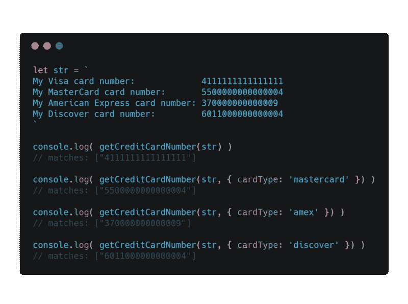
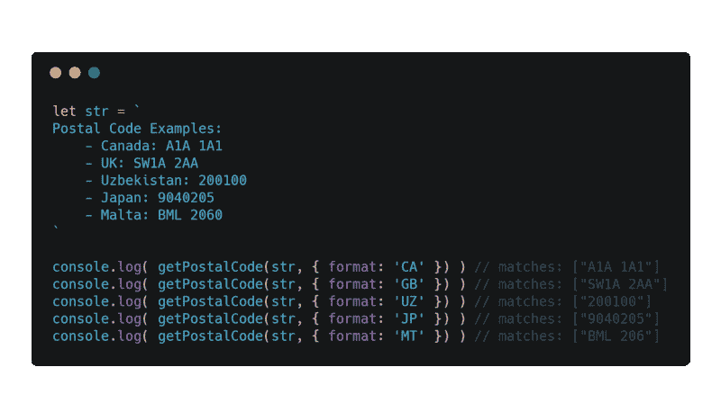
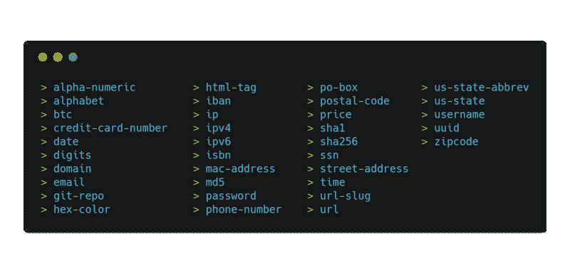

# 你讨厌 regex 吗？那么，我有一个解决方案给你…

> 原文：<https://www.freecodecamp.org/news/pregx-for-those-who-wish-to-dodge-regex-250e4a484ee0/>

作者布哈里·穆罕默德

# 你讨厌 regex 吗？那么，我有一个解决方案给你…


The complication in the readability of yesterday’s Regex

下面这篇文章展示了我在 NPM 上的最新[包](http://npmjs.com/package/pregx)，它也可以在 GitHub 上作为[库](https://github.com/bukharim96/pregx)获得。我写它是希望它能对所有需要它的人有益。

### 那么 PregX 是什么？


PregX — Largest library of popular & commonly used Regex patterns for JavaScript

**PregX** ，与普遍的看法相反，指的是:**【模式】*，而不是 Perl 正则表达式。说到“common ”,它是一个用 JavaScript 编写的库，旨在成为最大的流行和常见的正则表达式集合。*

*不习惯正则表达式的开发人员在尝试使用复杂的**正则表达式**符号和语法时可能会面临困难。这个库应该帮助这些开发人员完成需要正则表达式的常见任务。它利用了我们在项目中最常用的预先编写的模式。*

### *为什么不自己写正则表达式呢？*

*

[Image source.](https://www.flickr.com/photos/sirexkat/1128067974/in/album-72157601455231098/)* 

*[不要重复(DRY)](https://en.wikipedia.org/wiki/Don%27t_repeat_yourself) 方法是通过自动化或抽象来减少代码中的重复。这是编程的一个基本原则，应该尽可能遵守。因为重复既浪费时间又浪费空间，所以我花了很长时间去寻找一个解决方案，不仅仅是为了我自己，也是为了其他人。*

*如果每当汤姆、迪克或哈利发现小麦时，我们就不断地重新发明面包，那么 *DRY* 原理背后的意义是什么？*

*我发现了常见的**正则表达式**模式。我的想法是将这些流行的模式抽象成一个有用的纯函数。这种抽象不会改变给定字符串的状态来匹配。然后，每个函数将返回给定字符串中匹配项的数组。*

*PregX 不是为了反对原创而设计的。它有两个同步的目标。一个目标是减少开发人员尝试使用 **regex** 的时间。另一个目的是避免不属于它的复杂性。*

*尽管被指控有罪，但这个包也(间接地)是为那些总是逃避编写正则表达式的懒汉准备的。*

*然后，你可能需要写你自己的**正则表达式**。你的方法完全取决于手头任务的需要。*

### *我应该什么时候使用 PregX？*

*好问题，你应该什么时候？*

***PregX** 可用于内置功能无法实现或不足以实现您的复杂预期结果的情况。有些人可能会认为 **regex** 可以完成这项任务。*

*Regex 可能会有效地缩短代码。然而，这也会降低代码的可读性，这取决于手头任务的复杂程度。*

*为什么不选择抽象成有用功能的现成解决方案呢？*

*这就是 **PregX** 发挥作用的地方。模式按照 [*函数式编程范式*](https://en.wikipedia.org/wiki/Functional_programming) *抽象成函数。*这使得它成为常见正则表达式任务的首选解决方案。使用 **PregX** 可以获得相同的结果，而不会满足于可读性较差的代码或重新发明面包。*

*一个大致准确的原则是:无论你在构思什么模式，都可能有人已经写好了。PregX 采用了这个经验法则，为更多的**非面向 regex** 的开发人员积累这样的模式。*

*话说回来，这完全取决于你对什么感到舒服。如果你不热衷于编写自己的模式，那么这是一个简单的方法。*

### *何时不使用 PregX*

*如果你寻求一种与众不同的、特别符合你需求的模式，那么 **PregX** 根本不是答案。 **PregX** 不是为了取代 **regex** ，那就超级傻了。当涉及到这种性质的精确或明确的任务时，Regex 将永远是最佳解决方案。底线是，一个好的开发者将知道什么时候使用面包罐，什么时候使用面包房。*

### *PregX 的简单性和实用性*

*我想我应该展示一些实用的代码样本来展示这个库的神奇之处。也就是说，如果你还没有被我到目前为止写的所有无聊的谈话说服的话。？*

#### *信用卡示例*

*下面的例子展示了如何使用字符串和`getCreditCardNumber()`匹配信用卡号。甚至可以通过函数的`config`对象的`cardType`属性来指定要匹配的信用卡类型。默认情况下，该函数匹配 Visa 卡号。检查此样本:*

*

`getCreditCardNumber()`* 

*没印象？我的锦囊妙计已经足够诱惑你了。*

#### *邮政编码示例*

*如果上面的代码示例没有做到这一点，那么这一个会。*

*`getPostalCode()`函数的模式是我自己编写的许多模式之一。有很多解决方案试图做到这一点。无一符合 **PregX** 的标准。*

*我使用了[维基百科的邮政编码列表](https://en.wikipedia.org/wiki/List_of_postal_codes)作为参考，并编造了 **PregX** 的单一最大功能。由于**支持匹配 150 多个国家的邮政地址**，这个功能——至少对我来说——仍然是实现这个共同任务的最佳解决方案。看一看:*

*

`getPostalCode()`* 

### *当前支持的模式*

***PregX** 支持 35 种(还在增加)不同模式的精选列表，所有模式都经过良好测试以匹配其相应的文本。以下是支持的模式列表:*

*

Supported Patterns* 

### *深信不疑？*

*这只是这个库包含的许多模式中的两个例子。有关文档、用法示例以及关于 **PregX** 的更多信息，请查看 GitHub 上的[库](http://github.com/bukharim96/pregx)。更好的是，克隆它或通过 NPM 简单地安装它来测试它:*

```
*`npm install pregx --save`*
```

*我很想听听你对这个包的反馈。 **PregX** 目前由 35 个图案组成，希望达到~100 个。所以，请随意贡献任何有用的模式。[在 git](https://github.com/bukharim96/pregx/) 上启动它。*

*这是我在 NPM 的第一个开源项目，但不是我在 GitHub 的第一个项目。爱它，[叉它](https://github.com/bukharim96/pregx/)。讨厌它，批评它。要获得关于这个库的进展以及一些很酷的 JavaScript / React 相关技巧的更新，请在 twitter 上关注我: [@bukharim96](https://twitter.com/bukharim96)*

*感谢你阅读这篇文章。*

*和平。*