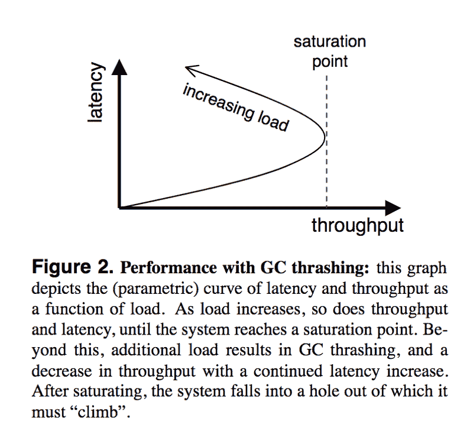
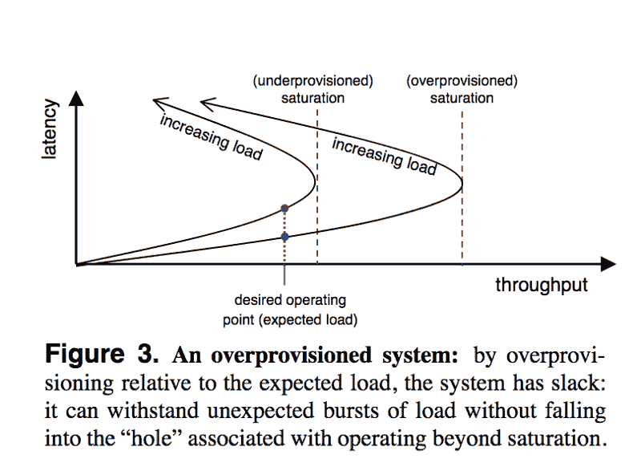

# 复杂系统中的鲁棒性:学术文章摘要

> 原文：<https://www.freecodecamp.org/news/robustness-in-complex-systems-a-summary-95d6f4067116/>

今天，我们来看看史蒂文·d·格里布在 2001 年发表的题为“复杂系统中的鲁棒性”的论文。所有引用和数字都来自报纸。

> 本文认为，系统的通用设计范例从根本上来说是有缺陷的，随着系统复杂性的增加，会导致不稳定的、不可预测的行为。

“通用设计范例”是指预测系统运行环境及其故障模式的实践。该论文指出，随着系统变得越来越复杂，它将处理无法预测的情况，因此它应该被设计成优雅地应对失败。本文借助“分布式数据结构(DDD)，一种可扩展的、基于集群的存储服务器”来探讨这些想法

> 就其本质而言，大型系统通过许多组件的复杂交互来运行。这种相互作用导致系统元素的普遍耦合；这种耦合可以是强耦合(例如，在网络中的相邻路由器之间发送的分组)，也可以是弱耦合(例如，广域网上路由广告的同步)。

这种大型系统的一个共同特征就是所谓的蝴蝶效应。这是指系统中由各种组件的复杂相互作用引起的小的意外扰动，它会引起大范围的变化。

系统设计的一个共同目标是健壮性:系统在各种条件下正确运行并在意外情况下正常失败的能力。这篇论文反对试图为系统预测一组特定的操作条件，并将其设计为仅在那些条件下工作良好的常见模式。

> 实际上也不可能预测系统由于环境条件的变化而经历的所有扰动，例如硬件故障、负载突发或引入行为不当的软件。有鉴于此，我们认为任何试图仅仅通过预知来获得鲁棒性的系统都容易变得脆弱。

### DDS:案例研究

上面陈述的假设是使用可扩展的、基于集群的存储系统分布式数据结构(DDD)来探索的——“一种高容量、高吞吐量的虚拟哈希表，它在许多称为砖块的单个存储节点上进行分区和复制。”

该系统是使用如上所述的预测设计理念构建的。

> 基于对这种系统的丰富经验，我们试图推断系统的软件组件、算法、协议和硬件元素的行为，以及它将接收的工作负载。

当系统在设计者的假设范围内运行时，它工作得很好。他们能够扩展它并提高性能。然而，在违反一个或多个关于操作条件的假设的情况下，系统以意想不到的方式运行，导致数据丢失或不一致。

接下来，我们谈几个这样的异常。

#### **垃圾收集颠簸和有界同步**

系统设计人员使用超时来检测系统中组件的故障。如果一个特定的组件没有在指定的时间内响应，它被认为是死的。他们假设系统是有限同步的。

> DDS 是用 Java 实现的，因此利用了垃圾收集。我们的 JVM 中的垃圾收集器是一个标记-清除收集器；因此，随着更多的活动对象驻留在 JVM 堆中，垃圾收集器为了回收固定数量的内存而运行的时间将会增加。

当系统处于饱和状态时，即使砖块上负载的微小变化也会增加垃圾收集器所用的时间，从而降低砖块的吞吐量。这叫做 **GC 颠簸**。受影响的砖块将落后于它们的对应砖块，导致系统性能的进一步下降。

因此，当垃圾收集接近或超过饱和点时，它违反了有界同步的假设。

#### **缓慢泄漏和一氧化碳相关故障**

设计系统时的另一个假设是故障是独立的。DDS 使用复制使系统具有容错能力。多个副本同时失败的概率非常小。

然而，当他们在代码中遇到导致内存泄漏但不影响正确性的竞争条件时，这种假设就被违背了。

> 每当我们启动我们的系统时，我们倾向于同时启动所有的砖块。假设整个系统的负载大致平衡，那么所有的砖块将会在几乎相同的时间用完堆空间，也就是在它们启动几天之后。我们还推测，我们的自动故障转移机制加剧了这种情况，因为它在一个对等体发生故障后增加了副本的负载，增加了副本泄漏内存的速率。

由于所有副本都承受统一的负载，而没有考虑性能下降和其他问题，这就在副本和…之间产生了耦合

> …当与缓慢的内存泄漏相结合时，会导致违反我们的独立故障假设，进而导致我们的系统不可用和部分数据丢失

#### **未检查的依赖性和故障停止**

基于这样的假设，即如果一个组件超时，则它已经失效，设计者还假设了“故障停止”故障，即已经失效的组件在一段时间后将不会恢复运行。系统中的砖块以异步方式执行所有长延迟工作(磁盘 I/O)。

然而，他们没有注意到他们代码的某些部分使用了阻塞函数调用。这导致主事件处理线程被随机借用，导致砖块莫名其妙地卡住几分钟并恢复 post。

> 虽然这个错误是由于我们自己未能验证我们使用的代码的行为，但它证明了独立构建的组件之间的低级交互会对系统的整体行为产生深远的影响。一个非常细微的行为变化导致整个集群违反了我们的故障停止假设，最终导致系统中的数据损坏。

### 走向健壮的系统

> ..对一个复杂的耦合系统的微小改变会导致巨大的、意想不到的行为变化，可能会使系统超出设计者的预期操作范围。

有几个解决方案可以帮助我们制造更强大的系统:

#### 系统性过度供应

当接近饱和点时，当试图适应意想不到的行为时，系统往往变得脆弱。解决这个问题的一个方法是故意过度配置系统。

然而，这有它自己的一套问题:它导致资源的利用不足。它还需要预测预期的操作环境，从而预测系统的饱和点。在大多数情况下，这是无法准确完成的。

#### 使用准入控制

另一种技术是，一旦系统开始接近饱和点，就开始拒绝负载。然而，这需要预测饱和点——这并不总是可能的，尤其是对于有许多起作用的变量的大型系统。

拒绝请求还会消耗一些系统资源。考虑到准入控制而设计的服务通常有两种操作模式:处理请求的正常模式和拒绝请求的极轻量级模式。

#### 在系统中建立内省

> 内省系统是一种从一开始就设计好监控系统的能力的系统。

当一个系统可以被监控，并且设计者和操作者可以得到关于它的操作的有意义的测量时，它比一个黑盒系统更健壮。这样的系统更容易适应环境的变化，也更容易管理和维护。

#### 通过闭合控制回路引入适应性

控制回路的一个例子是人类设计者和操作者响应于通过各种测量指示的其操作环境的变化来调整设计。然而，这样一个控制循环的时间线是不可预测的。作者认为系统应该建立内部控制循环。

> 这些系统结合了内省的结果，并试图动态地调整控制变量，以保持系统在稳定或良好运行的状态下运行。

> 所有这样的系统都具有这样的特性，即执行适配的组件能够稍微精确地假设适配的效果；如果没有这种能力，系统将“在黑暗中运行”，并可能变得不可预测。一种新的、有趣的假设适应效果的方法是使用统计机器学习；考虑到这一点，一个系统可以对变化进行实验，以建立一个关于变化效果的模型。

#### 为失败做准备

> 复杂系统必须预料到失败，并相应地做好计划。

有几个技巧可以做到这一点:

1.  分离组件以局部控制故障
2.  通过使用健壮的抽象(如事务)来最小化损害
3.  最大限度地减少故障状态时间(使用检查点快速恢复)

在本文中，作者认为，通过假设系统的操作、故障和行为的约束和性质来设计系统通常会导致脆弱和不可预测的系统。我们需要一种完全不同的方法来建立面对失败时更加稳健的系统。

> 在这种不同的设计范式中，系统获得了稳定行为的最佳可能机会(通过过度供应、准入控制和自省等技术)，以及适应意外情况的能力(通过将自省视为对闭环控制的反馈)。最终，系统必须设计成优雅地处理故障，因为复杂性似乎会导致不可避免的不可预测性。