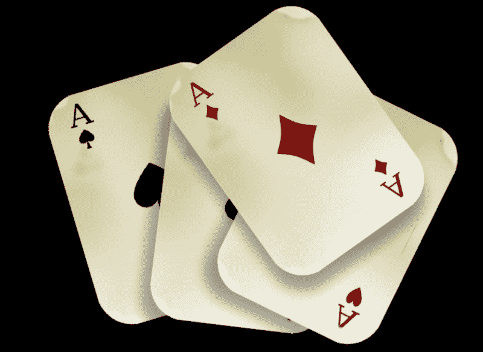
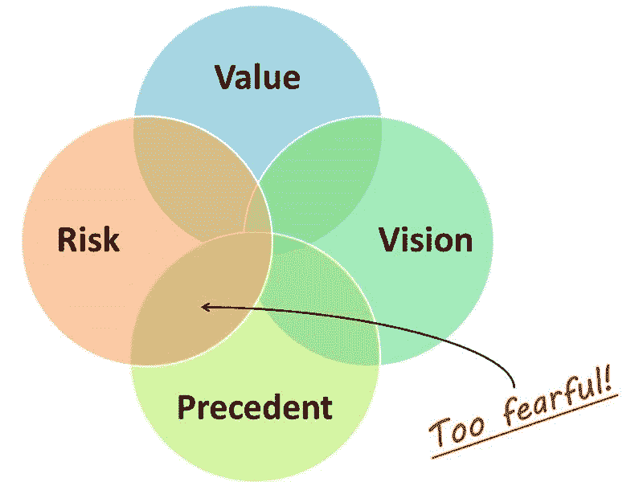
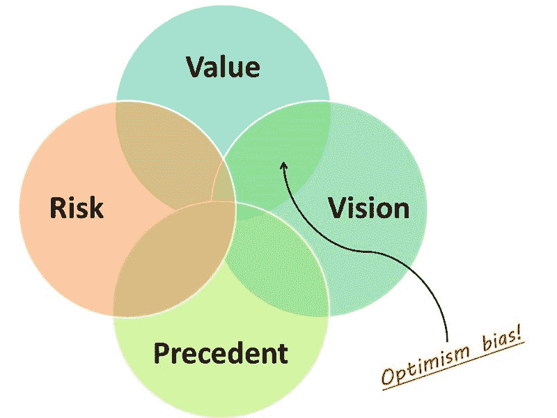
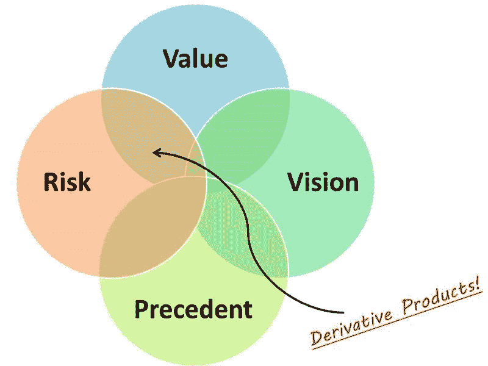

# 为什么在制造产品时应该关注愿景、价值、风险和先例

> 原文：<https://www.freecodecamp.org/news/new-product-owner-use-john-cutlers-40-questions-to-steer-your-product-ship-9b8a81caa7f4/>

作者史蒂夫

# 为什么在制造产品时应该关注愿景、价值、风险和先例

### 几周前，产品开发人员 John Cutler 发表了一篇名为[要问的 40 个产品路线图问题](https://medium.com/@johnpcutler/40-roadmap-item-questions-1a6895bf2e5a)的精彩文章。

你应该去看看。继续读下去。

作为一名敏捷蔻驰，我经常训练产品负责人远离他们的传统行为，我对问题列表非常感兴趣，因为它不是理论性的。

这是推动艰难但有价值的产品对话的合法工具。我研究得越多，就越能看到一些模式的形成；每个问题都可以归结为四类中的一类。

*   视觉:能够看见的能力；用想象力思考或计划未来
*   **风险**:面临伤害或损失
*   先例:在后来的类似情况下被视为范例或指南的早期事件。
*   **价值**:估计…的价值

通过对你的问题进行分类，我们可以推断出很多关于你的产品的信息。

### 你关于先例和远景的大部分问题已经得到了回答

当企业家或产品所有者拥有成功的记录，并且刚刚被灵感的闪电击中，或者更危险的是，对市场事件做出情绪反应时，这种情况最常见。

该产品通常将[希望作为一种策略](https://www.youtube.com/watch?v=1Ko0ZwKmhyw)，并且没有强大的风险管理档案或价值主张的支持。该产品或服务将投入大量的营销投资，以尝试和证明独特的愿景。

任何挑战都将被视为不理解创始人的梦想或考虑得不够长远。福利案例往往雄心勃勃，涉及大量目前服务不足的市场。很有可能，该产品将涉及一个目前甚至不存在的市场。通过尽职调查的可能性极小，但这将取决于产品所有者的魅力。

### 例子

*   当然，音乐流媒体服务 Tidal 会取得成功，Spotify 做得很好，Jay Z 接触的一切都是黄金！
*   Theranos 最为人所知的是其虚假的声明，声称已经设计出了革命性的血液检测方法，使用了非常少量的血液。

### 你关于风险和先例的大部分问题已经得到了回答

这种类型的产品展示了产品所有者的尝试性方法。可能是在一家初创公司内部，公司正在发展壮大，或者一家咨询公司正在寻求与客户建立关系。最恰当的描述是 [*软软的猴子*](https://en.wiktionary.org/wiki/softly,_softly,_catchee_monkey) 团队沿着既定路线朝着目标前进。这在过去行得通，我们完全理解风险，让我们不要太偏离常规。

风险先例模式的危险在于，你先生产 Microsoft Word 2010，然后生产 Microsoft Word 2010。如果你不是市场的现任者，那么用一种基于风险管理和先例的策略来取代当前的冠军将会非常困难。用沃尔特·格雷茨基对他儿子的话说:不要滑向冰球所在的地方，滑向冰球将要去的地方。

在欧洲足球中，我们奖励那些能够预测比赛进程并为自己创造机会的前锋。我们希望玩家有一定程度的自信和先见来预测未来，并采取行动迎接未来。

Ia Writer 的团队必须相信他们的愿景，打字机程序的额外切换和功能不会提供额外的价值。他们打破先例，利用一个新的市场领域；极简写作应用和不受干扰的生产力。

### 例子

*   你知道什么比 CCleaner 2.31 更好吗？CCleaner 2.32！

### 你的大部分问题价值和愿景都得到了回答

这种类型的产品有很强的愿景和价值，能让人产生信心。老生常谈的标志是一个年轻的青少年/黑客，他们可以看到未来，并疯狂地朝着那个目标编码。

扎克伯格效应。或者，对于那些年纪较大的人来说，是来自 Myspace 的汤姆效应。或者对那些年纪更大的人来说，比尔·盖茨效应。或者，亚历山大·汉密尔顿效应，因为他签署独立宣言时才 21 岁。真实的故事。

这听起来太棒了！我听到你说的缺点是什么？

最终，我们无法回避良好的风险管理和尽职调查这些成熟的活动。每个项目管理框架都鼓励团队回顾过去的项目，以给团队最大的成功机会。

对于一个被愿景所激励、被价值陈述所支持的产品团队来说，降低风险的尝试似乎令人窒息，但自大可能会产生可怕的副作用。在军事情报中，我们通过使用 [7 个问题的战斗估计](http://www.mod.gov.sl/docs/Doctrine%20-%207%20Questions%20Handbook.pdf)来对抗这种消极的方法。第一个问题总是

> 敌人在做什么，为什么？

我们优先考虑这个问题的原因是因为其他 6 个问题是关于我们的愿景和运营的价值，它们是计划；但如果敌人完全反击我们的行动或出其不意地袭击我们，这些都不重要。我们在执行前会进行风险管理。

风险管理是成熟产品团队的标志，他们已经超越了盲目乐观。

### 你关于风险和价值的大部分问题已经得到了回答

这种情况出现在公司生产衍生产品的时候；他们使用来自市场的滞后指标和定量数据来推动产品决策。百事可乐最大值是成功的，所以我们将开发可口可乐零。该产品的特点是缺乏远见或强烈的原创概念。

没有能够权威地谈论价值并拥有优秀风险管理策略的愿景的团队正在生产一种衍生产品。

这没什么丢人的。也许他们会把产品带到一个新的地理市场。或者他们克隆了竞争对手的产品。

在我的第一家创业公司 Wallept，我们在欧洲加速器创业训练营成功运营后向投资者推销产品。创始人和首席开发人员自豪地站在舞台上，展示了一个华丽的电子忠诚度应用程序。它可以让你放弃钱包里的积分卡，只使用一次。

风险投资公司眨眼了。然后一个人举起了手。

> 全世界有 500 家创业公司在做完全相同的事情…

> 仅在伦敦就有 30 个。

> 我该怎么投资你们？

我们没有答案。根本没有。我们是一个衍生产品，没有独特的知识产权，没有摇滚明星的编码团队，没有成功的记录，也没有蒸蒸日上的客户名单。我们的产品基于市场价值，甚至我们的风险管理也很薄弱。

我们知道，实际上，沃莱普在欧洲和美国市场已经完蛋了。

衍生产品的风险在于，有时船已经出航了。不是每个市场都有后动优势。天定命运只对 1850 年前出发的人有效。1900 年后，获胜者已经确定，之后的一切都是继承游戏。

### 这些都很棒，史蒂夫，但是我在现实生活中做什么呢？

如果你能仔细阅读上面提供的 40 个问题，并诚实地评估你的产品的价值、风险、先例和愿景，那么无论你是从一家初创公司还是从一家价值 10 亿美元的企业发起，你都将有更大的成功机会。

#### [Steven Feeney](http://www.stevenfeeney.com) 是敏捷蔻驰在 [Sure Summit 的独立顾问](http://www.suresummit.com/)和伦敦大学的客座讲师；他也是@FreeCodeCamp 的骄傲赞助商。

### 喜欢这篇文章吗？点赞分享！