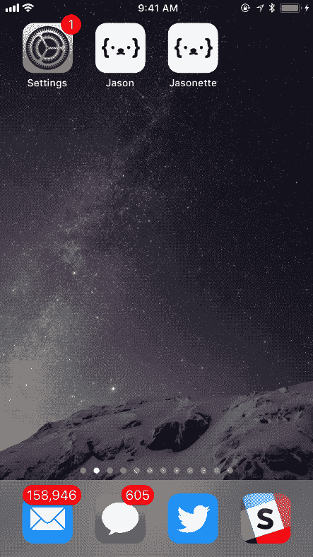
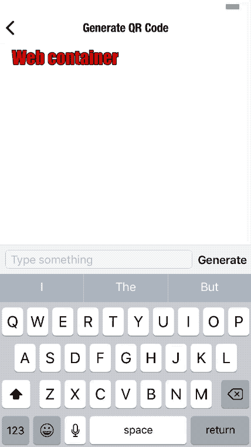
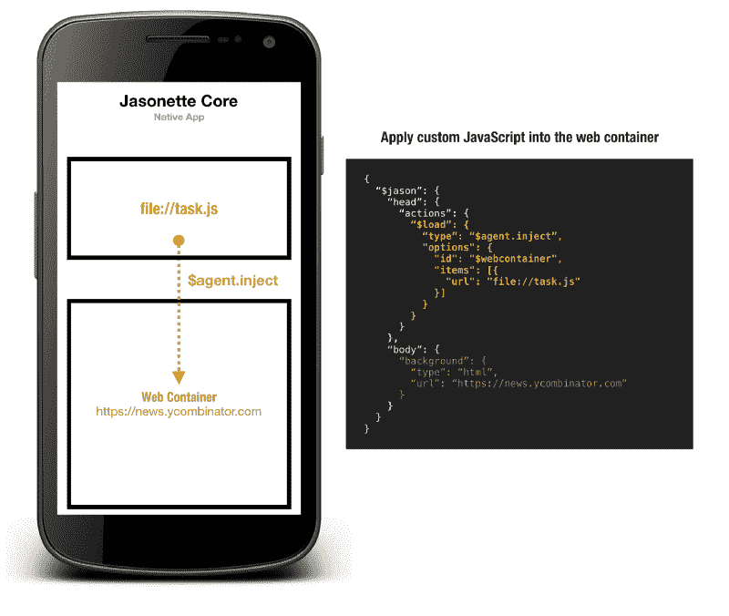
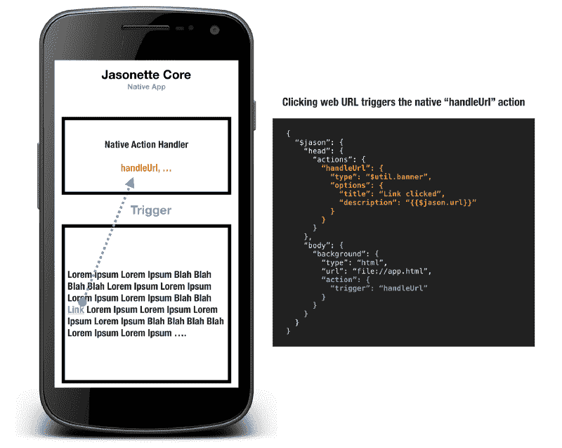
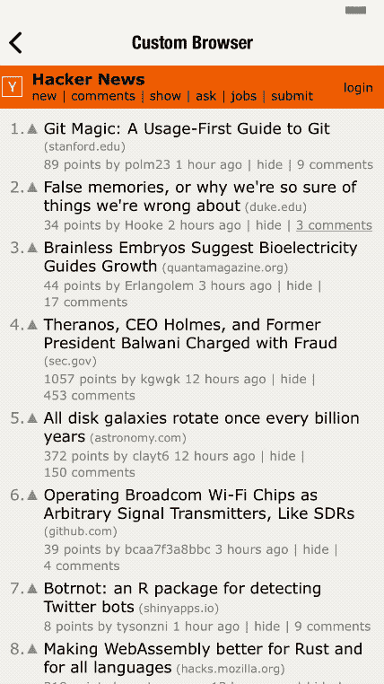
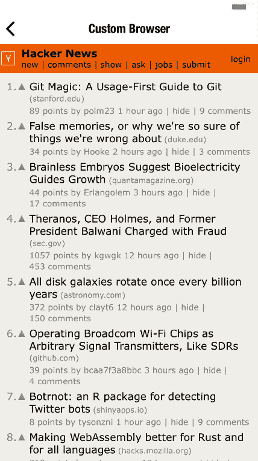
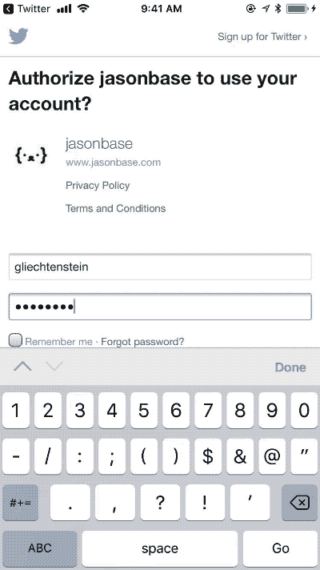

# 如何用 7 行 JSON 把你的网站变成手机 App

> 原文：<https://www.freecodecamp.org/news/how-to-turn-your-website-into-a-mobile-app-with-7-lines-of-json-631c9c9895f5/>

伊森

#### 一种将 Web 引擎融入本地应用的新方法

如果我告诉你**上面橙色的 7 行 JSON 代码**就是你将一个网站变成移动应用程序所需要的全部内容，会怎么样？不需要使用一些框架 API 来重写你的网站，只是为了让它像一个移动应用程序一样运行。只需将您现有的网站保持原样，并通过简单的 URL 引用将其融入原生应用程序。

如果只需稍微调整一下 JSON 标记，就可以访问所有本机 API、本机 UI 组件以及开箱即用的本机视图转换，那会怎么样？

下面是一个最小的实际例子:



注意我是如何嵌入一个[github.com 网页](https://github.com/Jasonette)的，但是布局的其余部分都是本地 UI 组件，比如[导航标题](https://docs.jasonette.com/document/#bodyheader)和[底部标签栏](https://docs.jasonette.com/document/#tabs)。这种转换是自动进行的，无需使用任何 API 重写网站。

在我解释如何做之前，你可能会问:“这很酷，但是除了在本地应用程序框架中显示网页之外，你还能做其他有意义的事情吗？”

很好的问题，因为这是这篇文章的主题。你所需要做的就是在 web 视图和应用程序之间创建一个无缝的**双向通信通道，这样父应用程序就可以在 web 视图内部触发任何 JavaScript 函数，web 视图也可以在外部调用本地 API。**

这里有一个这样的例子:



请注意，该视图包含:

1.  原生导航标题，带有内置过渡功能
2.  一个 web 视图，其中嵌入了一个 QR 码生成器 Web 应用程序
3.  底部的本地聊天输入组件

所有这些都可以通过调整我们上面看到的一些 JSON 标记属性来描述。

最后，请注意，当您从聊天输入中输入内容时，QR 码会发生变化。聊天输入触发了 QR code web 应用程序中的 JavaScript 函数，该函数重新生成图像。

没有一个应用开发框架试图从根本上解决这个问题**“将 web 视图无缝集成到原生应用中”**，因为他们都专注于选择 100%原生或 100% HTML5 端。

每当你听到有人谈论移动应用的未来，你可能会听到他们谈论**“html 5 方法会胜出吗？还是会是原生的？”**

他们中没有人认为`native`和`html`可以共存，而且可以产生协同作用，实现否则不容易实现的事情。

在这篇文章中，我将解释:

*   为什么混合 web 引擎和本地组件通常是一个好主意。
*   为什么 HTML 和 Native 的无缝集成不容易，以及我是如何实现的。
*   最重要的是，你如何使用它来即时构建自己的应用程序。

### 为什么要在原生应用中使用 HTML？

在我们进一步讨论之前，让我们先讨论一下这是否是一个好主意，以及什么时候你可能想采用这种方法。以下是一些潜在的使用案例:

#### 1.使用 Web 本机功能

使用 web 引擎可能会更好地实现应用程序的某些部分。例如， [Websocket](https://en.wikipedia.org/wiki/WebSocket) 是专为 web 环境设计的 web 原生特性。在这种情况下，使用内置的 web 引擎(**iOS 版的 WKWebView】和【Android 版的 WebView】)是有意义的，而不是安装一个第三方库，本质上是**“模拟”** Websocket。**

不需要安装额外的代码只是为了做一些你可以免费做的事情，这就把我们带到了下一点。

#### 2.避免二进制文件太大

您可能希望快速整合一些功能，否则将需要一个巨大的第三方库。

例如，要将 QR 码图像生成器整合到本机中，您需要安装一些第三方库，这会增加二进制文件的大小。但是如果你通过一个简单的`<script s` rc >使用 web 视图引擎和一个 JavaScript 库，你可以免费获得所有这些，并且你不需要安装任何第三方的本地库。

#### 3.不存在可靠的移动图书馆

对于一些尖端技术，还没有可靠和稳定的移动实现。

幸运的是，大多数这些技术都有 web 实现，所以集成它们的最有效方式是使用它们的 JavaScript 库。

#### 4.构建部分本地、部分基于 web 的应用程序

许多希望将网站移植到移动应用程序的新开发人员在发现他们现有的一些网站功能过于复杂，无法为每个移动平台快速重写时，会感到气馁或不知所措。

例如，您可能有一个过于复杂的网页，无法立即转换为移动应用程序，但您网站的其余部分可能很容易转换。

在这种情况下，如果有一种方法可以原生构建大部分应用程序，但对于特定的复杂网页，以某种方式无缝集成到应用程序中作为 HTML，那就好了。

### 它是如何工作的？

#### A.雅索内特

Jasonette 是一种开源的、基于标记的方法，用于构建跨平台的原生应用。

它就像一个网页浏览器，但它不是将 HTML 标记解释为网页，而是将 JSON 标记解释为 iOS 和 Android 上的原生应用。

就像所有 web 浏览器都有完全相同的代码，但可以通过按需解释各种 HTML 标记来为您提供各种不同的 web 应用程序一样，所有 Jasonette 应用程序都有完全相同的二进制文件，它按需解释各种 JSON 标记来创建您的应用程序。开发人员从来不需要接触代码。相反，您可以通过编写一个标记来构建应用程序，该标记可以实时转换为本机应用程序。

你可以在这里了解更多关于 Jasonette [的信息。](https://medium.freecodecamp.org/how-to-build-cross-platform-mobile-apps-using-nothing-more-than-a-json-markup-f493abec1873)

虽然 Jasonette 的核心是关于构建原生应用程序，但这篇文章是关于将 HTML 集成到核心原生引擎中，所以让我们来讨论一下。

#### B.Jasonette Web 容器

原生应用很棒，但有时我们需要利用网络功能。

但是将网络视图整合到原生应用中是一件棘手的事情。无缝集成需要:

1.  **Web 视图应作为原生布局的一部分进行集成:**Web 视图应作为原生布局的一部分融入应用程序，并与其他原生 UI 组件一样对待。否则，它会感觉笨重，感觉就像一个网站。
2.  **父 app 可以控制子 web 容器:**父 app 应该可以自由控制子 web 视图。
3.  **子 web 容器可以触发父应用上的本机事件:**子应用应该能够触发父应用的事件来运行本机 API。

这有很多工作要做，所以我首先只做了拼图的第一部分— **简单地将一个 web 容器嵌入本机布局**——并发布了版本 1:

[**JSON Web 容器**](http://jasonette.com/webcontainer/)
[*JSON 里面的 HTML 变身原生 App 组件*jasonette.com](http://jasonette.com/webcontainer/)

这已经很有用了，但是它仍然有不可交互的限制。

父应用程序无法控制子 web 容器，子应用程序无法通知父应用程序任何事件**，从而使 web 容器与外界完全隔离。**

#### C.Jasonette Web 容器 2.0:让它具有交互性

发布版本 1 后，我尝试了拼图的第二块— **向 web 容器添加交互性。**

下一节将解释为使以前静态的 web 容器具有交互性而添加的解决方案，这使它们变得更加强大。

### 实现:交互式 Web 容器

#### **1。通过 URL 加载**

#### 问题

在之前的版本 1 中，要使用 web 容器作为背景视图组件，您必须首先[将`$jason.body.background.type`设置为`"html"`，然后在`$jason.body.background.text`属性](https://jasonette.com/webcontainer/)下硬编码 HTML 文本，如下所示:

```
{  "$jason": {    "head": {      ...    },    "body": {      "background": {        "type": "html",        "text": "<html><body><h1>Hello World</h1></body></html>"      }    }  }}
```

很自然，人们希望能够使用简单的 web URL 实例化容器，而不是在一行中硬编码整个 HTML 文本。

#### 解决办法

Web 容器 2.0 增加了`url`属性。您可以像这样嵌入一个本地`file://` HTML(它从您随应用程序提供的本地 HTML 文件中加载):

```
{  "$jason": {    "head": {      ...    },    "body": {      "background": {        "type": "html",        "url": "file://index.html"      }    }  }}
```

或者像这样嵌入一个远程`http[s]://` URL(它从远程 HTML 加载):

```
{  "$jason": {    "head": {      ...    },    "body": {      "background": {        "type": "html",        "url": "https://news.ycombinator.com"      }    }  }}
```

#### **2。父应用< = > Web 容器通信**阳离子

#### 问题

以前，web 容器仅用于显示内容，而不是交互式的。这意味着**以下都是不可能的:**

1.  **Jasonette =>Web Contain**er:从 Jasonette 调用 Web 容器内部的 JavaScript 函数。
2.  web 容器= > Jasonet te:从 Web 容器代码中调用原生 API。

您所能做的就是显示 web 容器。这类似于在网页中嵌入 iframe，但是主网页无法访问 iframe 中的内容。

#### 解决办法

Jasonette 的要点是设计一种标准的标记语言来描述跨平台的移动应用。在这种情况下，我们需要一种标记语言来全面描述父应用程序和子 web 容器之间的通信。

为了实现这一点，我想出了一个基于`[JSON-RPC](http://www.jsonrpc.org/specification)`的父应用和子 web 容器之间的通信通道。因为 Jasonette 上的一切都是用 JSON 对象表示的，所以使用 JSON-RPC 标准格式作为通信协议是非常合理的。


为了对 web 容器进行 JavaScript 函数调用，我们声明了一个名为`$agent.request`的动作:

```
{  "type": "$agent.request",  "options": {    "id": "$webcontainer",    "method": "login",    "params": ["username", "password"]  }}
```

`[$agent.request](https://docs.jasonette.com/agents/#1-agentrequest)`是本地 API，它将 JSON-RPC 请求触发到 web 容器中。要使用它，我们必须传递一个`options`对象作为它的参数。

`options`对象是实际的 [JSON-RPC 请求](http://www.jsonrpc.org/specification#conventions)，它将被发送到 web 容器。让我们看看每个属性的含义:

*   Web 容器建立在一个叫做[代理](https://jasonette.com/agent/)的底层架构之上。通常情况下，一个视图可以有多个代理，每个代理都有自己唯一的 ID。但是 [Web 容器是一种特殊类型的代理，它只能有 id`$webcontainer`](https://docs.jasonette.com/web/#1-background-web-container-is-an-agent)，这就是为什么我们在这里使用那个 ID。
*   `method`:要调用的 JavaScript 函数名
*   `params`:传递给 JavaScript 函数的参数数组。

完整的标记如下所示:

```
{  "$jason": {    "head": {      "actions": {        "$load": {          "type": "$agent.request",          "options": {            "id": "$webcontainer",            "method": "login",            "params": ["alice", "1234"]          }        }      }    },    "body": {      "header": {        "title": "Web Container 2.0"      },      "background": {        "type": "html",        "url": "file://index.html"      }    }  }}
```

这个标记表示:

当视图加载(`[$jason.head.actions.$load](https://docs.jasonette.com/actions/#1-load)`)时，向 web 容器代理(`[$agent.request](https://docs.jasonette.com/agents/#1-agentrequest)`)发出一个 JSON-RPC 请求，请求在`options`下指定。

web 容器在`[$jason.body.background](https://docs.jasonette.com/web/#in-depth-on-background-web-container)`下定义，在这种情况下，它加载一个名为`file://index.html`的本地文件。

它将寻找一个名为`login`的 JavaScript 函数，并将两个参数传递给`params` ( `"alice"`和`"1234"`)

```
login("alice", "1234")
```

我只解释了父应用如何触发子 web 容器的 JavaScript 函数调用，但是你也可以反过来让 web 容器触发父应用的本地 API。

要了解更多信息，请查看[代理文档](https://docs.jasonette.com/agents/)。

#### 例子

让我们回到我上面简单分享的二维码例子:


1.  [页脚输入组件是 100%原生的](https://docs.jasonette.com/document/#input)。
2.  二维码由 web 容器[生成为 web app](https://github.com/Jasonette/Jasonpedia/blob/gh-pages/webcontainer/agent/fn/agent.html) 。
3.  当用户输入一些东西并按下“生成”时，它将调用 web 容器代理中的`$agent.request`动作，调用 [JavaScript 函数“QR”](https://github.com/Jasonette/Jasonpedia/blob/gh-pages/webcontainer/agent/fn/agent.html#L22)

你可以点击查看示例[。](https://github.com/Jasonette/Jasonpedia/blob/gh-pages/webcontainer/agent/fn/index.json)

#### **3。脚本注入**

#### 问题

有时，您可能希望在 web 容器加载完初始 HTML 后，动态地将 JavaScript 代码注入到 web 容器中。

假设您想要构建一个自定义的 web 浏览器应用程序。您可能希望将自己的定制 JavaScript 注入到每个 web 视图中，以定制 web 视图的行为，有点像 web 浏览器扩展的工作方式。

即使您没有构建 web 浏览器，当您想要对 URL 的内容进行自定义时，也可以使用脚本注入方法。本机应用程序和 web 容器之间唯一的通信方式是通过`$agent` API。但是如果不能改变 HTML 内容，那么将`$agent`接口添加到 web 容器中的唯一方法就是通过动态注入。

#### 解决办法

如前一节所述，`$jason.body.background` web 容器只是另一个`agent`。这意味着您可以使用常规代理可用的相同的`[$agent.inject](https://docs.jasonette.com/agents/#7-agentinject)`方法。



#### **4。URL 点击处理**

过去，web 容器只有两种方式来处理链接点击:

1.  **Readonly:** 将 web 容器视为只读，忽略所有事件，如触摸或滚动。所有的 web 容器都是只读的，除非你告诉它们像一个普通的浏览器一样工作，如下所述。
2.  **常规浏览器行为:**让用户像普通浏览器一样与页面交互。通过将`"type": "$default"`设置为它的`action`属性来声明它。

#### 问题

两者都是**“全有或全无”的解决方案**。

*   在“只读”的情况下，所有的交互都被 web 容器完全忽略。
*   在“常规浏览器行为”的情况下，web 容器实际上起着浏览器的作用。当你点击一个链接时，它会像刷新网页一样把你带到那个链接。没有办法劫持点击并调用一些本地 API。

#### 解决办法

有了新的 web 容器，您现在可以在`$jason.body.background` web 容器上附加任何`action`来处理链接点击事件。



让我们看一个例子:

```
{  "$jason": {    "head": {      "actions": {        "displayBanner": {          "type": "$util.banner",          "options": {            "title": "Clicked",            "description": "Link {{$jason.url}} clicked!"          }        }      }    },    "body": {      "background": {        "type": "html",        "url": "file://index.html",        "action": {          "trigger": "displayBanner"        }      }    }  }}
```

这里我们将`"trigger": "displayBanner"`附加到了 web 容器上。这意味着当用户点击 web 容器中的任何链接时，都会触发`displayBanner`动作，而不是让 web 视图来处理。

另外，如果您查看`displayBanner`动作，您会注意到`$jason`变量。在这种情况下，被点击的链接将通过`$jason`变量传递。例如，如果您点击了一个名为`"https://google.com"`的 URL，`$jason`将具有以下值:

```
{  "url": "https://google.com"}
```

这意味着您可以通过[检查`$jason.url`值来选择性地触发不同的动作。](https://docs.jasonette.com/web/#b-intercept-url-visits)

让我们再举一个例子，我们实现了一个定制的 web 浏览器:

```
{  "$jason": {    "head": {      "actions": {        "handleLink": [{          "{{#if $jason.url.indexOf('signin') !== -1 }}": {            "type": "$href",            "options": {              "url": "file://key.html"            }          }        }, {          "{{#else}}": {            "type": "$default"          }        }]      }    },    "body": {      "background": {        "type": "html",        "url": "file://index.html",        "action": {          "trigger": "handleLink"        }      }    }  }}
```

我们测试 URL 是否包含字符串`signin`，然后根据结果运行两个不同的操作。

1.  如果它包含`signin`，它会打开一个新的视图来处理本地登录。
2.  如果它不包含`signin`，只需运行`"type": "$default"`动作，这样它的行为就像普通浏览器一样。

### 用法示例

#### 构建自定义 web 浏览器

我们现在可以利用新的 web 容器可以:

1.  取一个`url`属性来加载自己，作为一个成熟的浏览器
2.  根据 URL 有选择地处理链接点击

我们甚至可以用十几行 JSON 构建一个定制的 web 浏览器应用程序。既然我们现在可以劫持每个链接点击，我们可以看一看`$jason.url`并根据 URL 运行我们想要的任何操作。

例如，看看下面的例子:



在左侧，我们看到点击一个链接的行为就像一个普通的浏览器(`"type": "$default"`)

在右边，我们看到单击一个链接会自然地转换到另一个 JASON 视图。

这一切都可以通过基于`$jason.url`有选择地触发不同的动作来实现。

**第一步。将名为`visit`的动作附加到 web 容器，如下所示:**

```
{  ...  "body": {    "background": {      "type": "html",      "url": "https://news.ycombinator.com",      "action": {        "trigger": "visit"      }    }  }}
```

**第二步。基于`$jason.url`** 运行`visit,`内的相关动作

在下面的代码中，我们检查`$jason.url`是否匹配`newest`、`show`、`ask`等等(它们是顶部的菜单项链接)。如果是这样，我们通过设置`"type": "$default"`让 web 容器表现得像普通浏览器一样

如果它们与模式不匹配，我们将原生的`$href`转换到一个新视图，并将点击的链接作为参数传递。

```
..."actions": {  "visit": [    {      "{{#if /\\/(newest|show|ask)$/.test($jason.url) }}": {        "type": "$default"      }    },    {      "{{#else}}": {        "type": "$href",        "options": {          "url": "https://jasonette.github.io/Jasonpedia/webcontainer/agent/hijack.json",          "preload": {            "background": "#ffffff"          },          "options": {            "url": "{{$jason.url}}"          }        }      }    }  ]},
```

点击这里查看 web 浏览器的完整 JSON 标记(只有 48 行！).

#### 即时“混合”应用

当人们谈论“混合”应用时，他们通常指的是包装在本地应用框架中的 HTML web 应用。

但我在这里不是这个意思。当我说“混合”时，我指的是真正的混合应用程序，其中一个应用程序可以同时拥有多个本地视图和多个基于 web 的视图。同样，一个视图可以有多个本地 UI 组件和一个 web 容器呈现在同一个本地布局中。

基于网络的视图和本地视图之间的交叉应该是如此无缝，以至于很难区分它们的起点和终点。



在这个例子中，我创建了一个应用程序，它在 web 容器中将[jasonbase.com](https://www.jasonbase.com)显示为主视图。

Jasonbase 是一个免费的 JSON 托管服务，我构建它是为了方便地托管 Jasonette 应用程序的 JSON 标记。

当然，它只是一个网站，但我已经将它嵌入到 Jasonette 中，这样当你点击链接时，而不是打开一个网页，它会自然地转换到一个自然的 JASON 视图。

我不需要接触 Jasonbase.com 的任何代码来构建这个应用程序。

我只是将网站作为 web 容器嵌入到 Jasonette 中，并劫持链接点击来本地处理它们，因此它可以做所有本地的事情，如触发本地 API 和进行本地转换。

你可以在这里查看代码[。](https://github.com/Jasonette/Jasonpedia/blob/gh-pages/webcontainer/agent/hybrid.json)

### 结论

在我看来，让所有这些工作不可思议的是**一切都在框架级别**上处理好了。所有的辛苦工作都在幕后处理。

而不是让应用程序开发人员从头开始实施以下所有内容:

*   将 webview 嵌入本机布局
*   创建一个 JavaScript 桥，这样应用程序就可以对 web 视图进行函数调用
*   创建本地事件处理架构，以便 web 视图可以触发父应用程序上的本地事件

解决方案是创建一个由以下内容组成的抽象:

1.  **声明式标记语言:**用于描述如何将 web 视图嵌入到原生应用中
2.  **通信协议(JSON-RPC):** 允许应用程序和其子 web 视图之间进行非常简单的交互。

我不认为这种方法是解决所有问题的最终解决方案，但是我很高兴地说，对于我自己的用例来说，这是一个很好的解决方案。

我试图构建一个基于超级边缘技术的应用，该技术没有稳定可靠的移动实现(由于协议的性质，尚不清楚是否会有移动实现)。值得庆幸的是，它有 JavaScript 实现，所以我可以轻松地将其集成到应用程序中。

总的来说，这很棒，我对结果很满意。[文档是最新的](https://docs.jasonette.com/web/),反映了所有的新特性，所以请随意阅读和体验。

> 免责声明:权力越大，责任越大

我想以一个免责声明来结束:尽管这种新发现的力量很大，但我认为你需要保持平衡来构建一个具有良好用户体验的应用程序。

有些人可能会利用这一点，只使用网络视图构建整个应用程序，但这样你最终得到的应用程序基本上只是一个网站，这违背了构建专用应用程序的目的。

我强调，我并不是说你应该总是用 HTML 和 native 来构建应用程序。我是说这对于不同情况下的许多人来说非常有用。只是不要做得太过火。

> 跟随以了解更多信息

有许多不同的配置，Jasonette 原生核心和它的子 web 容器可以进行通信，以创造性和强大的方式完成事情，这篇文章只是触及了表面。

展望未来，我计划分享更多这些用例和教程，所以如果你感兴趣，请关注 [medium](https://medium.com/@gliechtenstein) 或 [twitter](https://twitter.com/jasonclient) 。