# 很酷的 Chrome DevTools 提示和技巧，你希望你已经知道了

> 原文：<https://www.freecodecamp.org/news/cool-chrome-devtools-tips-and-tricks-you-wish-you-knew-already-f54f65df88d2/>

> 对学习 JavaScript 感兴趣？在 jshandbook.com 获得我的电子书

如果你是这个令人敬畏的浏览器功能的新用户，请查看我的 Chrome DevTools 概述。

### 1.元素面板中的拖放

在“元素”面板中，您可以拖放任何 HTML 元素，并更改其在页面中的位置

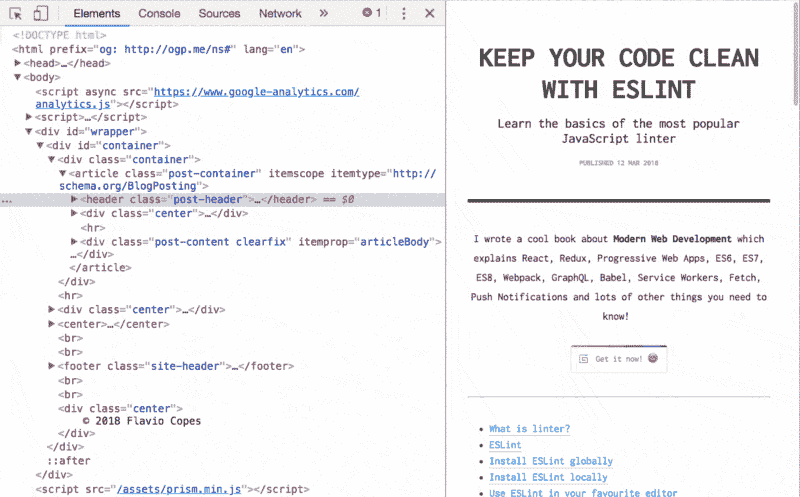

Drag-and-drop in the Elements panel

### 2.引用控制台中当前选定的元素

在 Elements 面板中选择一个节点，并在控制台中键入`$0`来引用它。

如果使用 jQuery，可以输入`$($0)`来访问这个元素上的 jQuery API。

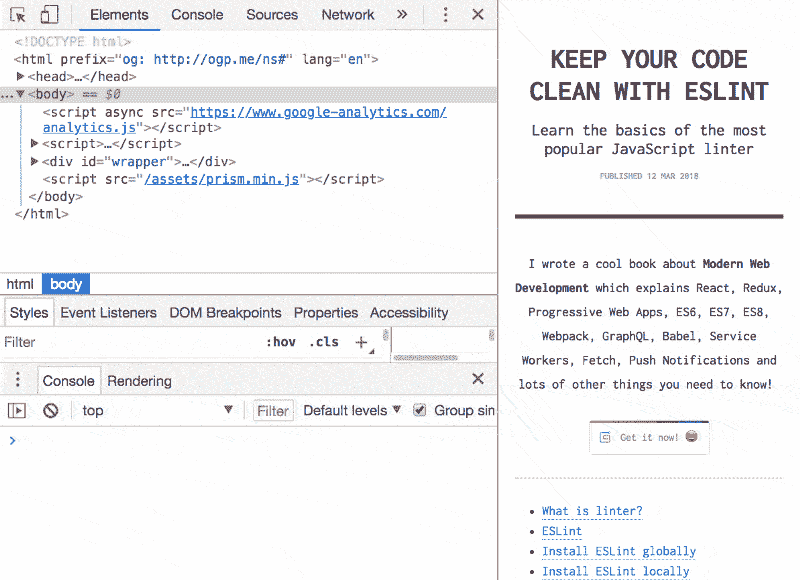

Reference the currently selected element in the Console

### 3.使用控制台中最后一次操作的值

使用`$_`引用控制台上一次执行操作的返回值

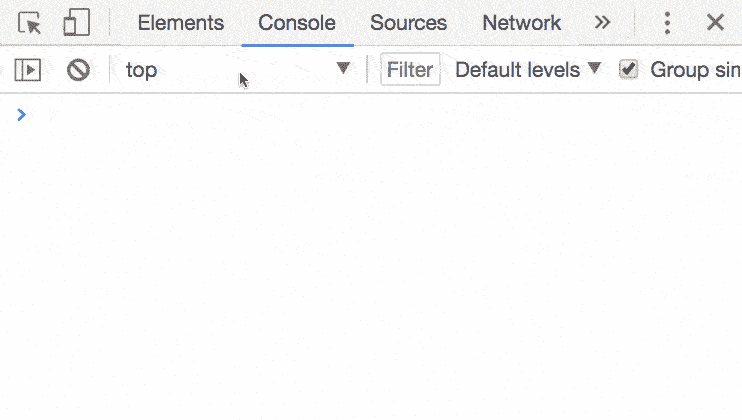

Use the value of the last operation in the Console

### 4.添加 CSS 并编辑元素状态

在元素面板中有两个非常有用的按钮。

第一个选项允许您使用任何选择器添加新的 CSS 属性，但会预先填充当前选定的元素:

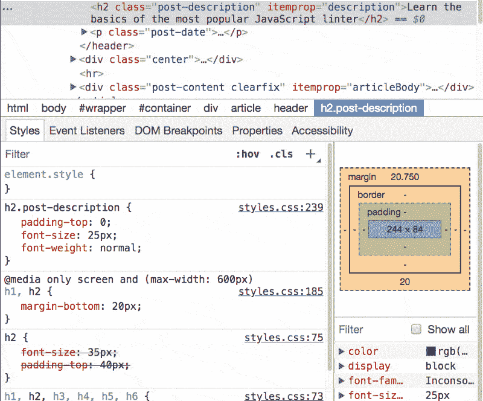

Add CSS rules

第二个选项让您触发所选元素的状态，这样您就可以看到当它处于活动状态、悬停或处于焦点时所应用的样式。

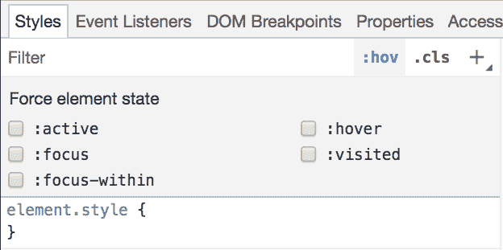

Edit the element state

### 5.保存修改后的 CSS 文件

单击您编辑的 CSS 文件的名称。检查器将它打开到“源”面板中，在那里您可以使用您应用的实时编辑来存储它。

这个技巧对使用+或添加到`element.style`属性中的新选择器无效，只对修改过的现有选择器有效。

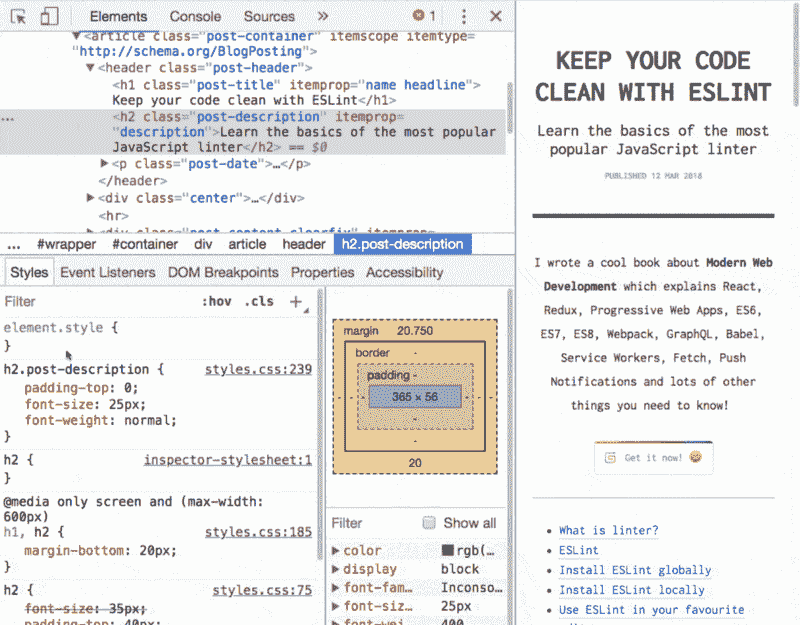

Save to file the modified CSS

### 6.截屏单个元素

选择一个元素，按`cmd-shift-p`(或者 Windows 中的`ctrl-shift-p`)打开命令菜单，选择**捕捉节点截图**

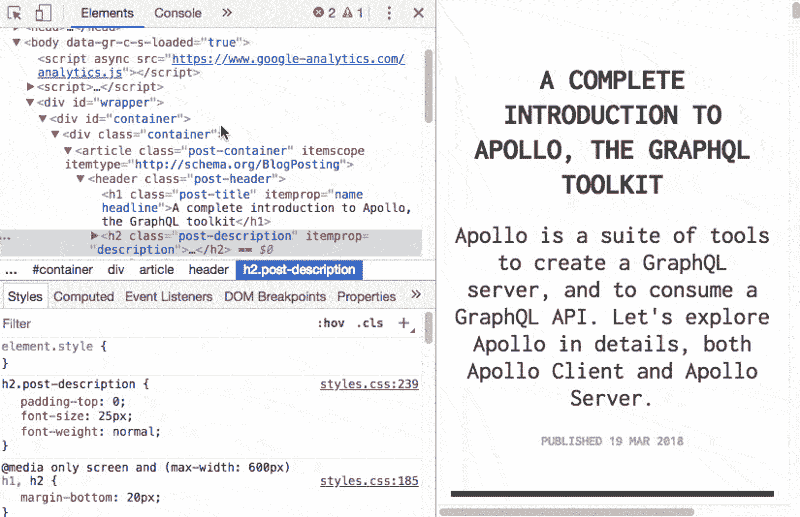

Screenshot a single element

### 7.使用 CSS 选择器查找元素

按下`cmd-f`(在 Windows 中为`ctrl-f`)打开元素面板中的搜索框。

您可以在其中键入任何字符串来匹配源代码，也可以使用 CSS 选择器让 Chrome 为您生成一个图像:

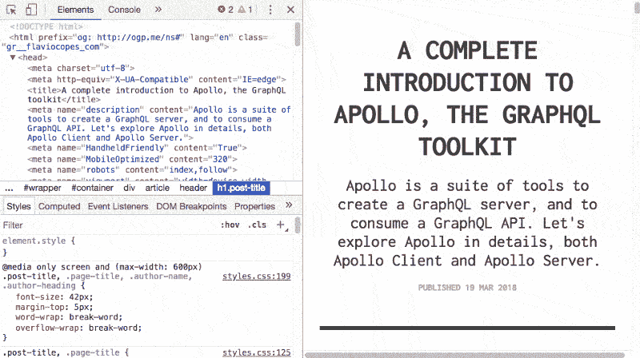

Find an element using CSS selectors

### 8.在控制台中按 Shift-enter 键

要在控制台中编写跨越多行的命令，请按`shift-enter`。

准备好之后，在脚本末尾按 enter 键来执行它:

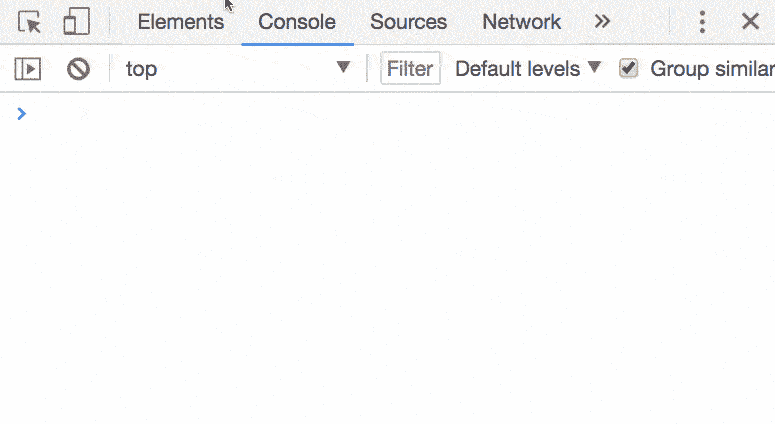

Shift-enter in the Console to write multiline commands

您可以使用控制台左上方的*清除*按钮，或者按下`ctrl-l`或`cmd-k`来清除控制台。

### 9.转到…

在“源”面板中:

*   `cmd-o`(Windows 中的`ctrl-o`)，显示页面加载的所有文件。
*   `cmd-shift-o`(Windows 中的`ctrl-shift-o`)显示当前文件中的符号(属性、函数、类)。
*   `ctrl-g`转到特定行。

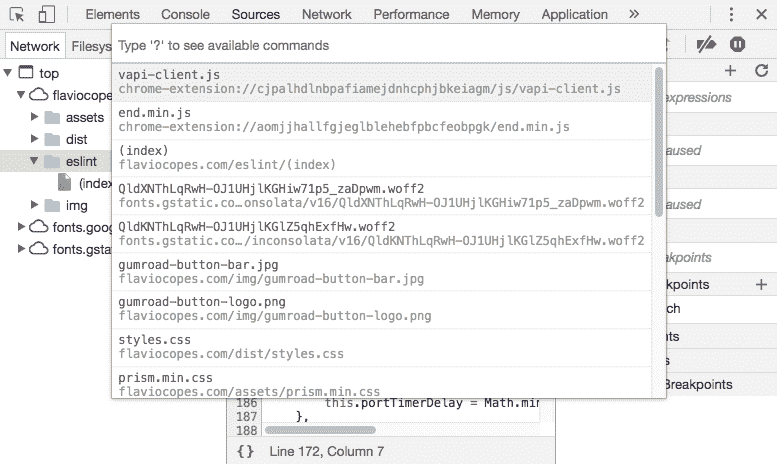

Go to file

### 10.观看表情

不要一遍又一遍地写一个变量名或一个你在调试会话中要检查的表达式，把它添加到*观察表达式*列表中。

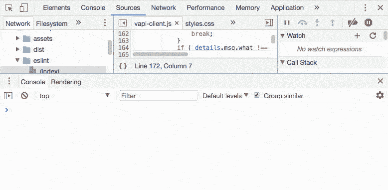

Watch Expression

### 11.XHR/提取调试

从调试器打开**XHR/获取断点**面板。

您可以将它设置为在发送 XHR/Fetch 调用时中断，或者只在特定情况下中断:

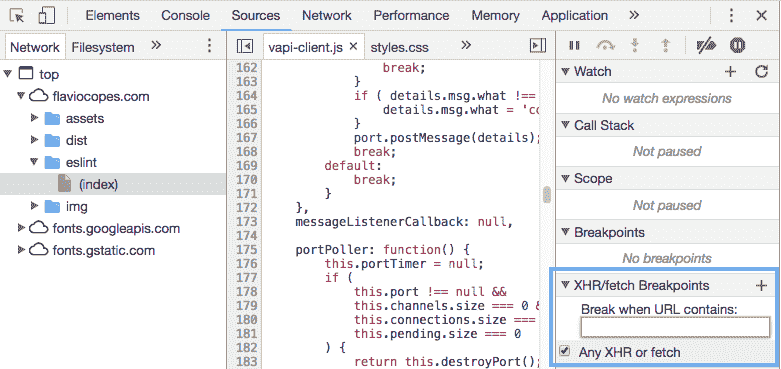

XHR/Fetch debugging

### 12.调试 DOM 修改

右键单击一个元素并启用 *Break on Subtree Modifications。*每当脚本遍历该元素的子元素并修改它们时，调试器会自动停止，让您检查发生了什么。

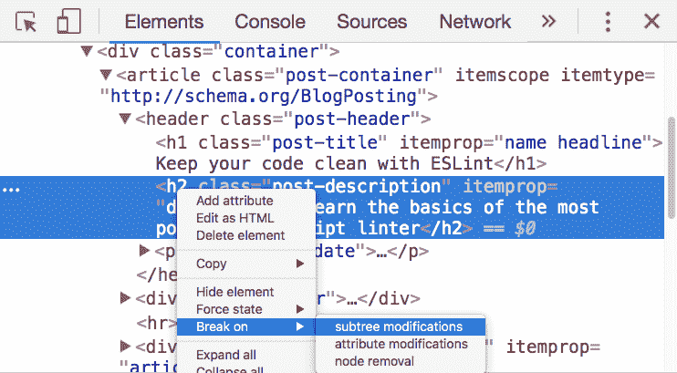

Debug on DOM modifications

> 对学习 JavaScript 感兴趣？在 jshandbook.com 获得我的电子书