# 我如何从应征入伍的空军成为软件工程师实习生@Twitter

> 原文：<https://www.freecodecamp.org/news/from-enlisted-air-force-to-a-software-engineer-intern-twitter-d3f90b8ea1af/>

乔丹·杰克逊

# 我如何从应征入伍的空军成为软件工程师实习生@Twitter

#### 编码、网络和成长的故事。

Photo by [Andrzej Grygiel](https://unsplash.com/photos/54ArKZlff8w?utm_source=unsplash&utm_medium=referral&utm_content=creditCopyText) on [Unsplash](https://unsplash.com/search/photos/air-force?utm_source=unsplash&utm_medium=referral&utm_content=creditCopyText)

我从大三入伍，到在一家科技公司自学成才的软件工程师实习生。我是怎么做到的？

我很高兴你这么问，因为如果我没有经历过，我会说这听起来很牵强。但这是可能的，我会告诉你我是如何做到的。我会包括每一个相关的细节，从我写的第一行代码到从 Twitter 上得到我的录取通知书。

在到达我的基地之前，我没有任何编程经验。我以前甚至都没有连接过我的 Myspace 页面。我完全是从零开始学习的，这意味着开始学习永远不会太晚([这里有一篇由](https://medium.freecodecamp.org/stories-from-300-developers-who-got-their-first-tech-job-in-their-30s-40s-and-50s-64306eb6bb27)[昆西·拉森](https://www.freecodecamp.org/news/from-enlisted-air-force-to-a-software-engineer-intern-twitter-d3f90b8ea1af/undefined)写的关于人们在 30 多岁、40 多岁和 50 多岁时做到这一点的文章可以证明这一点！).

我也没有在任何科技公司或科技社区的任何人有任何有意义的联系(这将很快发挥作用)。但这一切会以我从未预料到的方式发生。那么，让我们开始吧！

旁注:我接触过的很多想进入技术行业的人都认为他们必须具备编码能力才能进入。不是真的！和其他公司一样，科技公司也有不同的部门。开枪吧！

### 挫败感

2012 年 12 月，当我第一次到达我在北加州的工作地点(特拉维斯·AFB)时，我并不想成为一名软件工程师。在有这个目标之前，我只是一名年轻的飞行员，梦想着建立一家科技公司，对如何做到这一点知之甚少。我唯一拥有的就是想法。从我阅读的大量书籍和文章中，我知道我需要更多来创办一家公司。

然后我注意到一个重复出现的情况。有许多像我一样的人有想法，但无法执行。我们需要的是一个“技术创始人”，一个用代码构建我们梦想的人，或者至少是原型(也就是最小可行产品)。在几次寻找那个人的尝试失败后，我的挫败感开始增加。

Me searching for the answers. Image [source](https://www.npr.org/sections/thetwo-way/2016/03/31/472330783/the-evolution-of-the-michael-jordan-crying-face-meme).

最终，这让我喃喃自语道:“如果我找不到技术人员，我就让自己成为技术人员。”嘣，我学习编码的旅程已经开始了一半。我说中途，是因为不幸的是，我不止一次地开始了这段旅程。但这绝对是引发火灾的火花。

### 持久性

为了开始我的新探索，我简单地在谷歌上搜索了“[如何编写](https://www.google.com/search?q=how+to+code&source=lnms&sa=X&ved=0ahUKEwiL7su5kPfZAhVjy1QKHa1jBI8Q_AUICSgA&biw=1536&bih=694&dpr=2.5)”，这是有史以来最千年的学习方法。我立即找到了 codecademy.com 的[，这是我第一次体验编写代码的绝佳机会。它是完美的，因为它的用户界面是如此的简单明了，而且它对你的代码给出了实时的反馈。](https://www.codecademy.com/)

This is codecademy. Instructions on the left, code in the middle, results on the right.

我尝试的第一个编程语言是 [JavaScript](https://www.javascript.com/) ，也尝试了一些 [HTML](https://developer.mozilla.org/en-US/docs/Learn/HTML/Introduction_to_HTML) 和 [CSS](https://www.w3schools.com/css/css_website_layout.asp) 。这很有趣，但它并没有引起我最初的兴趣。在接下来的几个月里，我会拖延并尝试周期性地解决这些挑战。我也从一个网站跳到另一个网站，到处尝试课程片段。

了解 freeCodeCamp.org 是我探索编码的转折点。[昆西·拉森](https://www.freecodecamp.org/news/from-enlisted-air-force-to-a-software-engineer-intern-twitter-d3f90b8ea1af/undefined)做了一件了不起的工作，让网站变得平易近人，并在网站背后建立了一个巨大的社区。

我在和一个也在学习编码的同事聊天时发现了这一点。课程的结构和来自用户的成功故事真的让我兴奋不已！这让我兴奋不已，让我发誓我会完成网站上的一个认证，并且永不放弃。

这变成了许多深夜编码。这也变成了我真正喜欢的事情。解决挑战变得令人上瘾，学会征服我无法解决的挑战也很诱人。

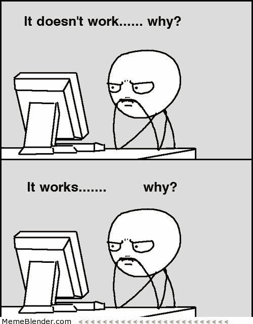

This will happen more often than you could imagine!

当我退役后，我突然意识到我很想做这件事。作为参考，我立誓的时候是 2016 年 1 月，离职日期是 2018 年初(我 6 年入伍的其他几年是怎么度过的，另说了)。

我知道，要在这么短的时间内实现这一点，我必须在我的 10，000 小时的时间里做出适当的让步。虽然没有完成全部 10，000 个，但足够获得初级工程师或网站开发员的职位了。我甚至没有考虑过去实习。所以，我忙着试图拆除免费代码营课程。

除了每天在家写代码之外，我还会挤出时间去任何我能去的地方练习。服现役让这有时有点挑战性，同时也有真正帮助我学习的时刻。

例如，因为我是轮班工作者，我会利用晚上工作节奏较慢的优势练习编码。再加上我在家做的时间，我可能一天有将近 4-5 个小时在做编码。

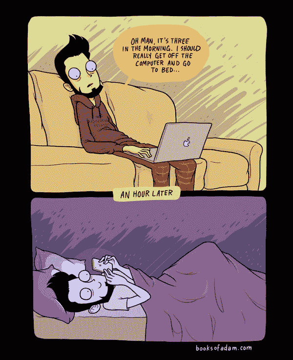

Searching for that last piece of the puzzle!

当然，并不是每个人都这样，但最重要的是找到空闲时间来实现它。

有时我会被困在 freeCodeCamp(构建井字游戏让我走投无路了)。我的解决办法是访问其他训练营和网站，直到我掌握了摆脱困境的技能。

在这些资源中有 [TheOdinProject](https://www.theodinproject.com/) 、 [CodeSchool](https://www.codeschool.com/) 、 [Hackerrank](https://www.hackerrank.com/) 以及无数其他资源。你永远不会知道谁对某个话题有最好的解释。

这个循环会继续，“学习，卡住，学习，卡住，学习，”在我知道之前，我会看着屏幕，“我写了这个……哇。”年初看起来像胡言乱语的东西，我现在可以从头开始写和阅读了。疯狂的东西！然而，这并不是我学习的终点。事实上，作为一名软件工程师，你永远不会停止学习。

### 毅力

在故事的这一点上，听起来好像我已经有了这个编码的东西，对吗？没有。

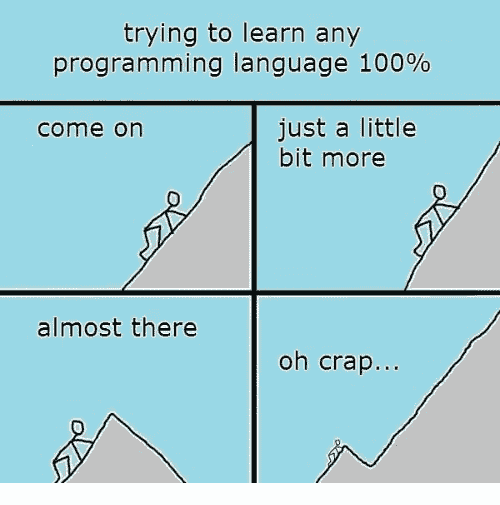

Do NOT think you have to try and learn any language 100%. Image [source](https://www.reddit.com/r/ProgrammerHumor/comments/5gcz6t/learning_any_programming_language/).

在学习编码的时候，我有过相当多的黑暗日子。我想确定我在这个故事中为他们留了一席之地。很容易碰壁，休息一天，然后变成几周，然后几个月，然后你就像“为什么我停下来了？”

我认为知道如何保护自己不被吓到是很重要的。尤其是当你像我一样，身边没有人对编码感兴趣的时候。很多话题都可以单独处理，但当我需要一个肩膀来哭泣时，会有一些更复杂的想法。

徒步旅行的大部分时间都很孤独。一些给我带来麻烦的主题是递归(这个想法很有道理，但是实现起来很难！)、AJAX(异步 JavaScript & XML)、大 O 符号以及一些更难的算法挑战。

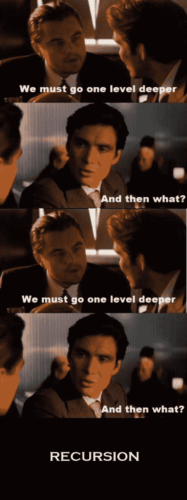

An example of how recursion works. :-/ Image [source](http://www.quickmeme.com/meme/t7o).

为了理解其中的一些主题，在我能理解它们之前，我不会阅读任何其他的东西。这意味着有时要花几天时间研究一个话题，观看 YouTube 视频，消化 [Stack Overflow](https://stackoverflow.com/) 帖子(你的新好朋友！)当然，还有更多的谷歌搜索。那时我会说“这是给我的吗？”

随着时间的推移，这些概念将会实现，但在此之前耗尽汽油总是一种恐惧。保持我最初为什么开始编码的愿景帮助很大——这和 G [lassdoor](https://www.glassdoor.com/Salaries/software-engineer-salary-SRCH_KO0,17.htm) 薪水估计！

更重要的是，只要想起我朝着我的梦想迈出了重要的一步，我内心的火就会一直燃烧。也就是说，这团火不一定要射向编码。不管你的梦想是什么，坚持努力，让它实现！

### 秘密的

我努力工作，自学编码，同时我开始了一个小型的松散的网络。小而松散，比如我和别人交换了几封电子邮件。所以根本算不上什么网络。所以，我还是一颗未经雕琢的宝石(自我标榜)。

我知道没有关系网也能找到工作，但是俗话说“重要的不是你知道什么，而是你认识谁。”尽管我很不同意这一点，但我知道建立一个网络会帮助我达到更高的高度。为什么不通过一个很棒的网络来增加我找到工作的机会呢？

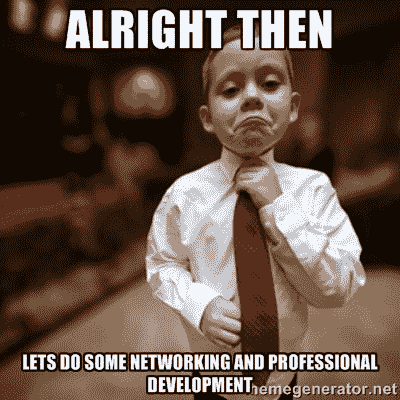

Do it!

服役意味着我被送到远离底特律的家，在那里我可以先和家人联系。这意味着我必须在北加州建立一个网络(对于技术人员来说，这不是最糟糕的地方)。

我之前在 [Quora](https://www.quora.com/) 上接触过一个名叫 [Charles Hudson](https://www.freecodecamp.org/news/from-enlisted-air-force-to-a-software-engineer-intern-twitter-d3f90b8ea1af/undefined) 的投资者(我上面提到的小网络的 1/2)。你为什么问查尔斯？他是科技界的知名投资者，他的公司当时投资了与我想建立的公司类似的公司，在观看了他的一次采访后，我了解到我们有着相同的家乡！

与你接触的人有一些共同之处会有所帮助。但除此之外，这只是寻找导师和碰运气的结合。对我来说幸运的是，他非常善于接受，并给了我实现目标的建议。我和他的聊天让我第一次发现了 Twitter 真正的社交潜力(与实习完全无关)。

他向我推荐了鲁本·哈里斯的一篇文章，标题是“[打入创业公司](https://medium.com/breaking-into-startups/breaking-into-startups-cc092432305a)”。这篇文章让我大吃一惊——尤其是鲁本是如何利用这个平台发展他的网络和个人品牌的。这是疯狂的，仍然值得一读。

快进到现在，那篇文章已经转变为[一家创造令人敬畏的播客来帮助人们进入技术行业的公司！](https://breakingintostartups.com/)

从那篇文章中，我把社交作为优先事项，尤其是在 Twitter 上。这让我与鲁本在那篇文章中提到的一些人进行了交谈，比如奈森·琼斯([断断续续](https://www.freecodecamp.org/news/from-enlisted-air-force-to-a-software-engineer-intern-twitter-d3f90b8ea1af/undefined))和投资者[坎伊·马克贝拉](https://www.freecodecamp.org/news/from-enlisted-air-force-to-a-software-engineer-intern-twitter-d3f90b8ea1af/undefined)，他们都给了我宝贵的建议和指导。(当时我只是在想，嘿，他们很容易接受，为什么不在阅读了鲁本的文章后主动出击呢！)

奈森最终把我和威廉·特雷瑟德联系在了一起，他允许我在他目前所在的初创公司 [BMNT](https://www.freecodecamp.org/news/from-enlisted-air-force-to-a-software-engineer-intern-twitter-d3f90b8ea1af/undefined) Partners 实习(在几个月又几个月的电子邮件表明我是多么认真之后——对不起，威廉)。这个机会太棒了，因为初创公司的很多人都曾是军人，所以他们可以更好地与我相处，并帮助我过渡。

获得第一手的创业经验也很棒，这与军事文化截然相反。我与他们合作的最大项目为我最终在 Twitter 的面试提供了一些最佳答案。

回到 Kanyi，在和他通了电话后，我有了一些想法，如何让自己在竞争激烈的科技行业中脱颖而出。从那以后，我喜欢上了网络的方方面面。当别人想要帮助你的时候，你可以打开甚至创造无限的机会。我一点也不知道在特拉维斯·AFB 工作期间会发生最好的关系。

### 繁荣

这是文章中的一点，一些疯狂可怕的事情发生了，让你有“这永远不会发生在我身上”的感觉。我只想说，如果你继续推动并告诉人们你的激情，这将发生在你身上。

一天晚上，当我在工作的时候，这种事情发生在我身上。只是一次常规的换班，我和机长 El-Amin 聊了起来，他是我工作的飞行员之一。我们总是聊一些随意的事情，包括我对科技和创业的热爱。

然而，在这一天，我碰巧在我们的谈话中提到了一些关于 Twitter 的事情。他说的下一句话相当于，“我认识一个在那里工作的人。”这就像一个电影场景，但我无法猜到这句话会变成什么。他认识的人是特里尔·布莱恩特，她自己也曾是一名空军成员！

在和她通完电话后，由于竞争，我感到既兴奋又疲惫。我只知道我必须继续编码，并与她保持健康的虚拟联系。当我和一个朋友拜访 Twitter 总部时，这种联系变得真实起来。我们被科技环境难倒了。特里尔和她的团队被我们打败了。然后我们集体说我们应该再做一次，但是要更大。下一次我们带了 12 个人来，我们甚至见到了杰克·多西。

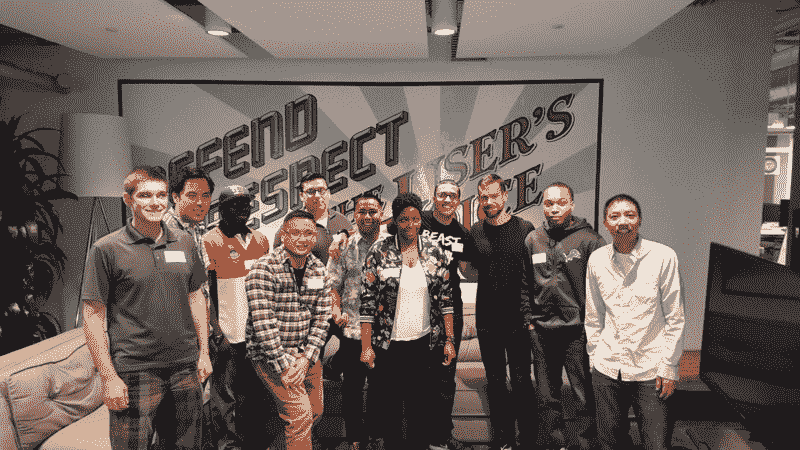

Jack made a surprise visit during our time there!

这次旅行之后，我们又一次被打动了，我们说我们应该更上一层楼。那次访问最终演变成了我和 50 多名现役人员访问 Twitter 总部，进行一整天的职业发展交流。

因此，我完成了一项足以让自己与众不同的活动(在我的老板/个人活动策划人 SMSgt Outsey 和其他人的大力帮助下)。我不知道如何让一个事件发生，但他们相信我的愿景和激情，并帮助我度过难关。结果证明是完美的！

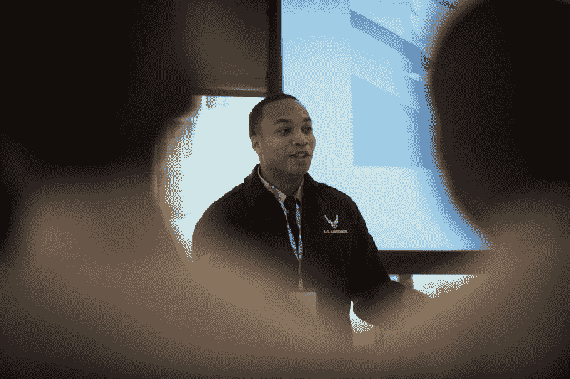

My “could this get any better” face.

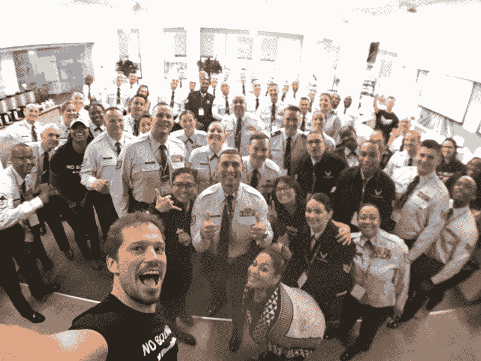

Smiles, smiles, and more smiles!!!

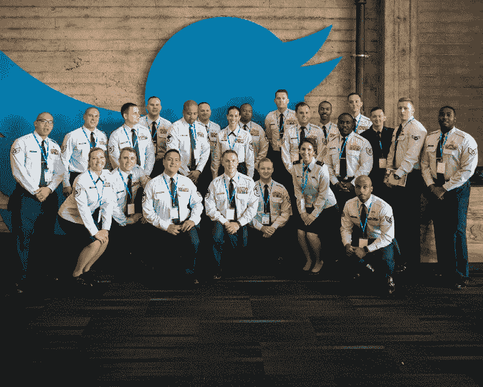

Air Force is happening!!

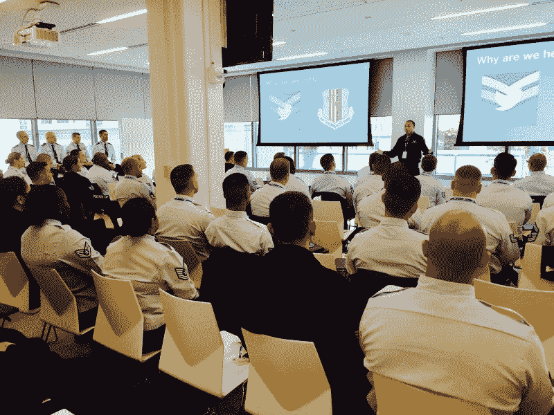

Me actually telling THIS part of the story to everyone.

空军来了，上了一课，然后推特上了一课。这对双方都很好。这件事发生在 2017 年 11 月，这意味着我现在离离职日期越来越近了。所有人都以为我会去 Twitter 工作。我似乎是唯一不这么认为的人。

从我第一次和特里尔谈话到现在，我经历了许多低谷和高峰。但是她一直告诉我“安静，相信你自己！”所以，无论如何我都坚持学习编码。

一想到我试图在两年内做人们在 4 年内要学的事情，我就感到害怕。这一点，以及由于没有学校证明来验证我的技能而引发的“冒名顶替综合症”让我很担心。有一件事我没有给予足够的信任，那就是我学习这些新技能的动力和奉献精神，我只是把它当作平常事。幸运的是，我周围的每个人都能看出我是多么渴望这个机会，或者任何证明自己的机会。

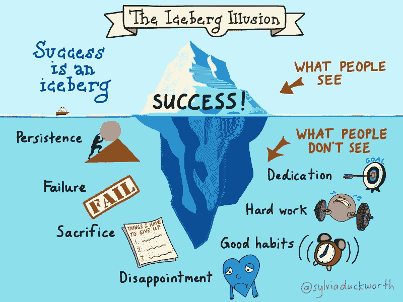

Always remember the stuff below the surface. Some will see it, most will not!

不知不觉中，特里尔给我争取到了一个软件工程师实习生的面试机会。然后我就疯狂的学习(某某人很好的帮我学习，谢谢 Susan！！！)，去面试，被揍了一顿，开车回家舔伤口，等着。

我觉得自己做得很好，但同时又觉得自己做得不好——有时候你永远不会知道！但是当我接到电话说我已经被一名软件工程师实习生录取时，我无法解释我的感受。感觉还是超现实的！这可能发生在任何愿意投入工作的人身上。有人会注意到并帮助你到达那里。

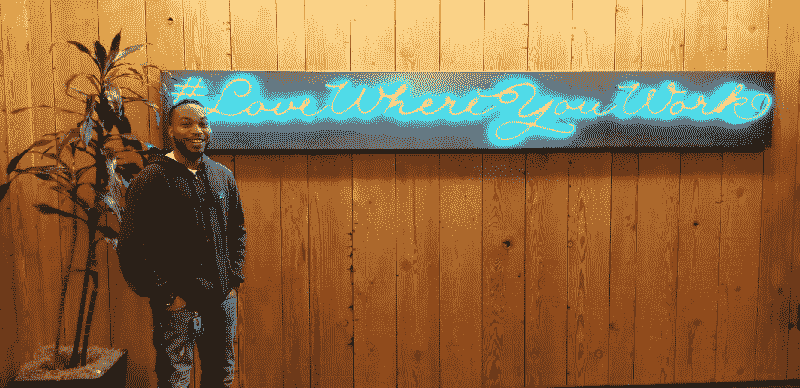

My first week as a tern!

### 结论

在不到两年的时间里，从一个对代码一无所知的人成为 Twitter 的实习工程师，对我来说听起来有些疯狂。见鬼，这听起来还是很疯狂！即使我坐在总部的办公桌前。再加上十二个小时的轮班，一个刚出生的女儿，还有军队的随机性，这听起来几乎不可能。

我在这里告诉你，如果你非常想要它，它就在你的能力范围之内。不管大家怎么想，不管谁会挡你的路。有人告诉我尝试在科技领域从事其他职业，因为成为一名工程师太难了。

有一条路可以让你达到那个目标。可能不是 Twitter，可能不是同一批人带你去那里，但机会总会到来。你只需要为他们做好准备。

如果我从未开始编码呢？如果我开始，但后来放弃了呢？如果我从来没有对任何愿意倾听的人说过我的梦想和目标呢？如果我听别人说这太难了怎么办？很多“如果”会极大地改变我的人生道路。同样的机会是不存在的，如果它真的存在，我也不会为它做好准备。

最后，我想说，把汗水排出去，这样当机会来临时，你已经投入了工作！

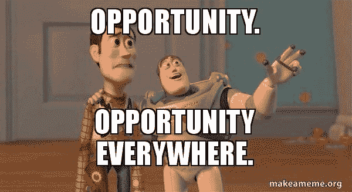

You can be this.

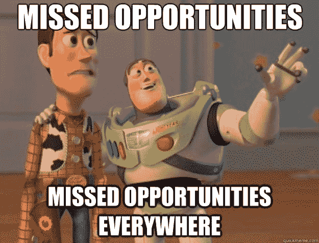

Or this.

### 附言

感谢所有在这个过程中帮助过我的人！感谢每一条推文、电子邮件、短信、视频电话和电话。很多次我本可以停下来，但我还是坚持了下来，因为你们给了我希望。所以，万分感谢你，我一定会通过帮助别人来回报你。

也有像我一样的其他人，等待着向科技展示他们属于那里的机会。我现在能想到两个！所以，如果你对我做的任何事情或者我是怎么做的有任何疑问，请联系我。最后，如果有人看到这篇文章，并有机会获得你想要的实习机会，请让我知道，我有几个人对此非常感兴趣！！感谢您的阅读！

Stay tuned, more good news on the way!