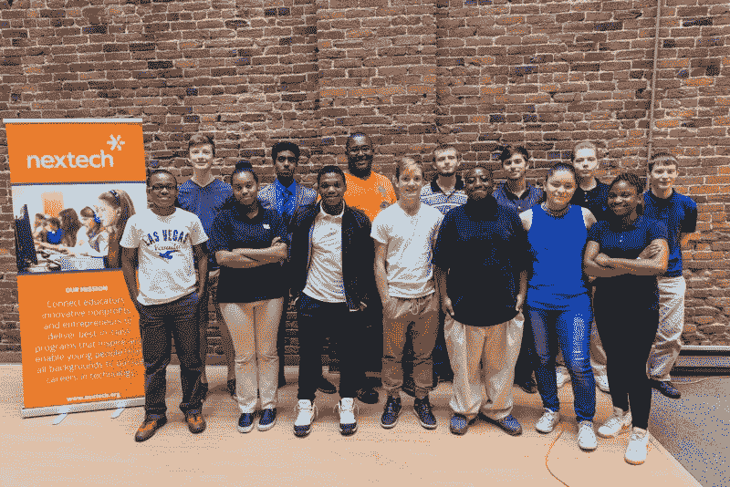
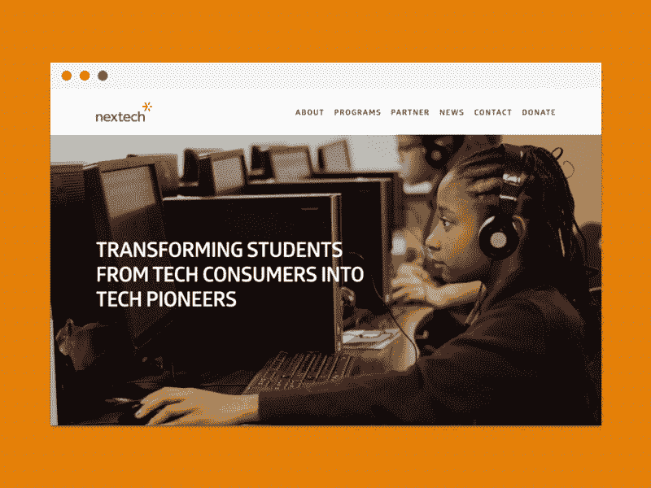

# 我花了整整一个夏天设计一个从未公开的网站

> 原文：<https://www.freecodecamp.org/news/i-spent-an-entire-summer-designing-a-website-that-never-saw-the-light-of-day-56152bbbcf10/>

海登·米尔斯

# 我花了整整一个夏天设计一个从未公开的网站

#### 从一个失败的网页设计项目中学到了什么？

几年前的夏天，我有机会为 Nextech 工作，这是一家非营利组织，帮助印第安纳州的孩子学习编码，并为教师在课堂上教授计算机科学(CS)提供设备。

作为印第安纳州每所高中教授计算机科学的热情支持者，我很高兴成为这个团队的一员。我帮助教授前端/网页设计暑期班，并在需要时为团队做摄像工作。最重要的是，我同意做一个长达一个夏天的网页设计项目。我将负责重新设计 Nextech 网站。

在之前，我已经设计了很多网站，所以我很高兴有机会重新设计他们的网站。很难找到将雇佣你的组织和你真正热爱的项目的完美结合。就是这个。我不仅开始教高中生如何编码，而且还有机会使用我自己的网页设计技能。我将会有一个很棒的经历，我可以在未来几年谈论它，还有一个很棒的作品集来展示我的设计技巧。夏天看起来阳光明媚。

这个夏天开始得很好。我和我的老板以及另外三名同事在一个团队中工作。我们都有分配给我们的任务。这是 Nextech 第一次为高中生提供课程，所以每个人都在一起学习。学生是一个伟大的群体，他们准备学习如何编码。然而，夏天很快变得忙碌起来。

Summer class students!

因为我们是一个小团队，所以我们都必须身兼数职，并能灵活应对出现的任何情况。我同意帮忙做更多的事情，这样可以减少花在网站重新设计上的时间。然而，我仍然能够每天花 2-3 个小时(无论是在办公室还是在家)在新网站上工作。对我来说，一切都很顺利，直到夏天结束。

在我回到学校前的几个星期，我还有几页要完成网站的设计。网站还有一些部分需要编辑，所以我和团队里的文案紧密合作。在我看来，这个网站正在按时完成。直到我和老板见了面。从一开始，我就能感觉到这次会议不会很好。我的老板看起来很担心。

她开始向我解释说，夏天过得很快，变得非常忙碌。我同意了。她感谢我所做的一切以及我为重新设计网站所付出的努力。

然而，她取消了这个项目。

他们不会使用我整个夏天都在建设的新网站。当我坐在那里不知所措的时候，她列举了许多对新网站的担忧。她关注的两个主要问题是，尚未完成的页面仍然需要“大量的工作”，她还关注我离开后网站的持续维护。这两种担忧都是合理的，我同意她的观点——但是我很失望。

当她解释更多为什么不值得换成新设计的原因时，我的思绪游离到我本可以做得不同的地方。我们结束了会议，最初的兴奋和夏末建立新网站的可能性都消失了。

我辜负了她、Nextech 和我自己。

在那之后的几个月里，我在想那个夏天我本可以做些什么不同的事情。在与我的老板和团队中的同事谈得更多之后，我意识到越来越多的事情我可以做得更好。其中大部分与我的设计技能无关。我在最基本的软技能上失败了:沟通。

总的来说，我没有做好足够的工作，让我的老板和团队的其他成员相信我会完成这项工作。这对于你做的任何网页设计项目都是至关重要的。你必须向客户灌输你能做到的信心。我没有那样做。

### 经验教训

以下是我从那个夏天学到的其他一些艰难的教训。

#### 小块设计

我试图一次设计整个网站。不要这样。这样一来，我的时间分布不均匀，也没有重点。这让我从一页跳到另一页，试图一次把它们都设计出来。那是一场噩梦。如果我可以再做一次，我会先设计主页，然后让它为项目的其余部分定下基调。我会先把重点放在这个目标上，然后设计下一页，以此类推。

#### 交流，交流，交流

我骗自己认为我不应该用这个项目“打扰”我的老板。在我的脑海中，她已经给我分配了这个项目，我要弄清楚，然后给她回复。

这是个坏主意。这很快导致她不知道项目在哪里。我和她以及团队的其他成员聊过一些，但是我没有养成每周向她更新进度的习惯。因此，在夏天结束时，她对我建立一个网站的信心减少了。

#### 尽早并经常分享

我没有及时分享新的设计来获得反馈。我在让其他人参与到我的设计过程中时太慢了，因为我害怕不能“把它做到完美”我想如果我以一种粗糙的、未完成的形式展示我的作品，团队会认为我是一个糟糕的设计师。

去他的大揭露。尽早让每个利益相关者参与进来。了解他们对设计的想法。给他们发邮件，告诉他们当天你做了什么。分享截图和草图。是的，厨房里可能有太多厨师，但你也不想一个人做饭。

#### 寻求真实的反馈

我在设计网站的时候征求过反馈，但是我做得不够。我也没有以一种让我的队友和老板容易给我诚实反馈的方式展示我的工作。

这是一个至关重要的错误，导致我的老板放弃了整个设计，因为它与她最初预期的方向不同。如果我从一开始就确保得到诚实的反馈，事情会有所不同。下一次，我会尽力培养一种重视诚实反馈的关系。

#### 永远不要承诺过多或兑现过少

当我有机会从事一个我非常热爱的新项目时，我很难不激动。我想做好工作，尽我所能让团队的其他成员开心。

然而，我现在意识到，在规划一个新的设计项目时，保持冷静和承诺是很重要的。即使你有充分的理由相信自己能完成，最好还是问问自己是否能在他们给你的时间表内完成事情。这样，如果你能在截止日期前完成，你总能给他们惊喜。相反的是打击士气，给自己施加不必要的压力。

#### 不要把自己分散得太开

整个夏天我都很难拒绝。下班后，我同意在车轮上的学校教小学生编程的基础知识，并在 Github 的 T2 免费代码营做设计工作。我还同意周末开车一小时回家，通过我的教堂参加一个小组。

不用说，所有这些课外活动都是很好的事情，但它们很快就变得势不可挡。这导致我白天和 Nextech 在一起时总是很累，效率也不高。

#### 项目总是被搁置

通过多年的自由职业，我有了很多客户的经验，他们因为这样或那样的原因从来没有使用过我的作品。我认为这次的不同之处在于我对这个组织和他们的使命的热情。我想送外卖。

然而，我也需要现实一点。项目总是被搁置。与在大型科技公司工作的其他设计师交谈让我更加意识到这一点。经理会改变主意。公司用你可以倾注心血、汗水和泪水的产品来改变方向。

别往心里去。我给自己施加了很大的压力，要在夏天结束前发布新网站，听到它不会发生的消息很难——但它发生了，你继续前进，并从中学习。

The new Nextech website that never was. RIP buddy.

从这次经历中，我对自己以及如何成为一名更好的设计师了解了很多。当然，没能发表我的作品是令人失望的。是的，不得不告诉我的队友、学生和朋友，我没能在夏天结束前完成一个新的网站设计，这有点丢脸。

但我现在意识到，为了学习，有时你不得不失败。失败是学习和成长的机会。从长远来看，这可能是一种意想不到的幸福，因为它让你更有弹性，教会你一些如果你只是从一个成功跳到另一个成功所学不到的东西。那个夏天我需要失败，我失败了。

真正的成功是从失败中吸取教训，并在情绪上有足够的弹性继续前进。

#### 感谢阅读！

欢迎在下面发表评论，或者在推特上联系我 ✌️

#### 关于失败/进展过快主题的补充阅读

*   [设计与失败](http://www.designandfailure.com/)(网站/视频访谈)
*   丽塔·冈瑟·麦格拉思的《设计失败》
*   [《设计公司的成功与失败》](https://hackernoon.com/the-success-and-failure-of-design-inc-99c07a93c8eb)作者[马克·赫米恩](https://www.freecodecamp.org/news/i-spent-an-entire-summer-designing-a-website-that-never-saw-the-light-of-day-56152bbbcf10/undefined)
*   “想创造一个伟大的产品吗？早失败，快失败，经常失败
*   [《慢慢来，解决问题》](https://m.signalvnoise.com/move-slowly-and-fix-things-e5a560fd928b)作者[乔纳斯·唐尼](https://www.freecodecamp.org/news/i-spent-an-entire-summer-designing-a-website-that-never-saw-the-light-of-day-56152bbbcf10/undefined)