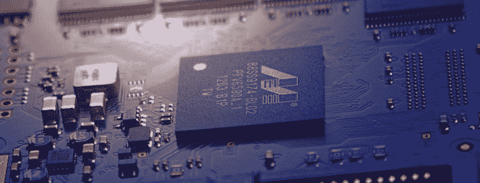
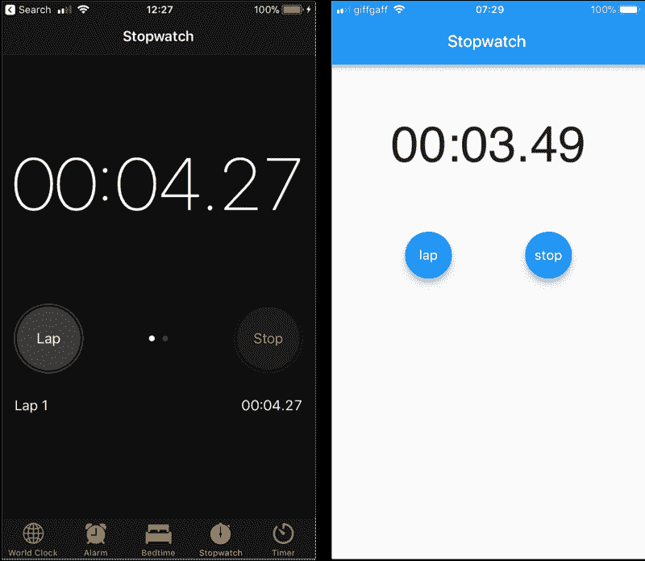
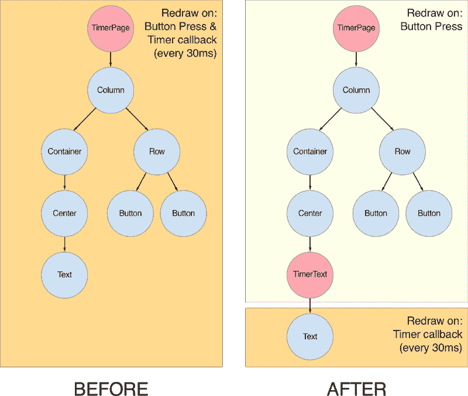
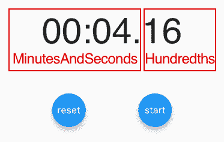
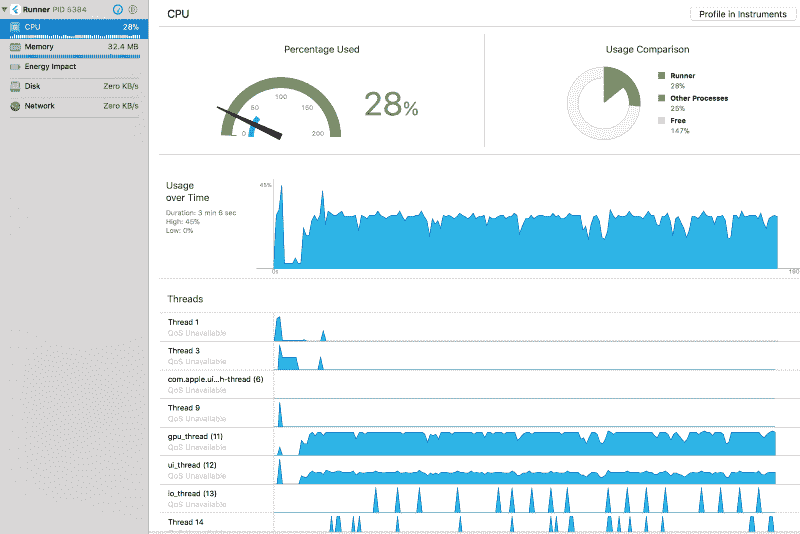
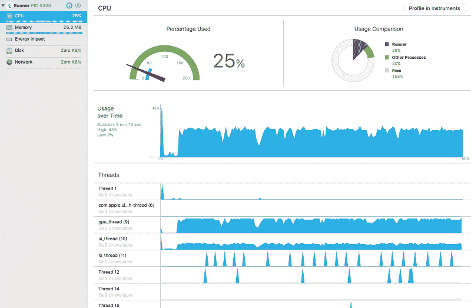
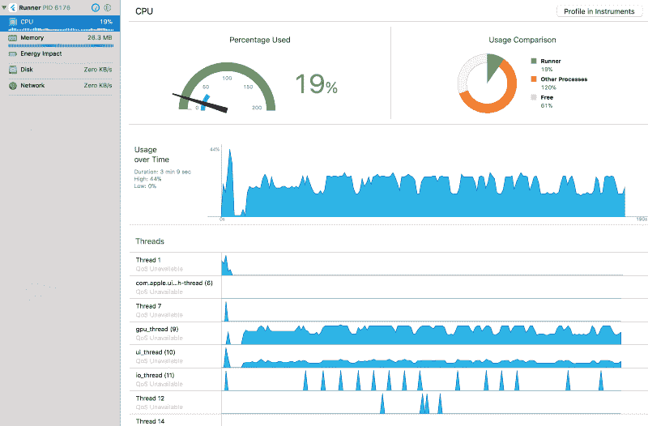

# Flutter 有多快？我建立了一个秒表应用程序来找出答案。

> 原文：<https://www.freecodecamp.org/news/how-fast-is-flutter-i-built-a-stopwatch-app-to-find-out-9956fa0e40bd/>

安德里亚·比佐托

# Flutter 有多快？我建立了一个秒表应用程序来找出答案。

Image Credit: [Petar Petkovski](https://unsplash.com/@petkovski)

这个周末，我花了一些时间来玩谷歌的新的 [Flutter](https://flutter.io/) UI 框架。

理论上，这听起来很棒！

*   [热重装](https://flutter.io/hot-reload/)？是的，请吧。
*   声明式[状态驱动](https://flutter.io/tutorials/interactive/) UI 编程？我全押上了！

根据文件中的[，高性能是可以预期的:](https://flutter.io/faq/#what-kind-of-app-performance-can-i-expect)

> Flutter 旨在帮助开发人员轻松实现恒定的 60fps。

但是 CPU 利用率呢？

**TL；博士**:不如原生。你必须做得正确:

*   频繁的用户界面重绘代价很高
*   如果你经常调用`setState()`，确保它尽可能少的重绘 UI。

我在 Flutter 中构建了一个简单的秒表应用程序，并对它进行了分析，以分析 CPU 和内存的使用情况。

**Left**: iOS stopwatch app. **Right**: My version in Flutter. Beautiful, ain’t it?

### 履行

UI 由两个对象驱动:一个[秒表](https://docs.flutter.io/flutter/dart-core/Stopwatch-class.html)和一个[计时器](https://docs.flutter.io/flutter/dart-async/Timer-class.html)。

*   用户可以通过点击两个按钮来启动、停止和重置秒表。
*   每次启动秒表时，都会创建一个定期计时器，每 30 毫秒触发一次回调，并更新 UI。

主用户界面是这样构建的:

这是如何工作的？

*   两个按钮管理秒表对象的状态。
*   当秒表更新时，`setState()`被调用，触发`build()`方法。
*   作为`build()`方法的一部分，创建了一个新的`TimerText`。

`TimerText`类看起来像这样:

几个注意事项:

*   计时器与`TimerTextState`对象一起创建。每次回调触发时，如果秒表正在运行，则`setState()`被调用**。**
*   这导致调用`build()`方法，该方法用更新的时间绘制一个新的`Text`对象。

### 做正确的事

当我第一次构建这个应用程序时，我正在管理`TimerPage`类中的所有状态和 UI，包括秒表和计时器。

这意味着每次触发计时器回调时，整个 UI 都要重新构建。这是多余且低效的:只有包含运行时间的`Text`对象应该被重画——特别是当定时器每 30 毫秒触发一次的时候。

如果我们考虑未优化和优化的窗口小部件树层次结构，这一点就变得很明显:

创建一个单独的`TimerText`类来封装定时器逻辑减少了 CPU 的消耗。

换句话说:

*   频繁的用户界面重绘代价很高
*   如果你经常调用`setState()`，确保它尽可能少的重绘 UI。

Flutter 文档声明平台针对[快速分配](https://flutter.io/faq/#why-did-flutter-choose-to-use-dart)进行了优化:

> Flutter 框架使用函数式的流程，这种流程严重依赖于底层内存分配器有效地处理小的、短期的分配

也许重建一个小部件树并不能算作“小的、短暂的分配”。实际上，我的代码优化降低了 CPU 和内存的使用率(见下文)。

#### 更新日期 2018 年 3 月 19 日

自从发表这篇文章以来，一些谷歌工程师注意到了这一点，并友好地提供了一些进一步的优化。

更新后的代码通过将`TimerText`分成两个`MinutesAndSeconds`和`Hundredths`小部件，进一步减少了 UI 重绘:

Further UI optimisations (credit: Google)

这些将自己注册为计时器回调的侦听器，并且仅在它们的状态改变时重绘。这进一步优化了性能，因为现在只有`Hundredths`小部件每 30 毫秒渲染一次。

### 基准测试结果

我在发布模式(`flutter run --release`)下运行应用程序:

*   设备:**运行 **iOS 11.2** 的 iPhone 6**
*   颤振版本:[0 . 1 . 5](https://github.com/flutter/flutter/releases/tag/v0.1.5)(2018 . 2 . 22)。
*   Xcode 9.2

我在 Xcode 中监控了三分钟的 CPU 和内存使用情况，并测量了三种不同模式的性能。

#### 非优化代码

*   CPU 使用率:28%
*   内存使用:32 MB(从应用程序启动后的基线 17 MB 开始)

#### 优化阶段 1(单独的计时器文本小部件)

*   CPU 使用率:25%
*   内存使用:25 MB(从应用程序启动后的基线 17 MB 开始)

#### 优化通道 2(单独的分钟、秒钟、百分之一秒)

*   CPU 使用率:15%到 25%
*   内存使用:26 MB(从应用程序启动后的基线 17 MB 开始)

在最后一个测试中，CPU 使用率图表密切跟踪 GPU 线程，而 UI 线程保持相当稳定。

**注意**:在 [**慢速模式**](https://flutter.io/faq/#my-app-has-a-slow-mode-bannerribbon-in-the-upper-right-why-am-i-seeing-that) 下运行相同的基准测试，CPU 使用率超过 50%，**内存使用率随着时间的推移稳步增加**。

这可能意味着在开发模式下没有释放内存。

关键要点:**确保在发布模式下对您的应用进行描述**。

请注意，当 CPU 使用率超过 20%时，Xcode 会报告**非常高的**能量影响。

### 深入挖掘

结果让我开始思考。每秒触发约 30 次并重新呈现文本标签的计时器不应使用高达 25%的双核 1.4GHz CPU。

Flutter 应用中的窗口小部件树是用**声明性范例**构建的，而不是 iOS / Android 中使用的**命令性**编程模型。

但是命令式模型更有性能吗？

为了找到答案，我在 iOS 上开发了同样的秒表应用。

这是设置计时器并每 30 毫秒更新一次文本标签的 Swift 代码:

为了完整起见，下面是我在 Dart(优化过程 1)中使用的时间格式化代码:

最后的结果？

**飘起。** CPU: 25%，内存:22 MB

**iOS。** CPU: 7%，内存:8 MB

Flutter 实现的 CPU 重量增加了 3 倍以上，并且使用了 3 倍的内存。

当计时器不运行时，CPU 使用率回到 1%。这确认了所有 CPU 工作都用于处理计时器回调和重绘 UI。

这并不完全令人惊讶。

*   在 Flutter 应用程序中，我每次都构建并呈现一个新的`Text`小部件。
*   在 iOS 上，我只是更新一个`UILabel`的文字。

“哎！”我听到你说。“但是时间格式代码不一样！你怎么知道 CPU 使用率的差异不是因为这个？”

那么，让我们修改这两个例子，不做任何格式化:

Swift:

省道:

更新的结果:

**飘起。** CPU: 15%，内存:22 MB

**iOS。** CPU: 8%，内存:8 MB

Flutter 实现仍然是 CPU 密集型的两倍。此外，它似乎在多线程上做了相当多的事情(GPU、I/O 工作)。在 iOS 上，只有一个线程是活动的。

### 结论

我在一个非常具体的用例上比较了 Flutter/Dart 与 iOS/Swift 的性能。

数字不会说谎。说到频繁的 UI 更新，**鱼和熊掌不可兼得**。？

Flutter 允许开发者使用相同的代码库为 iOS 和 Android 创建应用程序。热重装等功能进一步提高了工作效率。Flutter 仍处于早期阶段。我希望 Google 和社区能够改进运行时配置文件，以便最终用户也能受益。

至于你的应用程序，考虑微调你的代码，以尽量减少用户界面重绘。努力是非常值得的。

我在[这个 GitHub repo](https://github.com/bizz84/stopwatch-flutter) 上加了这个项目的所有代码，你可以自己玩。

不客气！？

这个样本项目是我第一次尝试颤振。如果你知道如何编写更高性能的代码，我很想听听你的意见。

#### 更多文章和视频教程，请查看使用 Flutter 的[编码。](https://codingwithflutter.com/)

**关于我:**我是一名 iOS & Flutter 开发者，在合同工作、开源、副业和博客之间周旋。

我是推特上的 [@biz84](https://twitter.com/biz84) 。你也可以看到我的 [GitHub](https://github.com/bizz84) 页面。反馈，推文，搞笑 gif，都欢迎！我的最爱？很多吗？？？。哦，还有香蕉面包。