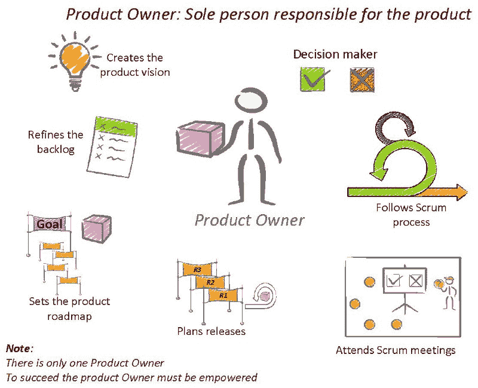
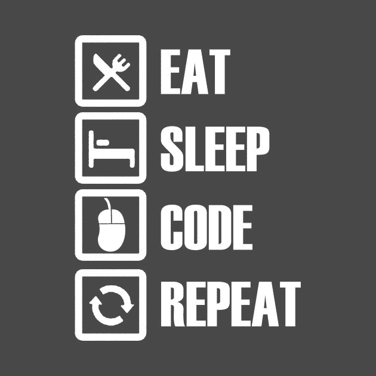

# 为什么开发人员应该像产品所有者一样思考

> 原文：<https://www.freecodecamp.org/news/why-should-a-developer-think-like-a-product-owner-c3f813e4ea93/>

作者:萨加尔·萨瓦尔·夏尔马

# 为什么开发人员应该像产品负责人一样思考

Image [source](http://labs.sogeti.com/what-makes-you-a-good-product-owner/).

> 经过一个月漫长而可怕的编码、审查和测试，您刚刚将期待已久的特性部署到产品中。昨晚你熬了一个通宵，现在你只想离开，在你舒适温暖的床上安静地睡觉。

在快速发展的创业文化中，这对于软件开发人员来说很正常。事情发展得很快，代码运行得更快，而需求——我们只能说:**光子先生，你有一个竞争对手**。

### 起初

在过去的三年里，我一直在与一家医疗保健初创公司合作，我目睹了它在这段时间里的成长。今天，我将分享我的一些心得——但我不会用我们用来保持车轮运转的过多技术来烦你。

相反，今天我将分享我多年来学到的一些见解，与业内一些最具激励性和启发性的商业领袖并肩工作。

在我作为开发人员的早期，我所做的就是:

**从产品经理那里拿到**需求，**开发**特性/系统，**测试** it，**部署** it，**回家**，**睡觉**重申。

似乎是合法的。这是开发人员的工作，对吗？

Image [source](https://www.teepublic.com/t-shirt/244143-eat-sleep-code-repeat).

在我两年的开发生涯中，我过着这样的生活。作为一名软件开发人员，我一直在成长，但经营企业不仅仅是软件开发。事实上，它只是战车上的一个轮子，还有其他轮子推动着战车前进，而我对此一无所知。

### 改变我的心态

我建造东西，部署，然后继续前进。我想这是我犯的最大的错误。虽然生意照常进行，但有一天我坐下来思考:

“为什么我不关心我这几个月来构建的产品？”

*“推进业务指标难道不是我的责任吗？”*

“我已经从头开始构建了这个系统，但是这个系统真的对最终用户有帮助吗？”

你可以通过思考*“这不在我的工作范围内”*并继续前进来安全地安慰自己。但最后一个问题实际上把我难住了:我是在为社会做什么吗，我的产品实际上是在帮助我们的用户过上更好的生活吗？

我面临着进退两难的局面。我是应该继续做我擅长的事情(开发)还是应该开始关注除了日常工作之外的其他领域？此时，我想起了童年时读过的传奇诗人罗伯特·弗罗斯特的一首诗:

The road not taken

> 树林里分出两条路，

> 我选择了一条人迹罕至的路，

> 这使得一切都不同了。

接下来几个月我所做的事情完全改变了我对工作的看法。我从以前很少交往的人身上学到了很多东西。我已经开始打破我困住自己的茧。要学的东西很多，我才刚刚开始接触皮毛。

### 这是我现在做的

#### 第一步

我没有直接从我的产品经理那里接受需求，而是和他一起经历了暴风雨。我开始问一些尖锐的问题:**为什么？** **有何不可？它将如何为最终用户服务？它将如何影响业务指标？你的假设和期望是什么？**

**效果**:在产品开发的规划阶段有了更多的清晰性。

#### 第二步

如果可能的话，我会请人**和我们的最终用户**谈谈，看看他们是否喜欢系统中的这种变化。我们**得到**他们**的反馈**。如果无法接触到最终用户，我们会随机询问他们是否愿意拥有 x、y 或 z 特性。在建立系统之前获得反馈是最重要的部分。

然后我**和产品经理**再次头脑风暴，**根据收到的**反馈**细化**需求。

**效果**:我们现在更接近于获得完整的画面，有了更清晰的视角。

#### 第三步

**开发**系统/功能，**测试**它，然后**将它部署**给最终用户。

**追踪**刚刚推出的专题之旅，**隔天捣鼓数字**。**将**与之前的业务指标进行比较。

**效果**:我们看到**期望**与**现实**的**偏差**，这有助于我们下次更好地计划。每一次失败都是一次新的学习。

#### 第四步

**跟踪****用户每天发布**。每天通过**用户票**两次。请听他们与运营人员的对话。一个愤怒的客户通常会给你比你的产品经理、工程经理、分析师和产品负责人加起来还多的产品见解。

倾听他们，重申解决方案，分类，解决问题，并道歉。我听过用户骂人，相信我——他们骂人真的很难听。

**效果**:我们知道哪些是我们系统中最棘手的问题，哪些是我们的用户**不想要的**。

并且在一天结束的时候:**回家**，**睡觉**，**重申。**

### 我学到了什么

这样做，让我对自己的产品有了很多感悟。

我的**产品经理**教会了我如何找到“我的最终用户真正需要什么”的答案

**工程团队**教会了我如何跟踪用户的旅程，以及如何每天处理数据。

运营团队一直是我的终端用户的代言人。由于我在系统中植入了错误，他们已经把我痛打了一顿。

产品所有者教会了我如何进行长期思考，以及如果你对产品有一个良好的思考过程，你将如何取得成功。

是什么让我做了这一切？有一个问题:

> 我为什么要做这些？

这是我的全部观点，可能与你的不同。我完全尊重这一点。但是，每当你有空的时候，就问自己上面的问题。如果金钱不是你得到的唯一激励因素，再想想，试着重复一遍。

我感谢在我的旅程中帮助过我的许多人，包括我的工程团队、产品团队、运营团队和许多其他人。