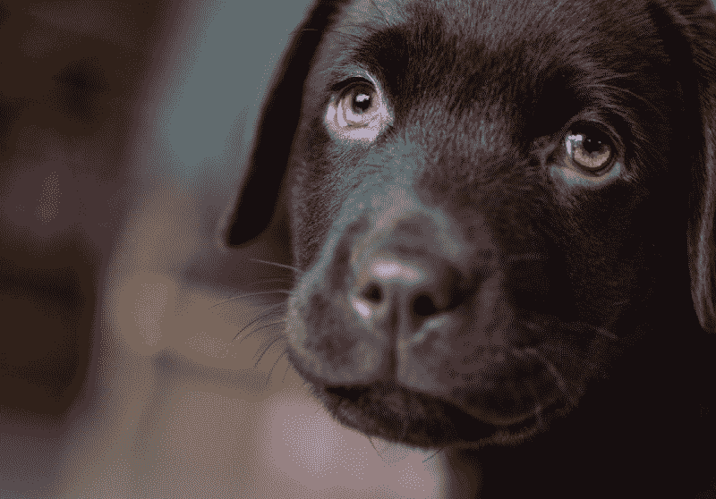
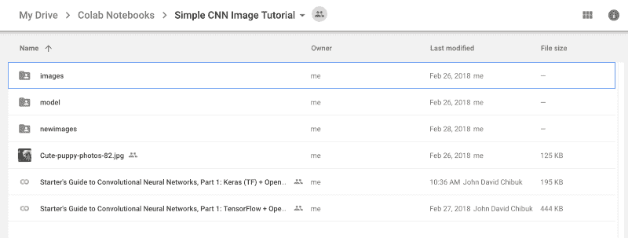
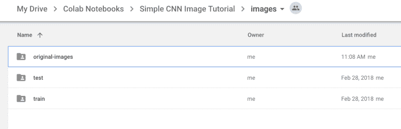
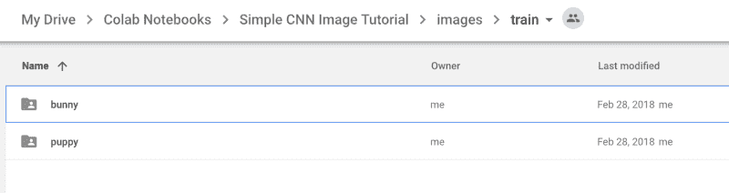
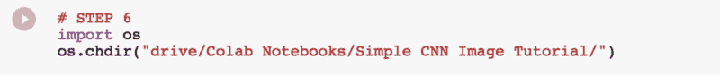
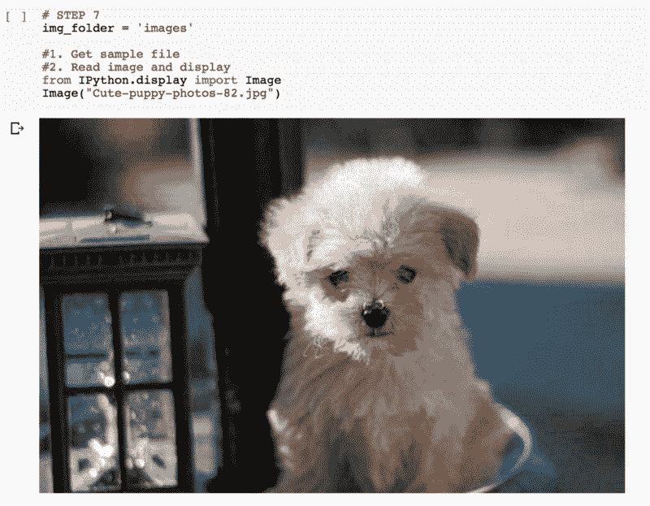
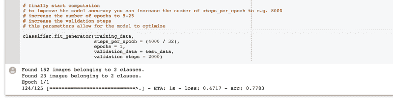
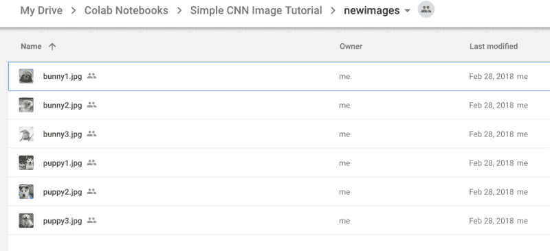
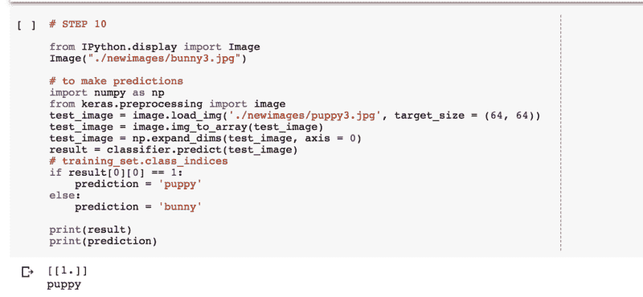

# 通过这个简单的教程，学习在网上建立一个卷积神经网络

> 原文：<https://www.freecodecamp.org/news/learn-to-build-a-convolutional-neural-network-on-the-web-with-this-easy-tutorial-2d617ffeaef3/>

约翰·大卫·奇布克

# 通过这个简单的教程，学习在网上建立一个卷积神经网络



这篇文章解释了如何建立你的第一个卷积神经网络(CNN)来检测两种图像类型:例如，兔子或小狗。

多亏了谷歌的新网络工具，开始构建和原型化你自己的神经网络变得非常容易。

这里有一个[链接](https://drive.google.com/file/d/1a7V9Hc7ks0xxDbfCZl2_96DUGlCLuh00/view?usp=sharing)到基于网络的应用程序。它给你看代码，让你运行“逐段”( **shift+enter** ) jupyter 笔记本代码，让你训练一个模型，然后测试它。在这里找到 [Github 公共回购](https://github.com/chibuk/simple-cnn-keras-colaboratory/tree/master)。

**第一步是在你自己的 Google drive 上建立 Colab notebook + image data 文件夹，就这么办吧！**

在您的 Google drive 中，您需要设置包含图像的文件夹，以存储要训练的数据。你可以[直接复制这个文件夹](https://drive.google.com/drive/folders/1rcihLGtsL8WbaYhBAShz8ntqr8G9BvPP?usp=sharing)放入你自己的 Google drive，然后解压放入你的 base Google drive 文件夹中一个名为“Colab Notebooks”的文件夹。



Screenshot from Personal Google Drive

在 images 文件夹中，有两个子文件夹。

> 火车

> 试验



Screenshot from Personal Google Drive

然后，这些文件夹中的每一个都包含代表您想要识别的图像类型的文件夹。

> 兔子

> 小狗

每个火车+测试文件夹里应该有一个兔子和小狗文件夹。



Screenshot from Personal Google Drive

用图片填满这些文件夹。大约 80%放在 train 文件夹中，20%放在 test 文件夹中。

教程中棘手的部分是如何在 Google drive 中正确链接文件夹。您需要通过 API 键连接几次，才能与您的个人 Google drive 文件夹建立正确的连接。

请注意:您需要保持与教程中定义的相同的文件夹结构，以使它正常运行。

在您的基本 Google Drive 文件夹中，您应该有一个名为 Colab Notebooks 的文件夹。

里面应该有一个名为:简单 CNN 图片教程的目录

这应该包含上面的图像和 Colab 笔记本的内容。

### 逐步地

**步骤 1** 安装所需的库，用 Google 的 tensorflow + Keras 构建和训练一个模型。Keras 是一个简化层，使 Tensorflow 之上的模型训练更容易。

**步骤 2–5**将您的 Google drive 链接到项目，从单元格中复制密钥，并在生成时将其粘贴到笔记本中。这可能需要几次尝试，但没关系！

**步骤 6** 您可以更改结构，但是您需要更新笔记本中的路径，以匹配您放置基本的简单 CNN 图像教程文件夹的位置。



Screenshot from CoLaboratory Notebook (Step 6)

**第 7 步**确认您已经将图片加载到 Google drive 中。



Screenshot from CoLaboratory Notebook (Step 7)

要运行该过程，只需单击第一个段落区域，然后单击键盘上的“shift + enter”。这将运行每个单元格中的代码，并让您逐步完成整个过程。

**第 9 步**训练你的模型。如果一切都被正确引用，它应该显示如下输出- >



Screenshot from CoLaboratory Notebook (Step 9)

完成后，将对您的模型进行训练，您可以测试放在新图像文件夹中的图像:



Screenshot from CoLaboratory Notebook (add new images here or use these to try out your trained network!)

只需在代码行中更改图像名称文本:

```
test_image = image.load_img(‘./newimages/puppy3.jpg’, target_size = (64, 64))
```

例如，你可以改变:

```
‘./newimages/puppy3.jpg’ to ‘./newimages/bunny1.jpg’
```



Screenshot from CoLaboratory Notebook (Step 10)

最后运行段落，看看你的模型把新图像分类成什么样！

### 恭喜你刚刚训练并测试了你的第一个卷积神经网络——太棒了！


Credit: [http://media.riffsy.com/images/7bafc4dc0036792b32a5e5aa6c5ac9ff/tenor.gif](http://media.riffsy.com/images/7bafc4dc0036792b32a5e5aa6c5ac9ff/tenor.gif)