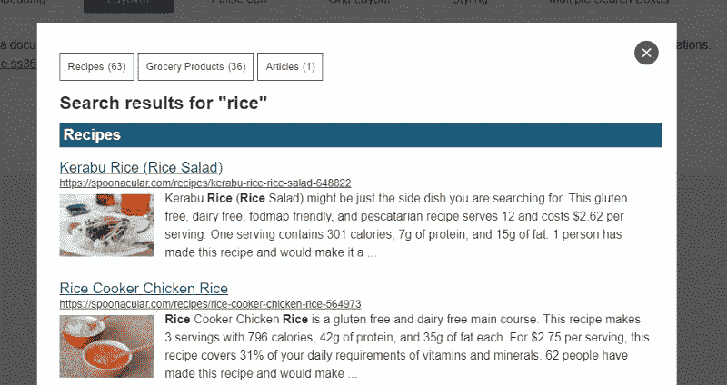
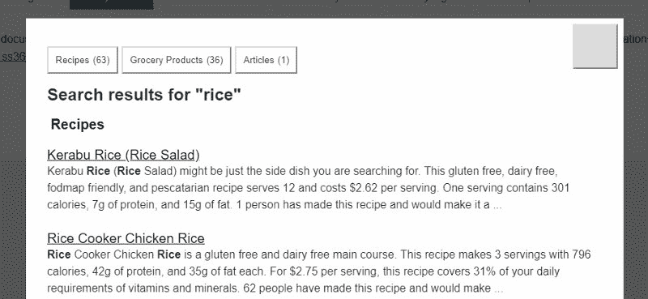
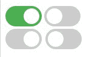
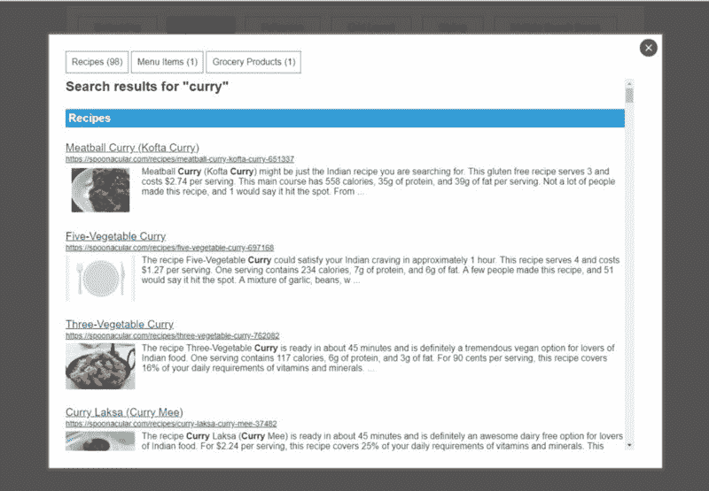
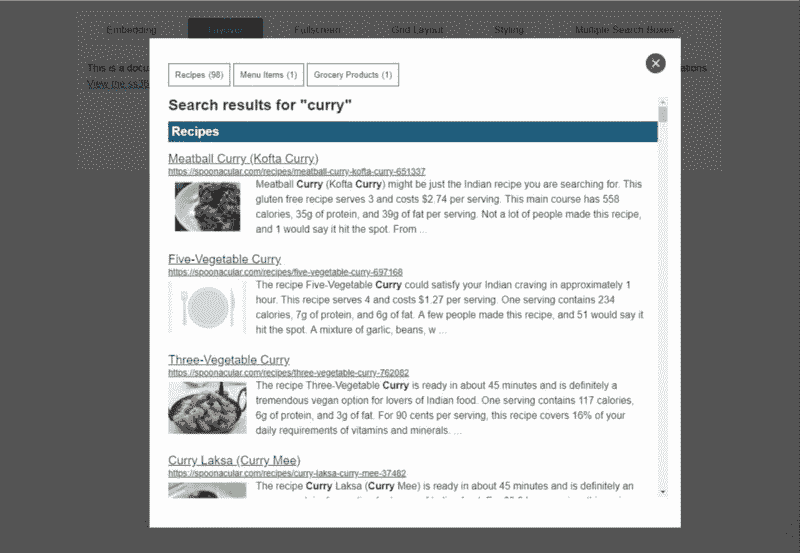
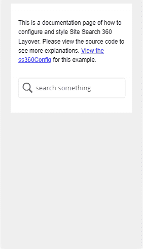

# 如何让你的网站更容易访问

> 原文：<https://www.freecodecamp.org/news/how-you-can-easily-make-your-website-more-accessible-88dc7db90bd2/>

Jaroslav 的羊

# 如何让你的网站更容易访问


Photo by [Jamie Street](https://unsplash.com/photos/_94HLr_QXo8?utm_source=unsplash&utm_medium=referral&utm_content=creditCopyText) on [Unsplash](https://unsplash.com/?utm_source=unsplash&utm_medium=referral&utm_content=creditCopyText)

作为一名设计师、开发者，甚至是产品经理，你有成千上万的责任。每个项目都需要大量的关注——桌面布局、移动布局、iPhone X 布局(感谢苹果)、IE 支持、Safari 支持……

#### 那么，为什么要关心可访问性呢？

以下是一些确凿的事实:

*   大约 15%的世界人口患有某种形式的残疾，其中 2 %- 4%的人在功能上存在严重困难。([世界卫生组织](http://www.who.int/disabilities/world_report/2011/report/en/))
*   从某种意义上说，每个人都有暂时残疾的时候，不管你是割破了手指，还是在阳光明媚的日子里试图在低对比度的屏幕上阅读。
*   在某些情况下，法律可能要求可访问性。

最重要的是:

> 当用鼠标吃饭时，每个人都是键盘使用者。

> ——阿德里安·罗塞利

通过提高网站的可访问性，你不仅仅是在支持残疾人。你只是让它对每个人都更有用。

### 不要多此一举

我们在 [Site Search 360](https://sitesearch360.com/) 开发了一个插件，允许我们的客户轻松地将我们的搜索解决方案集成到现有的网站中。

随着我们的发展壮大，很明显我们需要进行一次可访问性审计。是的，我们应该从项目一开始就考虑可访问性，但永远不会太晚。

你不能简单地“打开”可访问性。

但是不用担心。即使你在目前的项目中从未考虑过可访问性，也不会花很长时间来做一些改进。我不能告诉你我们花了多少时间让我们的插件更容易访问，但它不超过几个工作日(和大约 30 次提交)。

我现在将说明整个过程(基于我们的 JavaScript 插件，而不是一个网站)，所以你不必从头开始。但是首先:

### 什么是可访问性？

在你开始工作之前，你必须理解可访问性实际上是什么。我不会用冗长的定义来烦你。这个简短的句子总结了我认为的可访问性:

易访问性是一种让每个人都能使用你的产品的艺术。

大家都是谁？你应该考虑哪种残疾？

*   失明和色盲
*   认知障碍
*   身体残疾
*   听力障碍(是的，你的视频需要字幕)
*   年龄

### 一些简单的步骤

现在你知道你在为谁改进你的网站，我们可以开始看看无障碍网站的基本概念。

#### 编写语义标记

这可能是最重要的一步。HTML5 已经存在几年了，所以没有理由(也没有借口)不利用它。章节、文章、标题、导航、横幅和许多其他的——所有这些标签都是可以使用的。

您可能见过这样的标记(我省略了类和 id，因为它们没有任何语义目的):

```
<div>  <div>Recipes<span>98</span></div>  <div>Menu Items<span>1</span></div>  <div>Grocery Products<span>1</span></div></div>
```

信不信由你，这是我们的内容组导航(你可以点击一个内容组，搜索结果页面会自动滚动到相关的搜索结果)。你不会猜到的，是吗？

这个标记没有什么问题。依赖辅助技术的人怎么知道这是导航？他们不能。是用 *div* 表示的活动元素？是的，它是。

现在看看下面这段标记:

```
<nav role=”navigation”>  <ul role=”menubar”>    <li>      <button role=”menuitem”>Recipes<span>98</span></button>    </li>    <li>      <button role=”menuitem”>Menu Items<span>1</span></button>    </li>    <li>      <button role=”menuitem”>Grocery Products        <span>1</span>      </button>    </li>  </ul></nav>
```

好多了，不是吗？让我们回顾一下语义标记最重要的概念:

*   使用语义元素
*   总是用 *< main role="mai* n" >来标记主要内容
*   添加*角色*属性以支持旧浏览器
*   在适当的地方使用区段代替 div
*   *Span* 不是*按钮*——不要改变元素的含义(除非绝对必要)
*   使用*按钮*进行页面内交互
*   标题是每个网页最重要的部分之一。始终只有一个标题，不要跳过标题级别

我不会列出我们所做的每一个改变(有很多)，但是你可以在评论中提问。

**怎么做:**检查你当前的标记，检查内容和标题结构，确保交互元素由*按钮*或元素表示，并使用 HTML5 语义标签。

#### 使用键盘实现所有功能

这也是很重要的一点。每一个交互都应该可以通过键盘来实现。

让我们考虑一个与前一个类似的例子。我们确实有一个“显示更多结果”的按钮，但它实际上并不是一个按钮。你能猜到吗？是的，它是一个有风格的*分区*。

我们能支持这样一个元素的键盘控制吗？是的，我们可以，通过使其可聚焦并处理 *click* 和 *keyup* 事件，同时测试 *enter* 或 *space* 键是否被按下。

尽管如此，这仍然比简单地将标记从*<d*iv&g*t；to<b*button>—在这种情况下，您只需 *e to* 绑定一个 click 事件，而不必强制 DOM 元素成为可聚焦的(另外，您不必编写那么多样式)。

主要要点:

*   所有功能都应该可以通过键盘访问
*   不要从聚焦的元素中移除轮廓(如果你不喜欢这些轮廓，[你总是可以对它们进行样式化](https://css-tricks.com/almanac/properties/o/outline/))
*   页面内的交互应该用一个*按钮*来表示
*   离页交互(链接)要用锚( *<* )来表示；一个>
*   *按钮意味着由点击、回车和空格触发，锚点由点击和回车触发

**怎么做:**确保所有交互元素都可以通过键盘访问(和控制)，突出显示聚焦元素，并且 tab 键顺序实际上是有意义的。

#### 支持屏幕阅读器

请看下图:



Site Search 360 layer as seen by sighted people.

右上角的按钮是做什么的应该很容易看出来。它会关闭图层。下图模拟了盲人在使用屏幕阅读器软件时能够“看到”的内容:



Site Search 360 layer as seen by blind people.

您已经看到了完整的图像，所以您知道同一个按钮要执行什么操作。你能通过看第二张图片来判断吗？您不会看到——十字是使用背景图像 CSS 属性呈现的，按钮根本没有内部内容。

这就是 *aria-** 属性的用途。通过用一个简单的 *aria-label* 属性来增强按钮的标记，您不必努力使按钮的内部文本隐藏在表示层中。

```
<!-- Wrong markup --><button></button>
```

```
<!-- Accessible markup --><button aria-label=”Close layer”></button>
```

```
<!-- Alternative accessible markup --><button style="text-indent:100%;overflow:hidden;padding:0;white-space:nowrap;">Close layer</button>
```

你注意到我也从屏幕阅读器视图中删除了图像吗？你也可以用同样的技术给它们贴上标签(其中 *aria-labeledby* 可能更合适)。我删除了这些图像，因为在我们的例子中，它们没有任何语义目的，并且被标记为 *role="presentation"* 。即使它们确实有语义目的，我们通常也不知道。这些图片大部分是插图，给它们贴标签是多余的——标题已经有了相同的含义。

你应该知道的属性:

*   *角色* —用于标记元素的用途
*   *aria-hidden* —告诉辅助技术忽略某个元素
*   *aria-label，aria-labeledby* —标记元素
*   aria-described by-用它来描述非标准的用户界面控件
*   aria-owns-标记两个元素之间的关系

做什么:这一步可能是最难正确实现和正确测试的。确保所有图像都有一个 *alt* 属性，所有部分和交互元素都有标签，并用屏幕阅读器软件测试。

**如何测试:**作为一个视力正常的人使用屏幕阅读器可能会感觉不自然，所以首先花点时间熟悉一下你选择的软件(你可能想测试所有最常见的软件 Mac 上的[画外音](https://www.apple.com/accessibility/mac/vision/)、Windows 上的 [NVDA](https://webaim.org/articles/nvda/) 和 [Jaws](https://webaim.org/articles/jaws/) 以及 Android 上的 [TalkBack](https://play.google.com/store/apps/details?id=com.google.android.marvin.talkback&hl=cs) )。之后，尝试只使用屏幕阅读器软件浏览你的网站(关闭你的显示器)。即使是一个简短的测试也能帮助你了解你的网站表现如何，并揭示出最重要的问题。

额外收获:这里有一个简单的例子来说明我们是如何增强自我暗示的。突出显示的部分(和两个 *<温泉* ns >)是作为我们可访问性改进的一部分添加的。

```
<!-- Search Field --><input type="text" placeholder="search something"   autocomplete="off"   role="combobox"   aria-describedby="unibox-controls-description"   aria-owns="unibox-suggest-box"   aria-expanded="true"  aria-activedescendant="unibox-active">
```

```
<!-- Search Suggestions --><div id="unibox-suggest-box" role="listbox">;  <section aria-labelledby="unibox-suggest-cluster-heading-recipes">    <h3 id="unibox-suggest-cluster-heading-recipes"&gt;Recipes</h3>    <div aria-selected="false" role="option">            </div>      <;a href=[..]>Chicken Curry</a>    </div&gt;    <div aria-selected="true" role="option" id="unibox-active">            <a href=[..]>Curried Chicken</a>    </div>  </section>  </div>
```

```
<!-- Announce search suggestions have been changed --><span aria-live="polite" aria-atomic="true" role="status" class="ss360-sr-only">2 Search Suggestions Shown</span>
```

```
<!-- Suggest Box User Interface Controls --><span id="unibox-controls-description" class="ss360-sr-only">Use up and down arrows to select available result. Press enter to go to the selected search result.</span>
```

#### 简化演示

可访问性、UI 设计、UX——所有这些都是同一个三面硬币的两面。

背景和前景之间的低对比度会使你的文本难以阅读。

狂野的动画让你的网站对宿醉的人来说很难(你不在乎？相反，想想那些患有多动症的人——他们可能会发现很难集中注意力)。您是否知道有一个*偏好减速*媒体查询(尽管它尚未得到广泛支持)？如果设置了此媒体查询，您可以简单地关闭所有动画。我们是这样做的:

```
if(window.matchMedia &&   window.matchMedia("(prefers-reduced-motion: reduce)").matches){    animationSpeed = 0;}
```

> 你不会认为网站应该是某种疯狂的频闪灯秀吧？

仅通过颜色传达信息会使色盲者无法获得信息。



Classic example — toggle buttons do work without color.

这里有一个例子，说明我们如何改变我们的 layover 视图的默认布局——更短的文本块和更高的对比度。



The old default look of our layover.



The new default look for our layover.

我们的一个痛点一直是移动自我暗示。这可能不是一个可访问性问题，但我们最终增加了一个切换到全屏自动建议的选项。下面是一个对比:


Default autosuggestions.



New, mobile autosuggestions.

**做什么:**

*   检查文本块的宽度不超过 80 个字符，并使用比*字体大小*大 1.5 倍的*行高*(这也应该足够大——使用 16 像素或更大)
*   允许缩放(至少高达 200%)
*   [检查您的对比度](https://webaim.org/resources/contrastchecker/)
*   确保你的触摸目标足够大(44 x 44 像素是经验法则)
*   在用颜色传达信息的地方，要确保还有另外一种方法可以获得同样的信息
*   仔细检查你的动画，考虑你是否真的需要它们。还提供了关闭它们的机制。
*   忘记验证码…

#### 评估、发展和整合您的工作流程

这个在这里只是因为“5 步”听起来比“4 步”更好无论如何，在你的日常(或至少每周)工作流程中，始终关注可访问性。

你不需要花费大量的预算来以正确的方式做这件事。所以当计划一个新特性时，想想我在“什么是可访问性？”本文的一部分。

### 测试

有很多工具可以帮助你评估网站的可访问性。我会推荐谷歌 Chrome 的 [Tenon.io](https://tenon.io/) 、 [FAE](https://fae.disability.illinois.edu/anonymous/) 和 Lighthouse(打开开发工具，进入审计，点击‘执行审计……’)。

然而，有些事情很难用自动化工具来评估。试着只用键盘操作你的网站。然后尝试使用屏幕阅读器软件操作它。

### 其他来源

关于可访问性的内容远远超出了这篇文章的范围。因此，这里有一些资源可以帮助你更深入地理解这个主题:

*   [**如何迎接 WCAG 2.0**](https://www.w3.org/WAI/WCAG20/quickref/)
*   [围教程](https://www.w3.org/WAI/tutorials/)
*   [包容性设计清单](https://github.com/Heydon/inclusive-design-checklist)
*   [Freecodecamp 的一篇好文章](https://medium.freecodecamp.org/next-level-accessibility-freecodecamp-guide-7cbd6473eabd)

### TL；速度三角形定位法(dead reckoning)

使用语义标记，支持屏幕阅读器，使所有的交互元素都可以通过键盘访问，简化你的演示，至少阅读“一些简单的步骤”中的所有要点。

好了，就这样。如果你对我们所做的确切改变感兴趣，请在评论中提问。如果你正在寻找一个关注可访问性的网站搜索解决方案(或者仅仅是谷歌网站搜索的替代方案) [Site Search 360 就是为你准备的](https://sitesearch360.com/)。

别忘了鼓掌。