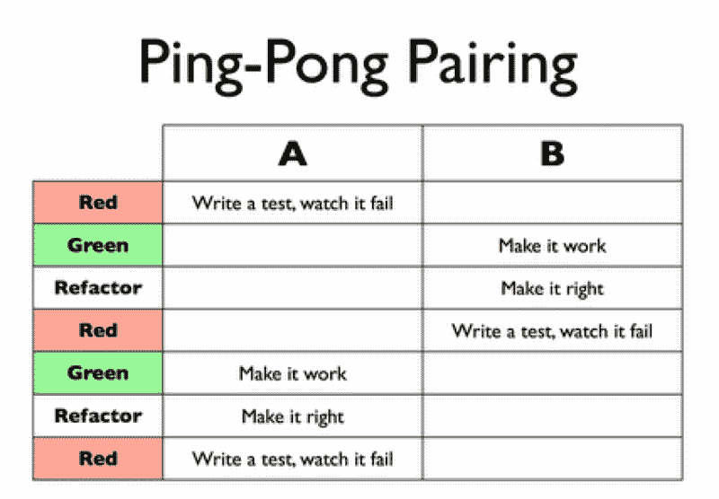

# 想做开发者？你应该结对编程。

> 原文：<https://www.freecodecamp.org/news/want-to-be-a-developer-you-should-probably-be-pair-programming-2c6ec12c4866/>

马库斯·加德纳

# 想做开发者？你应该结对编程。

当人们想到软件开发时，他们可以理解地想到一个与世隔绝的独狼程序员，解决复杂的问题。

如果我告诉你这几乎不是软件开发在现实世界中真正的工作方式…而结对编程可能是你更快地学习编码，为你自己进入软件开发的现实世界做准备，也许在这个过程中有更多的乐趣的答案，会怎么样？

A lone wolf software developer in action (Gifs courtesy of Giphy)

### 听起来不错。那么软件开发人员到底是怎么工作的呢？

更准确的说法可能是一个由软件开发人员组成的团队，他们有时将自己与世界隔绝，有时将自己与世界联系在一起，但仍能解决复杂的问题(但却是 T2 团队和 T3 团队)。

在某些情况下，比如完成一个兼职项目或自由职业者的工作，孤独的场景可能是真实的。然而，大多数情况下，任何有意义规模的产品的软件开发都是由一个成熟的软件团队完成的，很可能混合了不同的开发力量(见下图，来自 DSDM 敏捷框架)。这个软件团队将被插入到一个更广泛的商业团队中(我们不能忘记我们的最终用户:)

DSDM® Agile Project Framework

这对正在学习这门手艺的美国软件开发人员来说意味着什么？这意味着，虽然学习编码通常从一个孤独的狼游戏开始，但我们希望它(尽快)成长为在大多数组织中流行的软件开发团队运动。

除了编码内容本身，建立协作和团队工作技能也是必不可少的，这将帮助你在软件开发团队中茁壮成长。从他人那里获得外部支持来拓展你也是一种奇妙的(也许是最好的)学习方式，即使自然的诱惑是独自解决棘手的编码问题。

找一个团队一起学习和成长可能不是一个实际的解决方案。找另外一个人和程序配对是一个更现实的起点。

#### 好吧，我很好奇…

### 对于门外汉:什么是结对编程？

**谢天谢地，维基百科可以在这里帮助我们:**

> **“结对编程**是一种敏捷的软件开发技术，两名程序员在一个工作站一起工作。一个是*驱动*，编写代码，而另一个是*观察者*或*导航者*，在每一行代码被输入时对其进行检查。这两个程序员经常互换角色。”

**这如何改变接近代码的两个人的心态？**

> 在评审时，观察者也考虑工作的“战略”方向，提出改进的想法和将来可能要解决的问题。这使得驾驶员可以将所有注意力集中在完成当前任务的“战术”方面，将观察者作为安全网和向导。

#### 好酷。但是这种结对编程不是会非常不舒服吗？

你可能对结对编程持怀疑态度——我自己肯定也持怀疑态度。你的第一个想法可能是这个想法听起来不舒服。会是这样吗？

Pairing may seem like an uncomfortable idea ([Source](https://www.youtube.com/watch?time_continue=5&v=dYBjVTMUQY0))

为了安抚你合理的怀疑，让我们来谈谈结对编程的一些优点，特别关注那些即将开始编码之旅的人。

### 结对编程的三个核心优势，为学习编程的人量身定制:

#### (1)结对编程是向另一个程序员学习的绝佳方式。

在任何其他环境中，你都不会在编码挑战的同一点上，努力解决同一个问题，并试图一起解决它。你会笑，你会哭，最终*学会*。

重要的是，随着你学习编码，你将积累不同的知识库，并且你将能够从你的搭档中获得新的内容。更重要的是，好的编程最终是应用你最好的解决问题的过程，而不仅仅是拥有大量的内容知识。结对编程将使你能够从另一个开发人员的过程中学习，并且给你一个机会接收对你自己的编码过程的反馈(更多关于反馈的信息在下面)。

**对你的编码过程有这种观点并向你的搭档解释的额外好处:** [逃避](https://en.wikipedia.org/wiki/Rubber_duck_debugging)是调试代码的一种奇妙方式。简而言之，它包括向一只“橡皮鸭”或另一个无生命的物体解释你试图解决的问题，这样你就能对这个问题有一个全面的认识。为什么不向现实生活中的程序员解释，你可以把想法反弹回来呢？

Rubber ducks! (from BBC Blue Planet)

#### (2)结对是练习团队技能的好环境，团队技能是好的软件开发的核心。

我们之前已经确定软件是一项团队运动。通过结对把你的编码实践带出了你自己的头脑，你将自然地建立软团队技能，这对于在一个更大的软件开发团队中工作是至关重要的。

编写面试代码通常包括在你编写代码或伪代码时，通过你的思维过程与面试官交流。通过结对练习，你将能够清楚地表达你的编码思想，并在这些结对式面试中给自己最好的机会。

#### (3)结对编程的好处对于(相对)新的软件开发人员来说更大。

正如 Laurie Williams 编辑的[研究所支持的，结对编码在以下情况下效果最好:( I)结对处理复杂的任务，以及(ii)个人具有相似的编程知识水平(](https://collaboration.csc.ncsu.edu/laurie/Papers/ESE%20WilliamsPairProgramming_V2.pdf)[参见 Laurie Williams](https://collaboration.csc.ncsu.edu/laurie/Papers/ESE%20WilliamsPairProgramming_V2.pdf) 编辑的结对编程研究)。

作为一个正在努力走向成功的新程序员，你承担的许多任务自然会很复杂，因为你还没有那种可以使特定的编码任务变得简单的经验和知识基础。同样在学习编码的两个人更有可能在各种编码知识领域与你处于*相似的*水平，即使你们中的一个在某个特定领域更强。

除了核心研究之外，你还可以从以下事实中得到安慰:大多数著名的编码训练营(旨在在大约 3 个月内将人们从新手程序员带到初级开发人员)严重依赖结对编程，作为程序员尽快从零到英雄的一种方式。

这些密集的代码教学训练营如此频繁地使用结对，这一事实清楚地表明，使用结对来学习和快速学习肯定是有价值的。我自己也在我参加的编码训练营 [Makers Academy](http://www.makersacademy.com/) 中发现了使用结对学习的荣耀。

如果你仍然持怀疑态度，**我挑战你尝试配对编码**。我可以继续列举它的好处，但这与尝试它，在实践中看到它的力量，并最终决定它是否是你学习的好方法相比就相形见绌了。

The magical powers of pair programming

### 好吧，我被说服去尝试一下，我该如何开始？

首先，找到你的搭档(最好是一个具有相似技能水平并且也在学习编码的人)。这可能是你认识的正在学习编码的朋友，也可能是你在编码过程中遇到的人。

面对面配对是理想的，但远程配对也很棒，可能是更方便的解决方案(为此，你可以使用屏幕共享软件，如 [Skype](https://www.skype.com/en/) 或 [Mikogo](https://www.mikogo.com/) )。在工作场所，资深开发人员和初级开发人员之间经常进行结对，以便初级开发人员可以快速向资深开发人员学习。

#### 如果你目前还没有合适的人选，是时候开始建立你的开发者社区了。

了解其他开发人员是学习编码的一个非常重要的方面。你可以从别人那里获得灵感，一起发展想法，从有各种背景和实力的人那里学习。这使得加入这些社区只是为了结识其他开发者是值得的，找到人配对是一个美味的奖励。

#### 如果你是一个新的程序员，我建议你有两条认识其他开发人员的必经之路:

(1)加入一个编码社区，在那里人们聚在一起编码/学习编码。例如在伦敦，你可以加入“[伦敦黑客空间](https://london.hackspace.org.uk/)

(2)参加编码社区活动，特别是那些新编码员的活动。一条好路线是参加当前训练营举办的活动。其他检查训练营的程序员会和你处于相似的位置。

An example event to meet other developers in training

### 一旦你找到一个潜在的配对(或者几个！)，尝试不同的结对编程技巧，找到自己喜欢的一个:

下面是结对编程技术的两个例子:

**(1) [番茄](https://en.wikipedia.org/wiki/Pomodoro_Technique)配对。**计时器设置为 25 分钟，其中一人为驾驶员，另一人为导航员。每 25 分钟，你有一个短暂的休息和交换角色。这个[在这里](https://chrome.google.com/webstore/detail/marinara-pomodoro%C2%AE-assist/lojgmehidjdhhbmpjfamhpkpodfcodef?hl=en)有一个很棒的 chrome 扩展。

**(2)乒乓配对。驱动程序编写一个失败的测试，然后将驱动程序角色(和键盘)传递给其他人。新的驱动程序编写代码使测试通过，重构代码，并编写一个失败的测试供其他人通过。([要理解测试驱动开发，请阅读这里的第一点](https://codeburst.io/5-powerful-yet-underused-ways-to-approach-coding-problems-2-bbae82fb686f))**

Source: Jim Shore’ 2007 book ‘The Art of Agile Development

**更多结对编程技巧，请看:**

*   [结对编程技术](https://www.youtube.com/watch?v=W_hsEi_UZHE)
*   [远程配对编程](https://www.youtube.com/watch?v=Yq1qgWvSIdI)

### 最后:平衡结对编程的观点

希望您现在受到启发，将结对编程作为一个强大的工具添加到您的学习工具箱中。它真的非常有用，我希望你现在有足够的信息开始。

当然，结对编程并不总是容易的。学习解释和具体化你的编码过程可能是困难的。一般来说，与他人合作可能会很困难，某些情况下可能会降低结对编程提供的价值(例如，如果结对的技能或目标不匹配)。

> “困难的事情并不容易，但它们是值得的”

> **米娅爱**

不过，从根本上说，如果你正在学习编码，学习在软件开发团队中工作，我还没有发现比与各种各样具有不同背景和才能的人一起长时间地结对编程更有帮助的事情。

归根结底，代码(以及生活)中的大多数事情都归结于与他人的良好合作。额外的奖励？与他人一起工作有着朝着你可能意想不到的方向前进的兴奋感，通过分歧和讨论确保高质量代码的严谨性，并且也许，仅仅是也许，这将会简单得多！

A visual representation of pure FUN

寻找更多的编码秘密？

这是一个系列的第五篇文章，重点是我在 Makers Academy 学习编码时获得的秘密元学习:成为一名出色的程序员所需的突破方法、工具和心态。

[点击这里阅读我之前的文章:摆脱棘手编码问题的 5 种方法](https://hackernoon.com/5-ways-to-unstick-yourself-from-sticky-tricky-coding-problems-4-f65aba51a0ca)

如果你喜欢这篇博文，并想阅读更多类似的内容，请点击“关注”,并点击下面的“中等掌声”按钮为我鼓掌？