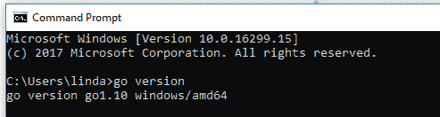
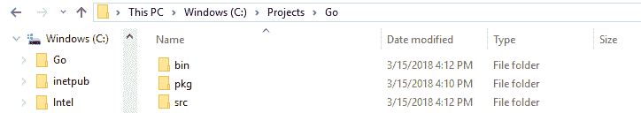
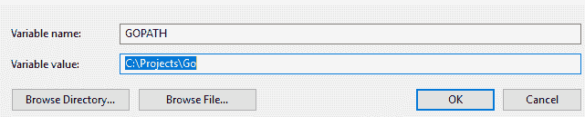
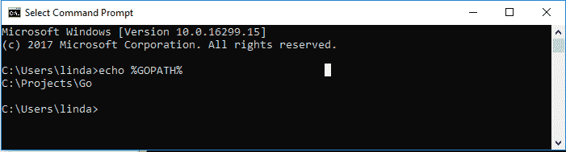

# 如何设置 Go for Windows —快速简单的指南

> 原文：<https://www.freecodecamp.org/news/setting-up-go-programming-language-on-windows-f02c8c14e2f/>

琳达·格雷内尔

另一种可以添加到您的全栈开发人员工具带的优秀语言是简单而高效的通用编程语言 Go。

通过 2007 年开始的一个项目，通过一些谷歌程序员的努力，Go 有了成果。他们在 Go 的设计上花了很大的心思，让它的语言特性和标准库清晰一致，让 Go 使用起来简单又有趣。

它最好是开源的…但是不要忘记:它是区分大小写的！

Go installation avators

那么让我们从微软 Windows 10 操作系统开始吧。您将会看到这是多么简单——只需要 GitHub 和命令提示符的基本工作知识。当然，还有其他安装和运行程序的方法，但由于有限的编码背景，我觉得这组说明是最容易理解和遵循的。

请务必完整地按照这些步骤以及**正确的顺序(如所列)**进行操作，以免您不得不卸载 Go 并花费几个小时来解决任何与安装相关的问题。

### 阶段 1:按此顺序安装以下组件

1.  As Go 使用开源(免费！)仓库通常，一定要先在这里安装 Git 包。
2.  在此导航至 Go 安装网站[。下载并安装适用于 Microsoft Windows 操作系统的最新 64 位 Go set。](https://golang.org/doc/install)
3.  按照 Go 安装程序上的说明进行操作。
4.  通过搜索“cmd”在计算机上运行命令提示符。打开命令行并键入:“go version”
5.  进入 *go 版本*后的输出应该是这样的:

### 第二阶段:创造你的工作空间

首先，确认您的 Go 二进制文件:转到您的计算机的控制面板，然后到系统和安全>系统>高级系统设置，并在左侧窗格中单击高级选项卡。然后点击右下角的环境变量。确保系统变量下的路径中包含“C:\Go\bin”变量。

然后创造你的工作空间。这将位于一个单独的新文件夹中，Go 安装文件将保存在该文件夹中。例如，您的 G 安装文件保存在路径 C:\Go 下，而您正在 C:\Projects\Go 下创建您的 Go 工作空间

在新的 Go 工作空间文件夹中，设置三个新文件夹:

bin, pkg, src

### 阶段 3:创建 GOPATH 环境变量

创建 GOPATH 变量并引用新创建的 Go 工作空间。回到您的控制面板，导航到系统，然后环境变量。然后在系统变量下点击新建。

在变量名旁边输入“GOPATH”，在变量值旁边输入“C:\Projects\Go”

要检查路径设置是否正确，请在命令行中输入“echo %GOPATH%”。

### 阶段 4:测试和确保

现在，您已经准备好通过打开命令行并键入:`go get github.com/golang/example/hello`来验证一切都正常工作了

等待代码完全实现(这可能需要几秒钟)，然后在命令行中输入以下内容:`%GOPATH%/bin/hello`

如果安装成功，您应该得到以下返回消息:“Hello，Go examples！”

我希望你成功。如果您遇到任何错误或令人困惑的消息，请在下面用这个命令行的结果进行注释:“go env”

本文的灵感来自以下在线资源，这些资源非常容易理解，在我的 Windows 操作系统上设置 Go 时非常有用:

[韦德·韦格纳视觉简洁的&风格文章](http://www.wadewegner.com/2014/12/easy-go-programming-setup-for-windows/)

现在你准备好成为一个“地鼠”了！