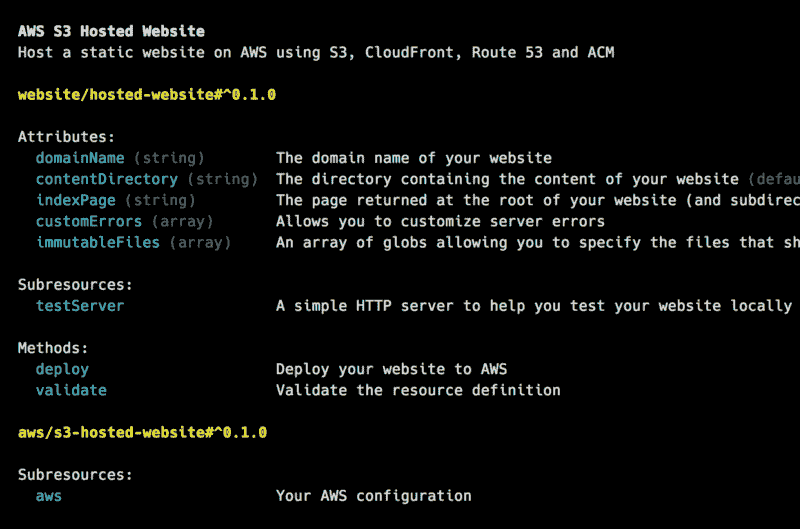
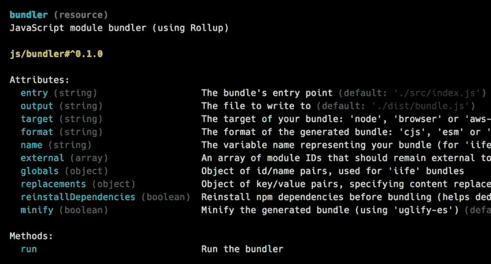

# 让我们修复好旧的命令行

> 原文：<https://www.freecodecamp.org/news/lets-fix-the-good-old-command-line-b6eaa1f9c040/>

曼努埃尔·维拉

# 让我们修复好旧的命令行


虽然我们有漂亮的图形用户界面，但似乎我们正在使用越来越多的命令行工具。虽然它们中的许多真的很好，但我认为如果它们基于更现代的基础，它们可能会更好。

为了说明这个问题，我将考虑两个基本特征:可定制性和可用性。并且，通过查看一些更流行的工具，我将展示同时实现这两个特征是多么困难。

我将主要谈论 JavaScript 工具，因为这是我最喜欢的环境。但是不管开发环境如何，问题都是相似的。

### 创建 React 应用

[Create React App](https://github.com/facebook/create-react-app) 举例说明了一个非常容易使用但不太可定制的工具的情况。它汇集了一套工具、技术和最佳实践，可以立即启动一个现代化的 web 应用程序。

在这方面，它是极有价值的，但它的实现就像一个黑箱。内心的东西很难改变。是的，有一个`eject`功能，但我不认为这是一个真正的解决方案。这是用一种特性换另一种特性。该工具变得更加可定制，但不再易于使用。

### npm 脚本和特定代码

在这里，我们有最大程度的可定制性，但可用性很低。通过编写 [npm 脚本](https://medium.freecodecamp.org/introduction-to-npm-scripts-1dbb2ae01633)和特定代码，可以创建任何类型的构建者、部署者等。但是，这并不适合每个人，而且这是一项相当费力的任务。使用 npm 脚本(即 [Bash](https://www.gnu.org/software/bash/) )将一组工具放在一起并不十分用户友好，并且用 JavaScript 编写代码来通过 npm 模块配置和控制工具有些麻烦。

### [webpack](https://webpack.js.org/) 、[大口](https://gulpjs.com/)、[无服务器框架](https://serverless.com/framework/)等。

最后，这里有一些既可定制又易于使用的工具。但是，要付出的代价很高。我们必须处理他们的插件系统，或者更确切地说，有这样一个系统的事实。

问题是每次一个工具提供一个插件系统，它就创造了一个新的生态系统。结果是，我们没有拥有一个全球性的工具生态系统，而是以一个个各自为政的生态系统的扩散而告终。所以，许多插件在做同样的事情，但是针对不同的生态系统(例如，`[awesome-typescript-loader](https://github.com/s-panferov/awesome-typescript-loader)`、`[gulp-typescript](https://github.com/ivogabe/gulp-typescript)`、`[serverless-plugin-typescript](https://github.com/graphcool/serverless-plugin-typescript)`等)。).真是浪费时间。

很多时候，当一个工具实现了一个插件系统，这是一个错误的标志。它试图解决一个可能应该在较低层次解决的问题。


### *nix，Bash 等。

不要误解我。我之前提到的所有工具都棒极了。鉴于它们所基于的基础，它们做得很好。我的意思是他们不得不与类似 Unix 的系统和 shells 如 [Bash](https://www.gnu.org/software/bash/) 作斗争。你能相信我们所有的现代工具都是建立在近半个世纪以来几乎没有改变的基础之上吗？

通常，当我们在一个项目上工作时，我们使用几个工具，例如(在现代 web 项目的情况下)，依赖管理器，transpiler，bundler，等等。因此，我们需要一种方法来安装、配置和组合所有这些东西。不幸的是，我们优秀的老命令行不太擅长这个。

我们使用基于许多不同格式的配置文件来配置我们的工具。我们通过一系列的字符串(`argv`)与他们交流。最后，因为典型的 shells 不能处理同一个工具的多个版本，所以当我们必须处理许多项目时，管理我们的开发环境是很痛苦的。

说真的，我们不能说它是用户友好的。当然，我们有很棒的编程语言和丰富的库。工具里面很漂亮，但是外面很丑。当涉及到配置、组合和执行它们时，这并不酷，正因为如此，我们最终陷入了可定制性和可用性的两难境地。

### 你好，“资源”

我花了整整一年的时间试图解决这个问题，最终我得到了我称之为“[资源](https://run.tools/docs/introduction/what-is-a-resource)”。此外，作为概念验证，我构建了“ [Run](https://run.tools/) ”，一个资源运行时。

那么，资源有什么用呢？基本上，资源向工具添加了一个面向对象的接口，使它们更容易从命令行和以编程方式从其他工具使用。

如果你创建了一个工具，你可以把它包装成一个资源来提高它的可用性，节省大量的开发时间。首先，由于 Run 自动安装工具，安装问题就消失了。然后，假设用户使用资源配置工具，您不需要管理配置文件。最后，您不再需要实现命令行界面。Run 为你提供了。

如果您是最终开发人员，并且您正在处理应用程序、网站、后端等，您可以使用资源来引用项目所需的工具，并指定它们的配置。然后，因为您的开发环境是在一个文件中定义的，所以您的项目非常容易移植和共享。只要抓住资源就万事俱备了。此外，因为您的资源消耗的工具本身就是资源，所以一切都变得非常容易配置、组合和使用。

### 它看起来像什么？

资源是一个 JSON 或 YAML 文档，允许您指定以下内容:

*   资源使用的工具(通过继承或组合它们)
*   一组属性(用于配置工具)
*   一组方法(添加自定义行为)

例如，要建立一个网站，你可以这样开始:

```
{  "@import": "aws/s3-hosted-website#^0.1.0"}
```

然后，通过调用不带任何参数的 Run:

```
run
```

您将获得反映资源内容的自动生成的帮助:



因为资源导入了`"aws/s3-hosted-website"`，所以它继承了许多属性和方法。让我们指定一些属性:

```
{  "@import": "aws/s3-hosted-website#^0.1.0",  "domainName": "www.example.com",  "contentDirectory": "./content"}
```

最后，让我们调用`deploy`方法:

```
run deploy
```

瞧啊。你的网站上线了。这个`"aws/s3-hosted-website#^0.1.0"`东西呢？这是对实现用于管理 AWS 上托管的静态网站的工具的资源的引用。并且，为了更容易使用，它被存储在一个[资源目录](https://resdir.com/)中。

几个月来，我一直在紧张地使用资源，事实上，可定制性和可用性的两难问题似乎已经解决了。例如，这里有一个更现实的网站的资源，包括 npm 依赖项(没有`package.json`文件！)和一个运行 transpiler、bundler 和 file copier 的`build`方法:

```
{  "@import": ["aws/s3-hosted-website#^0.1.0", "js/resource#^0.1.0"],  "domainName": "www.example.com",  "contentDirectory": "./build",  "dependencies": {    "color": "^3.0.0",    "lodash": "^4.17.4"  },  "build": {    "@type": "method",    "@run": ["transpiler run", "bundler run", "copier run"]  },  "transpiler": {    "@import": "js/transpiler#^0.1.0",    "source": "./src",    "destination": "./dist",    "targets": {"chrome": "41", "safari": "10", "firefox": "50"},    "format": "esm"  },  "bundler": {    "@import": "js/bundler#^0.1.0",    "entry": "./dist/index.js",    "output": "./build/bundle.js",    "target": "browser",    "format": "iife"  },  "copier": {    "@import": "tool/file-copier#^0.1.0",    "sourceDirectory": "./",    "destinationDirectory": "./build",    "files": ["./index.html", "./images"]  }}
```

很简单，你不觉得吗？如果你迷路了，Run 自动生成的帮助就是你的向导。例如，要了解关于捆绑器的更多信息，只需调用:

```
run bundler
```

您应该会看到类似这样的内容:



### 结论

我不是说资源概念是圣杯，但它是我迄今为止发现的最好的，并且是一项正在进行的工作。规格还不稳定；一切都可以改变，甚至“资源”这个名称也可以改变。

要了解更多关于运行和资源的当前状态，你可以看看[文档](https://run.tools/docs)和 [GitHub repo](https://github.com/runtools/run) 。

你们觉得怎么样？只是我在命令行上有问题吗？还是需要修复的东西？如果是这样，你认为这个资源概念是朝着正确方向迈出的一步吗？