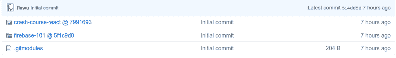
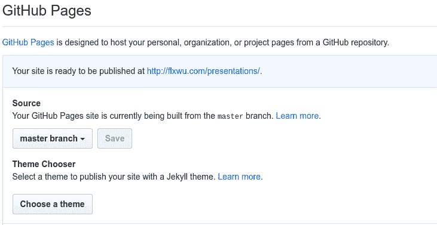
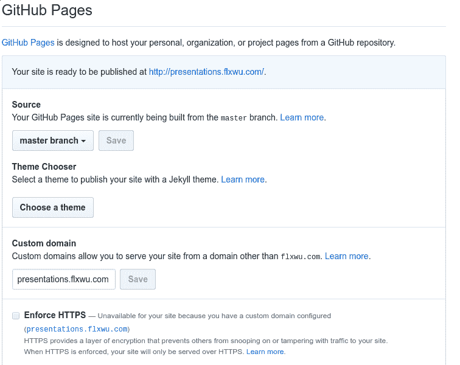

# 如何用 Git 子模块在 GitHub 页面上托管

> 原文：<https://www.freecodecamp.org/news/hosting-on-github-pages-with-git-submodules-36815856c3f1/>

菲利克斯·吴

Git 子模块是 Git 中最棒但最累人的特性之一。我的意思是，我们都喜欢 T2 饭桶，对吗？但是你试过使用 Git 子模块吗？

实际上，独立的 Git 子模块并不难理解。输入以下命令即可轻松完成初始化:

```
git submodule add <link-to-remote-repo>
```

然而，我最近想使用子模块来托管基于子路径的 reveal.js 演示，这变得非常复杂，因为我没有任何教程可以参考。

我基本上想有一个名为“演示”的存储库，这样 GH-Pages 将在各自的子路径([http://presentations.flxwu.com/](http://presentations.flxwu.com/))上托管这个存储库，在那里我可以包含我实际的展示存储库。

因此，我可以为我的演示文稿创建单独的 repos，这些 repos 将在“演示文稿”存储库中自动更新。这将导致我的“firebase-101”存储库被托管在 http://flxwu.com/presentations/firebase-101 的。

你也可以在一个自定义的子域名上托管——我在[**presentations . flx Wu . com/【回购名称】**](http://presentations.flxwu.com/[repo name]) 有我的演示文稿。因此，您仍然可以在[username . github . io/【repo name】](http://username.github.io/[repo name])下拥有您的其他非演示资源库

### 设置本地存储库

首先，我们初始化一个新的存储库，并向其中添加相应的子模块。

```
mkdir parentrepo && cd parentrepo/git initgit submodule add https://github.com/flxwu/firebase-101
```

您可以将“我的存储库”链接替换为您希望在您的[username . github . io/parent repo/【存储库名称】](http://username.github.io/parentrepo/[repository name])子路径上托管的存储库。**只要确保链接使用 HTTPS 并且存储库是公共的**。

现在提交所有内容，并完成创建 GitHub 存储库的常规过程，在本地添加远程 GitHub 存储库并将其推送到该存储库:

```
git commit -a -m "Initial Commit"git remote add origin [your github repository .git link]git push origin master
```

你的 GitHub 库现在应该看起来像这样(除了只有一个挂钩文件夹，以防你只添加了一个子模块)



现在进入设置，在 GitHub 页面上发布“主”分支。现在，您应该看到下面的内容，用您自己的用户 GitHub pages 域名(如果您没有设置自定义域名，请使用 username.github.io)替换[flxwu.com]。



您现在还可以设置自定义子域:



This is how I configured GitHub Pages

现在，你们各自的子模块`**firebase-101**` (如果你没有添加自己的回购代替我的)托管在**subdomain.domain.com/firebase-101**。

#### 成功！

如果这篇文章对你有帮助，请在 twitter 上关注我

### 额外收获:如何移除子模块

*   从`.gitmodules`文件中删除引用子模块的部分
*   通过`git add .gitmodules`进行变更
*   从`.git/config`中删除子模块的相关部分。
*   运行`git rm --cached path_to_submodule`(无尾随斜线)
*   运行`rm -rf .git/modules/path_to_submodule`
*   使用“git commit -m”删除的子模块提交更改
*   删除现在未跟踪的子模块文件`rm -rf path_to_submodule`