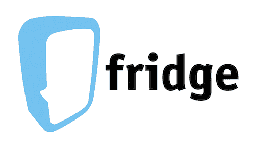
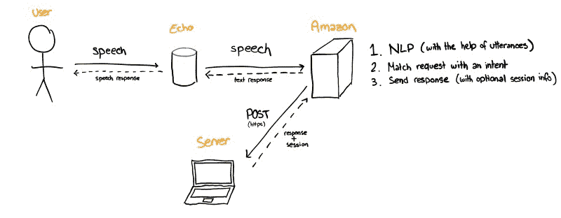

# 我如何在 Shopify 获得实习机会

> 原文：<https://www.freecodecamp.org/news/how-i-got-an-internship-at-shopify-432cbe8da58a/>

by Radu Raicea

# 我如何在 Shopify 获得实习机会

2018 暑期实习的面试季终于结束了。在多家公司进行了一个多月的面试和测试后，我将作为后端开发实习生加入 Shopify。

在这篇文章中，我想带你了解一下我申请、准备和面试 Shopify 的过程。我还想和你分享一些我在申请和面试工作时使用的技巧。

### 快速介绍

我现在是加拿大蒙特利尔的协和大学的本科生。我即将完成软件工程学士学位的第三年。

我也是 COOP 计划的一部分，该计划要求我在整个学士学位期间完成三次实习。我的前两次实习是在育碧公司和 T2 警惕公司。

我的最后一次实习将在今年夏天进行，我将在蒙特利尔的 Shopify 工作。

### 什么是 Shopify？

简单地说，Shopify 的平台允许企业和个人轻松地在线销售商品。

Shopify 会引导您完成设置店面、管理库存、接受各种支付方式和运输的整个过程。甚至还有一个可以在店内使用的销售点(POS)系统！

就在 Shopify 工作而言，他们赢得了 Glassdoor 的 2017 年加拿大最佳工作场所。众所周知，他们在各自的行业中都有杰出的人才。

### 应用过程

Shopify 有一套独特的实习生招聘流程，从申请流程开始就很明显。

为了提交我的申请，我需要完成三项任务。

#### 1.创建 Shopify 商店

第一项任务是创建一个虚拟的 Shopify 商店。这是一种让我熟悉平台并了解商家如何创建网上商店的方式。

我开了一家日本糖果店。我想做一些比典型的时装、美容或电器商店更有创意的东西。

我认为这一步的秘诀是**围绕你的商店创造一个虚构的故事**。那么，店铺的设计和它的库存应该是自然而然的。

#### 2.完成技术挑战

后端开发实习生的职位有一个相关的技术挑战。

挑战在于为图形数据结构创建一个验证器。我决定[用 Python](https://github.com/Radu-Raicea/Shopify-Challenge/blob/master/challenge.py) 来做。

我真的很喜欢这个挑战与 Shopify 平台的联系(或者至少看起来是这样)，而不是一个毫无意义的算法问题。

我相信对于这部分，做一个**简单的**解决方案是极其重要的。既然解决问题有这么多方法，让你的解决方案**直观**和**有据可查**也很关键。我充分利用了 [Python docstrings](https://www.python.org/dev/peps/pep-0257/) 来完成这个任务。

最后，**如果这意味着使你的解决方案更加复杂，不要**超越问题的要求。这只会伤害你。

#### 3.回答申请问题

申请过程的最后一步是回答一些问题。

我写了我想在实习期间做的工作，以及我在整个申请过程中的经历。我还为 Hack Days (Shopify 的季度黑客马拉松)写了一个想法。

我花了很大的力气来回答这些问题。和任何申请一样，你投入的努力会清楚地表明你对在那里工作有多感兴趣。

同样重要的是**诚实**你写的内容，并且**通过你的回答展示你的** **激情**。

关于“黑客日”的想法，试着想想在你之前的实习和经历中，有哪些事情可以改善你的工作生活。思考工作本身以外的方面。让它变得有趣！

### 面试过程

等了几个星期后，我收到了一封邮件，开始面试过程！

我的面试过程分为两部分:一个生活故事视频电话和一个现场技术面试。

#### 生活故事

我的生活故事视频通话持续了大约 45 分钟，是与人才获取团队的一名招聘人员进行的。

根据我的理解，生活故事的目的是让招聘者在更个人的层面上了解你。他们想知道你的简历没有提到的内容。我谈论了一些话题，比如我的旅行、兴趣、爱好、过去的经历(没什么技术性的)，以及我是如何培养自己对编程的热情的。

这是这个过程中我最喜欢的部分之一。这是非常随意的，感觉就像遇见一个新的人，分享你的生活故事！

虽然在面试过程的这一部分没有什么要准备的，但我还是列出了所有我想谈论的不同话题。我把它放在我的屏幕上，以确保我没有忘记提及任何我认为重要的事情。

我认为在人生故事中最重要的元素是**诚实**，保持**随意**，并且**真正了解你的人生故事**。就当是一次对话吧！

#### 现场技术

几周后，我收到了一封安排我现场面试的电子邮件。它将被分成两部分:一个个人项目分析和一个技术问题。我将接受两位开发人员的面试。

对于第一部分，我需要引入一个我已经做了大量工作的项目。

那时，我正计划开始一个项目来解决我在日常生活中遇到的一个问题:在餐馆的食物上花费太多的钱。

我想在我的亚马逊 Echo 上创建一个 Alexa 应用程序，它可以知道我目前拥有的成分，并根据我的库存建议食谱。这是一箭双雕的绝佳机会。

然而，我也想打第三只鸟。我想学习 Ruby on Rails 已经很久了。由于 Shopify 的平台是建立在 Rails 之上的，我认为使用 Rails 来制作我的 Alexa 应用程序是一个很好的主意。

我很快完成了 SoloLearn Ruby 课程，并从官方的《T2 入门指南》中学习了 Ruby on Rails 的基础知识。

然后，我用新学到的知识做了 [Alexa 冰箱](https://github.com/Radu-Raicea/AlexaFridge)！

Credits to [g-harel](https://github.com/g-harel) for making this awesome logo for my project

在面试的这一部分，我被要求从各个方面介绍我的项目。我浏览了代码，展示了我是如何实现各种元素的。我的设计决策也受到了质疑。

不言而喻，但是你应该真正地了解你的项目，以便能够回答任何关于它的问题。事先准备一些文档(尤其是图表)来展示不同的方面，比如基础设施、数据库模式或者您使用的 API 是如何工作的，这会很有帮助。

例如，我用这个图来展示我的服务器如何与我的 Amazon Echo 通信:

我认为，如果你能带来一个可以演示的项目，这也是有益的。如果你不能展示结果，就很难理解你工作的意义。

在现场面试的第二部分，我需要解决一个技术问题。

我事先被告知这不会是一个写在白板上的算法(耶！).相反，这是一个我需要做出设计决策来解决的问题。

对于这部分，我真的推荐多了解一下**系统设计**。您应该知道如何组织 web 和移动应用程序，如何设计数据库模式，如何进行身份验证，等等。

这些主题中有些是在软件工程学位期间学习的，但有些不是。我推荐在 Tech 的[系统设计训练营](https://www.hiredintech.com/classrooms/system-design/lesson/52)和[高可扩展性](http://highscalability.com)里查聘。这两个网站都是学习系统设计和了解大公司如何设计应用程序的绝佳资源。密切关注每个设计决策带来的权衡。

当你处理系统设计问题时，确保你总是清楚地**陈述你的假设**并且**理解需求**。

还有，如果需要，不要羞于提问！房间里有两个开发人员和你在一起，你可以不时地得到一些帮助。问正确的问题和回答它们一样重要(反正你有谷歌)。

最后，永远**大声思考**。对于面试官来说，了解你的想法是非常重要的。

在这类问题中，我会尽可能地大声思考，即使我的思路是错误的。然而，如果它是错的，重要的是我认识到它并纠正自己。

#### 要约

大约一个星期后，Shopify 联系了我，我接受了！

### 外卖食品

我真的很喜欢申请和面试过程的独特性。它让我展示的不仅仅是我的技术技能！

以下是我在整篇文章中分享的技巧总结:

*   创建网上商店时，设身处地为商家着想，沉浸在他们虚构的故事中
*   当进行技术挑战时，寻找简单性并很好地记录下来
*   当你写申请问题的答案时，投入大量的努力，诚实，并展示你的热情
*   在人生故事中，做你自己，了解你的人生故事
*   在现场，带一个你熟悉的项目，并且知道你为什么要这样设计它
*   对于技术问题，陈述你的假设和要求，并大声思考

谢谢你看我的文章！

**更多更新，请在[推特](https://twitter.com/radu_raicea)上关注我。**