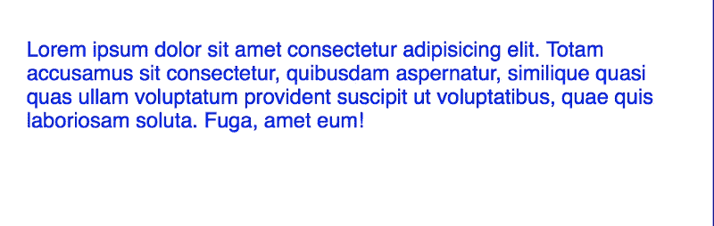
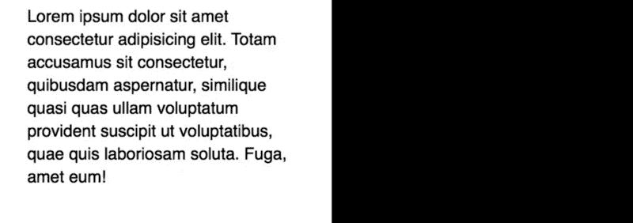
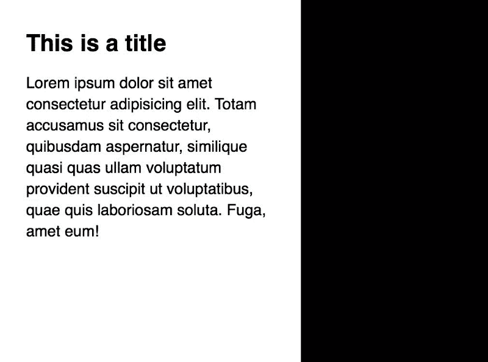
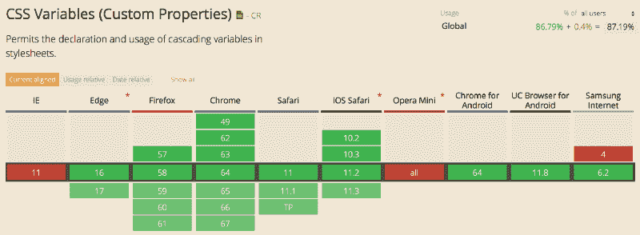
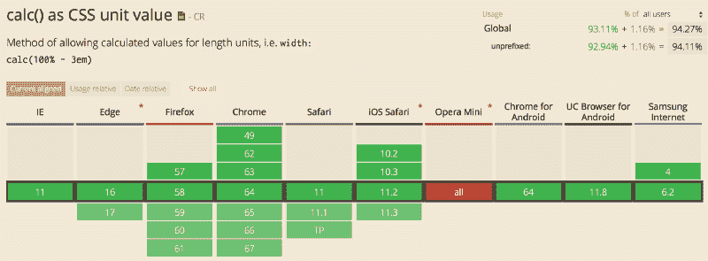

# 如何用 CSS 变量和 CSS Calc 让垂直节奏有反应

> 原文：<https://www.freecodecamp.org/news/how-to-make-vertical-rhythm-responsive-with-css-variables-and-css-calc-dfeec0bd1660/>

作者 Zell Liew

# 如何用 CSS 变量和 CSS Calc 让垂直节奏有反应


Photo by [Samuel Zeller](https://unsplash.com/photos/ex0gVNvCAvA?utm_source=unsplash&utm_medium=referral&utm_content=creditCopyText) on [Unsplash](https://unsplash.com/search/photos/tall?utm_source=unsplash&utm_medium=referral&utm_content=creditCopyText)

垂直节奏是网页设计中的一个重要概念。它有能力将设计整合在一起，让不同的元素在同一页面上感觉一致。

过去在不同的视口改变垂直节奏是不可能的，因为我们没有合适的工具。但是现在，有了 CSS Calc 和 CSS 自定义属性，我们可以在不同的视口改变垂直节奏。这篇文章解释了如何。

### 计算节奏单位

一个节奏单位是你网站垂直节奏的倍数。**节奏单位的值应该是你正文的行高。** [下面是为什么](https://zellwk.com/blog/why-vertical-rhythms/)。

```
/* One rhythm unit would be 20px * 1.4 = 28px */ html {   font-size: 20px;   line-height: 1.4; } 
```

```
p {   margin: 28px; }
```

计算节奏单位变得更容易，如果你使用相对单位([和你应该](https://zellwk.com/blog/responsive-typography/))。**一个节奏单位总是等于根字体大小乘以正文的行高。**

```
/* 1 rhythm unit, calculated with rem */ html {   line-height: 1.4; } 
```

```
p {   margin: 1.4rem; }
```

当你创建空白时，可以随意改变节奏单元的数量。[你甚至可以包含非整数值](https://zellwk.com/blog/why-vertical-rhythms/)。

```
/* 2 rhythm units */ h2 {   margin-top: 2.8rem;} 
```

```
/* 0.75 rhythm units */ p {   margin-top: 1.05rem;}
```

### 为什么要在不同的视口改变垂直节奏？

我们倾向于将较大的设备(如台式机)放在比较小的设备(如手机)更远的地方。我们需要增加字体大小来补偿由于距离增加而造成的可读性损失。如果你的用户不能舒服地阅读你的网站，他们可能会离开，他们会眯着眼睛，或者增加浏览器的前置尺寸(如果他们足够聪明的话)。

#### 更多关于可读性。

可读性是网页排版最重要的元素之一。它受三个值**的影响——文本的字体大小、行高(或行距)和行长(或度量)**。当一个元素改变时，其他元素可能需要改变以保持可读性。

当您将浏览器从移动视图调整到桌面视图时，您会注意到尺寸和字体大小都发生了变化。因此，领导力也应该改变。这个概念非常重要，以至于蒂姆·布朗提出了[熔融领先](https://css-tricks.com/molten-leading-css/)的方法。使用熔化铅的一个例子是你用视口单位写你的身体线条高度。

```
/* This is a simple example. See the complete example in the link above */ body {   font-size: calc(1em + 1vw);   line-height: calc(1.2em + 1vw); }
```

但问题是，当你改变正文的行高时，垂直节奏单位也会改变。没有办法把熔铅和垂直节奏融合在一起。

现在，即使你放弃熔化铅和使用标准的无单位行高，你可能仍然会因为你需要创建的复制数量而发疯。不值得努力。

```
/* Change line height at different breakpoints */ html {   line-height: 1.4; } 
```

```
@media (min-width: 600px) {   html {     line-height: 1.5;   } } 
```

```
/* Calculate rhythm again at each breakpoint */ p {  margin-top: 1.4rem; } 
```

```
@media (min-width: 600px) {   p {     line-height: 1.5rem;   } }
```

### 用 CSS 自定义属性改变节奏单位

CSS 自定义属性(通常称为 CSS 变量)可用于创建在不同视口变化的节奏单位。

要创建一个 CSS 变量，您可以通过在属性前添加`--`来创建一个自定义属性(因此得名)。

```
:root {   --color: red; }
```

要使用您创建的自定义属性，您可以编写`var(--your-custom-property)`。

```
p {   color: var(--color) }
```

CSS 自定义属性的伟大之处在于:它们可以在不同的媒体查询中动态更新。

```
:root {   --color: red; } 
```

```
@media (min-width: 30em) {   :root {     --color: blue;   } } 
```

```
p {   color: var(--color) }
```



这意味着您可以创建一个对应于一个节奏单元的`--baseline`属性，然后，在您的 CSS 中使用这个`--baseline`属性来创建响应的垂直节奏。

```
:root {  --baseline: 1.4;   line-height: var(--baseline) } 
```

```
@media (min-width: 30em) {   :root {     /* a value of 3 used here to exaggerate the changes so you can see it in the demo below */   --baseline: 3;   } }
```



要创建节奏值，需要使用 CSS Calc(因为只能用 CSS Calc 计算 CSS 中的东西)。

```
/* Two rhythm units */ h2 {   margin-top: calc(var(--baseline) * 2rem); } 
```

```
/* 0.75 rhythm units */ p {   margin-top: calc(var(--baseline) * 0.75rem); }
```



### 用函数简化计算

每次创建一个节奏值时都要写`calc`和`var`可能是件苦差事。如果在像 Sass 这样的预处理器中创建一个函数，可以简化计算。

```
// rvr stands for responsive vertical rhythm @function rvr($multiple) {   @return calc(var(--baseline) * $multiple * 1rem); }
```

然后，您可以像这样使用您创建的`vr`函数。简单多了！？。

```
/* Two rhythm units */ h2 { margin-top: rvr(2); } 
```

```
/* 0.75 rhythm units */ p { margin-top: rvr(0.75); }
```

### 支架看起来怎么样？

对 [CSS 自定义属性](https://caniuse.com/#feat=css-variables)和 [CSS 计算](https://caniuse.com/#feat=calc)的支持非常棒。如今所有主流浏览器都支持它们。



不幸的是，Opera Mini(以及一些不太知名的浏览器，如 QQ 和百度)缺乏对 CSS Calc 和 CSS Custom 的支持，这令人失望。

由于 Opera Mini 不支持 CSS Calc 和 CSS 自定义属性，我们需要在每次创建节奏单元时提供后备属性。这是稍微多一点的工作，但幸运的是，不是一个交易破坏者。

```
:root {   --baseline: 1.4;   /* Line-height fallback */   line-height: 1.4;   line-height: calc(var(--baseline) * 1); } 
```

```
@media (min-width: 30em) {   :root {     --baseline: 1.5;   } } 
```

```
p {   /* Line-height basic vertical rhythm fallback. */   margin-top: 1.05rem;   margin-top: rvr(0.75); }
```

为了更简单，您还可以创建一个基于基线高度值计算垂直节奏的`vr`函数。这里有一个您可以使用的简单版本(专门针对本例)。如果你想要一个更完整的版本，可以去看看 [Typi](https://github.com/zellwk/typi) ，这是一个我创建的库，用来帮助简化响应式排版。

```
@function vr($multiple) {   @return 1.4 * $multiple * 1rem; }
```

如果您创建了`vr`函数，您的节奏回退会更简单:

```
p {   /* Line-height basic vertical rhythm fallback. */   margin-top: vr(0.75);   margin-top: rvr(0.75); }
```

注意:我还没有在 Typi 中包含响应垂直节奏。我希望等我有时间的时候再添加它。

### 包扎

垂直节奏是我们作为设计者和开发者应该注意的一个重要的排版原则。不幸的是，我们不能像以前那样给予它足够的关注，因为我们缺乏这样做的工具。

但是现在，我们可以借助 CSS 自定义属性和 CSS Calc 创建响应式垂直节奏。如果你创建了响应式垂直节奏，确保你为不支持 CSS 自定义属性和 CSS Calc 的浏览器提供了后备！

感谢阅读。这篇文章对你有什么帮助吗？如果我有，[我希望你考虑分享它](http://twitter.com/share?text=Responsive%20Vertical%20Rhythm%20with%20CSS%20Custom%20Properties%20and%20CSS%20Calc%20by%20@zellwk%20?%20&url=https://zellwk.com/blog/responsive-vertical-rhythm/&hashtags=)；在阅读这篇文章之前，你可能只是帮助了和你有同样感受的人。谢谢你。

*最初发表于[zellwk.com](https://zellwk.com/blog/responsive-vertical-rhythm/)。*