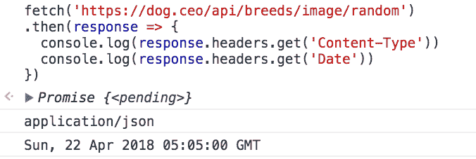
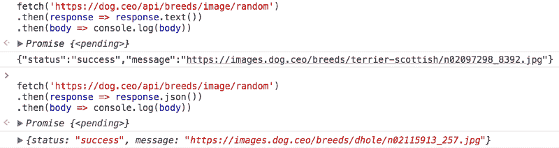

# 了解获取 API

> 原文：<https://www.freecodecamp.org/news/understanding-the-fetch-api-a7d4c08c2a7/>

> 对学习 JavaScript 感兴趣？在 jshandbook.com 获得我的电子书

自从 IE5 在 1998 年发布以来，我们可以选择在浏览器中使用 [XMLHttpRequest (XHR)](https://flaviocopes.com/xhr/) 进行异步网络调用。

几年后，Gmail 和其他丰富的应用程序大量使用它，并使这种方法如此受欢迎，以至于它必须有一个名字: **AJAX** 。

直接使用 XMLHttpRequest 一直是一件痛苦的事情，它几乎总是被某个库抽象出来。特别是，jQuery 有自己的助手函数:

*   `jQuery.ajax()`
*   `jQuery.get()`
*   `jQuery.post()`

诸如此类。

它们对让异步调用变得更容易理解产生了巨大的影响。特别是，他们把重点放在旧的浏览器上，以确保一切仍然正常工作。

**Fetch API** 已经被标准化为异步网络请求的现代方法，并使用 [**Promises**](https://flaviocopes.com/javascript-promises/) 作为构建模块。

在撰写本文时(2017 年 9 月), Fetch 在各大浏览器上都有很好的支持，除了 IE。


GitHub 发布的 [polyfill](https://github.com/github/fetch) 允许我们在任何浏览器上使用`fetch`。

### 使用获取

开始对`GET`请求使用 Fetch 非常简单:

```
fetch('/file.json')
```

您已经在使用它了:fetch 将发出一个 HTTP 请求来获取同一个域上的`file.json`资源。

如您所见，`fetch`函数在全局`window`范围内可用。

现在让我们让它更有用一点，让我们实际看看文件的内容是什么:

```
fetch('./file.json') .then(response => response.json()).then(data => console.log(data))
```

调用`fetch()`返回一个承诺。我们可以通过传递带有承诺的`then()`方法的处理程序来等待承诺的解决。

该处理程序接收`fetch`承诺的返回值，这是一个响应对象。

我们将在下一节更详细地了解这个对象。

### 捕捉错误

由于`fetch()`返回了一个承诺，我们可以使用承诺的`catch`方法来拦截请求执行过程中出现的任何错误，处理是在`then`回调中完成的:

```
fetch('./file.json').then(response => {  //...}.catch(err => console.error(err))
```

### 响应对象

由一个`fetch()`调用返回的响应对象包含了关于请求和网络请求响应的所有信息。

通过访问`response`对象的`headers`属性，您可以查看请求返回的 HTTP 头:

```
fetch('./file.json').then(response => {  console.log(response.headers.get('Content-Type'))  console.log(response.headers.get('Date'))})
```



#### 状态

此属性是表示 HTTP 响应状态的整数。

*   `101`、`204`、`205`或`304`是一种`null body`状态
*   `200`到`299`，包含在内，是一个`OK`状态(成功)
*   `301`、`302`、`303`、`307`或`308`是一个`redirect`

```
fetch('./file.json') .then((response) => {   console.log(response.status) })
```

#### statusText

`statusText`是表示响应的状态消息的属性。如果请求成功，状态为`OK`。

```
fetch('./file.json') .then(response => console.log(response.statusText))
```

#### 全球资源定位器(Uniform Resource Locator)

`url`表示我们获取的属性的完整 URL。

```
fetch('./file.json') .then(response => console.log(response.url))
```

### 正文内容

响应有一个主体，可以使用返回承诺的`text()`或`json()`方法访问。

```
fetch('./file.json').then(response => response.text()).then(body => console.log(body))
```

```
fetch('./file.json').then(response => response.json()).then(body => console.log(body))
```



同样可以使用 [ES2017](https://flaviocopes.com/ecmascript/) [异步函数](https://flaviocopes.com/async-await/)编写:

```
(async () => {  const response = await fetch('./file.json')  const data = await response.json()  console.log(data)})()
```

### 请求对象

Request 对象代表一个资源请求，它通常是使用`new Request()` API 创建的。

示例:

```
const req = new Request('/api/todos')
```

请求对象提供了几个只读属性来检查资源请求的详细信息，包括

*   `method`:请求的方式(GET、POST 等))
*   `url`:请求的 URL。
*   `headers`:请求的关联头对象
*   `referrer`:请求的推荐人
*   `cache`:请求的缓存模式(如默认、重新加载、无缓存)。

并公开了包括`json()`、`text()`和`formData()`在内的几个方法来处理请求体。

完整的 API 可以在[这里](https://developer.mozilla.org/docs/Web/API/Request)找到。

能够设置 HTTP 请求头是必不可少的，而`fetch`让我们能够使用 Headers 对象来做到这一点:

```
const headers = new Headers()headers.append('Content-Type', 'application/json')
```

或者更简单:

```
const headers = new Headers({   'Content-Type': 'application/json' })
```

为了将头附加到请求，我们使用请求对象，并将其传递给`fetch()`,而不是简单地传递 URL。

而不是:

```
fetch('./file.json')
```

我们有

```
const request = new Request('./file.json', {   headers: new Headers({ 'Content-Type': 'application/json' }) }) 
```

```
fetch(request)
```

Headers 对象不仅限于设置值，我们还可以查询它:

```
headers.has('Content-Type') headers.get('Content-Type')
```

我们可以删除之前设置的标题:

```
headers.delete('X-My-Custom-Header')
```

### 发布请求

Fetch 还允许您在请求中使用任何其他 HTTP 方法:POST、PUT、DELETE 或 OPTIONS。

在请求的方法属性中指定方法，并在标头和请求正文中传递附加参数:

发布请求的示例:

```
const options = {   method: 'post',   headers: {     "Content-type": "application/x-www-form-urlencoded; charset=UTF-8" },     body: 'foo=bar&test=1' } 
```

```
fetch(url, options) .catch((err) => {   console.error('Request failed', err) })
```

### **如何取消获取请求**

在引入`fetch`之后的几年里，一旦请求打开，就无法中止。

现在我们可以，感谢`AbortController`和`AbortSignal`的引入，一个通知**中止**事件的通用 API

通过传递一个信号作为获取参数来集成这个 API:

```
const controller = new AbortController()const signal = controller.signalfetch(‘./file.json’, { signal })
```

您可以设置一个超时，在获取请求开始 5 秒后触发中止事件，以取消获取请求:

```
setTimeout(() => controller.abort(), 5 * 1000)
```

方便的是，如果 fetch 已经返回，调用`abort()`不会导致任何错误。

当中止信号发生时，fetch 将拒绝带有名为`AbortError`的`DOMException`的承诺:

```
fetch('./file.json', { signal }).then(response => response.text()).then(text => console.log(text)).catch(err => {  if (err.name === 'AbortError') {    console.error('Fetch aborted')  } else {    console.error('Another error', err)  }})
```

> 对学习 JavaScript 感兴趣？在 jshandbook.com 获得我的电子书