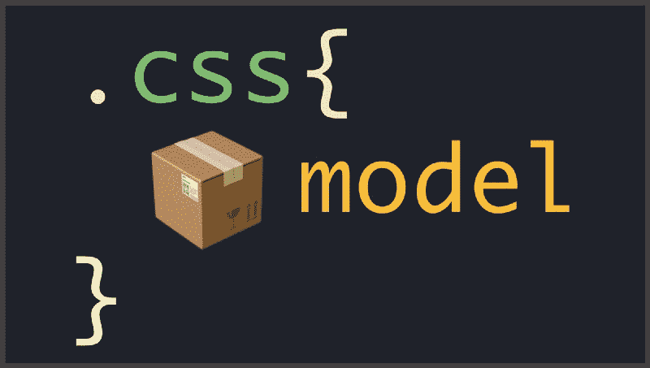
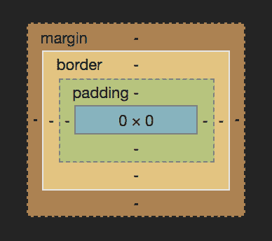
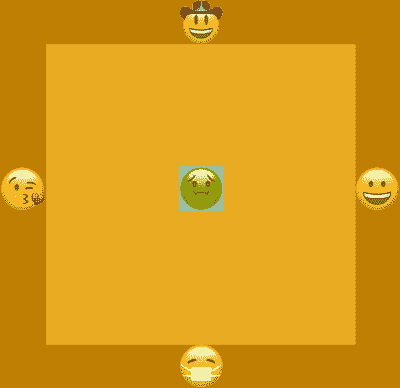
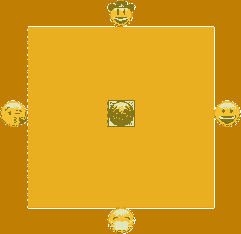
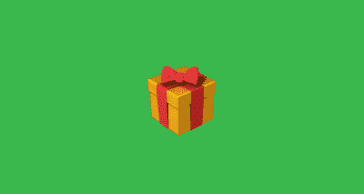

# 打开 CSS 盒子模型的基础

> 原文：<https://www.freecodecamp.org/news/css-box-model-b3e68ceea756/>

布莱恩·史密斯

# 打开 CSS 盒子模型的基础



理解 CSS 盒子模型对于掌握元素在页面上的布局至关重要。用最基本的术语来说，盒子模型如下:边距、边框、填充和内容。但是这意味着什么呢？这些单词是如何组合在一起的？

Welp。

在本周的文章中，我们将直接进入主题，让你感觉自己就像一个盒子模型大师。设计元素的样式并给它们适当的左右间距(上下……明白了吗？因为你在页面上排列你的元素？…抱歉，开了不好的玩笑)。

看看 Chrome 控制台提供的这种可视化分解:



You can see this visual by right-clicking your page in Chrome (or your browser of choice), clicking Inspect to open the developer console, selecting the Styles tab and then scrolling down to the very bottom.

你可以看到盒子模型的每个部分都有标签，除了内容——就是中间的蓝色盒子。让我们来分解一下每个部分是如何工作的，以及它们之间的独特差异。

### 边缘

您可以将边距视为元素的缓冲区。想要在你的元素周围留一点空间吗？这就是利润存在的原因。假设你感冒了。你应该(希望)远离人群，这样你就不会四处传播。你周围需要一些空间。请看这张图片，进一步说明:



注意到你的朋友都从你身边散开，而你被橙色包围了吗？这就是边际效益。你的体型保持不变，但你周围的一切都是禁区。页面上的元素也是如此。边距会在你的元素周围给你空间，并把东西分开。简而言之，边距将在元素周围放置不可见的间距，而不会直接影响其大小。在这个例子中，我们将它设置为橙色，以给你一个视觉提示，告诉你它相对于内容的位置(在这个例子中是一个生病的你)。

### 边境

Border 是元素外部边缘的第二个属性。正如您可能已经猜到的，Border 用于定义元素的可视边缘。边框会增加你的元素或者在屏幕上可见的部分的外观尺寸。仍然可以包含边距，但它将位于边框的外部边缘。让我们再来看看你生病的情况，但这次涉及到一点边界:



它看起来几乎与之前的保证金演示相同，只是现在有一个黑色的盒子围绕着它。那是我们的边界。需要记住的一点是，我们的内容(生病的表情符号)现在是表情符号的大小加上每边的边框。

好了，恶心的表情符号够多了。再说垫料。

### 填料

填充是从外边缘数的第三个项目。和之前的边距和边框一样，完全是可选的。在试图找出边距和填充之间的区别时，要记住的最重要的事情是，填充会增加元素的外观尺寸。

让我们想象你的祖母正在送你一份生日礼物。她把它打包，然后邮寄出去。现在，你的祖母不希望你的礼物在寄给你的时候被毁了，她真的增加了包装。以下是我的意思:



你收到礼物，并假设奶奶全力以赴给你买了一台 60 英寸的电视。

不对。

她只是添加了一些填充(看到我在那里做了什么？)添加到框中，使其占据更多空间并显得更大。

让我给你一个相关的编码例子。你创建了一个宽 100 像素高 100 像素的第四个 T2。你在每条边上添加了 10px 的填充，现在 `that` < div >因为每边都添加了填充，所以宽度为 120px，高度为 120px。在设计页面元素时，请记住这一点。

### 内容

内容，内容，内容。这就是我们页面的组成。内容是你最初在 CSS 中描述它的方式，或者是它的自然高度(如果你使用的是图像的话)。你创造了一个宽 50px 高 300px 的 iv？如果没有被盒子模型的上述任何部分改变的话，这就是你的屏幕上需要的空间。内容是你奶奶给你的礼物，是生病的表情符号。

### 盒子尺寸

如果我现在不提及`box-sizing: border-box`，那将是我的失职。我不想深入探究它的细节，但是有一个名为`box-sizing`的 CSS 属性的值默认为`content-box`。看一下这个代码笔来演示。子容器不尊重父容器，从父容器中延伸出来。

现在有了`box-sizing: border-box`的力量:

孩子们现在被包含在父母的身体里(可能会做家务，在宵禁前回家)。每个演示中的 CSS 都是完全相同的，除了第二个演示中的一个小改动:

```
*, *:before, *:after {   box-sizing: border-box; }
```

这三行代码告诉我们页面上的每个元素计算它们的宽度和高度，并添加边框和填充，而第一个演示是一个自由的混乱，不尊重任何人或任何事。填充和边框被添加到宽度中，并流到父容器之外。

### 把一切都包起来

盒子模型是理解页面布局的基础。希望您现在已经很好地理解了盒子模型是如何工作的，以及如何利用它。我也希望这意味着不用再输入“margin:10px；……[等待换页……删删删]填充:10px……”。

*最初发表于[www.frontamentals.com](https://www.frontamentals.com/css-box-model)。*