# 使用图像的数据压缩

> 原文：<https://www.freecodecamp.org/news/data-compression-using-images-5eaede612c28/>

由丹路

# 使用图像的数据压缩

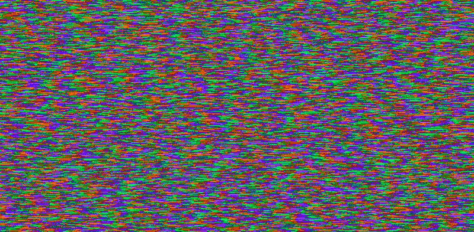

这个兼职项目的最初动机是在开发 [jsNet](https://github.com/DanRuta/jsNet) 的同时，找到一种更好的方法来保存和加载由基于浏览器的神经网络训练的权重。为了节省重量，作为 JSON，我必须在控制台或页面上记录内容，正如你可以想象的，当网络变大并且有大量数据时，情况变得非常糟糕。

我想到的解决方案是将数据编码成图像，这比普通的 JSON 文本更容易处理。无意中，我使用的算法似乎不仅运行得很好，而且最终的文件大小和 gzip 压缩一样小，甚至在大多数情况下都超过了它。

所以我想我应该完善并把它作为一个独立的库发布，供一般人使用。这篇文章是对压缩算法的一个概述，对于那些喜欢这类东西的人来说。

### 该算法

闲话少说，下面是阵列到映像转换的简要概述:

*   数字被转换为 15 进制，前几个字符是元数据
*   结果被连接在一起
*   然后，每对十六进制字符被转换成一个 Uint8Clamped 值
*   最后，将它绘制到画布上，然后返回(浏览器)或保存到文件中(nodejs)

至于从图像转换回数组数据:

*   图像是从文件、Uint8ClampedArray 或 img HTML 元素中读取的
*   Uint8ClampedArray 中的每个值都转换为基数 16
*   一旦连接成一个字符串，输出将沿着元数据“f”字符拆分
*   每个十六进制字符串然后被解析回一个数字

在转换前后，可以采取额外的、可选的标准化步骤，以潜在地进一步减少元数据的数量，从而减小文件大小。

#### 元数据

如果这些数字被转换成图像使用的 16 进制(0 到 f)，那么一旦连接起来，就没有办法区分单独的值。因此，它们被转换为 15 进制(0 到 e)，并且 f 字符被用作分隔符来分隔值。

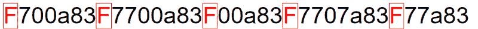

Where the long list of data gets split

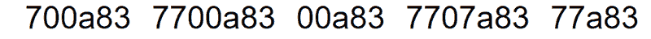

The separate values, after the split

从这里开始，其他事情可能需要更多的元数据。但是从现在开始，这可以表示为基数 15，因为它在开始，这意味着我们不再需要任何元字符。

**正或负**
元数据需要的第一个额外比特是数字是正还是负。然而，仅仅为了一个二进制值而用尽整个字符将是一种浪费，因此这将被合并到元数据中，以确定有多少个基数为 15 的字符存储在数字的左侧(小数点位置的左侧)。

更多信息见下面的**配置**部分，但默认情况下，两者都用一个字符编码，如下所示:

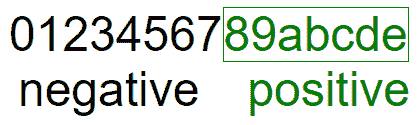

0–7 for negative, 8-e for positive

7 或更小的值代表负数，而其余的代表正数。

**左侧的 15 进制字符数**
此外，每个值代表有多少个 15 进制字符用于表示小数点左侧。

所以比如， **3** 代表负数，左边 4 位数，像 *-1234.xyz* 。而 **a** 代表正数，左边 3 位数，像 *123.xyz* 。

**十进制前导零的个数**
最后，默认情况下，存储十进制值中前导零的个数。同样，参见下面的**配置**部分，但是默认情况下，使用 1 个字符，允许 15 个前导十进制零，如 0.00000000000001。

因此，在默认配置下，值 **1430.01623** 将被转换为以下内容:

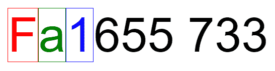

Fa1655733

*F* 是分隔符， *a* 表示一个正数，用 3 个字符(655)表示小数点左边部分，1 表示 1 前导零，在 1430 中。**01623，其余代表实际值。前 3 个字符，' *655'* 从基数 15 转换为 1430，其余，' *733'* ，转换为 1623。结果被连接起来，并添加了前导零。**

#### 配置

默认情况下，只有 1 个元字符用于编码有多少十六进制字符用于表示小数点左边的位置(在上面的例子中，655 => 1430)。这将限制在 eeeeeee 的最大十六进制值，即十进制的 170859374。虽然这对于大多数情况来说已经足够了，但是仍然可以通过简单地使用两个字符来表示更多。

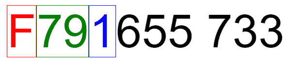

F791655733

在这种情况下，正数存储为 112 以上的任何数字，负数存储为 112 以下的任何数字。这意味着理论上最多有 113 个十六进制字符可以表示数字的左侧，也就是 791247358705416320420226222460646022222222460648206244620828868886284044448028028404442206200620068248028828282828282828282828282828282828282828282828282828 虽然，在实践中，`parseInt`四舍五入在 15 个字符之后变得有趣，所以 99999999999999 应该是一个停止点。

但是，为了节省更多的空间，如果您确实知道这些数字是正数，并且在 0–1 的范围内(您总是可以使用包含的 helper 函数对其进行规范化/取消规范化)，可以将该配置设置为 0，以完全忽略这些元数据。因此， *0.123* 将被转换为:

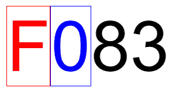

F083

其中' *83* '是 123 的十六进制转换。小数点左边没有存储字符，因为数字被假定为 0。

最后，如果数据由整数组成，或者最多由不带前导零的小数组成，也可以切换前导零的元数据字符。对于上面的示例，关闭它将产生:

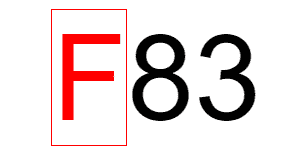

F83

这是最低配置，通过一些数据预处理，它可以帮助大大减少文件大小。

#### 基准

最有趣的两种格式是 PNG 和 WebP。两者都可以从画布中保存，并且都可以使用 alpha 通道，这意味着它们非常容易互换(至少在浏览器版本中)。

由于我最初解决的问题是神经网络权重，第一组基准是来自 3 个神经网络的权重，每个神经网络的大小都是原来的四倍，以测试可伸缩性，这似乎不受影响。这些配置是默认的，没有优化。

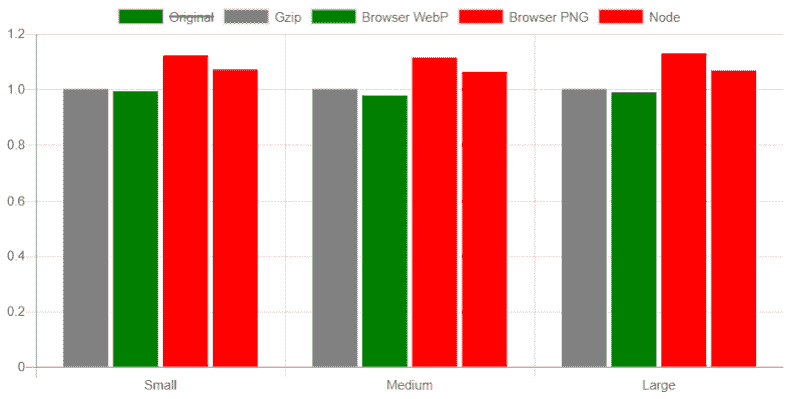

File size relative to gzip compression

PNG 格式完成了这项工作，但是 WebP 实际上击败了 gzip！从这三次测试来看，大约是大小的 98.5%。使用 alpha 通道对减小文件大小没有帮助，但它确实减小了图像的大小，以像素为单位，所以它被保留为可切换的配置。

下一组基准是针对容量配置的。为此，以及接下来的一组测试，我创建了一个 0 到 1 范围内的随机数字数组，有 1 个小数位，例如: *0.1、0.4、0.7、0.2* 等等，以确保数据对任何配置都有效，并从浏览器输出中测试了 PNG 和 WebP 变体。这个基准测试使用了 80000 个数字。

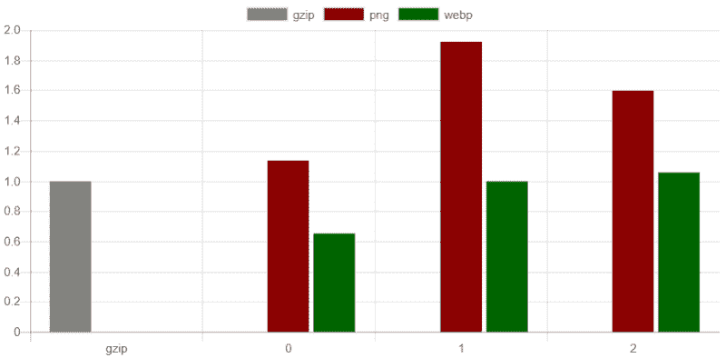

File size relative to gzip

当容量设置为 0 时，WebP 轻而易举地击败了 PNG 格式，甚至 gzip，当容量设置为 1 时，与它相等，当容量设置为 2 时，比它稍大。

最后，比较了前导十进制零配置、每个容量配置和 WebP 格式的大小。这一次，使用了一组 500，000 的数字，与上面的类型相同。

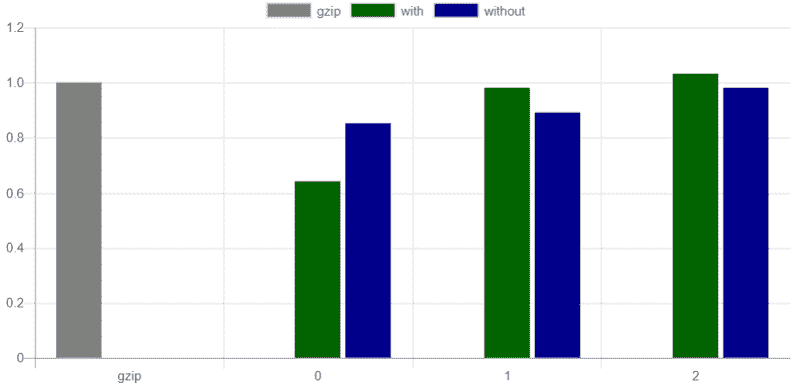

File size relative to gzip

这种特殊的配置看起来在最小容量配置上表现更差，但在其他配置上稍好一些。

我从这些测试中得到的启示是，如果数据作为预处理步骤被规范化，并且您可以使用 WebP 格式，则有可能获得更好的压缩。你也可以得到一些非常酷的图片:

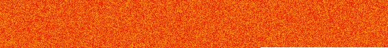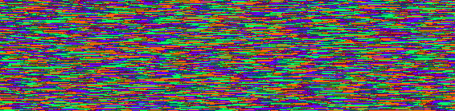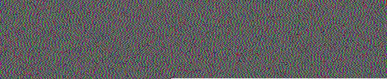

基准文件可以在 GitHub 上的[repo](https://github.com/DanRuta/IMGArrays)中找到。

#### 那么下一步是什么？

贡献总是受欢迎的，因为我很想改善这一点，并得到文件大小甚至更小。将来，当我或其他人有时间时，这可能会被移植到 WebAssembly，以获得潜在的转换速度。

其他值得添加的东西可能是一个“自动”配置，通过首先循环数据来自动确定所有配置，以查看实际需要的是什么。

最后，为了避免必须跟踪配置，以便在解析回图像时使用，所有配置都可以存储在编码输出中，作为 FF 分隔符后面的“头”像素。

但现在，总结一下，这是一个训练识别手写数字的神经网络的权重图像( [MNIST](http://yann.lecun.com/exdb/mnist/) )。假设 Medium 本身没有应用任何压缩，您应该能够使用 [jsNet](https://github.com/DanRuta/jsNet) 在 784–100–10 结构中加载它，并拥有一个训练好的模型，所有这些都来自一个 PNG 图像！

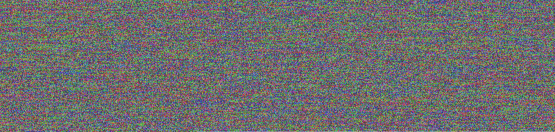

Default configuration

这里的 GitHub 页面是，我的 Twitter 是[@丹 _ 芸香属](http://twitter.com/Dan_Ruta)。