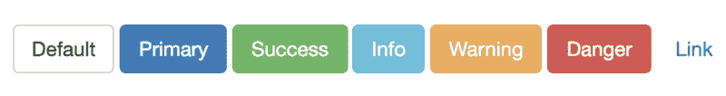
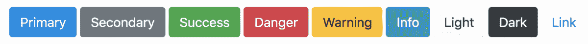
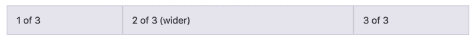
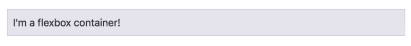
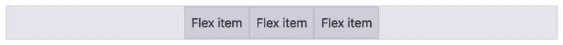
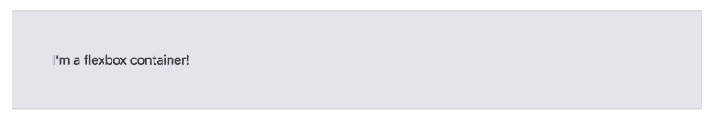
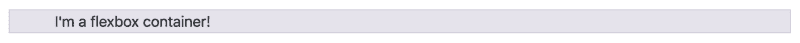
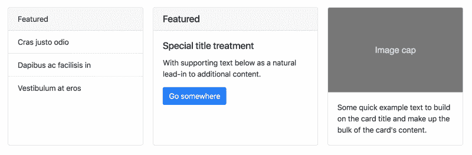
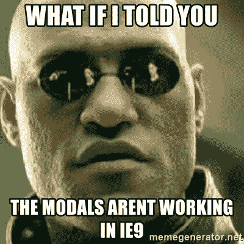

# 在 5 分钟内学习 Bootstrap 4——快速入门教程

> 原文：<https://www.freecodecamp.org/news/learn-bootstrap-4-in-5-minutes-da94728efe41/>

#### 了解世界上最流行的前端组件库的最新版本。

2018 年 1 月，Bootstrap 4(又名 v4)在 alpha 版发布两年多后终于发布了。它代表了一次重大的改写。不仅有很多变化，而且还有一些新概念需要你去思考。

因此，在本教程中，我将解释从引导 v3 到 v4 的最重要的变化。我假设您以前使用过 Bootstrap，所以我不会解释基础知识。

你也可以在 Scrimba 上查看我们关于 Bootstrap 4 的免费课程。

[**想学自举 4？这是我们的 10 节免费课程。复活节快乐！**](https://medium.freecodecamp.org/want-to-learn-bootstrap-4-heres-our-free-10-part-course-happy-easter-35c004dc45a4)

现在让我们来看看最重要的变化(排名不分先后):

### #1:扁平按钮

让我们从一个有趣且直观的开始吧！v4 中的按钮设计比 v3 中的更扁平。以下是以前的按钮:



这里有一些新的:



这更符合更现代的设计准则，比如在过去几年中非常流行的[材料设计](https://material.io/guidelines/)中发现的那些准则。

### #2:媒体提问更好

在我看来，Bootstrap v3 的网格断点太少，因为最低的断点`xs`是 768 px。很多流量通常来自比这更窄的屏幕，所以这让许多开发者感到沮丧。

所以现在他们增加了一个新的断点，`xl`。这个取了以前`lg`的角色，把剩下的断点向下推，让范围一直下到 **576 px** 。

```
$grid-breakpoints: (  xs: 0,  sm: 576px,  md: 768px,  lg: 992px,  xl: 1200px) !default; 
```

这让你更容易构建适用于所有屏幕尺寸的网格。

### #3: Flexbox 支持为您提供更多灵活性

著名的引导网格现在是用 Flexbox 而不是 floats 创建的。乍一看，这对开发人员来说并没有太大的不同，因为大多数网格布局都是一样的。然而，它确实提供了更多的可能性。

以前，您必须定义每列的宽度(从 1 到 12)。现在你可以定义一个列的*宽度，然后让其他的由 Flexbox 自动设置。*

这里有一个这样做的例子:



正如您在下面的标记中看到的，我们只将中间一列的宽度设置为 6(等于全宽的一半)，然后其余的列将简单地占用剩余的空间。

```
<div class="container">  
  <div class="row">    
    <div class="col">1 of 3</div>
    <div class="col-6">2 of 3 (wider)</div>    
    <div class="col">3 of 3</div>  
  </div>
</div> 
```

#### Flexbox 类别

Bootstrap 4 还附带了许多类，您可以应用这些类来控制 Flexbox 容器和项目。要将一个元素转换成 Flexbox 容器，只需给它一个类`d-flex`。

```
<div class="d-flex">I'm a flexbox container!</div> 
```

这将给你一个 Flexbox 容器，里面有文本:



注意:我在这里只提到与 Flexbox 相关的样式。

让我们也添加几个项目，并添加另一个类来控制它们在容器中的位置。

```
<div class="d-flex `justify-content-center"`">  
  <div>Flex item</div>  
  <div>Flex item</div>  
  <div>Flex item</div>  
</div> 
```

这使得物品在容器中居中:



您还可以在项目本身上添加类。查看文档中的 [Flex 部分](https://getbootstrap.com/docs/4.0/utilities/flex/)以了解更多相关信息。

### #4:用类控制间距

这个很酷。现在，您可以使用`p-*`和`m-*`类来控制填充和边距。通过应用从 0 到 5 的数字，范围从 0.25 雷姆到 3 雷姆。

例如，让我们给 Flexbox 容器一个`p-5`类，以便创建尽可能多的填充:

```
<div class="d-flex p-5">I'm a flexbox container!</div> 
```

这就是它的样子:



如果您想要特定边(上、下、右、左)的间距，您还可以添加`t`、`b`、`r`和`l`，如下所示:

```
<div class="d-flex pl-5">I'm a flexbox container!</div> 
```

这只会在左侧添加填充，就像这样:



注意:默认情况下，最初的 flexbox 容器实际上有一个`_p-2_`类。

### #5:从像素到像素

Bootstrap 4 在除媒体查询和网格行为之外的所有地方都用相对测量单位(rem)替换了像素。这意味着更多的灵活性和响应性，因为 rem 单位不是绝对的，而像素是绝对的。

使用`rems`，所有字体大小都相对于根元素(`html`标签)，默认情况下，`1rem`等于`16px`。然而，如果你在根元素中将字体大小改为 50%，那么整个应用程序中的`1rem`将等于`8px`。

注意，这个开关并不意味着当你在网站上应用自己的风格时，你需要使用`rems`。

### #6:卡片取代了面板、孔和缩略图

Bootstrap 还附带了一个名为 cards 的全新组件，它取代了[面板](https://getbootstrap.com/docs/3.3/components/#panels)、[威尔斯](https://getbootstrap.com/docs/3.3/components/#wells)和[缩略图](https://getbootstrap.com/docs/3.3/components/#thumbnails)。卡片是一种灵活且可扩展的内容容器。它包括页眉和页脚选项、各种各样的内容、上下文背景颜色和强大的显示选项。



### #7:再见 IE9

Bootstrap v4 已经不再支持 IE8、IE9 和 iOS 6。v4 现在只有 IE10+和 iOS 7+。对于需要这两者之一的站点，请使用 v3。



当然，还有很多变化没有出现在本文中，所以请查看文档中的[迁移部分](https://getbootstrap.com/docs/4.0/migration/)来查看所有的变化。

最后，如果你想正确地学习 Bootstrap v4，一定要查看我们在 Scrimba 上的免费课程。

此外，当你走到这一步，请随时通过 Twitter 与我联系:

感谢阅读！我叫 Per，我是 Scrimba 的联合创始人，我喜欢帮助人们学习新技能。如果你想获得关于新文章和资源的通知，请在 [Twitter](https://twitter.com/perborgen) 上关注我。

* * *

感谢阅读！我的名字叫 Per Borgen，我是最简单的学习编码方法——Scrimba 的联合创始人。如果你想学习建立专业水平的现代网站，你应该看看我们的[响应式网页设计训练营](https://scrimba.com/g/gresponsive?utm_source=freecodecamp.org&utm_medium=referral&utm_campaign=gbootstrap4_5_minute_article)。


[Click here to get to the advanced bootcamp.](https://scrimba.com/g/gresponsive?utm_source=freecodecamp.org&utm_medium=referral&utm_campaign=gbootstrap4_5_minute_article)