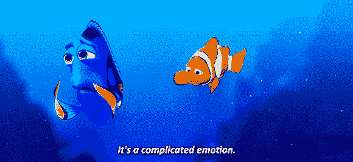
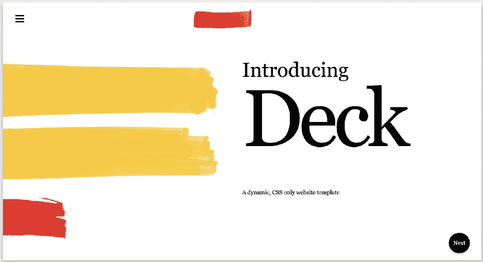
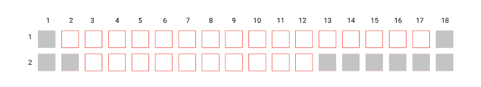
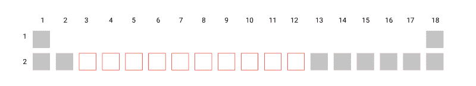
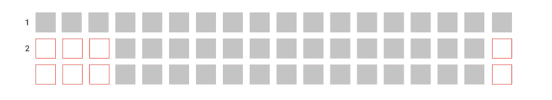
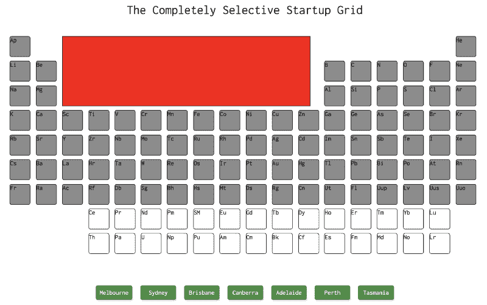
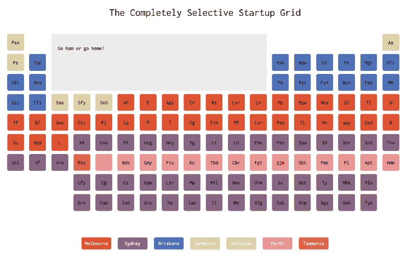
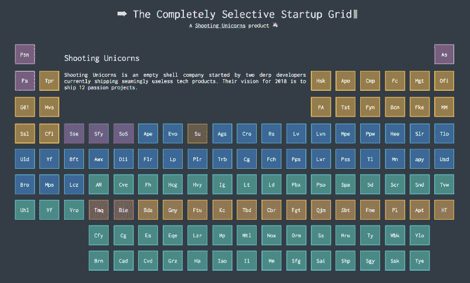

# 用 CSS 网格搭建的澳洲创业公司周期表？？

> 原文：<https://www.freecodecamp.org/news/the-periodic-table-of-australian-startups-4ab76b79ee34/>

通过射杀独角兽

# 用 CSS 网格搭建的澳洲创业公司周期表？？


Photo by [adam morse](https://unsplash.com/photos/9KoEOIuKtgI?utm_source=unsplash&utm_medium=referral&utm_content=creditCopyText) on [Unsplash](https://unsplash.com/search/photos/grid?utm_source=unsplash&utm_medium=referral&utm_content=creditCopyText)

本月, [Shooting Unicorns](https://shooting-unicorns.com) 的两位 derp 开发人员通过构建周期表开始了他们学习 CSS Grid 的旅程。作为对在公司工作 5 年并于最近告别加入创业生活的一点敬意，derps 认为分享公司流行语将是一个完美的项目。

1.  把它放到区块链上
2.  颠覆性技术
3.  我们是一家灵活的公司
4.  前沿技术
5.  它在云中
6.  我们的设计以人为中心
7.  数字化转型
8.  思想领导
9.  大数据和分析
10.  360 度视角
11.  定制设计
12.  它支持物联网
13.  创造协同效应
14.  打破筒仓
15.  实时自动化
16.  … ?

但是他们不知道元素周期表中实际上总共有 118 种元素。他们很快就意识到，想出这么多企业术语比学习 CSS Grid 本身更难。毫无疑问，企业界充斥着成千上万的流行词汇，但不幸的是，对于这两个人来说，回忆任何超过 7 个正负 2 个项目都将被视为一项非常困难的任务。



现在他们别无选择，只能做他们最擅长的事…最后一分钟旋转！？

于是… [澳大利亚创业公司周期表](https://startups.shooting-unicorns.com)就这样做了！或者他们喜欢称之为完全选择性启动网格(CSS 网格)(◔_◔)

### 这个想法

说真的，我们受到了 [Deck](http://www.hi.agency/deck/) 的启发，这是一个不用任何 Javascript 开发的演示平台，它真正激发了我们的尝试。



它可以说是 CSS 中最强大的布局系统，允许我们处理列和行，使其多维化。那天我们变得超级兴奋，真的很想做我们自己的[拍摄独角兽](https://shooting-unicorns.com)甲板，但出于某种原因，我们决定做周期表？？。

我们猜测一个原因是，虽然面板看起来真的很酷，但让它看起来漂亮会占用学习 CSS grid 本身的大量时间。你可以在这里查看这个平台的源代码。

#### 因此在过去的两周里…

我们遵循了我们认为的秘方，并使用…


为了确定网格需要多少个盒子，我们需要考虑行和列，还要考虑空格。

周期表有 118 种元素。因此，如果我们的数学没有让我们失望，让我们的网格看起来像一个将需要 18 列和 9 行，使其总共 162 个盒子。

我们的周期表的第一次迭代如下:

```
.firstElement {   grid-row: 1 / span 1;   grid-column: 1 / span 1;}
```

```
.secondElement {   grid-row: 2 / span 1;   grid-column: 1 / span 1;}
```

```
...nthElement{}
```

可以想象，过了一段时间我们最终做了 118 个类只是为了展示周期表。…嗯？。当然，有一种更干净、更易维护的方法可以正确地做到这一点？因此，我们决定不把事情掌握在自己手里，而是效仿之前的例子。

我们发现 CSS 网格使用神奇的布局算法，可以决定网格的流动。如果我们不指定流向(使用 grid-auto-flow)，那么它会先填充一行中的所有列，然后再填充下一行。

第二回合。我们删除了原来的 CSS 代码，重新开始。这次我们更聪明了。你可以在我们的源代码 [**这里**](https://github.com/shooting-unicorns/the-periodic-table-of-australian-startups) **之后参考本文的其余部分。**



首先，让我们看看周期表的第一行。第一个元素自动放置在第 1 行第 1 列。默认情况下，第二个元素将放在第 1 行第 2 列，但这不是我们想要的。根据图表，要将它放在第 18 列中，我们可以这样做:

```
.itemInEighteenthColumn {   grid-column-start: 18;}
```

所以，要得到第二列中的下一个元素，我们只需要告诉 CSS 把它放在第二行第一列，对吗？

```
.thirdElement {   grid-column-start: 1;   grid-row-start: 2;}
```

这是一种方法，但是在 CSS grid 中，在子元素上指定 grid-column-start 将自动创建那么多的列。所以在这种情况下，我们说第二个元素应该从第 18 列开始，所以我们的网格将包含 18 列。之后的任何元素都将流向下一行。



同样的概念也适用于第二行的第三个元素。我们将网格列 start 设置为第 13 行，以创建该间隙。

```
.secondRowThirdElement {   grid-column-start: 13;}
```

这使得第 13 行之前的所有列都是空白的，而其余的元素将采用从第 13 行到第 18 行的正常流程。这同样适用于其后的下一行:

```
.secondRowThirdElement, .thirdRowThirdElement {   grid-column-start: 13;}
```

我们必须考虑的唯一特例是底部的最后两行，这需要特定的网格属性。原因是这些元素并不是 HTML 中的最后几个元素，所以它们会被放错在上面的行中。要获得第 8 行和第 9 行中的元素，我们需要为这些单独的元素显式声明 grid-row-start 属性(需要将这些类添加到 HTML 中的每个单独的元素中):

```
.row-8 {   grid-row-start: 8;}
```

```
.row-9 {   grid-row-start: 9;}
```



Result after setting .row-8 and .row-9

有了这个 CSS 网格魔法，我们得到了第一个元素周期表。



#### 剧本

手动将启动数据复制并粘贴到 HTML 文件中会花费太多的精力。为了完成这项工作，我们创建了 Python 脚本将 CSV 转换成 JSON，然后从 JSON 转换成 HTML。下面是我们如何生成 HTML 的一个片段(不是最好的，但它仍然工作):

```
import json
```

```
with open('./startups.json') as startup_data:with open('./startups.html', 'w+') as f:
```

```
d = json.load(startup_data)   for startup in d:   name = startup['name']   city = startup['city']   founded = startup['founded']   description = startup['description']      htmlString= "\   <div class=\"startup-detail-container %s\"> \n\   <div class=\"startup-em\"></div>\n\   <div class=\"name\">%s</div>\n\   <div class=\"description\">%s</div>\n\   </div>\n\n"%(city.lower(), name, description)   f.write(htmlString.encode('utf-8'))
```

还有一些额外的脚本用于清理现有数据和向现有数据添加额外的信息，但是我们不会用细节来烦你。

#### 谜题的其余部分

从现在开始，剩下的就是推像素和玩颜色了。我们最初采用了拍摄独角兽的配色方案，但尽管看起来色彩缤纷，这个主题似乎有点“非主题化”。



许多天之后…我们最终决定了不是别的，正是我们终端的颜色…因为…开发商。



**Live version [here](https://startups.shooting-unicorns.com)**

我们对 CSS 还很陌生，但我们希望这个项目至少会启发或帮助其他人做同样的事情。如果你还没有看到我们的代码，你可以在这里 **查看我们的回购 [**。**我们也很乐意收到任何关于如何改进当前代码库的反馈。欢迎在下面分享你的想法，甚至提出拉动请求！](https://github.com/shooting-unicorns/the-periodic-table-of-australian-startups)**

#### 下一步是什么？？

每个月[拍摄独角兽](https://www.freecodecamp.org/news/the-periodic-table-of-australian-startups-4ab76b79ee34/undefined)会运送一个激情项目，同时学习不同的技术。一月份，这是一个名为 [Hustle Club](https://hustle.shooting-unicorns.com) 的 React 项目，这是一个帮助人们在美丽的澳大利亚找到完美加速器的平台。

三月份，我们将分享我们在 Swift 中学到的所有知识。你会看到我们是如何从初创公司发展到企业的！

**敬请关注，下次再见，黑客快乐！**

旋转次数:100% ✌️