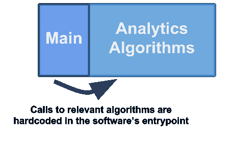
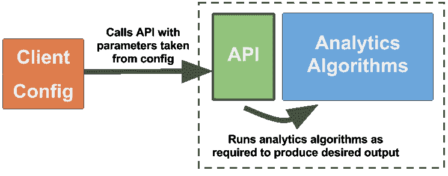
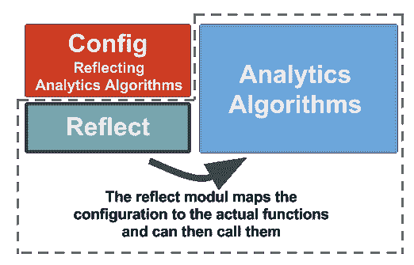

# 通过实例学习 Go 反射和通用设计

> 原文：<https://www.freecodecamp.org/news/a-practical-example-go-reflections-and-generic-designs-4868b6cdb2dc/>

大卫·里格尔

# 通过实例学习 Go 反射和通用设计


反射允许我们在程序运行时检查和修改程序的结构。在本文中，我们将查看 go `reflect`包 API 的一些部分，并通过构建一个*通用应用程序配置机制*将它们应用到现实世界的用例中。

### 我们拥有的和我们想要的

我们已经实现了一个 Go **数据分析应用程序，它将从书店的库存数据库中获取数据，对其进行处理，并将其转换为人类可读的统计模型**，以反映我们的库存状态。

例如，输出可以是某个作者出版的书籍列表，或者描述每十年出版的图书数量的条形图。

我们想要的是一种方法，让我们以抽象的方式配置应用程序从原始数据中生成的内容。可能有数百种算法都以不同的方式处理原始数据并产生不同的输出，但并非所有的输出都与我们每次运行应用程序相关。我们希望能够配置我们的应用程序来满足我们的需求，然后让它做它必须做的事情，以便提供我们想要的东西。

我们还希望能够让分析流程**以固定的配置在作业调度器**(例如 Jenkins、Rundeck 或 cron)上自动定期运行，并向我们报告我们感兴趣的输出，而不必在每次运行前与之交互。

最终，我们希望应用程序能够**容易扩展**,这样我们可以尽可能轻松地添加新算法，并且不会中断任何工作流。

**因此，简而言之，我们对架构的核心需求是:**

*   持久和抽象配置
*   人类用户和其他软件(作业调度程序)都可以通过这个接口运行应用程序
*   直观的扩展性

#### 方法 1:自满

实现这一点最直接的方法是首先将原始数据加载到我们的程序中，从应用程序的 main 函数中调用我们想要对其运行的每一个分析算法，并最终将所有数据放在一个漂亮的报告中。



Self-contained application. The client and the business logic are the same piece of software.

```
package main

func main() {
    rawData := Parse("books_db.flatfile")

// Run algorithms of our choice against the data
    bpDChart := amountOfBooksPerDecade(rawData)
    bpAList := booksPerAuthor(rawData)

createReport(bpDChart, bpAList)
}
```

就直观的可扩展性而言，这可能是最好的(直观并不意味着好)。每当我们想添加一个新的分析算法时，我们只需实现它，如果我们想运行它，就在主函数中调用它。

然而，这里有一个明显的缺点:我们不仅需要在扩展业务逻辑的时候，而且还需要在每次我们想要改变它所生成的内容的时候(也就是说，每次我们想要重新配置它的时候)，接触核心应用程序代码并重新编译应用程序。

这种方法没有为用户提供任何界面来配置应用程序。它也没有真正以抽象的方式解决我们定义应用程序做什么的需求。软件的开发者基本上是唯一能够配置其行为的人。

当然，我们可以添加一个配置文件。这将允许我们选择要执行的算法和要忽略的算法，而不必修改或重新编译应用程序代码。然而，它需要一些逻辑来将配置文件中的条目映射到我的应用程序中的(可能有数百个)函数。

每次我用新的分析算法扩展应用程序时，都需要调整这个逻辑。最终，我们可能会以一堆 if 语句运行或省略基于配置文件中是否存在字符串的算法而告终。稍后将详细介绍。

#### 方法 2:客户端友好

最常见也可能是最干净的方法是在分析软件之上提供一个漂亮的接口——一个发布的 API——和一个单独的客户端，它与这个 API 对话。然后，客户端可以决定对哪个输出感兴趣，并使用相应的参数调用适当的 API 端点。在服务器端——我们最初的分析软件——我们只需对原始数据运行相关算法，生成报告，然后将其发送回客户端。



A clean architecture with a client talking to a published API on top of the business logic. Often a great approach, but it doesn’t come for free.

这可能是最干净的架构，但也有不是最理想的情况。

看看上面的需求和前面的方法，创建一个单独的客户机只是把原来的问题从一个地方移到了另一个地方。比方说，我希望定期运行具有特定设置(即，具有我感兴趣的输出的特定定义)的分析应用程序，而不必在每次运行时都与应用程序或其客户端进行交互。我将需要某种映射到我的应用程序中的函数的持久配置。我是直接在后端还是在客户端这样做对我来说并不重要。

此外，额外的接口和客户端在可扩展性方面引入了很多惰性。每当我们添加一个新的分析算法，产生一种不同的统计模型，我们需要调整服务的接口以及与这个接口对话的客户端。根据客户是谁，这可能很值得努力，但在我们的情况下，这可能只是不合理的开销。

如果我的客户是一个人类用户，他想在特定的时间按几个按钮来接收特定的结果，那么是的，有一个干净的 API 来展示我的分析软件是必须的。但是在这种情况下，客户端是一些作业调度程序，我们只是偶尔接触一下，其他东西可能更合适。

#### 方法 3:通用

为了满足我们的需求，我们需要做两件事:提供一种设计，在扩展业务逻辑时，不需要我们维护单独的应用层(例如隔离的接口和客户端)，同时允许客户端定义行为，而不必接触应用程序的源代码。

第一种方法加上一个配置文件将提供这样的设计。编写一个简单的配置文件，解析它，然后找到合适的算法来运行是显而易见的。然而，它没有很好地解决可扩展性问题。

通过添加新的分析算法来扩展业务逻辑也需要我们将配置文件中的参数映射到新的算法。为了支持新功能，有必要修改配置阅读器。因此，我们仍然有这个额外的层，使我们的软件更难扩展。

如果我们可以将配置文件中的参数映射到业务逻辑中的函数，而不必为我们的每个(可能有数百个)分析算法显式地实现一对一(配置到代码)映射，那就太好了。倒影进入房间。


Drawing of Gopher by Renee French (reneefrench.blogspot.com)

幸运的是，我们的每个分析算法都有一个唯一的名称，我们可以通过在配置中指定它们的名称来识别我们想要运行的算法。我们通过在配置文件中键入相关算法的名称来告诉程序我们希望在最终报告中看到哪些统计数据。现在我们只需要从配置文件中获取这些名称，在业务逻辑中找到具有相同名称的函数，并执行它们(加上一些代码将所有结果放在一个报告中)。



Reflections map parameters from a configuration file living alongside the application to functions in the business logic. This allows for extension with little effort.

找到函数(给定它们的名字)的部分是通过反射完成的。反射允许我们检查业务逻辑代码结构，并检索给定函数名称的实际函数类型。

这种架构允许我们轻松地扩展业务逻辑，而不必维护应用程序的另一层或修改现有代码。配置参数到分析算法的映射以通用方式完成。

它还允许我们通过抽象接口重新配置应用程序的行为。

注意，每次我们用新的分析算法扩展应用程序时，我们仍然需要重新编译整个应用程序。插件框架可以帮助我们避免这种情况，但是这超出了本文的范围。

当然，这种架构并非没有缺点。我们的反射层只会盲目地检索函数并调用它们，而不知道这些函数需要什么或返回什么。因此，我们需要实现所有的分析算法，使它们能够接受一般类型的输入并返回一般类型的输出。

每个算法将返回不同的统计模型，但是我们需要返回那些包装在调用者(即反射层)可以处理的东西中的模型。然后，它可以将包装好的模型发送给生成报告的层，当然，该层需要能够访问实际的统计模型。

实现这一点的方式因语言而异。我们将在围棋中研究(一种方法)来解决它。

### 按名称查找函数

从普通的 YAML、JSON 或 XML 配置文件到可调用算法的第一步(当然是在将文件加载到应用程序之后)是在软件中找到一个与配置文件中给定的函数名相匹配的函数。

不幸的是，在 Go 中，没有一种直观的方法可以通过函数名来检索包中的函数。我们不能只在一端输入一个函数名，而在另一端检索可调用的东西。

但是，可以通过名称找到类型为的*方法* *。*

Go 中的方法是一个有接收方的函数，而接收方可以是在与方法相同的包中定义的任何类型。

```
type Library struct {
    books []Book
}

func (l *Library) GetMostSoldBooks(startYear, endYear int) SoldStat {
    ...
}
```

这里我们定义了一个基于类型`struct`的类型`Library`。我们现在使用上面定义的函数`GetMostSoldBooks`，提取库参数，并将其转换为接收器类型，接收器类型将函数转换为`*Library`类型的方法。另一方面，`*Library`描述了一个指向`Library`的指针。

这是可行的，不仅因为 Go 提供了一种通过名称查找类型方法的方法，还因为它允许我们将所有统计算法与`*Library`类型联系起来。在所有这些算法中，我们无论如何都需要一个这样的实例，因为它包含了我们想要在算法中处理的库的所有数据。

我们可以将函数库用作接收器，从而获得更强的耦合，而不是将函数库作为另一个参数传递给每个函数。在这种情况下，它使我们的代码更干净。现在要添加到应用程序中的每个新的统计算法必须是一个`*Library`类型的方法。

现在让我们来看看，如果我们得到的只是方法的名称，我们实际上如何使用 reflect 包来检索上面的方法。

```
import "reflect"

m := reflect.ValueOf(&Library{}).MethodByName("GetMostSoldBooks")
```

首先，我们需要接收方类型的一个实例(接收方类型是`*Library`)并通过将它传递给`reflect.ValueOf()`将其转换为`reflect.Value`。对于返回值，我们可以用我们想要检索的方法名调用`MethodByName()`。

我们得到的回报是一个包装在`reflect.Value`中的可调用函数，它将完全接受我们在方法定义中定义的参数。注意，在调用这个函数时，我们传递给`reflect.ValueOf()`的`*Library`的实例将被用作接收者类型。这意味着[重要的是](https://golang.org/pkg/reflect/#Value.MethodByName)你已经将正确的实例传递给了`reflect.ValueOf()`函数。

为了使上面例子中的返回值`m`实际上是可调用的，我们需要用正确的签名将它从`reflect.Value`转换成实际的函数类型。这将如下所示:

```
mCallable := m.Interface().(func(int, int) SoldStat)
```

请注意，我们需要先将其转换为接口类型，然后再将其转换为函数类型。

### 使方法通用化

好的，很好。我们现在有了一个可调用的方法，通过将函数名传递给我们的应用程序并让反射完成剩下的工作来检索它。但是当调用实际的函数时，我们仍然有一点问题。

我们需要知道函数的签名，以便能够将由`MethodByName()`返回的`reflect.Value`转换成一个可调用的函数。由于我们有许多不同的分析算法，它们接受的参数很可能是不同的(我们绝对不希望将特定的函数签名强加给希望扩展应用程序的开发人员)。这意味着方法签名各不相同，我们不能将反射返回的所有值都转换成完全相同的函数类型。

我们要做的是提供一个通用的函数签名。我们可以通过创建一个包装器方法来做到这一点。

```
func (l *Library) GetMostSoldBooksWrap(p GenericParams) Reportable {
    return l.GetMostSoldBooks(p.(*MostSoldBooksParams))
}
```

这里我们有一个具体方法`GetMostSoldBooks`的包装方法`GetMostSoldBooksWrap`。和具体方法一样，包装器也是一个类型为`*Library`的方法。不同的是它的签名。它接受一个通用参数`GenericParams`并返回一个类型`Reportable`的实例。在其主体中，它调用处理库数据的具体分析方法。同样新的是类型`MostSoldBooksParams`，它包装了具体方法的参数。

现在，让我们看看这些新类型来自哪里。

为了能够将`GenericParams`参数传递给具体的`GetMostSoldBooks()`方法，具体的方法还需要只接受一个单一的参数，我们可以将泛型参数转换为该参数。我们通过改变具体函数的方法签名来接受一个`*MostSoldBooksParams`参数来做到这一点。

这可能首先听起来好像我们在分析算法上强加了一个方法签名，因此与上面的陈述相矛盾。在某些方面，这是真的。但在某种程度上不是，因为`MostSoldBooksParams`是 struct 类型，因此可以包含多个字段。

```
type MostSoldBooksParams struct { 
    startYear int
    endYear int
}

func (l *Library) GetMostSoldBooks(p *MostSoldBooksParams) SoldStat {
    ...
}
```

如您所见，分析方法的参数仍然包含了我们最初在方法签名中定义的整数参数`startYear`和`endYear`。该方法还返回具体类型`SoldStat`。

让我们回到包装方法。

因为我们现在需要将配置文件中的字符串映射到包装器方法，而不是具体的方法，所以我们需要为每个分析算法准备一个包装器。需要对其进行命名，以便将该名称添加到配置文件中。

在这个解决方案中，我们用`<concrete method name&g` t 命名包装器；包装。在配置文件中，我们可以只提供相同的具体方法名，反射逻辑将在寻找方法前对字符串进行 *ppend* “包装”。

然而，每个包装函数的签名是完全相同的(否则它们将是无用的)。

```
type GenericParams interface { 
   IsValid() (bool, string)
}
```

`GenericParam`参数类型是一个接口。我们为这个接口声明了一个方法`IsValid() (bool, string)`，这意味着定义这个方法的每个结构都会自动实现`GenericParams` [接口](https://gobyexample.com/interfaces)。

这是相关的，因为在我们的包装器方法中，我们将 GenericParams 接口转换为具体的结构类型`MostSoldBooksParams`。这只有在`MostSoldBooksParams`实现了`GenericParams`接口时才有效。
因此，我们现在为我们的具体参数类型提供一个`IsValid()`方法。

```
func (p *MostSoldBooksParams) IsValid() (bool, string) {
 …
 return true, “”
}
```

`IsValid()`函数本身可以用来检查传递给具体分析方法的参数的有效性。我们可以在方法的最开始调用它。

```
func (l *Library) GetMostSoldBooks(p *MostSoldBooksParams) SoldStat
{
    if isValid, reason := p.IsValid(); !isValid {
        log.Fatalf(“\nParams invalid:: %s”, reason)
    }
    ...
}
```

最后，我们有`Reportable`类型，这是我们的一般返回值。

```
type Reportable interface { 
    Report() HTMLStatisticReport 
}
```

与泛型参数类型一样，`Reportable`也是一个接口。它声明了一个方法`Report()`，该方法将以 HTML 格式返回一个统计报告。

由于我们的通用包装方法直接返回具体方法的输出，具体方法的返回类型必须是通用包装方法的返回类型。这意味着我们的`SoldStat`类型，也就是具体分析方法返回的类型，必须实现`Reportabe`接口。

我们通过编写由接口声明的方法的实现来再次做到这一点。

```
func (p SoldStat) Report() HTMLStatisticReport {
    ...create report...
}
```

我们将需要为所有统计算法的所有不同返回类型实现这些方法，以便这些类型可以由通用包装器返回。虽然这可能会引入大量的开销，但是将每个算法的统计输出转换为人类可读的报告是无论如何都需要做的事情。

现在我们有了通用的设计，我们可以回到反射。

```
m := reflect.ValueOf(library).MethodByName("GetMostSoldBooksWrap")
mCallable = m.Interface().(func(GenericParams) Reportable)
```

这两行反射现在可以用于通过名称检索任何分析方法包装器，由此`mCallable`将是可调用的包装器方法。

### 传递参数

缺少的是方法参数。这些需要从配置文件中解析出来，就像方法名一样，然后传递给我们通过反射检索的包装器方法。这就是事情变得有点复杂的地方。

```
statistics: 
    — statsMethodName: GetMostSoldBooks 
      startYear: 1984
      endYear: 2018
```

上面显示了一个 YAML 格式的配置文件示例。我们有一个映射到列表的根元素`statistics`。列表中的每个元素都是我们想要运行的分析算法，并将其输出包含在报告中。这些元素由一个键`statsMethodName`和一个键组成，键的值是分析方法的名称，每个键对应一个参数的值。请注意，参数的名称必须与为关联方法声明的参数结构中的字段名称相匹配。在这里的例子中，参数 struct 就是我们之前声明的那个，即`MostSoldBooksParams`，带有字段`startYear`和`endYear`，这两个字段都是整数类型。

我们现在需要添加到反射中的是定义参数的字符串(和其他值类型)的映射，从配置文件到方法参数结构的字段。

因为具体方法参数 struct 在具体方法的签名中，而不在包装方法的签名中，所以除了包装方法之外，我们还需要通过反射逻辑来检索具体方法。

```
methodName := "GetMostSoldBooks" // taken from configuration file
conreteMethod := reflect.ValueOf(library).MethodByName(methodName)

wrapperName := fmt.Sprintf("%sWrap", methodName)
wrapperMethod := reflect.ValueOf(library).MethodByName(wrapperName)
```

接下来我们需要访问传递给[具体方法](https://golang.org/pkg/reflect/#Type)的参数类型。

```
concreteMethodParamsType := conreteMethod.Type().In(0).Elem()
```

`concreteMethodParamsType`现在将保存方法参数 struct 的类型。对于`GetMostSoldBooks`的情况，这是`MostSoldBooksParams`。

为了能够通过名称(在配置文件中给出)检索结构字段(表示分析算法所需的参数)，我们需要创建方法参数结构类型的实例。我们既需要指向实例的指针，也需要实例本身(稍后将会看到)。

```
concreteMethodParamsPtr := reflect.New(concreteMethodParamsType)
concreteMethodParams := concreteMethodParamsPtr.Elem()
```

在这个阶段，您可以迭代配置文件中 stats 元素的键，并将参数类型逐个映射到参数中的字段(即，根据名称检索方法参数 struct 的字段)。为了通过名字检索结构[的字段，我们可以使用`reflect.FieldByName()`。](https://golang.org/pkg/reflect/#Value.FieldByName)

```
parameterField := concreteMethodParams.FieldByName(configParam)
```

一旦我们获取了参数字段，我们就可以将配置文件中给定的参数值映射到实际的字段。

```
if configValueInt, isInt := configValue.(int); isInt {
    parameterField.SetInt(int64(configValueInt)
)
```

以上是针对整数值的情况，但是我们可以对配置文件中给定的每个参数，对我们期望的每个值类型(以试错的方式)做同样的事情。在这里设置参数字段的值也会直接影响方法参数 struct，所以我们不需要显式地改变`concreteMethodParams`来存储从配置文件中检索到的参数值。

最后，正如我们对包装方法所做的那样，我们将把`concreteMethodParams`结构转换为`GenericParams`类型。注意，我们需要使用指针类型。

```
wrapperParams := concreteMethodParamsPtr.Interface().(GenericParams)
```

### 把所有的放在一起

一旦我们有了包装器方法和泛型方法参数，我们就可以如下调用包装器。

```
wrapperMethod(wrapperParams)
```

如你所见，这只是一个普通的函数调用。它的作用与调用包装器时不经过反射过程完全一样。

最后，您将只需要一个函数，该函数对调用的分析方法的包装函数的所有返回值调用`Report()`,并将每个统计数据的报告放入一个连贯的报告文件中。

现在你应该问的问题是:**这是好代码吗？**

我的回答:**不知道。**

我能告诉你的是，这是一个值得探索的选择。特别是如果你最终需要一个与本例中需求相似的软件设计——即使只是为了学习反射。

如果你想看到使用这种设计的应用程序的完整代码，请查看:[https://github.com/Demonware/harbor-analytics](https://github.com/Demonware/harbor-analytics)