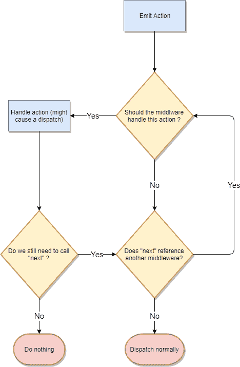

# 如何轻松创建您的第一个 Redux 中间件

> 原文：<https://www.freecodecamp.org/news/how-to-create-your-first-redux-middleware-with-ease-a75e6b1384db/>

加布里埃尔·西马托

# 如何轻松创建您的第一个 Redux 中间件


Photo by [JESHOOTS.COM](https://unsplash.com/@jeshoots?utm_source=medium&utm_medium=referral) on [Unsplash](https://unsplash.com?utm_source=medium&utm_medium=referral)

几乎每个真实的 React 应用程序都大量使用异步请求。如果您使用 Redux 管理应用程序状态，有几种方法可以处理异步操作。

您可能听说过`redux-thunk`或`redux-saga`，这是 Redux 中处理异步动作最流行的解决方案。当您需要跟踪您所在州的请求状态时，这种方法非常方便。

我经常看到的一种利用`thunks`的模式如下:

```
import {
  FETCH_DATA_ERROR,
  FETCH_DATA_PENDING,
  FETCH_DATA_SUCCESS,
} from 'constants/actionTypes';

function fetchMyDataError(error) {
  return {
    type: FETCH_DATA_ERROR,
    payload: error,
  };
}

function fetchDataPending() {
  return { type: FETCH_DATA_PENDING };
}

function fetchMyDataSuccess(response) {
  return {
    type: FETCH_DATA_SUCCESS.
    payload: response,
  };
}

function fetchData() {
  return (dispatch) => {
    dispatch(fetchDataPending());

    fetch('https://my-api.com/my-data')
      .then(res => res.json())
      .then(data => dispatch(fetchMyDataSuccess(data)))
      .catch(err => dispatch(fetchMyDataError(err)));
  };
}
```

如你所见，我们写了大量的代码。这个例子可以简化，只用一个函数就可以处理。无论哪种方式，很快就会感觉非常重复和乏味，特别是如果你需要跟踪应用程序中每个异步请求的生命周期。这种冗长无助于使用 Redux 的应用程序所需的样板文件。

当一个模式或代码块被反复使用时，在一个函数中提取它是一个好的实践。这将抽象出它的逻辑，并且只需要最少的数据来“运行”那时候我就开始玩自己写中间件的想法了。帮助我跳过样板代码，用一个小小的 API 提供强大的控制。现在让我们看一下新中间件的前一个例子:

```
import {
  FETCH_DATA_PENDING,
  FETCH_DATA_SUCCESS,
  FETCH_DATA_ERROR,
} from 'constants/actionTypes';

function fetchData() {
  return {
    types: [
      FETCH_DATA_PENDING,
      FETCH_DATA_SUCCESS,
      FETCH_DATA_ERROR,
    ],
    callAPI: fetch(‘https://my-api.com/my-data')
      .then(res => res.json()),
  }
}
```

所有那些笨拙的功能都消失了，我们的`fetchData`现在是最小的——非常简洁！？

现在让我们继续构建这种中间件的一个较小版本。这将有助于我们了解它的内部工作原理，嘿，你将能够建立自己的下一个！

### 创建中间件

让我马上向您展示这个小中间件的代码。你会发现它并不像你想象的那样势不可挡。

```
function createSlimAsyncMiddleware({ dispatch, getState }) {
  return next => action => {
    const {
      types,
      callAPI,
      shouldCallAPI = () => true,
    } = action;

    if (!actionIsValid(action)) next(action);
    if (!shouldCallAPI(getState())) {
      return Promise.resolve(getState());
    }

    const [pendingType, successType, errorType] = types;

    dispatch({ type: pendingType });

    return callAPI()
      .then(response => {
        dispatch({
          type: successType,
          payload: response,
        });

        return Promise.resolve(getState());
      })
      .catch(error => {
        dispatch({
          type: errorType,
          payload: error,
        });

        return Promise.reject(error);
     });
  };
}
```

等等……就这样？绝对的！

让我们一次走一行。这个中间件是一个函数，它返回一个函数，这个函数返回一个`Promise`。听起来很奇怪，但你会发现它比看起来简单得多。

我们的中间件函数接收一个具有两个字段的对象:`dispatch` 和`getState`。这些是 Redux 提供的[命名参数](http://2ality.com/2011/11/keyword-parameters.html)。

*   顾名思义，这是我们用来调度一个动作的。它将赋予我们在中间件内部处理动作的能力
*   `getState`:这是一个在给定时间返回当前状态的函数。如果我们想在一个动作被分派后返回更新后的状态，这可能是有用的

在**的第一行**中，我们有一个带有字段`dispatch` 和`getState`的对象参数的函数。

在**的第二行**我们返回一个函数，它带有一个名为`next`的参数。这样一个函数返回一个接受`action` 并执行某些操作的函数。稍后会详细介绍。但是`next` 是干什么的？为什么我们要返回一个函数，这个函数返回一个做某事的函数？

Redux 在幕后做的是[组合](https://github.com/reactjs/redux/blob/master/src/compose.js)中间件，这样每个中间件都有一个对……那个`next` 的引用！这个名字很有助于使它变得直观。我们正在用我们的中间件包装官方的 Redux `dispatch`函数。这建立了一个动作必须经过的管道。

请记住，您不必调用`next(action)`，但是如果您不想阻塞调度过程，您需要这样做(我们将在我们的中间件中看到一个具体的案例)。



A flow chart that explores the middleware pipeline in a simplified way

在我们的例子中，它是有用的，因为我们不想截取每个动作，只截取对我们的中间件有效的动作。为了简单起见，我添加了一个名为`actionIsValid`的检查。该函数将一个`action` 作为参数，并返回一个布尔值。返回的布尔值表示我们的中间件的这个动作的有效性。

`actionisValid` 是一个检查错误的好地方，如果有必要的话可以使用`throw` 进行检查。如果它无效，那么我将使用我们对`next` 中间件的引用，并将动作传递给它。否则我们最终可以使用动作并“做一些事情”(上面的流程图代表了这种逻辑的简化版本)。

中间件的其余部分非常直观。我们检查动作的有效性，以确定我们的异步请求是否应该继续。

`shouldCallAPI`是我们中间件 API 的一个参数。给定状态，它返回一个布尔值，决定我们的请求是否应该执行。中间件为它提供了一个默认值(一个返回`true` 的函数)。如果我们不需要进行 API 调用，那么我们返回`Promise.resolve`。这样，我们可以在任何通过中间件的异步动作上使用`.then`或`async/await`。

```
const [pendingType, successType, errorType] = types;
```

下一步是确定作为参数传入的动作`type`字段。我们使用数组[析构](https://developer.mozilla.org/en-US/docs/Web/JavaScript/Reference/Operators/Destructuring_assignment#Array_destructuring)来分解我们的`types` 数组参数。

```
dispatch({ type: pendingType });
```

现在我们终于可以使用`dispatch` 方法了。这将像您通常所做的那样调度一个 Redux 操作。这样的动作代表了我们的异步请求的“挂起”状态。

```
return callAPI()
  .then(response => {
    dispatch({
      type: successType,
      payload: response,
    });

    return Promise.resolve(getState());
  })
  .catch(error => {
    dispatch({
      type: errorType,
      payload: error,
    });

    return Promise.reject(error);
  });
```

我们终于有了最后一份`return`声明。这里我们进行 API 调用，根据`Promise`如何解析，我们分派并返回不同的值。

*   **成功**:给定 API 的响应，我们发送一个成功动作。有效负载是请求的响应。在那之后，我们返回一个`Promise`,用我们应用程序的最新状态进行解析。这允许我们使用`.then(updatedState => …do somethi` ng)
*   **错误:**如果`Promise`拒绝，那么我们发送一个错误操作。在这种情况下，有效载荷就是错误本身。

就是这样！如前所示，我们可以创建操作并按如下方式使用它们:

```
// Our Action

function fetchData() {
  return {
    types: [
      FETCH_DATA_PENDING,
      FETCH_DATA_SUCCESS,
      FETCH_DATA_ERROR,
    ],
    shouldCallAPI: state => state.dataArr.length === 0,
    callAPI: () =>
      fetch('https://my-api.com/my-data').then(res => res.json()),
  }
}

// Inside the component

class MyComponent extends Component {
  componentDidMoun() {
    this.props.fetchData()
      .then(state => {
        console.log('updated state after async action:', state);
      })
      .catch(err => {
        console.log('an error occured');
      });
  }

// Rest of the component omitted...

}
```

在这个简单的例子中，只有当数据数组为空时，我们才获取数据。然后，我们记录请求后的更新状态，或者如果`Promise`拒绝，记录一条错误消息..

### 结论

创建 Redux 中间件很直观。您可以访问商店调度员和`getState` 功能。使用它们来访问应用程序的最新状态或调度操作。

你还需要记得在必要的时候使用`next` ，并确保不要阻塞调度管道。在我们的例子中，如果我们不调用`next(action)`，任何对我们的中间件无效的动作基本上都将被丢弃⚠️！！

为了简单起见，这里省略了一些实现细节。如果你想更深入一点，可以在这里随意探索`redux-slim-async`中间件[。](https://github.com/Gabri3l/redux-slim-async)

喜欢就给它一个⭐️吧！我构建了这个中间件，目前正在生产中使用它，以避免大量的样板文件。请随意尝试，并随时提供反馈。这里有另一个更有价值的资源来探索中间件，即 [redux docs](https://redux.js.org/advanced/middleware) ！

你也可以在 twitter 上关注我 [@SuperGabry](https://twitter.com/SuperG4bry)