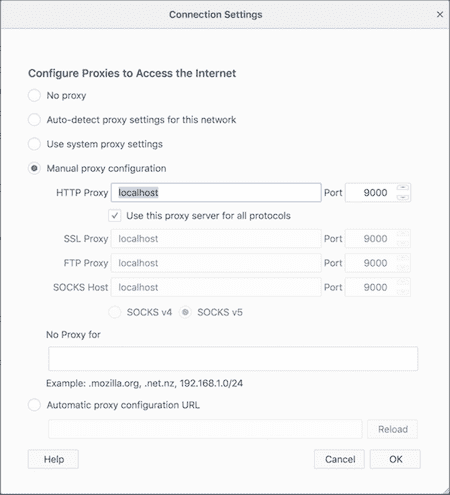
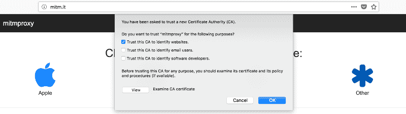
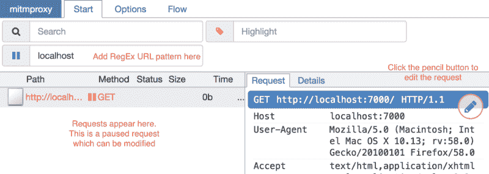
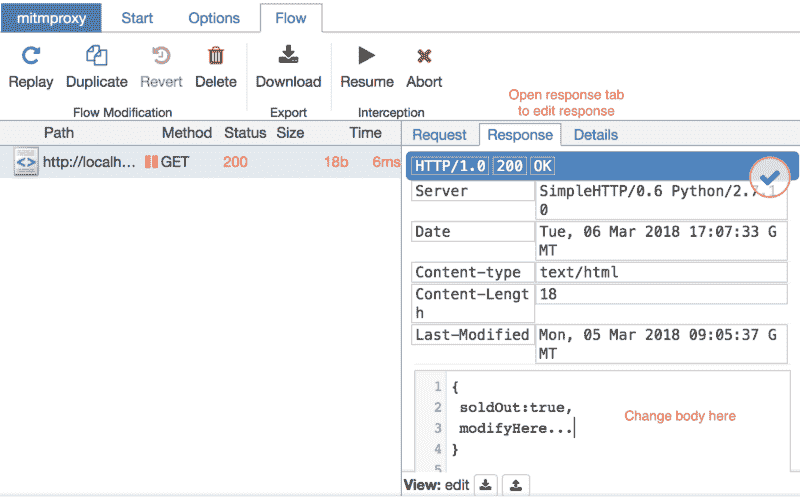
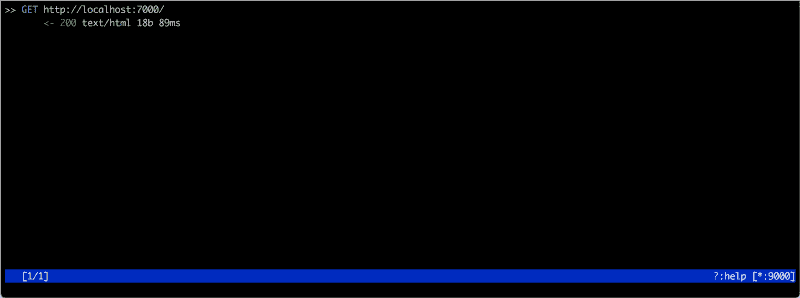
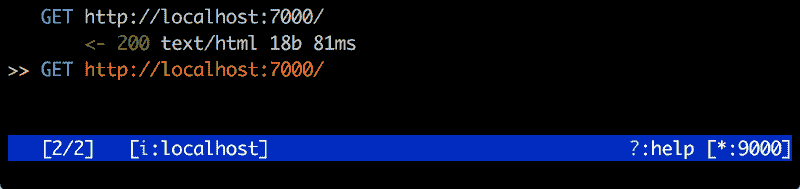
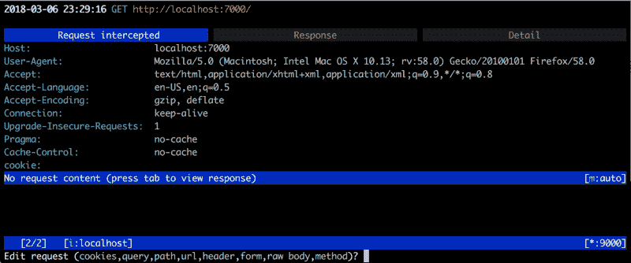
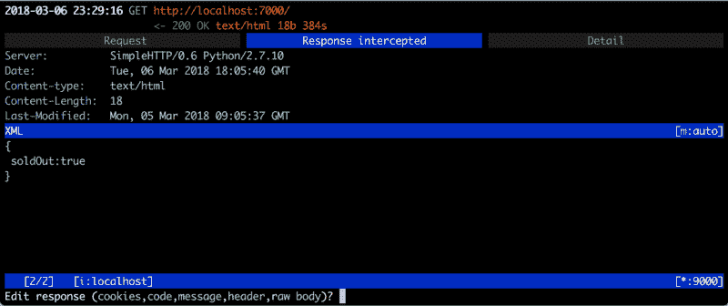

# 使用代理服务器玩虚拟游戏

> 原文：<https://www.freecodecamp.org/news/playing-make-believe-using-proxy-server-1deecc068abe/>

苏米特·古普塔

# 使用代理服务器玩虚拟游戏

#### 使用代理服务器(mitmproxy)获得所需响应的指南


假设你正在开发一个电子商务网络/移动应用的功能。当商品缺货时，你必须在“购物车”页面上显示“商品缺货”的横幅。

你点击了一个端点`/cart`，这个端点返回类似这样的东西。

```
[  {    "name": "SomeShoes",    "soldOut": false,    "price": "$50",    "quantity": 1,    ...  }]
```

当商品售完时，你得到的`soldOut`就是`true`。
为了简化开发，您需要模拟这种行为。

这样做的一些方法可以是:

1.  您将一个商品添加到购物车，然后作为另一个用户登录，购买所有可用的股票。这将模拟第一个用户的商品缺货。
2.  您将一个商品添加到购物车，然后修改数据或更改后端 API 中的代码，以确保该商品售完。

以上两种方法都可行，但都需要大量的工作。如果这些 API 是外部的，那么你几乎没有控制权。第一种方法也许可行，但第二种方法是不可能的。

如果您可以用自己的方式将`soldOut`的值更改为`true`而不使用上述任何方法，会怎么样？

> 输入代理服务器

代理服务器让您可以看到来自服务器的响应，甚至在它到达前端应用程序之前修改它。您可以拦截`/cart` API 调用，并在响应中将`soldOut`的值修改为`true`。

想象一下你会节省多少时间。你想做的只是检查你的售罄横幅出现时的样子，如果有的话。

没有人想改变世界来确保他们得到的是真的而不是假的。

#### 选择您的代理服务器

有许多代理服务器可以让你做到这一点，其中一个就是 **mitmproxy。**

mitmproxy 是一个免费的开源工具，适用于 Windows、Linux 和 Mac。

下面是如何使用 mitmproxy(下面的命令是针对 Mac 的，但它们应该也适用于 Linux)。

#### 装置

Mac: `brew install mitmproxy`
其他:你可以在这里找到安装说明[。](https://docs.mitmproxy.org/stable/overview-installation/)

mitmproxy 有命令行和 web 界面。

#### 网络界面

要启动代理服务器，请使用以下命令:

Mac: `mitmweb --port 9000 --web-port 9001`
Windows: `mitmweb.exe --listen-port 9000 --web-port 9001`

这里，`--port`和`--listen-port`用于指定代理服务器运行的端口，`--web-port`用于指定服务器 web 接口的端口。

现在打开 URL `[localhost:9001](localhost:9001)`
下面是代理服务器的 web 界面，您可以看到通过它的每个请求。


mitmproxy’s web interface

现在我们需要通过它路由所有的网络请求。

我用 Firefox 来做这个，因为它支持为 Firefox 添加代理设置和证书。

注意:也可以使用 Android 手机/模拟器或任何其他客户端。

#### **配置火狐**



#### **配置代理**

安装并打开 Firefox。
在设置中搜索“连接设置”。

在这里，您将手动添加一个代理配置。如果您遵循本指南，那么在 HTTP 代理中添加`localhost`并作为`9000`端口。
另外，清除“无代理”文本。

#### **安装 mitmproxy 证书**

您需要安装证书，mitmproxy 才能工作。否则，您的浏览器不会让您访问任何内容。

不要在您的系统上安装这些证书。仅在客户端(本指南中客户端为 Firefox)**上安装。**在您的系统上安装这些证书是一个安全漏洞。

这是我选择火狐的另一个原因。Firefox 只允许你为自己安装证书。



在你的 Firefox 中打开网址“ [mitm.it](http://mitm.it) ，然后点击“**其他**安装证书。选中“信任此 CA 来识别网站”复选框

以上步骤将只在 Firefox 中安装 mitmproxy 证书。

除非您的客户端是 Windows VM 或 iOS 模拟器/Android 模拟器或您想用作客户端的真实手机，否则不要通过点击 Apple、Windows 或 Android 来安装证书。

> 我们被锁定和加载

点击任何你想要的网址，查看 mitmproxy 的网页界面。你会在那里找到你的请求/回应。

#### **修改请求和响应**

要修改请求和响应，您必须首先截取一个请求。当你拦截一个请求时，它会被停止两次。第一次是当它发送到服务器时，第二次是当响应来自服务器时。

要拦截它，在“拦截”文本框中添加一个 URL 模式。



在上图中，我截取了包含“localhost”的 URL。请求显示在左下角的框中。当前请求在被拦截时暂停。您可以在此修改请求。

现在切换到“流”标签，点击恢复按钮。



您的请求现在已经发送到服务器，响应将会到来。这个请求将再次被暂停，但这次它将返回到 Firefox，您也可以更改响应。

#### 闪耀的时刻

现在将`soldOut`改为`true`，点击恢复按钮，看看神奇的事情发生了(*黑客*咳嗽*)。您的前端将收到修改后的响应，它会向您显示您期待已久的“商品缺货”横幅。

你可以把一切都变成回应和请求。从字面上看，从头到脚，饼干，以及其他任何东西。

#### 命令行界面(在 Windows 中不可用)

mitmproxy 也有一个优秀的命令行界面。

要在 CLI 中启动代理服务器，在这里使用命令`mitmproxy --port 9000`
，`--port`用于指定该服务器必须运行的端口。



你会看到这个。点击`?`获取命令行界面的快捷方式。

正如在 Web 界面配置部分提到的，配置您的 Firefox。

此时，您应该能够看到通过代理服务器的所有请求/响应。

要拦截一个请求，点击`i`并添加一个 URL 模式(*这是一个正则表达式*)。
与 web 接口相同，mitmproxy 拦截请求两次:一次是在去往服务器的时候，另一次是在从服务器返回的时候。



我添加了一个图案`localhost`。它拦截了一个请求。点击回车键查看这个暂停的请求。



要修改，点击`e`,你会得到你想要修改的选项。

点击`a`将请求发送到服务器。现在，您可以查看并修改响应。



上面是响应选项卡。点击`e`，您可以修改响应。再次按下`a`让响应进入 Firefox。

这些是您可以使用的一些基本命令。如需更多帮助，请点击`?`。

现在，像这样进入软件开发:


有关 mitmproxy 的更多信息，请参考此处的文档[。](https://mitmproxy.org/)

#### 如果你喜欢这篇文章，请点击？按钮并分享，帮助其他人找到它！欢迎在下方留言评论。

*原载于 2018 年 3 月 13 日[www.plightofbyte.com](https://www.plightofbyte.com/tools/2018/03/13/make-believe-using-proxy/)。*