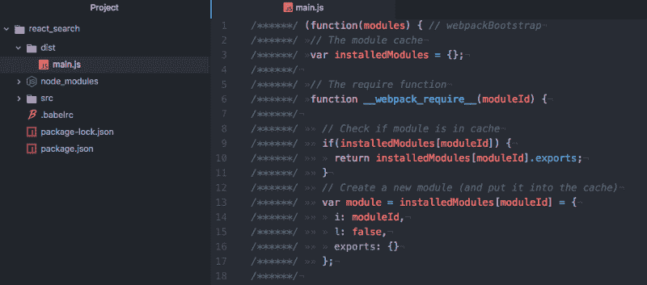
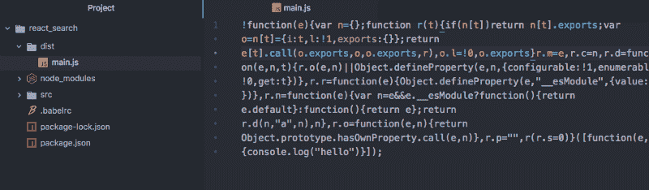
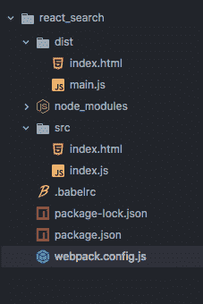
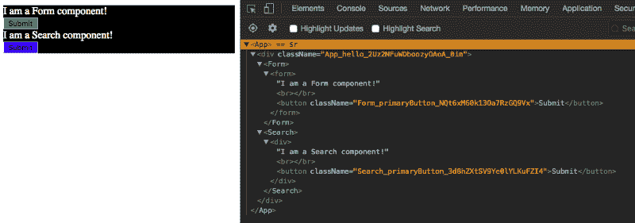
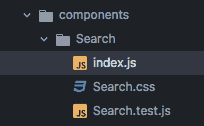

# 如何使用 Webpack 4 从头开始创建 React 应用程序

> 原文：<https://www.freecodecamp.org/news/part-1-react-app-from-scratch-using-webpack-4-562b1d231e75/>

在过去的三周里，我一直试图从头开始创建一个 React 应用程序，以了解 Webpack 的设置。我的目的是建立一个简单的配置，然后可以增长。理解 Webpack 是一场斗争。但是多亏了[瓦伦蒂诺·加利亚迪的这个](https://twitter.com/gagliardi_vale)[教程](https://www.valentinog.com/blog/webpack-4-tutorial/)，我开窍多了。

我打算做的是用一些假的 JSON 数据(或者真的)做一个搜索功能。在这篇博文中，我将介绍我的项目的设置。在下一篇文章中，我计划展示如何设置测试。我还想使用 Node.js 添加一个服务器，但不确定我的项目范围是否需要这样做。

*( **注**:我已经在这篇博文的末尾提供了我的 Webpack 设置)*

事不宜迟，让我们继续设置！

制作一个**新项目**和 **cd** 到里面:

```
mkdir react_searchcd react_search
```

创建一个 **package.json** 文件:

```
npm init
```

如果您想跳过所有问题，请添加-y 标志:

```
npm init -y
```

我们需要安装作为开发依赖的 **webpack** 和 **webpack-cli** ，以便您可以在命令行中使用 webpack:

```
npm i webpack webpack-cli -D
```

*   I:安装
*   -D: —保存-开发

用 **index.js** 创建一个 **src 文件夹**，并放置以下代码作为示例:

```
console.log("hello");
```

现在将以下脚本添加到 package.json 中(粗体):

```
{
  "name": "react_search",
  "version": "1.0.0",
  "description": "Search app using React",
  "main": "index.js",

"scripts": {
    "start": "webpack --mode development",
    "build": "webpack --mode production"

},  "keywords": [],
  "author": "",
  "license": "ISC",
  "devDependencies": {
    "webpack": "^4.0.1",
    "webpack-cli": "^2.0.10"
  }
}
```

Webpack 4 现在有两种模式，**开发**和**生产**，后者的代码最少。

通过跑步亲自体验:

```
npm run start
```

这将创建一个 **dist** 文件夹，里面有 **main.js** 文件(包含你的 src 代码)。



如果您现在运行:

```
npm run build
```

以下输出现在是这样的:



### 设置 React 和 Babel

要使用 React，我们需要将它与 Babel 一起安装。这将把代码从 ES6 转换到 ES5，因为不是所有的浏览器都支持 ES6(例如 Internet Explorer)。

安装 **react** 和 **react-dom** 作为依赖项

```
npm i react react-dom -S
```

*   -S: —保存

然后安装 **babel-core** 、 **babel-loader** 、 **babel-preset-env** 和 **babel-preset-react** 作为开发依赖:

```
npm i babel-core babel-loader babel-preset-env babel-preset-react -D
```

*   将你的 ES6 代码转换成 ES5
*   babel-loader : Webpack 助手，用 babel 转换您的 JavaScript 依赖项(例如，当您将组件导入其他组件时)
*   **babel-preset-env** :根据您想要支持的浏览器矩阵，确定要使用的转换/插件和 polyfills(在没有本地支持的旧浏览器上提供现代功能)
*   babel-preset-react :所有 react 插件的 babel 预设，例如将 JSX 转化为函数

我们需要创建一个 **webpack.config.js** 文件来陈述我们的 babel-loader 的规则。

```
module.exports = {
  module: {
    rules: [
      {
        test: /\.js$/,
        exclude: /node_modules/,
        use: {
          loader: "babel-loader"
        }
      }
    ]
  }
};
```

然后我们需要创建一个名为**的单独文件。babelrc** 为 babel-loader 提供选项。你可以把它包含在 webpack.config.js 文件中，但是我看到大多数项目都把这个分开了。这导致了更清晰的可读性，并且它可以被其他与 webpack 无关的工具使用。当你在你的 webpack 配置中声明你正在使用 babel-loader 时，它会寻找。如果有 babelrc 文件的话。

```
{
  "presets": ["env", "react"]
}
```

接下来，更改您的 **index.js** 文件来呈现一个组件:

```
import React from "react";
import ReactDOM from "react-dom";

const Index = () => {
  return <div>Hello React!</div>;
};

ReactDOM.render(<Index />, document.getElementById("index"));
```

我们还需要在 **src** 文件夹中创建一个**index.html**文件，我们可以在其中添加 id 为`index`的 section 元素。这是我们渲染主要 react 组件的地方:

```
<!DOCTYPE html>
<html lang="en">
<head>
  <meta charset="UTF-8">
  <meta name="viewport" content="width=device-width, initial-scale=1.0">
  <meta http-equiv="X-UA-Compatible" content="ie=edge">
  <title>React and Webpack4</title>
</head>
<body>
  <section id="index"></section>
</body>
</html>
```

现在我们需要安装 **html-webpack-plugin** 并在我们的 webpack 配置文件中使用它。这个插件生成一个注入了<脚本>的 HTML 文件，将**写到 dist/index** 。html，并缩小文件。

安装 **html-webpack-plugin** 作为开发依赖项:

```
npm i html-webpack-plugin -D
```

像这样更新 webpack 配置:

```
const HtmlWebPackPlugin = require("html-webpack-plugin");

const htmlPlugin = new HtmlWebPackPlugin({
  template: "./src/index.html",
  filename: "./index.html"
});

module.exports = {
  module: {
    rules: [
      {
        test: /\.js$/,
        exclude: /node_modules/,
        use: {
          loader: "babel-loader"
        }
      }
    ]
  },
  plugins: [htmlPlugin]
};
```

你也可以像这样输入插件:

```
plugins: [
    new HtmlWebPackPlugin({
    template: "./src/index.html",
    filename: "./index.html"
  });
]
```

但是我更喜欢将它提取到一个变量中，这样我就可以看到我正在使用的插件列表。

我给`template`键的值是我寻找 HTML 文件的地方。filename 值是将在 dist 文件夹中生成的缩小的 HTML 的名称。

如果你现在运行`npm run start`，你应该看到**index.html**在 dist 文件夹中生成。



运行`open dist/index.html`,你应该会在浏览器中看到“Hello React”。

### 设置 webpack-dev-server

每当您想在浏览器中看到您的更改时，一直运行这个命令有点乏味。为了让 webpack“监视”我们的更改，从而在我们对任何组件进行更改时进行刷新，我们可以使用 **webpack-dev-server** 模块。

继续将它安装为开发依赖项

```
npm i webpack-dev-server -D
```

然后将 package.json 启动脚本修改成这样(粗体):

```
{
  "name": "react_search",
  "version": "1.0.0",
  "description": "Search app using React",
  "main": "index.js",
  "scripts": {

  "start": "webpack-dev-server --mode development --open",    "build": "webpack --mode production"
  },
  "keywords": [],
  "author": "",
  "license": "ISC",
  "dependencies": {
    "react": "^16.2.0",
    "react-dom": "^16.2.0"
  "devDependencies": {
    "babel-core": "^6.26.0",
    "babel-loader": "^7.1.4",
    "babel-preset-env": "^1.6.1",
    "babel-preset-react": "^6.24.1",
    "html-webpack-plugin": "^3.0.6",
    "webpack": "^4.1.1",
    "webpack-cli": "^2.0.10",
    "webpack-dev-server": "^3.1.0"
  }
}
```

如果你现在运行`npm run start`，你应该看到 **localhost:8080** 在你的默认浏览器中打开——这就是`—-open`标志的作用。现在每次你做改变，它将刷新页面。

您还可以向 npm 启动脚本添加一个`--hot`标志，这将允许您只重新加载您已经更改的组件，而不是进行整个页面的重新加载。这是[热模块更换](https://webpack.js.org/concepts/hot-module-replacement/#src/components/Sidebar/Sidebar.jsx)。

### 设置 CSS

最后一部分涉及设置我们的 CSS。因为我们将把 CSS 文件导入到 React 组件中，所以我们需要 **css-loader** 模块来解析它们。一旦解决了这个问题，我们还需要一个**样式加载器**将其注入我们的 DOM——将一个<样式>标签添加到我们的 HTML 的< head >元素中。

继续将这两个模块作为开发依赖项进行安装:

```
npm i css-loader style-loader -D
```

然后我们需要像这样更新我们的 webpack.config.js 文件:

```
const HtmlWebPackPlugin = require("html-webpack-plugin");

const htmlWebpackPlugin = new HtmlWebPackPlugin({
  template: "./src/index.html",
  filename: "./index.html"
});

module.exports = {
  module: {
    rules: [
      {
        test: /\.js$/,
        exclude: /node_modules/,
        use: {
          loader: "babel-loader"
        }
      },
      {
        test: /\.css$/,
        use: ["style-loader", "css-loader"]
      }
    ]
  },
  plugins: [htmlWebpackPlugin]
};
```

请注意，添加这些加载程序的顺序很重要。首先，我们需要在用样式加载器将 CSS 文件添加到 DOM 之前解析它们。默认情况下，webpack 从右(数组中的最后一个元素)到左(数组中的第一个元素)使用加载器。

#### 使 CSS 模块化

我们也可以使用 webpack 使 CSS 模块化。这意味着类名将在本地确定范围，并且只特定于所讨论的组件。

为此，我们可以向 css-loader 提供一些选项:

```
const HtmlWebPackPlugin = require("html-webpack-plugin");

const htmlWebpackPlugin = new HtmlWebPackPlugin({
  template: "./src/index.html",
  filename: "./index.html"
});

module.exports = {
  module: {
    rules: [
      {
        test: /\.js$/,
        exclude: /node_modules/,
        use: {
          loader: "babel-loader"
        }
      },
      {
        test: /\.css$/,
        use: [
          {
            loader: "style-loader"
          },
          {
            loader: "css-loader",
            options: {
              modules: true,
              importLoaders: 1,
              localIdentName: "[name]_[local]_[hash:base64]",
              sourceMap: true,
              minimize: true
            }
          }
        ]
      }
    ]
  },
  plugins: [htmlWebpackPlugin]
};
```

由于我们需要给出选项，每个加载器现在都是一个具有键值对的对象。要启用 CSS 模块，我们需要将 css-loader 的**模块**选项设置为**真**。 **importLoaders** 选项配置在 css-loader 之前应该应用多少个加载器。例如，sass-loader 必须在 css-loader 之前。

**localIdentName** 允许您配置生成的标识。

*   **【名称】**将采用您的组件的名称
*   **【本地】**是您的班级名称/id
*   **【hash:base64】**是随机生成的散列，它在每个组件的 CSS 中都是唯一的

为了更形象化，我给你举个例子。假设我有一个名为`Form`的组件，我有一个 CSS 类`primaryButton`的按钮。我还有另一个名为`Search`的组件和一个带有 CSS 类`primaryButton`的按钮。但是，这两个类有不同的 CSS:

```
Form button.primaryButton {
  background-color: green;
}
Search button.primaryButton {
  background-color: blue;
}
```

当 webpack 捆绑您的应用程序时，根据哪个 CSS 是最新的，您的两个按钮都可以是绿色或蓝色，而不是绿色的 Form 和蓝色的 Search。

这就是 localIdentName 的用武之地。这样，一旦你的应用程序被捆绑，你的按钮将有一个唯一的类名！



如您所见，表单组件中的按钮类名不同于搜索组件中的按钮类名——它们的命名以组件名、类名和惟一的散列码开始。

因此，有了这个，你就不必担心你是否在整个应用程序中使用了相同的类名——你只需要担心你是否在同一个组件中使用了它。

从头开始设置 React 应用程序的第一部分到此结束。在下一篇博文中，我的目标是解释如何为 TDD 设置测试以及如何编写测试。

如果有不清楚的地方，请告诉我，我会尽我所能解释清楚。我重视并欢迎建设性的反馈，因为这有助于我提高:)

希望这有所帮助！

### 编辑

#### 导入 CSS

我收到一些评论，问我他们如何渲染 CSS，这是我之前没有提到的。您需要做的是在 React 组件中导入 CSS 文件。例如，假设您有一个搜索组件，这是您的树目录:



您需要在搜索组件中导入 CSS 文件，如下所示:

```
import style from "./Search.css"
```

然后，您可以应用不同的 CSS 类样式，例如:

```
const Search = () => {
  return <div className={style.
nameOfYourCSSClass}>
           Hello Search Component :)
         </div>
}
```

你不必称之为风格，但我发现大多数人在他们的项目中给它起了这个名字。

#### 我的 Webpack 样板

对于任何想要快速复制这个 Webpack 设置的人，我在我的 [GitHub](https://github.com/pinglinh/simple_webpack_boilerplate) 上有这个。我还在自述文件中包含了一个更简洁的指南。

#### 入口和输出点

默认情况下，Webpack 4 在您的 **src** 文件夹中有一个默认的入口点 **index.js** 。如果希望指向不同的文件，可以通过在 webpack 配置文件中指定入口点来实现:

例如

```
module.exports = {

entry: "./src/app.js",  module: {
   ...
  }
}
```

您也可以像这样指定输出文件:

```
const path = require('path')
module.exports = {
  entry: "./src/app.js",

output: {
    path: path.resolve(‘dist’),
    filename: ‘bundled.js’
  },

module: {
    ...
  }
}
```

感谢 [Gudu Kassa](https://www.freecodecamp.org/news/part-1-react-app-from-scratch-using-webpack-4-562b1d231e75/undefined) 指出这一点！

*如果你觉得这很有帮助，请在社交媒体上分享::*

[www.pinglinh.com](http://www.pinglinh.com)

在 [Twitter](http://twitter.com/pinglinh) 上关注我|查看我的 [LinkedIn](http://linkedin.com/in/lnguyenmy/) |查看我的 [GitHub](http://github.com/pinglinh)