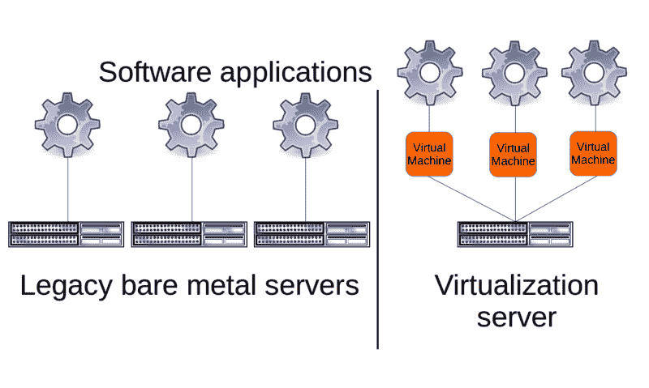
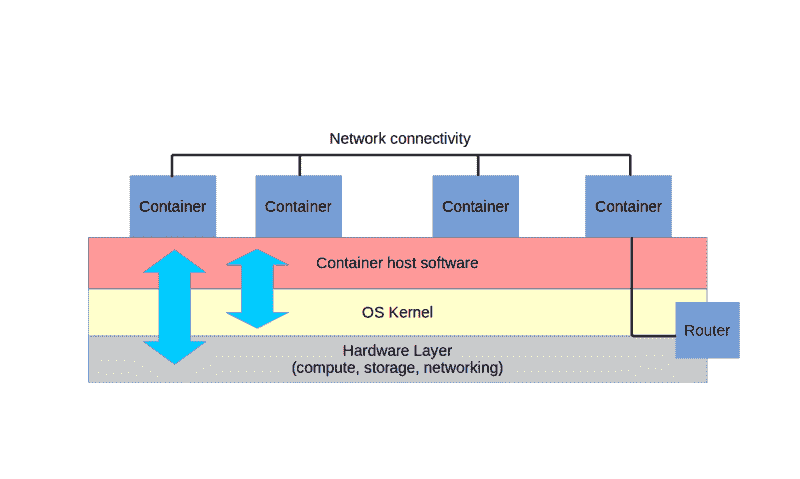
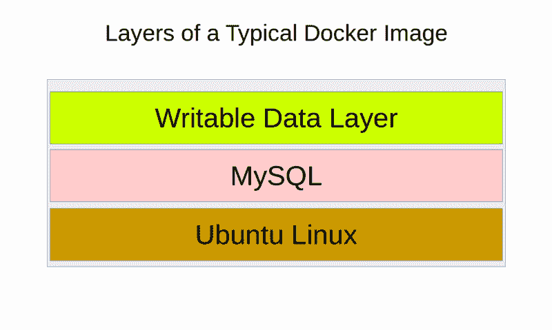

# AWS 上 Docker 的深入介绍

> 原文：<https://www.freecodecamp.org/news/an-in-depth-introduction-to-docker-on-aws-f373ff97da0e/>

容器虚拟化——最明显的代表是 Docker——是一种服务器范式，可能会在未来几年推动企业计算。

云是容器部署最明显和最合理的平台。

亚马逊网络服务在很大程度上主导了云计算世界。加起来。如果你有兴趣参与其中，你肯定会想弄清楚它是如何工作的。

首先，让我们快速定义一些关键术语。

### 虚拟化

虚拟化是将物理计算机和网络资源划分为更小、更灵活的单元，将这些更小的单元呈现给用户，就好像每个单元都是独立的资源一样。

其思想是，不是将特定的计算任务分配给单个物理服务器(有时可能会过度使用或使用不足)，而是将单个物理服务器逻辑上划分为所需数量的虚拟服务器。

这意味着，如下图所示，可能有几十个单独安装的操作系统(OS)并排运行在同一个硬盘上。每个操作系统实际上都不知道它在本地环境中并不孤立。



Multiple applications being served through physical servers or, via VMs, from a single virtualization server

实际上，管理员和客户都可以像访问任何其他服务器一样远程访问每个操作系统实例。

在这种环境中，一旦您的虚拟服务器完成其任务或变得不必要，您可以立即删除它。这将为队列中的下一个任务释放资源。

没有必要过度配置虚拟服务器来预测未来可能的需求，因为未来的需求随时都可以轻松满足。

事实上，今天的虚拟服务器可能只存在几分钟甚至几秒钟，在完成它的任务后，就被永久关闭，以便为下一个任务腾出空间。所有这些都允许更有效地使用昂贵的硬件。它提供了随意配置和启动新服务器的能力，既可以测试新的配置，也可以为您的生产服务增添新的动力。

像 AWS 这样的云计算提供商使用这样或那样的虚拟化计算机。例如，成千上万的亚马逊 EC2 实例都运行在开源的 T2 Xen T3 或 T4 KVM T5 T6 虚拟机管理程序 T7 上，这些虚拟机管理程序安装并运行在亚马逊庞大的服务器群中数以千计的物理服务器上。

无论使用哪种虚拟机管理程序技术，目标都是为多个完整、独立的虚拟计算机提供一个高度自动化的托管环境。

另一方面，像 Docker 这样的容器不是独立的虚拟机，而是经过修改的文件系统，共享物理主机的操作系统内核。这就是我们接下来要讨论的。

### 容器

什么是容器？首先，它们不是虚拟机管理程序。相反，它们是非常轻量级的虚拟服务器，如图所示，它们不是作为完整的操作系统运行，而是共享其主机操作系统的底层内核。



Virtualized containers running with access to their host’s kernel and hardware resources

容器可以从纯文本脚本构建，在几秒钟内创建和启动，并在网络间轻松可靠地共享。容器技术包括 Linux 容器项目，这是 Docker 最初的灵感。

脚本友好的容器设计使得自动化和远程管理复杂的容器集群变得容易，这些容器集群通常被部署为微服务。

微服务是一种计算服务架构，其中部署了多个容器，每个容器都有不同但互补的角色。因此，您可以启动一个容器作为数据库后端，另一个作为文件服务器，第三个作为 web 服务器。

#### 码头工人

正如我在[的一两门 Pluralsight 课程](http://pluralsight.pxf.io/c/1191769/424552/7490?subId1=solving&u=https%3A%2F%2Fapp.pluralsight.com%2Fprofile%2Fauthor%2Fdavid-clinton)中探索的那样，Docker 容器是一个其行为由脚本定义的图像。容器作为一个软件进程启动，狡猾地伪装成一个服务器。

但什么是形象呢？它是一个软件文件，包含完整操作系统文件系统的快照。启动可行的虚拟服务器所需的一切都包括在内。

一个映像可能只包含一个基本的操作系统，比如 Ubuntu Linux，或者极小且超快的 Alpine Linux。但是图像也可以包括带有软件应用程序的附加层，如 web 服务器和数据库。不管图像有多少层，它们之间的关系有多复杂，图像本身永远不会改变。

如下图所示，当图像作为容器启动时，会自动添加一个额外的可写层，用于保存任何正在进行的系统活动的记录。



A simple MySQL/Ubuntu Docker image illustrated with its writable data layer

人们通常用他们的码头集装箱做什么？通常，他们会加载某种应用程序开发项目来测试它的工作方式，然后与团队成员分享以获得反馈和更新。当应用程序完成时，它可以作为一群容器(Docker 称之为“swarm ”)启动，这些容器可以根据用户需求以编程方式即时放大或缩小。

虽然 Docker 是一种基于 Linux 的技术，并且需要 Linux 内核才能运行，但通过 Docker for Mac 或 Docker for Windows 应用程序，或者通过 Docker Machine tool，在 Mac 或 Windows 机器上运行远程甚至本地 Docker 容器是可能的。

### 云计算

云计算是通过网络远程按需提供自助式计算、内存和存储资源。

由于基于云的服务以非常小的增量计费，您可以快速配置和启动广泛的项目。由于这些资源都是虚拟的，将它们作为实验的一部分或为了解决一些短期问题而启动通常很有意义。当工作全部完成时，资源被关闭。

云平台让你做在其他任何地方都不可能做的事情——或者是极其昂贵的事情。

不确定您的项目将运行多长时间或它将吸引多少需求？也许购买、构建和安置所有昂贵的硬件来适当地支持您的内部项目是不合理的。

在服务器、冷却和路由设备上大量投资可能没有意义。

但是，如果你可以租用别人的设备，以满足快速变化的需求水平，并且只为你实际使用的设备付费，那么这可能是可行的。

### 自动警报系统

AWS 上不缺少管理 Docker 容器的方法。事实上，在框架、编排接口、图像存储库、
和混合解决方案之间，多样性可能会令人困惑。

本文不会深入探讨每一个选项，但您至少应该知道您的所有选择:

亚马逊的 [EC2 容器服务](https://aws.amazon.com/ecs/) (ECS)利用专门配置的 EC2 实例作为集成 Docker 容器的主机。您不必亲自动手操作 EC2 实例本身，因为您可以通过 ECS 框架供应和管理您的容器。ECS 现在通过其 Fargate 模式选项提供了更高的抽象性(和简单性)。

[AWS CloudFormation](https://aws.amazon.com/cloudformation/) 允许您将 AWS 资源的任意组合配置到一个可以部署一次或多次的模板中。您可以在模板中包含指定的依赖项和自定义参数。鉴于其自包含和可脚本化的设计，CloudFormation 是 Docker 部署的自然环境。事实上，Docker 本身提供了其 Docker for AWS 服务(目前处于测试阶段)，该服务将自动生成一个 CloudFormation 模板，以编排一群 Docker 容器在您帐户内的 AWS 基础架构上运行。

[AWS 弹性豆茎](https://aws.amazon.com/elasticbeanstalk/)有效地位于 ECS 之上。它允许您跨 ECS 通常使用的所有 AWS 资源部署您的应用程序，但是几乎所有的逻辑都被巧妙地抽象掉了。实际上，要启动一个完全可扩展的复杂微服务环境，您所需要的只是一个名为`Dockerrun.aws.json`的文件中的 JSON 格式的声明性脚本。您可以将脚本上传到 GUI，或者使用 AWS Beanstalk CLI 从初始化的本地目录上传。

针对 Kubernetes (EKS)的亚马逊弹性容器服务目前仍处于预览阶段。这是一个允许你使用开源的 Kubernetes orchestrator 管理容器的工具，但是不需要安装你自己的集群。与 ECS 一样，EKS 将为您的群集部署所有必要的 AWS 基础架构，无需手动干预。

在撰写本文时，AWS 的 Docker 仍处于测试阶段。使用其浏览器界面，您可以使用该服务来安装和运行“一群 Docker 引擎”，这些引擎与自动扩展、负载平衡(ELB)和块存储等 AWS 基础设施服务完全集成。

Docker Datacenter(现在作为 Docker Enterprise Edition 的一部分进行营销)是一个 AWS/Docker 联合项目，它为商业客户提供了一个更加可定制的接口，用于将 Docker 与 AWS、Azure 和 IBM 基础架构集成。

[Docker Cloud](https://cloud.docker.com/) 与 Docker Datacenter 非常相似，它提供了一个基于浏览器的 GUI 控制台，用于管理 Docker 部署的各个方面。这包括管理在公共云中运行的主机节点。最大的区别是，与数据中心不同，Docker 云管理服务是从自己的站点托管的。你自己的设备上不需要安装服务器软件。

Docker Hub 可能是寻找和分享 Docker 图片的首选之地。Docker Hub 由 Docker 自己提供，它保存了大量预加载的图像，以支持各种应用程序项目。您可以在 hub.docker.com 网站上查找和研究图像，然后将它们直接放入您自己的 Docker 引擎环境中。

[EC2 容器注册中心](https://aws.amazon.com/ecr/) (ECR)是亚马逊自己的映像注册中心，与他们的 EC2 容器服务平台配套。可以通过 AWS GUI 或 CLI 工具推、拉和管理映像。权限策略可以严格控制只有您选择的人才能访问图像。

我想你已经准备好开始了。如果你还没有，一定要去亚马逊网站创建一个 AWS 账户。如果您还不熟悉这一切是如何工作的，新客户可以获得一整年的免费服务级别的试验。假设你还是第一年，我们在这门课程中做的任何事情都不会花你一分钱。

接下来，我们将揭开 Docker 的盖子，看看它在最基本的层面上是如何工作的:您的笔记本电脑命令行。从技术上讲，这与 AWS 工作负载没有什么关系，但是这将是更好地理解工作流的一个很好的方法。

### Docker 简介

如果您首先了解 Docker 本身的情况，那么正确地可视化所有 AWS 部件的工作方式可能会更容易。因此，在本文中，我将带您在我的本地工作站上启动和配置一个简单的 Docker 容器。

准备好了吗？

#### Docker 命令行

让我们看看这个东西实际上是如何工作的。我将让 Docker 在我的本地工作站上运行，然后用一个快速的 hello-world 操作来测试它。然后我会提取一个真正的 Ubuntu 镜像并运行它。

出于几个原因，我不会在这里介绍在您的机器上安装 Docker 的过程。首先，具体情况会因您运行的操作系统而有很大差异。但是它们也可能经常改变，所以我在这里写的任何东西都可能在不久后过时。最后，所有这些都与 AWS 无关。在 docs.docker.com/install 查看码头工人自己的说明。

在这个过程中，我将尝试一些 Docker 的命令行工具，包括创建一个新的网络接口，并将其与一个容器相关联。这种环境配置对于涉及需要逻辑分离的多层资源的实际部署非常有用。

大多数 Linux 发行版现在通过 [systemctl](https://www.freedesktop.org/software/systemd/man/systemctl.html) 命令使用 [systemd](https://www.freedesktop.org/wiki/Software/systemd/) 来处理进程。在这种情况下，`systemctl start docker`将启动 Docker 守护进程，如果它还没有运行的话。`systemctl status docker`将返回一些有用的信息，包括出错时的深度错误消息。在这种情况下，一切看起来都很健康。

```
# systemctl start docker# systemctl status docker
```

这是唯一一个 Linux 特有的部分。从现在开始，我们将使用可以在正确安装 Docker 的任何地方使用的命令。

#### 推出集装箱

从 docker 命令行运行命令总是以单词“Docker”开头。新安装系统的第一个测试通常是
使用`docker run`启动一个小映像——在本例中是专门构建的“hello-world”映像。

从下面的输出可以看出，Docker 首先在本地系统上寻找图像。Docker 在这方面效率特别高。在转向远程资源之前，它总是试图重用本地可用的元素。

在这种情况下，由于这个新环境中没有现有的映像，Docker 从官方 Docker 库中取出 hello-world。

```
$ docker run hello-world
Unable to find image ‘hello-world:latest’ locally
latest: Pulling from library/hello-world
ca4f61b1923c: Pull complete
Digest: sha256:66ef312bbac49c39a89aa9bcc3cb4f3c9e7de3788c9
44158df3ee0176d32b751
Status: Downloaded newer image for hello-world:latest2.1\. 
Hello from Docker!
This message shows that your installation appears to be
working correctly. To generate this message, Docker took the
following steps:
1\. The Docker client contacted the Docker daemon.
2\. The Docker daemon pulled the “hello-world” image
from the Docker Hub. (amd64)
3\. The Docker daemon created a new container from that
image which runs the executable that produces the output you
are currently reading.
4\. The Docker daemon streamed that output to the Docker client,
which sent it to your terminal.
To try something more ambitious, you can run an Ubuntu container
with:
$ docker run -it ubuntu bash
Share images, automate workflows, and more with a free Docker ID:
https://cloud.docker.com/
For more examples and ideas, visit:
https://docs.docker.com/engine/userguide/
```

该命令的完整输出包括对刚刚发生的事情的有用的四部分描述。Docker 客户机联系 Docker 守护进程，守护进程继续从存储库中下载 hello-world 映像。docker run 命令将图像转换成一个运行中的容器，该命令的输出被传输到我们的命令行 shell——Docker 客户机。

让我给你解释一下这些术语:

*   **Docker 客户端** —通过运行 docker
    命令激活的命令行外壳
*   **Docker 守护进程**——我们在
    之前用`systemctl`命令启动的本地 Docker 进程
*   **映像** —包含将用于组成
    操作系统的数据的文件

只需输入`docker`就会打印出一个有用的常用命令列表和
以及简短的描述，d `ocker info`会返回关于
Docker 客户端当前状态的信息。

注意，我们目前有一个容器和一个图像(hello-world 容器),现在没有容器在运行。

```
$ docker info
Containers: 1
Running: 0
Paused: 0
Stopped: 1
Images: 3
Server Version: 1.13.1
Storage Driver: aufs
Root Dir: /var/lib/docker/aufs
Backing Filesystem: extfs
Dirs: 28
Dirperm1 Supported: true
Logging Driver: json-file
Cgroup Driver: cgroupfs
Plugins:
Volume: local
Network: bridge host macvlan null overlay
```

#### 交互式容器会话

让我们试试 Docker 文档先前建议的“更雄心勃勃的”`docker run -it ubuntu bash`命令。这将下载最新的官方基础 Ubuntu 映像，并将其作为容器运行。

`-i` 选项将使会话具有交互性，这意味着您将被放入正在运行的容器中的一个活动外壳中，在那里您将能够像在任何其他服务器上一样控制事情。`-t`参数将打开一个 TTY 壳。

```
$ docker run -it ubuntu bash
Unable to find image ‘ubuntu:latest’ locally
latest: Pulling from library/ubuntu
1be7f2b886e8: Pull complete
6fbc4a21b806: Pull complete
c71a6f8e1378: Pull complete
4be3072e5a37: Pull complete
06c6d2f59700: Pull complete
Digest: sha256:e27e9d7f7f28d67aa9e2d7540bdc2b33254
b452ee8e60f388875e5b7d9b2b696
Status: Downloaded newer image for ubuntu:latest
root@c81a051f6f03:/#
```

注意新的命令行提示`root@c81a051f6f03:/#`。我们现在实际上是在一个最小但工作正常的 Docker 容器中。

例如，我们可以更新我们的软件库索引。

```
# ls
bin dev home lib64 mnt proc run srv tmp var boot etc lib media opt root sbin sys usr
# apt update
Get:1 http://security.ubuntu.com/ubuntu xenial-security InRelease
Get:2 http://archive.ubuntu.com/ubuntu xenial InRelease
[…]
Fetched 24.8 MB in 48s (515 kB/s)
Reading package lists… Done
Building dependency tree
Reading state information… Done
6 packages can be upgraded. Run ‘apt list — upgradable’ to
see them.
```

如果我退出容器，它将关闭，我会发现自己回到我的主机服务器。再次输入`docker info`现在显示两个停止的容器，而不是一个。

```
$ docker infoContainers: 2Running: 0Paused: 0Stopped: 2Images: 4[…]
```

#### 在后台运行容器

我可以通过添加将返回容器 ID 的`detach=true`选项在后台启动一个容器。用`ps`列出所有活动的 docker 容器将显示我的新的**运行的**容器。

```
$ docker info
Containers: 2
Running: 0
Paused: 0
Stopped: 2
Images: 4
[…]
```

#### 管理容器

正如您可以从`wizardly_pasteur`名称中看到的，设计 Docker 的人汇编了一个相当古怪的名称池来分配给您的容器。如果你想重命名一个容器——也许这样管理它需要更少的输入——运行`docker rename`,然后是当前的容器名和你想给它起的新名字。我将再次运行`docker ps`,以展示实际的更新。

```
$ docker rename wizardly_pasteur MyContainer
$ docker ps
CONTAINER ID IMAGE COMMAND CREATED STATUS NAMES
232a83013d39 ubuntu “bash” 3 minutes ago Up 5 minutes MyContainer
```

`docker inspect`后跟一个容器名，将返回关于该容器的配置和环境的有用信息的页面。我在下面包含的输出片段显示了容器的网络环境细节。注意，网络网关是`172.17.0.1`，容器的实际 IP 地址是`172.17.0.2` ——这在后面会很有用。

```
$ docker inspect MyContainer
[...]
            "Gateway": "172.17.0.1",
            "GlobalIPv6Address": "",
            "GlobalIPv6PrefixLen": 0,
            "IPAddress": "172.17.0.2",
            "IPPrefixLen": 16,
            "IPv6Gateway": "",
            "MacAddress": "02:42:ac:11:00:02",
            "Networks": {
                "bridge": {
                    "IPAMConfig": null,
                    "Links": null,
                    "Aliases": null,
[...]
```

#### Docker 网络公司

`docker network ls`将列出当前与 Docker 客户端关联的所有网络接口。请特别注意`bridge`接口，它将容器连接到 Docker `host`，允许网络通信进出容器。

```
$ docker network ls
NETWORK ID          NAME            DRIVER        SCOPE
fa4da6f158de        bridge          bridge        local
18385f695b4e        host            host          local
6daa514c5756        none            null          local
```

我们可以通过运行`docker network create`来创建一个新的网络接口，后面跟着我们想要给新接口起的名字。通过`Driver`值，对新接口运行`inspect`向我们展示了这个新接口已经自动与我们之前看到的网络`bridge`相关联，但是存在于它自己的`172.18.0.x`网络中。你会记得我们的默认网络使用的是`172.17.0.x`。

```
$ docker network create newNet
715f775551522c43104738dfc2043b66aca6f2946919b39ce
06961f3f86e33bb
$ docker network inspect newNet
[
    {
        "Name": "newNet",
 [...]
        "Scope": "local",
        "Driver": "bridge",
        "EnableIPv6": false,
        "IPAM": {
            "Driver": "default",
            "Options": {},
            "Config": [
                {
                    "Subnet": "172.18.0.0/16",
                    "Gateway": "172.18.0.1"
 [...]
]
```

迷茫？我的《解决技术问题》一书中有一章是关于基本的 TCP/IP 网络的。

#### 在网络间移动容器

有时，您可能希望将现有的容器从一个网络移动到另一个网络——可能需要重新组织并更好地保护您的资源。通过将 Ubuntu 容器移动到不同的网络来尝试一下，就像我们刚刚创建的`newNet`接口。使用`docker network connect`，后跟网络名`newNet`，然后是容器名`MyContainer`。

```
$ docker network connect newNet MyContainer
```

再次在容器上运行`inspect`将向您显示`MyContainer`现在连接到了`bridge`接口的`172.17.0.2`地址、**和**`172.18.0.2`上的`newNet`接口。它现在就像一台计算机，有两个网络接口卡物理连接到不同的网络。

不相信我？您可以从命令行成功地`ping`这两个接口，因此我们可以看到它们都是活动的。顺便说一下，所有这些都是可能的，尽管事实上容器一直在运行。不要在物理机上尝试！

```
$ ping 172.17.0.2
PING 172.17.0.2 (172.17.0.2) 56(84) bytes of data.
64 bytes from 172.17.0.2: icmp_seq=1 ttl=64 time=0.103 ms
64 bytes from 172.17.0.2: icmp_seq=2 ttl=64 time=0.070 ms
^C
 — — 172.17.0.2 ping statistics — -
2 packets transmitted, 2 received, 0% packet loss, time 999ms
rtt min/avg/max/mdev = 0.070/0.086/0.103/0.018 ms
$ ping 172.18.0.2
PING 172.18.0.2 (172.18.0.2) 56(84) bytes of data.
64 bytes from 172.18.0.2: icmp_seq=1 ttl=64 time=0.079 ms
64 bytes from 172.18.0.2: icmp_seq=2 ttl=64 time=0.062 ms
^C
 — — 172.18.0.2 ping statistics — -
2 packets transmitted, 2 received, 0% packet loss, time 999ms
rtt min/avg/max/mdev = 0.062/0.070/0.079/0.011 ms
```

#### 使用 docker 文件

虽然可以从命令行定义和控制容器，但是这个过程可以通过名为 [Dockerfiles](https://docs.docker.com/engine/reference/builder/) 的脚本来很大程度上实现自动化。作为 docker 构建操作的一部分运行`Dockerfile`将告诉 Docker 使用脚本指定的配置创建一个容器。

在下面显示的`simple dockerfile`示例中，`FROM`行告诉 docker 主机使用 Ubuntu 版本 16.04 作为基本操作系统。如果本地系统上还没有 Ubuntu 16.04 镜像，Docker 会下载一个。

```
# Simple Dockerfile
FROM ubuntu:16.04
RUN apt-get update
RUN apt-get install -y apache2
RUN echo “Welcome to my web site” > /var/www/html/index.html
EXPOSE 80
```

每一行`RUN`在操作系统中启动一个命令，其结果将包含在容器中——甚至在它作为一个活动的虚拟机实际启动之前。

在这种情况下，`apt-get update`更新本地存储库索引以允许软件下载，`apt-get install apache2`将下载并安装 Apache webserver 包。对于安装过程中出现的任何提示，`-y`将自动回答“是”。

`echo`命令将用我定制的`Welcome`文本替换`index.html` 文件的内容。`index.html`当然是浏览器访问一个新网站时首先寻找并加载的文件。

最后，`EXPOSE 80`打开容器上的端口 80 以允许 HTTP 流量——这是必要的，因为这将是一个 web 服务器。这将允许我们从 Docker 主机访问 web 服务器。您有责任为您可能想要邀请的任何远程客户端提供对主机的访问权限。

如果你关注最新的 Ubuntu 软件包管理新闻，你会知道已经有了从`apt-get` 到新的`apt`替代品的转变。那么为什么我在那个`Dockerfile`里用了`apt-get` ？因为它在脚本环境中使用更可靠。

要基于这个 docker 文件实际创建一个容器，您需要用`-t`创建容器的名称(或“标签”)。我和`webserver`一起去。您添加一个空格，然后添加一个点，告诉 Docker 读取当前目录中名为`Dockerfile`的文件。Docker 将立即开始在我们之前提取的 Ubuntu 映像上构建一个容器，并运行`apt-get`和`echo`命令。

```
$ docker build -t “webserver” .
Sending build context to Docker daemon 2.048 kB
Step 1/5 : FROM ubuntu:16.04
16.04: Pulling from library/ubuntu
Digest: sha256:e27e9d7f7f28d67aa9e2d7540bdc2b33254b452ee8e
60f388875e5b7d9b2b696
Status: Downloaded newer image for ubuntu:16.04
 — -> 0458a4468cbc
Step 2/5 : RUN apt-get update
 — -> Running in c25f5462e0f2
[…]
Processing triggers for systemd (229–4ubuntu21) …
Processing triggers for sgml-base (1.26+nmu4ubuntu1) …
 — -> 3d9f2f14150e
Removing intermediate container 42cd3a92d3ca
Step 4/5 : RUN echo “Welcome to my web site” > 
/var/www/html/index.html
 — -> Running in ddf45c195467
 — -> a1d21f1ba1f6
Removing intermediate container ddf45c195467
Step 5/5 : EXPOSE 80
 — -> Running in af639e6b1c85
 — -> 7a206b180a62
Removing intermediate container af639e6b1c85
Successfully built 7a206b180a62
```

如果我运行`docker images`，我将会看到一个名为`webserver`的 Ubuntu 镜像版本。

```
$ docker images
REPOSITORY TAG IMAGE ID CREATED SIZE
webserver latest 7a206b180a62 3 minutes ago 250 MB
ubuntu 16.04 0458a4468cbc 12 days ago 112 MB
hello-world latest f2a91732366c 2 months ago 1.85 kB
```

现在我们准备使用`docker run`启动容器。

正确构建这个命令是一个微妙的过程，有很多地方可能出错。`-d`参数告诉 Docker 运行这个分离的容器，这意味着我们不会发现自己在容器的命令行上，但它将在后台运行。`-p`告诉 Docker 将来自端口`80`(默认 HTTP 端口)的**的任何流量通过**转发到容器上的**端口`80`。这允许外部访问 web 服务器。我不能说我明白为什么，但这里的顺序很关键:只在** `-d`后加`-p`论元**。

接下来，我们告诉 Docker 我们想要启动的容器的名称，在我们的例子中是`webserver`。之后，我们告诉 Docker 在容器运行时运行一个命令来启动 Apache 服务器。**

```
$ docker run -d -p 80:80 webserver \ /usr/sbin/apache2ctl -D FOREGROUND
```

也许你想知道为什么我没有使用更现代的`Systemd`命令`systemctl start apache`。我试了一下，发现至少在这一点上，systemd 在 Ubuntu Docker 容器中是好的，但有问题。如果你知道什么对你有好处，就远离它。`-D FOREGROUND`确保 Apache——以及整个容器——即使在启动完成后也能保持运行。为你自己运行它。

我们得到了一个新集装箱的 ID，其他一无所知。您可以运行`docker ps`，您应该会在所有正在运行的容器列表中看到我们的`webserver`。您还应该能够通过将浏览器指向容器的 IP 地址来打开 webserver 的`index.html`页面。

那是什么？你**不知道**你的集装箱的 IP 地址吗？因为容器已经与默认的`bridge`网络相关联，所以您可以使用`docker network inspect bridge`,在输出的容器部分，您应该可以找到您想要的东西。对我来说，那就是`172.17.0.3`。

#### 使用 Docker Hub 图像

我们已经享受了 Docker Hub 提供的一些好处。我们在前面的剪辑中用来构建容器的图像都是从 Docker Hub 后台无缝下载的。

事实上，使用类似于`docker search apache2`的东西，您可以手动地在资源库中搜索预装 Apache 的公共可用图像。你也可以浏览 Docker Hub 网站上的内容。

然而，你应该记住，并不是所有这些图像都是可靠的，甚至是安全的。你会想要寻找那些已经赢得了许多评论之星，特别是被指定为“官方”的结果。运行`docker search ubuntu`至少会返回一些官方图片。

找到自己感兴趣的东西？您可以使用 d `ocker pull`将其添加到您的本地收藏中。下载完成后，您可以使用`docker images`查看您的图像。

```
$ docker pull ubuntu-upstart
```

在 Docker Hub 网站上，花点时间创建一个免费帐户。这将允许你像使用 GitHub 这样的工具一样存储和分享你自己的图片。这可能是 Docker 最受欢迎的用例，因为它允许远程工作的团队成员或在同一办公室工作的懒惰开发人员即时可靠地访问项目进展每个阶段使用的确切环境。

这些都是最基本的，清楚地理解它们很重要。但是，由于同时协调几十个或几千个容器集群的复杂性，大多数严重的容器工作负载不会使用这些特定的命令行工具。

相反，您很可能想要一个更健壮、功能更丰富的框架。你可以在我的文章“[太多选择:如何选择正确的工具来管理你的 Docker 集群](https://hackernoon.com/too-many-choices-how-to-pick-the-right-tool-to-manage-your-docker-clusters-b5b3061b84b7)”中了解其中的一些工具，包括 Docker 自己的 Docker Swarm Mode、Docker Enterprise Edition 或 Docker Cloud 和 Kubernetes。

*这篇文章主要基于我为 Pluralsight 撰写的[视频课程。我还通过我的](http://pluralsight.pxf.io/c/1191769/424552/7490?subId1=solving&u=https%3A%2F%2Fapp.pluralsight.com%2Fprofile%2Fauthor%2Fdavid-clinton)[网站](https://bootstrap-it.com/)获得了大量 Docker、AWS 和 Linux 内容，包括指向我的书 [Linux in Action](https://www.manning.com/books/linux-in-action?a_aid=bootstrap-it&a_bid=4ca15fc9) 的链接，以及一个名为 [Linux in Motion](https://www.manning.com/livevideo/linux-in-motion?a_aid=bootstrap-it&a_bid=0c56986f&chan=motion1) 的混合课程，该课程由两个多小时的视频和大约 40%的 Linux in Action 文本组成。*