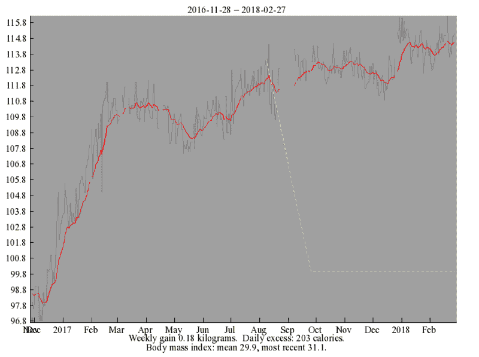
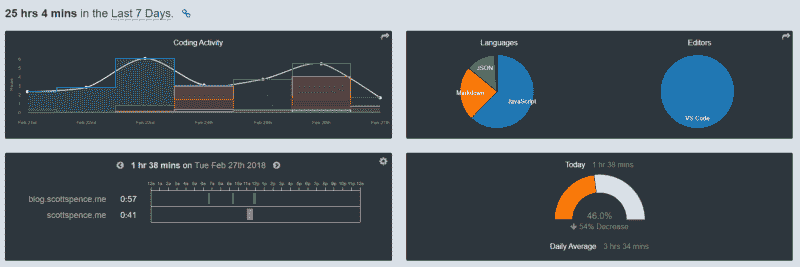

# 如何为 100 天的代码腾出时间

> 原文：<https://www.freecodecamp.org/news/how-to-make-time-for-100-days-of-code-776cd6e0de49/>

> 生活节奏很快。如果你不偶尔停下来四处看看，你可能会错过它。——费里斯·布勒

我在 freeCodeCamp 度过了一段有趣又刺激的时光。当我第一次开始使用 freeCodeCamp 的时候，我经常看到这样的信息，听起来也像是序言

> 让我们在几个月内学会一项新技能，找到一份新工作。

你会看到很多类似“嘿，我以前是学校老师，现在是 x startup 的工程师，收入 10 万美元”的文章。如果你刚开始从事网站开发，你周围都是想有所成就的人——你知道，他们会成功的。你也会的！

这里有一点期望与现实的对比。如果你是那种能记住大量与你所选择的领域相关的信息的人，那么你就是赢家。至于我自己，就是重复再重复，直到变成一种**习惯**。关于习惯有很多要说的。

尽管养成习惯需要时间。2016 年[12 月 30 日，](https://github.com/spences10/100-days-of-code/commit/7dbefb608862401d4cb9e6ed11f539b44bedcdae)我决定参加#100DaysOfCode 挑战赛。我无法向你描述我当时的感受，但是看着日志条目，我似乎很困惑，也有点沮丧。

最后，对我来说，这绝对是一次丰富和改变人生的经历。一路上，我遇到了一些真正令人敬畏和鼓舞人心的人，他们很乐意帮助你解决任何问题。我发现不仅在#100DaysOfCode 社区，而且在整个 web dev 社区都获得了支持，这真的令人惊讶。

我将回顾一下我采取的一些步骤，以帮助我学习编码(再次)和破解 **#100DaysOfCode** 。

### 有耐心

耐心是必要的——即时的满足并不总是有效的。如果你开始把自己和其他人(你的同伴)的进步进行比较，这一点很快就会显现出来。你可能会开始想为什么你没有其他人进步的那么快。这可能会增加你的焦虑，不管你能不能做某事。不要关心这个，而是把精力集中在你需要做的事情上，然后编码。

#### 不同的人进步的速度不同，学习的方式也不同

至于我自己，我发现我是一个视觉学习者。事实上，我很早就知道这一点，在那里能够“连接”我需要在行动中看到的概念和范例。这就是为什么我总是滔滔不绝地谈论肯特·c·多兹(Kent C. Dodds)或韦斯·博斯(Wes Bos)的课程，因为他们非常擅长解释复杂的主题以及其他许多主题。他们在 egghead.io 和 wesbos.com[网站](http://wesbos.com/courses/)上的[内容在简单直观地解释概念方面非常出色。](https://egghead.io/instructors/kentcdodds)

#### 您的里程可能会有所不同。所以，找出适合你的方法，并坚持下去！

我最近发现，把我的时间分配在不同的项目上并没有真正帮助我。所以我决定每次坐下来写代码的时候都专注于一个特定的项目。我第一次这样做的时候，我挣扎了几个小时，几乎没有任何效果。这感觉是徒劳的，我越来越担心不能继续前进。正是在这一点上，我通常会切换上下文，做些别的事情。我发现我所需要的只是多推一点点。

对我来说，这是一次心理上的胜利，给了我做得更多的信心。它带来了回报，现在我已经在[的作品集](https://scottspence.me/portfolio)上做了 6 个以上的项目演示。

### 避免分心

我会被 Slack、电子邮件和 Twitter 之类的东西分散注意力。这些应用程序不应该打开，因为它会占用你的时间。你有固定的时间去完成一些事情。当你读完你的 Twitter 更新和 Slack 消息，只是意识到你还有 15 分钟来完成你设定的任务时，这一点就会显现出来。

我在开始#100DaysOfCode 不久就注意到了这一点。我做的是关掉我所有的电话通知。如果你需要检查什么，那就去检查。但是不要让你的手机决定你的注意力需要被引导到哪里。

我关闭了 Slack 和 Gmail 的所有浏览器通知。我工作的时候，我的手机被放在另一个房间的“请勿打扰”栏里。在“请勿打扰”模式下，我的手机不会发出声音，除非我的联系人列表中有人打电话给我。下午，我会拿起电话查看是否有未接电话，听语音邮件，如果需要的话，还会回电话。

### 投入时间

说你没有时间每天做 1-2 个小时的编码是没有用的。是的，这很难，但这不是有时间的问题。这是关于**让**做这件事的时间。

#### 如果这对你来说很重要，你会为此腾出时间。

你是唯一能让这些事情发生的人。经常有人问我“你喜欢做什么”？我很难回答这个问题，因为在过去的 18 个月里，我一直在学习编码！

### 创造平衡

这是一切的关键。我在这里并不完美——这次旅行对我的健康造成了损害。2016 年底我 95 公斤，今天截至 2 月 26 日我 115 公斤。

这种体重增加是 2017 年初疾病和此后不良饮食选择的混合物。过去，我有意识地选择“健康”食物，用那一点点额外的时间来决定吃什么。

2017 年初生病时，我对谷类食品(格兰诺拉麦片)有点上瘾？。它准备得很快，吃起来也很容易，我很快就从它那里得到了提升。

此后，快速简单很快成为常态。我现在已经意识到了这一点，并正在努力减少这一点，同时也为我的发展腾出时间。

你也需要均衡饮食！？

my hack-diet weight stats for the last 15 months: [https://www.fourmilab.ch](https://www.fourmilab.ch)

### 使用工具

我使用一些工具来帮助我“继续”我已经开始做的事情。

不久前，我开始用[来描绘](https://en.todoist.com/) **。**当你滚动浏览你的 Twitter feed，找到一个看起来很不错的教程或帖子的链接时，这很有用，但你不想陷入兔子洞，不知道在哪里记录它。我通常会在 Todoist 上添加这样的链接，当我有能力做的时候再回来。

WakaTime 是量化你的编码的一个很好的工具——在做#100DaysOfCode 的时候非常方便。

stats yo!

RescueTime 可以很方便地帮助你发现你的生产力黑洞，并给你一个很好的细分，告诉你你在电脑和手机上花了多少时间。

### 使用生活窍门…

它们被称为黑客，所以每个人都可以认为它们是用来“欺骗系统”的。事实上，如果你需要找一些额外的时间，它们是一些有用的规则来帮助你。

早起。我已经习惯比以前早起一个小时，从早上挤出一个半小时。我有一个小米手环，我把它设置成在那个时间振动叫醒我，这样我就不会打扰我的妻子。

早点睡觉。睡眠很重要，孩子们——任何不这么认为的人显然睡眠不足。

### …和一些好运？

当我在 10 月份完成我的最后一份(VBA)合同时，我利用这段时间完全沉浸在网络开发中。

那时(实际上是个好时机)，我和另外两个远程开发人员开始了一个构建学习项目——一个在埃及，一个在塞尔维亚。我们都参加了 Chingu 号的航行，这让我大开眼界。这给了我信心，让我准备好所有的投资组合项目，让潜在的雇主查看。

在参与这个项目时，我把它当成了一份全职工作——我的 WakaTime 统计数据可以证明这一点。这是我应该开始以初级开发人员的身份申请工作的触发因素之一。

### 感谢阅读

如果我错过了什么，或者如果你有更好的方法，请告诉我。

在 Twitter 上找到我或者在 GitHub 上问我任何问题。

这最初发布在我的博客上。

> 你可以在我的博客上阅读其他类似的文章。