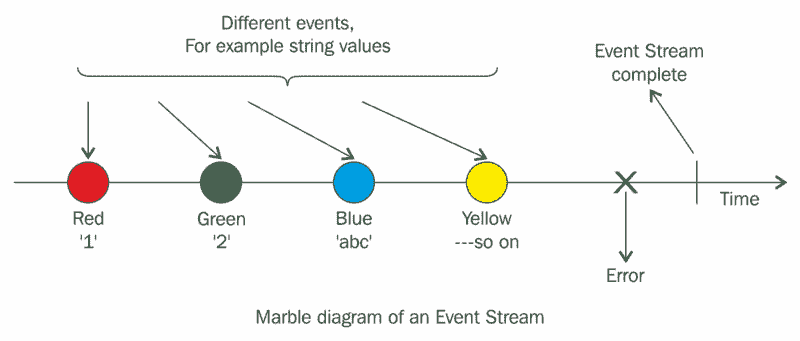

# 函数式反应式编程(FRP)快速介绍

> 原文：<https://www.freecodecamp.org/news/functional-reactive-programming-frp-imperative-vs-declarative-vs-reactive-style-84878272c77f/>

作者纳夫迪普·辛格

# 函数式反应式编程(FRP)快速介绍

FRP 代表了两种编程范例的交集。但是，在我们深入研究这些概念之前，我们需要了解一些基本术语。



FRP: reacting to events

### 命令式编程

传统上，我们编写代码来描述它应该如何解决问题。每一行代码都按顺序执行，以产生期望的结果，这就是所谓的命令式编程。命令式范式迫使程序员写出程序“如何”解决某个特定的任务。请注意，在前面的语句中，关键字是“如何”

这里有一个例子:

```
let numbers = [1, 2, 3, 4, 5, 6, 7, 8, 9]var numbersLessThanFive = [Int]()for index in 0..<numbers.count     {    if numbers[index] < 5         {        numbersLessThanFive.append(numbers[index])        }    }
```

如您所见，我们顺序执行一系列指令来产生所需的输出。

### 函数式编程

函数式编程是一种编程范式，在这种编程范式中，您将一切都建模为函数的结果，从而避免改变状态和改变数据。我们将在后续章节中讨论状态和数据可变性等概念及其重要性，但仅供参考:

*   将**状态**视为您的程序在执行期间的任何给定时间可以拥有的不同排列和组合之一
*   **数据可变性**是指在程序执行过程中，给定的数据集可能会随着给定的时间发生变化。

使用命令式编程给出的相同示例可以通过使用函数式方法以如下方式使用:

```
let numbers = [1, 2, 3, 4, 5, 6, 7, 8, 9]let numbersLessThanFive = numbers.filter { $0 < 5 }
```

我们用包含某个标准的闭包来填充过滤函数。然后将该标准应用于 numbers 数组中的每个元素，得到的数组包含满足我们的标准的元素。

注意两个例子中两个数组的声明。

在第一个例子中，`numbersLessThanFive`数组被声明为`var`，而在第二个例子中，同一个数组被声明为`let`。

有印象吗？

哪种方法更好，使用哪种阵列更安全？

如果不止一个线程试图使用同一个数组和它的元素呢？

常量数组不是更靠谱吗？

### 反应式编程

反应式编程是用异步数据流或事件流编程的实践。一个**事件流**可以是任何东西，比如键盘输入、按钮敲击、手势、GPS 位置更新、加速度计和 iBeacon。你可以听一个流，并对它做出相应的反应。

你可能听说过反应式编程，但它可能听起来太吓人、太可怕或太神秘，以至于不能尝试。您可能会看到类似这样的内容:

```
var twoDimensionalArray = [ [1, 2], [3, 4], [5, 6] ]let flatArray = twoDimensionalArray.flatMap { array in    return array.map { integer in        return integer * 2    }}print(flatArray)Output : [2, 4, 6, 8, 10, 12]
```

乍一看，前面的代码可能有点晦涩，这可能是您放弃这种编程风格的原因。正如我们前面提到的，反应式编程是用事件流编程。

然而，更大的问题仍然没有答案。**什么是功能反应式编程(FRP)？**

FRP 是功能性和反应性范例的组合。换句话说，它使用函数范式对数据流做出反应。FRP 不是一个工具或库——它改变了你设计应用程序的方式和你思考应用程序的方式。

在下一篇博客中，我将讨论反应式编程的基本构建模块——在此之前，请继续关注并享受阅读的乐趣:)

要扎实掌握反应式概念，用 RxSwift 编写 iOS 应用，可以看我的书:[Swift 4 中的反应式编程](https://www.amazon.com/Reactive-Programming-Swift-easy-maintain-ebook/dp/B078MHNSL1/ref=asap_bc?ie=UTF8)。

我的更多项目和可下载代码在[我的公共 github repos](https://github.com/NavdeepSinghh)

你可以在这里阅读更多关于主题[的内容](https://gist.github.com/staltz/868e7e9bc2a7b8c1f754)

感谢阅读，如果发现有用请分享:)