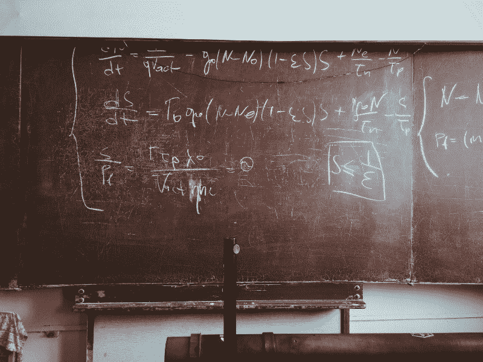

# 为什么学习编程不需要擅长数学

> 原文：<https://www.freecodecamp.org/news/why-you-dont-need-to-excel-at-math-to-learn-how-to-program-90f9697f70d9/>

保罗·帕万

# 为什么你不需要擅长数学来学习如何编程



“Equations written in chalk on a worn-out blackboard” by [Roman Mager](https://unsplash.com/@roman_lazygeek?utm_source=medium&utm_medium=referral) on [Unsplash](https://unsplash.com?utm_source=medium&utm_medium=referral)

这可能是我听过的最大的误解之一。

如果你想编程，你必须擅长数学。完全是假的。让我解释一下。

### 学习编码不需要擅长数学

我从 12 岁开始写代码。我知道的数学是加减乘除。而且这足够让我进入编程世界了。即使在今天，我也不使用比幂或平方根更复杂的东西。

如果你曾经编写过任何一行代码，你可能已经意识到它几乎与数学无关。如果你知道怎么数数，那你就很容易上手了。

### 神话的起源

我相信我已经找到了这个“神话”的来源。你知道那些关于黑客和程序员的老(或者不那么老)电影。他们经常用绿色字体显示计算机上大量的 0 和 1，沿着屏幕垂直排列？那是二进制代码(而且一般不会在屏幕上移动，只是静态文本)。

计算机理解二进制代码，但这不是编程语言的内容。这听起来很明显，因为如果你正在读这篇文章，你可能与这个世界有某种关系。但是你会惊讶地发现有多少人认为这都是关于二进制的。


When I code, my screen doesn’t look like this. Maybe I’m doing something wrong. Photo by [Markus Spiske](https://unsplash.com/@markusspiske?utm_source=medium&utm_medium=referral)on [Unsplash](https://unsplash.com?utm_source=medium&utm_medium=referral)

但是除了这个误解，我认为另一个因素是单词*数学*和*逻辑*之间建立的关系。编程需要逻辑思维，数学也是。但是高尔夫和篮球都需要一个球来玩，这并不意味着你需要知道如何打篮球才能打高尔夫。

### 让你相信我刚才说的话

我们举个恰当的例子。假设您想要构建一个函数来打印出一个数字的乘法表。因此，对于输入 2，我们的函数将返回:

> 2 x 0 = 0

> 2 x 1 = 2

> 2 x 2= 4

> 2 x 3 = 6

> …

> 最多 2 x 10 = 20

你将会看到做这件事只需要很少的数学知识(即使我们正在计算一些‘数学’的东西)。出于这个例子的目的，我们将使用 JavaScript。

首先，我们声明**函数**。我们称之为 ***tableOf(n)*** ，其中 *n* 是我们要打印的表的数字。

```
function tableOf(n) {
```

```
//rest of the code
```

```
}
```

目前来说很简单。现在我们将实现一个叫做 **for 循环的东西。这类似于一个函数，除了当它到达终点时，它会回到起点，直到某个条件为真**

我们想要打印 *n* 乘以其他值(姑且称之为 *i* )，直到该值达到 10。我们还必须考虑到 *i* 应该从 0 开始，因为我们希望 *n x 0 = 0* 成为打印的第一行。代码可能如下所示:

```
for(i = 0; i < 11; i++) {
```

```
console.log(n, 'x', i, '=', n*i);
```

```
}
```

让我们回顾一下我们刚刚做的事情。我们以 *i = 0* 开始 for 循环，这意味着 *i* 从 0 开始(正如我们所希望的)。然后我们说 i < 11，意思是我们不想退出循环 unt *i* l i 等于 11 或者换句话说，我们希望循环继续 *i* f i 小于 11。然后我们*做* i++，也就是说每次循环再次开始的时候我们都把值 *o* f i 加 1(所以最终达到 11，退出循环)。

然后我们只是输出 *n* (我们输入的数字)、‘x’(代表*乘以*符号)、 *i* (代表 *n* 乘以的数字)、‘=’(代表*等于*符号)，最后是 *n*i* (实际操作， *n 乘以 i* )。

前面的代码组合在一起:

```
function tableOf(n) {
```

```
for(i = 0; i < 11; i++) {
```

```
console.log(n, 'x', i, '=', n*i);
```

```
}
```

```
}
```

```
tableOf(2);
```

这很有效。这是难的数学吗？我们所做的唯一数学运算是将 *i* 加 1(相加)，并检查 *i* 是否小于 11。对于这个具体的例子，我们也将 *n* 乘以 *i* 。**哇**。

### 事情的另一方面

学习编码会让你更擅长数学。

正如我之前所说，编程需要逻辑思维，就像数学一样。在写程序的时候，你会遇到很多需要解决的问题。大部分时间都是用逻辑(但是说实话，有时候试错也行)。

培养解决这些问题的技能肯定会对你的数学有所帮助——不仅仅是概念，还有解决问题的能力。你也可以把它扩展到其他学科，比如物理学。

我希望这篇文章能够鼓励那些想尝试编码的人。相信我，我对数学知之甚少，对英语更是如此，但我仍然能够学到很多东西。知识没有限制。