# 深入研究卷积语义分段网络和 Deeplab_V3

> 原文：<https://www.freecodecamp.org/news/diving-into-deep-convolutional-semantic-segmentation-networks-and-deeplab-v3-4f094fa387df/>

泰勒·席尔瓦

# 深入研究卷积语义分段网络和 Deeplab_V3

深度卷积神经网络(DCNNs)在各种计算机视觉应用中取得了显著的成功。像其他人一样，语义分割的任务也不例外。

这篇文章通过 TensorFlow 的实际实现介绍了语义分段。我们将回顾关于一般对象的语义分割的最相关的论文之一— [Deeplab_v3](https://arxiv.org/abs/1706.05587) 。你可以在这里克隆本帖[的笔记本。](https://github.com/sthalles/deeplab_v3)

### 语义分割

常规图像分类 DCNNs 具有相似的结构。这些模型将图像作为输入，并输出代表该图像类别的单个值。

通常，分类 DCNNs 有四个主要操作。卷积、激活函数、池化和全连接层。通过一系列这些操作传递图像输出包含每个类别标签的概率的特征向量。请注意，在这个设置中，我们将图像作为一个整体进行分类。也就是说，我们给整个图像分配一个标签。

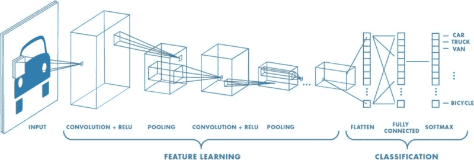

Standard deep learning model for image recognition. *Image credits: [Convolutional Neural Network MathWorks](https://www.mathworks.com/discovery/convolutional-neural-network.html).*

与图像分类不同，在语义分割中，我们希望对图像中的每个像素做出决定。因此，对于每个像素，模型需要将其归类为预先确定的类别之一。换句话说，语义分割意味着在像素级别理解图像。

请记住，语义分割并不区分对象实例。在这里，我们试图给数字图像的每个像素分配一个单独的标签。因此，如果我们有两个相同类的对象，它们最终会有相同的类别标签。实例分割是区分同一类实例的一类问题。

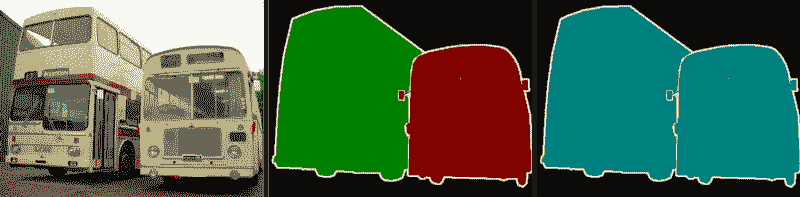

*Difference between Semantic Segmentation and Instance Segmentation. (middle) Although they are the same object (bus) they are classified as different objects. (left) Same object, equal category.*

然而，像 AlexNet 和 VGG 这样的常规 DCNNs 并不适合密集的预测任务。首先，这些模型包含许多旨在减少输入要素空间维度的图层。因此，这些图层最终会产生缺乏清晰细节的高度抽取的特征向量。第二，在计算期间，完全连接的层具有固定的大小和松散的空间信息。

作为一个例子，代替池化和完全连接的层，想象通过一系列卷积传递图像。我们可以将每个卷积设置为具有 1 的*步距和“相同的”填充。**这样做，每个卷积保持其输入的空间维度**。我们可以将这些卷积叠加在一起，得到一个细分模型。*

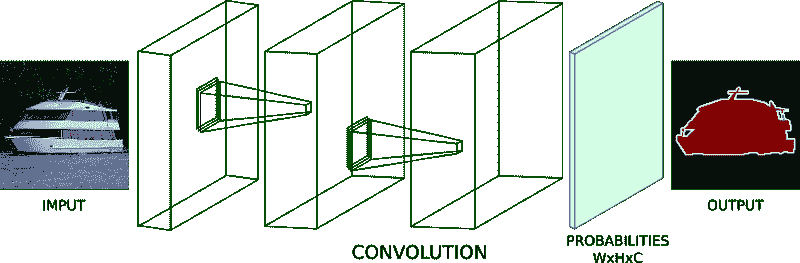

*Fully-Convolution neural network for dense prediction task. Note the non-existence of pooling and fully-connected layers.*

该模型可以输出形状为*【W，H，C】*的概率张量，其中 W 和 H 表示宽度和高度，C 是类别标签的数量。应用 *argmax* 函数(在第三个轴上)给我们一个张量形状*【W，H，1】*。之后，我们计算地面真实图像的每个像素和我们的预测之间的交叉熵损失。最后，我们对该值进行平均，并使用 back prop 训练网络。

不过，这种方法有一个问题。正如我们提到的，使用步长为 1 和*“相同”*填充的卷积保留了输入维度。然而，这样做会使模型在内存消耗和计算复杂性方面变得非常昂贵。

为了缓解这个问题，分段网络通常有三个主要组件:卷积、下采样和上采样层。

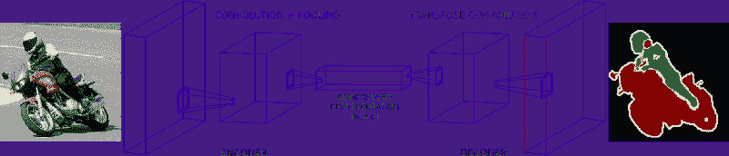

*Encoder-decoder architecture for Image Semantic Segmentation.*

在神经网络中有两种常见的方法来进行下采样:使用*卷积步长*或常规的*合并*运算。一般来说，下采样有一个目标，那就是减少给定特征地图的空间维度。出于这个原因，下采样允许我们执行更深层次的卷积，而没有很多内存问题。然而，他们这样做的代价是在这个过程中失去了一些功能。

另外，请注意，该体系结构的第一部分看起来很像通常的分类 DCNNs。除了一个例外，它们没有将*完全连接的*层放置到位。

在第一部分之后，我们有一个形状为[W，H，D]的特征向量，其中 W，H 和 D 是特征张量的宽度、高度和深度。请注意，这个压缩向量的空间维度比原始输入更小(但更密集)。

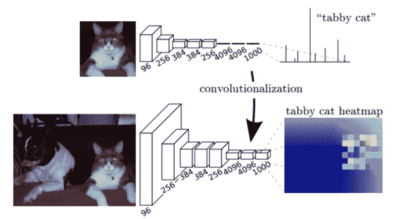

*(Top) VGG-16 network in its original form. Note the 3 fully-connected layers on top of the convolution stack. (Down) VGG-16 model when substituting its fully-connected layers to 1x1 convolutions. This change allows the network to output coarse heat-maps. Image credits: [Fully Convolutional Networks for Semantic Segmentation](https://arxiv.org/abs/1411.4038).*

此时，常规分类 DCNNs 将输出包含每个类别标签概率的密集(非空间)向量。相反，我们将这个压缩的特征向量提供给一系列上采样层。这些层致力于重构网络第一部分的输出。**目标是提高空间分辨率，使输出矢量与输入矢量具有相同的尺寸**。

通常，上采样层基于*步进转置卷积*。**这些功能从深而窄的层到宽而浅的层**。这里，我们使用转置卷积将特征向量的维数增加到期望值。

在大多数论文中，分割网络的这两个组件被称为编码器和解码器。简而言之，第一个将它的信息“编码”成一个用于表示其输入的压缩向量。第二个(解码器)负责将该信号重建为所需的结果。

有许多基于编码器-解码器架构的网络实现。FCNs、 [SegNet](https://arxiv.org/abs/1511.00561) 和 [UNet](https://arxiv.org/abs/1505.04597) 是一些最受欢迎的。因此，我们在各种领域看到了许多成功的细分模型。

### 模型架构

与大多数编码器-解码器设计不同，Deeplab 提供了一种不同的语义分割方法。它提出了一种用于控制信号抽取和学习多尺度上下文特征的架构。

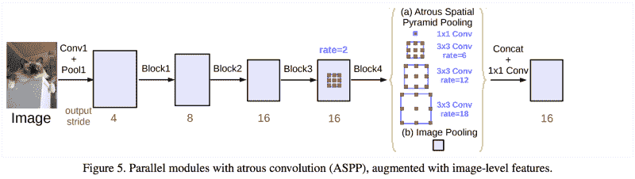

*图像致谢:[重新思考语义图像分割的阿特鲁卷积](https://arxiv.org/abs/1706.05587)。*

Deeplab 使用 ImageNet 预训练的 ResNet 作为其主要特征提取器网络。然而，它提出了一种新的多尺度特征学习的残差块。最后一个 ResNet 块没有使用常规卷积，而是使用了 atrous 卷积。此外，每个卷积(在这个新块内)使用不同的膨胀率来捕捉多尺度上下文。

此外，在这个新的区块之上，它使用阿特鲁空间金字塔池(ASPP)。ASPP 使用不同速率的膨胀卷积来尝试对任意尺度的区域进行分类。

为了理解 deeplab 架构，我们需要关注三个组件。(一)雷斯内特建筑，(二)阿特鲁斯回旋，(三)阿特鲁空间金字塔池(ASPP)。让我们逐一检查一下。

### ResNets

ResNet 是一个非常受欢迎的 DCNN，赢得了 [ILSVRC 2015](http://image-net.org/challenges/LSVRC/2015/results) 分类任务。ResNets 的主要贡献之一是提供了一个框架来简化更深层次模型的训练。

在其原始形式中，ResNets 包含 4 个计算模块。每个块包含不同数量的剩余单元。这些单元以特殊的方式执行一系列卷积。此外，每个块都插入了最大池操作，以减少空间维度。

原始论文提出了两种剩余单位。*基线*和*瓶颈*阻塞。

基线单元包含两个 *3x3* 卷积，具有批量标准化(BN)和 ReLU 激活。

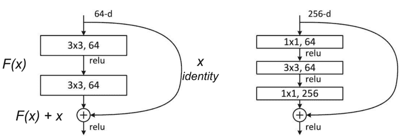

*ResNet building blocks. (left) baseline; (right) bottleneck unit. Image adapted from: [Deep Residual Learning for Image Recognition](https://arxiv.org/abs/1512.03385).*

第二个是瓶颈单元，由三个堆叠操作组成。一系列的 *1x1* 、 *3x3* 和 *1x1* 回旋取代了之前的设计。两个 *1x1* 操作是为了减少和恢复尺寸而设计的。这使得位于中间的 *3x3* 卷积对密度较低的特征向量进行操作。此外，在每次卷积之后和 ReLU 非线性之前应用 BN。

为了帮助澄清，让我们将这些操作组表示为其输入 *x* — *F(x)* 的函数 *F* 。

在 *F(x)* 中的非线性变换之后，该单元将 *F(x)* 的结果与原始输入 *x* 组合。这种组合是通过将两个函数相加来完成的。将原始输入 *x* 与非线性函数 *F(x)* 合并提供了一些优势。它允许前面的层从后面的层访问梯度信号。换句话说，跳过对 *F(x)* 的操作允许较早的层访问更强的梯度信号。因此，这种类型的连接已被证明可以简化更深层次网络的训练。

随着模型容量的增加，非瓶颈单元也显示出准确性的提高。然而，瓶颈剩余单元具有一些实际优势。首先，它们用几乎相同数量的参数执行更多的计算。第二，它们的计算复杂度与同类产品相似。

在实践中，*瓶颈*单元更适合训练更深的模型，因为需要的训练时间和计算资源更少。

对于我们的实现，我们将使用 ***完全预激活剩余单元*** 。与标准瓶颈单元的唯一区别在于 BN 和 ReLU 激活的顺序。对于完全预激活，BN 和 ReLU(按此顺序)出现在卷积之前。

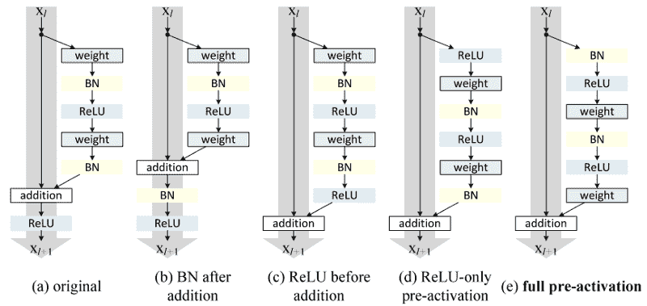

*Different ResNet building block architectures. (Left-most) the original ResNet block. (Right-most) the improved full pre-activation version. Image credits: [Identity Mappings in Deep Residual Networks](https://arxiv.org/abs/1603.05027).*

如[深度剩余网络中的身份映射](https://arxiv.org/abs/1603.05027)所示，全预激活单元的性能优于其他变体。

*注意，这些设计的唯一区别是卷积堆栈中 BN 和 RELu 的顺序。*

### 阿特鲁卷积

阿特鲁(或扩张)卷积是有一个因子的规则卷积，允许我们扩大过滤器的视野。

例如，考虑一个 *3x3* 卷积滤波器。当膨胀率等于 1 时，它的行为类似于标准卷积。但是，如果我们将膨胀因子设置为 2，它具有放大卷积核的效果。

理论上是这样的。首先，它根据膨胀率来扩展卷积滤波器。其次，它用零填充空白空间，从而创建一个稀疏的 like 过滤器。最后，它使用扩张滤波器执行常规卷积。

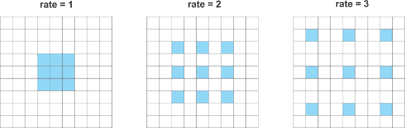

*Atrous convolutions with various rates.*

因此，与扩大的 2， *3x3* 滤波器的卷积将使其能够覆盖相当于一个 *5x5* 的区域。然而，因为它的作用就像一个稀疏过滤器，只有原始的 *3x3* 细胞会进行计算并产生结果。我说“act”是因为大多数框架不使用稀疏过滤器实现 atrous 卷积(因为内存问题)。

以类似的方式，将 atrous 因子设置为 3 允许常规的 *3x3* 卷积从 *7x7* 相应区域获得信号。

这种效应允许我们控制计算特征响应的分辨率。此外，atrous 卷积增加了更大的上下文，而没有增加参数的数量或计算量。

Deeplab 还表明，膨胀率必须根据特征图的大小进行调整。他们研究了在小特征地图上使用大膨胀率的后果。

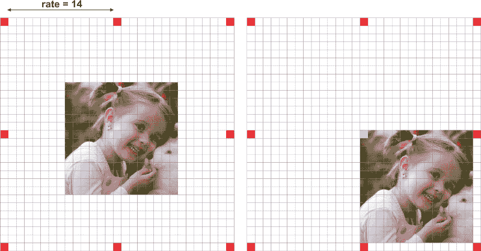

*Side effects of setting larger dilation rates for smaller feature maps. For a 14x14 input image, a 3x3 filter with dilation rate of 15 makes the atrous convolution behaves like a regular 1x1 convolution.*

当膨胀率非常接近特征图的尺寸时，常规的 *3x3* atrous 滤波器充当标准的 *1x1* 卷积。

换句话说，糟糕的卷积的效率取决于膨胀率的合理选择。因此，了解神经网络中**输出步幅**的概念非常重要。

**输出步幅解释了输入图像尺寸与输出特征图尺寸的比率。它定义了输入矢量通过网络时信号抽取的程度。**

对于 16 的输出步幅，*224×224×3*的图像尺寸输出尺寸小 16 倍的特征向量。那就是 *14x14* 。

此外，Deeplab 还讨论了不同输出步长对分割模型的影响。**它认为过度的信号抽取对密集预测任务有害**。总之，输出步幅较小的模型——信号抽取较少——往往输出更精细的分割结果。然而，输出步幅较小的训练模型需要更多的训练时间。

Deeplab 报告了两种输出步长配置的实验，即 8 和 16。正如所料，output stride = 8 能够产生稍微好一点的结果。出于实际原因，这里我们选择输出步幅= 16。

此外，因为 atrous 块不实现下采样，ASPP 也在相同的特征响应大小上运行。因此，它允许使用相对较大的膨胀率从多尺度上下文中学习特征。

新阿特鲁剩余块包含三个剩余单元。三个单元总共有三个 *3x3* 卷积。受*多重网格*方法的启发，Deeplab 为每个卷积提出了不同的膨胀率。总之，*多重网格*定义了三个卷积的膨胀率。

实际上:

对于新 block4，当输出步幅= 16、**多网格 *= (1，2，4)*** 时，三个卷积分别有**速率 *= 2 (1，2，4) = (2，4，8)*** 。

### 阿特鲁空间金字塔池

对 ASPP 来说，这个想法是为模型提供多尺度的信息。为了做到这一点，ASPP 增加了一系列具有不同膨胀率的巨大回旋。这些比率旨在捕捉长期背景。此外，为了添加全局上下文信息，ASPP 通过全局平均池(GAP)合并图像级特征。

这个版本的 ASPP 包含 4 个并行操作。这些是一个 *1x1* 卷积和三个 *3x3* 卷积，其中*扩张率=(6，12，18)* 。正如我们提到的，此时，要素地图的标称步幅等于 16。

基于最初的实现，我们在训练和测试中都使用了 *513x513* 的裁剪尺寸。因此，使用 16 的输出步幅意味着 ASPP 接收大小为*32×32*的特征向量。

此外，为了增加更多的全球背景信息，ASPP 合并了图像级功能。首先，它将间隙应用于从最后一个 atrous 块输出的特征。其次，产生的特征被馈送到具有 256 个滤波器的 *1x1* 卷积。最后，结果被双线性上采样到正确的尺寸。

最后，来自所有分支的特征通过连接被组合成单个向量。这个输出然后与另一个 *1x1* 内核进行卷积——使用 BN 和 256 个过滤器。

在 ASPP 之后，我们将结果馈送到另一个 *1x1* 卷积，以产生最终的分割逻辑。

### 实施细节

使用 ResNet-50 作为特征提取器， [Deeplab_v3](https://arxiv.org/pdf/1704.06857) 的实现采用了以下网络配置:

*   *输出步幅= 16*
*   *对新阿特鲁残差块(块 4)固定多网格 atrous 卷积率(1，2，4)。*
*   *ASPP 以(6，12，18)的速度追赶最后一个阿特鲁残块。*

将*输出步幅*设置为 16，这给了我们更快训练的优势。与 8 的输出步距相比，16 的步距使阿特鲁残差块处理的特征图比它的对应物处理的特征图小四倍。

多重网格膨胀率被应用于阿特鲁残差块内的 3 个卷积。

最后，ASPP 中三个平行的 *3x3* 卷积的每一个都得到不同的膨胀率——*(6，12，18)* 。

在计算*交叉熵误差*之前，我们将 logits 的大小调整为输入的大小。正如论文中所讨论的，为了保持分辨率细节，调整逻辑比地面事实标签更好。

基于原始的训练过程，我们使用从 0.5 到 2 的随机因子来缩放每个图像。此外，我们对缩放后的图像应用随机的左右翻转。

最后，我们裁剪大小为 *513x513* 的小块用于训练和测试。

为了在 resnet 的 block4 中实现具有多重网格的 atrous 卷积，我们只是在 *resnet_utils.py* 文件中更改了这一部分。

### 培养

为了训练网络，我们决定使用来自反向检测器的[语义轮廓提供的扩充 Pascal VOC 数据集。](http://ieeexplore.ieee.org/document/6126343/)

训练数据由 8，252 幅图像组成。有 5，623 个来自训练集，2，299 个来自验证集。为了使用原始 VOC 2012 val 数据集测试模型，我从 2，299 个验证集中删除了 558 个图像。这 558 个样品也出现在官方 VOC 验证集上。此外，我添加了来自 VOC 2012 训练集的 330 幅图像，这些图像既没有出现在 5623 组中，也没有出现在 2299 组中。最后，8，252 幅图像中的 10%(约 825 个样本)用于验证，其余的用于训练。

请注意，这与原始论文不同:该实现没有在 COCO 数据集中进行预训练。此外，论文中描述的一些培训和评估技术也没有实施。

### 结果

该模型能够在 PASCAL VOC 验证集上取得不错的结果。

*   像素精度:~91%
*   平均准确率:~82%
*   并集上的平均交集(mIoU): ~74%
*   联合上的频率加权交集:~86%。

下面，您可以从 PASCAL VOC 验证集中的各种图像中查看一些结果。

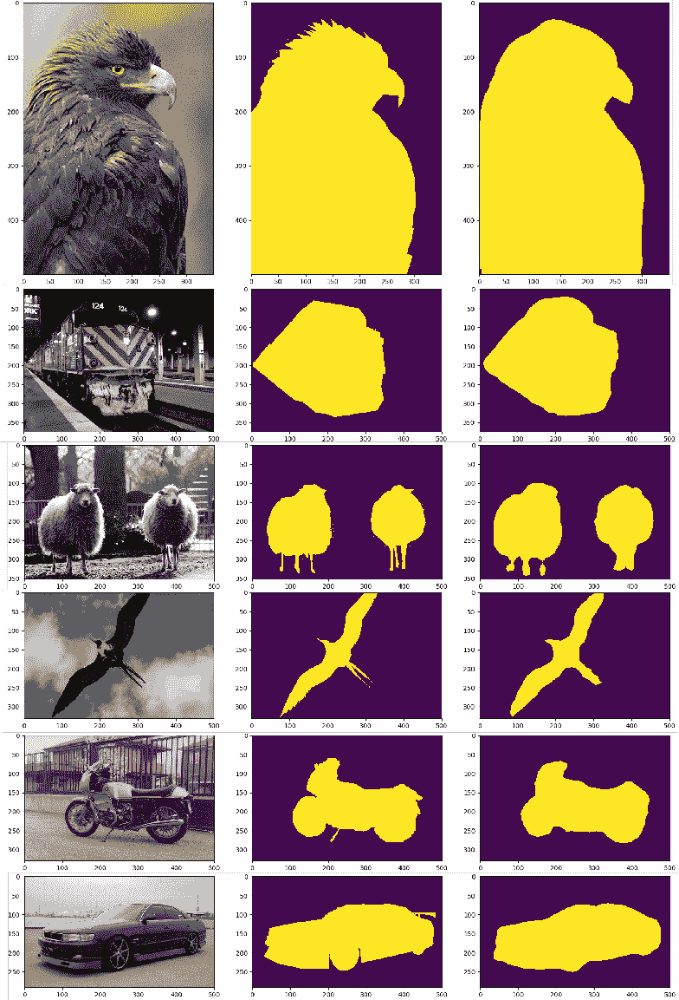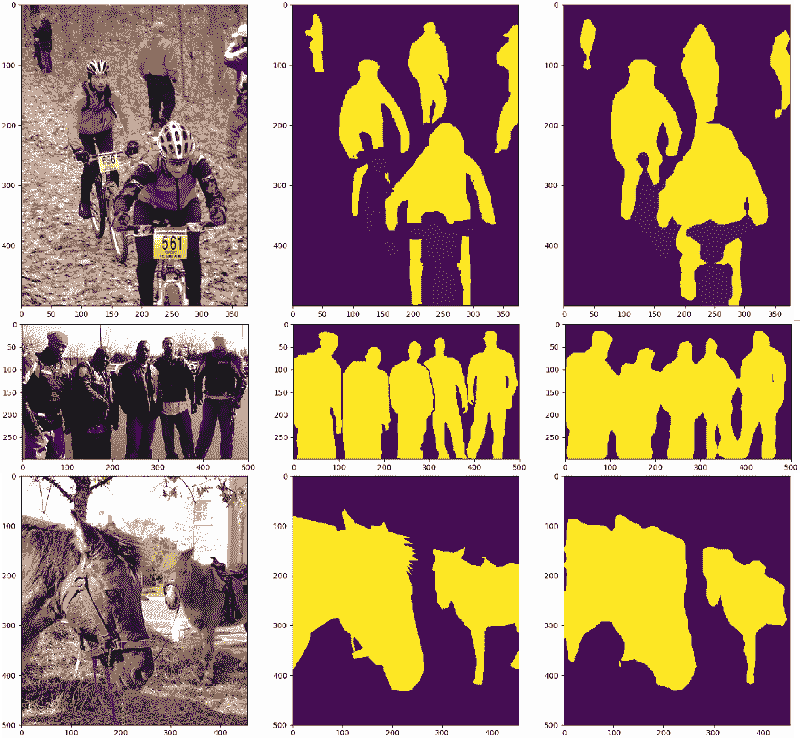

### 结论

语义分割领域无疑是计算机视觉中最热门的领域之一。Deeplab 提供了经典编码器-解码器架构的替代方案。它提倡在多范围上下文中使用 atrous 卷积进行特征学习。随意克隆回购协议并调整模型，以获得更接近原始实现的结果。完整的代码是[这里是](https://github.com/sthalles/deeplab_v3)。

希望你喜欢阅读！

*最初发表于 [sthalles.github.io](https://sthalles.github.io/) 。*

