# 简单解释:人工智能程序如何掌握围棋这一古老的游戏

> 原文：<https://www.freecodecamp.org/news/explained-simply-how-an-ai-program-mastered-the-ancient-game-of-go-62b8940a9080/>

阿曼·阿加瓦尔

# 简单解释:人工智能程序如何掌握围棋这一古老的游戏

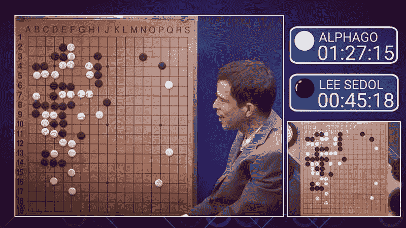

[Image credit](https://www.flickr.com/photos/erikbenson/25717574115)

这是关于 **AlphaGo** ，谷歌 DeepMind 的 [*围棋*](https://en.wikipedia.org/wiki/Go_(game)) 通过击败世界上最好的棋手之一 [Lee Sedol](https://en.wikipedia.org/wiki/Lee_Sedol) 而在 2016 年震撼了技术世界的 AI。

围棋是一种古老的棋盘游戏，每一步都有如此多的可能走法，以至于未来的位置很难预测——因此它需要强大的直觉和抽象思维才能玩下去。因为这个原因，人们认为只有人类才擅长下围棋。大多数研究人员认为，建立一个能够像那样思考的人工智能还需要几十年的时间。事实上，我今天发布这篇文章是因为本周(3 月 8 日至 15 日)是 AlphaGo 与 Sedol 比赛的两周年纪念日！

但是 AlphaGo 并没有就此止步。8 个月后，它伪装成一个名为“大师”的玩家，在一个围棋网站上打了 60 场职业比赛，每场比赛都赢了*、赢了*对了*几十个*世界冠军，当然在比赛之间没有休息。

自然，这是人工智能领域的一项巨大成就，并引发了世界范围内的讨论，即我们应该对人工智能感到兴奋还是担忧。

今天我们要拿 DeepMind 发表在 *Nature* 期刊上的原始研究论文，用简单的英语逐段分解。

在这篇文章之后，你会非常清楚 AlphaGo 是什么，以及它是如何工作的。我也希望看完这篇文章后，你不要相信所有记者制造的关于 AI 的新闻标题来吓唬你，相反，你会为此感到兴奋。

担心人工智能不断增长的成就就像担心微软 Powerpoint 不断增长的能力一样。是的，随着新功能的加入，它会变得更好，但它不能不受控制地成长为某种好莱坞怪物。

你不需要知道如何玩围棋来理解这篇论文。事实上，我自己只读过维基百科关于它的开篇的前 3-4 行。相反，令人惊讶的是，我用了一些基础象棋的例子来解释算法。你只需要知道什么是双人棋盘游戏，每个玩家轮流玩，最后只有一个赢家。除此之外，你不需要知道任何物理或高等数学或任何东西。

这将使刚刚开始学习机器学习或神经网络的人更容易接近。尤其是对于那些不以英语为第一语言的人(这使得阅读这类论文非常困难)。

*如果你没有 AI 和神经网络的先验知识，可以在这里 阅读我之前的一篇论文 [**的“深度学习”部分。读完之后，你就能读懂这篇文章了。**](https://medium.com/swlh/everything-about-self-driving-cars-explained-for-non-engineers-f73997dcb60c)*

*如果你也想对强化学习有个粗浅的了解(可选阅读)，可以在这里**找到。***

**如果你想试着读一读，这是原文:**

**至于我:嗨，我是一名人工智能和自主机器人工程师。我希望我的工作能为你节省大量的时间和精力，如果你是自己研究这个的话。**

**你会说日语吗？ [池边亮治](https://www.freecodecamp.org/news/explained-simply-how-an-ai-program-mastered-the-ancient-game-of-go-62b8940a9080/undefined)在[的一系列推特](https://twitter.com/ikb/status/976008433852866560)中用日语写了一份关于这篇文章的简短备忘录。**

### **我们开始吧！**

#### **摘要**

**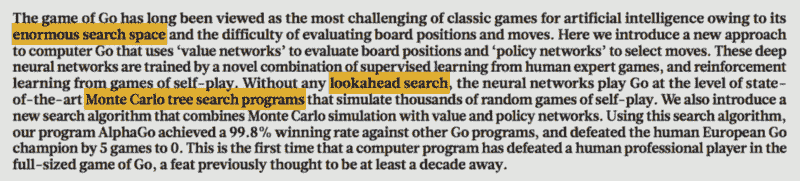**

**如你所知，这项研究的目标是训练一个人工智能程序，让它在世界级职业人类棋手的水平上下棋。**

**为了理解这个挑战，让我先来谈谈类似的国际象棋。20 世纪 90 年代初，IBM 推出了深蓝电脑，它打败了国际象棋大冠军 [**【加里·卡斯帕罗夫】**](https://en.wikipedia.org/wiki/Garry_Kasparov) 。(他也是一个非常酷的家伙，请确保以后能读到更多关于他的内容！)深蓝怎么玩的？**

**它使用了非常暴力的方法。在游戏的每一步中，它都会考虑所有可能的合法走法，并继续探索每一步，看看会发生什么。它会在一段时间内不断探索一步又一步的棋，形成一个由成千上万步棋组成的巨大决策树。然后它会沿着那棵树回来，观察哪一步似乎最有可能带来好结果。但是，我们所说的“好结果”是什么意思呢？嗯，深蓝内置了许多由专业棋手精心设计的象棋策略，以帮助它做出更好的决定——例如，如何决定是保护国王还是在其他地方获得优势？他们为此制定了一个特定的“评估算法”，以比较不同棋盘位置的优势或劣势(IBM 将专家象棋策略硬编码到这个评估函数中)。最后它选择了一个精心计算的步骤。在下一个回合，它基本上又经历了整个事情。**

**如你所见，这意味着深蓝在下每一步棋之前都思考了数百万个理论位置。就深蓝的人工智能软件而言，这并不令人印象深刻，而是在硬件方面——IBM 声称它是当时市场上最强大的计算机之一。它可以每秒查看 2 亿个棋盘位置。**

**现在我们要走了。只要相信我，这个游戏的开放性要大得多，如果你在围棋上尝试了深蓝策略，你就不会玩得很好。每一步都有很多位置要看，让计算机经历这些是不切实际的。例如，在国际象棋的第一步有 20 种可能的走法。在围棋中，第一个棋手有 361 种可能的走法，这种选择范围在整个游戏中都很广。**

**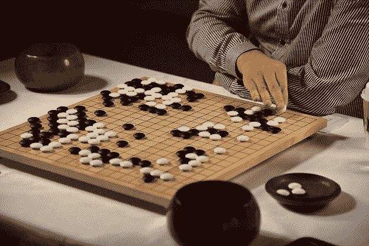**

**这就是他们所说的“巨大的搜索空间”此外，在围棋中，判断一个特定的棋盘位置在游戏中的任何特定点上是有利还是不利并不那么容易——你可能需要下一会儿整个游戏，然后才能确定谁赢了。但是假设你神奇地有办法做到这两点。这就是深度学习的用武之地！**

**所以在这项研究中，DeepMind 使用神经网络来完成这两项任务(如果你还没有读过关于神经网络的文章，[这里是链接](https://medium.com/swlh/everything-about-self-driving-cars-explained-for-non-engineers-f73997dcb60c))。他们训练了一个“政策神经网络”，以决定在特定的董事会位置上哪些是最明智的举措(所以这就像遵循直觉策略从任何位置选择举措)。并且他们训练了一个“价值神经网络”来估计特定的棋盘排列对玩家有多有利(或者换句话说，你从这个位置赢得游戏的可能性有多大)。他们首先用人类的游戏例子(你的好老普通监督学习)训练这些神经网络。在这之后，人工智能能够在一定程度上模仿人类的演奏，所以它表现得像一个弱人类玩家。然后，为了进一步训练网络，他们让人工智能与自己对抗数百万次(这是“强化学习”的一部分)。有了这个，人工智能变得更好，因为它有了更多的练习。**

**仅凭这两个网络，DeepMind 的人工智能就能够很好地与其他研究人员之前构建的最先进的围棋程序对弈。这些其他程序已经使用了一个已经流行的预先存在的游戏算法，称为“蒙特卡罗树搜索”(MCTS)。稍后会详细介绍。**

**但是你猜怎么着，我们还没有谈到真正的交易。DeepMind 的人工智能不仅仅是关于政策和价值网络。它不使用这两个网络作为蒙特卡洛树搜索的*替代*。相反，它使用神经网络使 MCTS 算法更好地工作*……它变得如此之好，以至于达到了超人的水平。MCTS 的这种改进变体是“AlphaGo”，它击败了李·塞多尔，并作为有史以来最伟大的突破之一载入人工智能历史。所以从本质上来说，AlphaGo 只是一个非常普通的计算机科学算法的*改进实现*。你现在明白为什么人工智能在它目前的形式下绝对没有什么可怕的了吗？***

***哇，我们已经在抽象上花了很多时间了。***

******

***好的——为了从这一点上理解这篇论文，首先我们将讨论一种叫做蒙特卡罗树搜索算法的游戏策略。现在，我将深入解释这个算法，以便理解这篇文章。但如果你想深入了解它，一些聪明人也就此制作了精彩的视频和博客:***

***1.[来自 Udacity](https://www.youtube.com/watch?v=onBYsen2_eA)
2 的短视频系列。[杰夫·布拉德伯里对 MCTS](https://jeffbradberry.com/posts/2015/09/intro-to-monte-carlo-tree-search/) 的解说  3。富栈学院的 MCTS 教程***

***下面的部分很长，但是很容易理解(我会尽力的)并且非常重要，所以请继续关注我！文章的其余部分会写得更快。***

***先说上面短文的第一段。还记得我说过的关于深蓝在游戏的每一步都做出一棵由数百万个棋盘位置和移动组成的巨树吗？你必须进行模拟，观察和比较每一个可能的动作。正如我之前所说，这是一种简单而直接的方法——如果普通的软件工程师必须设计一个玩人工智能的游戏，并且拥有世界上所有最强的计算机，他或她可能会设计一个类似的解决方案。***

***但是我们想想人类自己是怎么下棋的？假设你在游戏中处于一个特定的棋盘位置。根据游戏规则，你可以做十几种不同的事情——将这个棋子移到这里，将皇后移到这里两格或那里三格，等等。但是你真的会列出你所有棋子可能的走法，然后从这个长长的列表中选择一个走法吗？不——你“直觉地”缩小到你认为有意义的几个关键步骤(假设你想出了 3 个明智的步骤),然后你想知道如果你选择了这 3 个步骤中的一个，游戏会发生什么。你可以花 15-20 秒考虑这三步棋中的每一步及其未来——注意，在这 15 秒内，你不必仔细计划每一步棋的未来；你可以在直觉的指导下“推出”一些心理动作，而无需太多仔细的思考(好吧，一个好的玩家会比一个普通玩家想得更远更深)。这是因为你的时间有限，*和*你无法准确预测你的*对手*在你脑中构想的美好未来的每一步会做什么。所以你只能让你的直觉来引导你。我将把思考过程的这一部分称为“展示”，所以请注意！
所以在“推出”你的几个明智的步骤后，你终于说去他妈的，就玩你觉得最好的那一步。***

***然后对手出招。这可能是你已经预料到的一步，这意味着你现在对下一步要做什么很有信心。你不必再花太多时间在产品推出上。或者，可能是你的对手用一个你意想不到的非常酷的动作击中了你，所以你必须更加小心你的下一步棋。游戏就是这样进行的，当它越来越接近终点时，你就越来越容易预测你的行动结果——所以你的推出不会花太多时间。***

***这个长故事的目的是在表面上描述 MCTS 算法的作用——它通过构建每次移动和位置的“搜索树”来模仿上述思维过程。同样，要了解更多细节，你应该查看我前面提到的链接。这里的创新之处在于，它不是遍历每个位置上所有可能的移动(深蓝就是这样)，而是智能地选择一小组合理的移动，并探索这些移动。为了探索它们，它“推出”了这些动作的未来，并根据它们的*想象的*结果进行比较。
(说真的——我认为这就是你理解这篇文章所需要的)***

***现在，回到报纸上的截图。围棋是一个“[完美信息博弈](https://jeffbradberry.com/posts/2015/09/intro-to-monte-carlo-tree-search/)”(请阅读链接中的定义，不要担心它不吓人)。而**理论上的**，对于这类游戏，无论 ***你处于游戏中的哪个*** 特定位置(即使你刚刚下了 1-2 步棋)，你都有可能正确地猜出谁会赢谁会输(假设双方玩家从那一点开始都“完美地”出牌)。我不知道是谁提出了这个理论，但这是这个研究项目中的一个基本假设，而且是可行的。***

***这意味着，给定一个博弈状态 *s* ，有一个函数 v*(s)可以预测结果，比如说你赢这场博弈的概率，从 0 到 1。他们称之为“最优价值函数”。因为一些董事会职位比其他董事会职位更有可能让你获胜，所以他们可以被认为比其他职位更“有价值”。我再说一遍:价值= 0 到 1 之间你们赢得比赛的概率。***

***但是等等——假设在你下棋的时候，有一个叫 Foma 的女孩坐在你旁边，她不断告诉你每一步是赢还是输。"你赢了…你输了…不，还是输了…"我认为这对你选择下一步行动没有太大帮助。她也会很烦人。相反，对你有帮助的是，如果你画出你可能采取的所有行动的完整的树，以及这些行动将导致的状态，然后 Foma 会告诉你完整的树，哪些状态是赢的状态，哪些状态是输的状态。然后，你可以选择能让你不断走向胜利的举措。突然间 Foma 成了你的犯罪伙伴，而不是讨厌的朋友。这里，Foma 表现为你的最优值函数 v*(s)。早些时候，人们认为围棋不可能有像 Foma 这样精确的价值函数，因为围棋有太多的不确定性。***

***但是——即使你有美妙的 Foma，这种画出所有可能的位置供 Foma 评估的奇妙策略在现实世界中也不会很好地工作。在像国际象棋或围棋这样的游戏中，正如我们之前所说，如果你试图想象未来的 7-8 步棋，可能会有如此多的可能位置，以至于你没有足够的时间用 Foma 检查所有的位置。***

***所以 Foma 是不够的。你需要缩小行动列表，只列出几个你可以在未来实施的明智的行动。你的程序将如何做到这一点？进入露莎。露莎是一个熟练的棋手和爱好者，他花了几十年的时间观看大师们对弈。她可以查看你的棋盘位置，快速浏览你能走的所有棋步，并告诉你如果一个象棋专家坐在你的桌旁，他走这些棋步的可能性有多大。因此，如果你在一个点上有 50 个可能的移动，露莎会告诉你每个移动被专家选中的概率。当然，几个明智的举动会有高得多的概率，其他无意义的举动概率很小。例如:如果在国际象棋中，假设你的皇后在游戏的一个角落处于危险之中，你仍然可以选择在游戏的另一个角落移动一个小卒。她是你的*策略函数*，p(a\s)。对于一个给定的状态 s，她可以给你一个专家可能采取的所有行动的概率。***

***哇——你可以在露莎的帮助下指导你如何选择几个明智的步骤，Foma 会告诉你从这些步骤中获胜的可能性。可以选择 Foma 和露莎都认可的举动。或者，如果你想格外小心，你可以推出露莎选择的移动，让 Foma 评估它们，选择其中几个在未来进一步推出，并继续让 Foma 和露莎帮助你预测游戏的未来——比在未来的每一步都经历所有移动更快更有效。这就是他们所说的“缩小搜索空间”。使用价值函数(Foma)来预测结果，使用政策函数(Lusha)来给你大师概率，以帮助缩小你推出的动作。这些被称为“蒙特卡洛展开”。然后，当你从未来回溯到现在，你可以取所有不同的移动平均值，并选择最合适的行动。到目前为止，这仅在围棋业余爱好者的水平上有效，因为他们用来指导这些推广的策略函数和价值函数并不是很好。***

***唷。***

***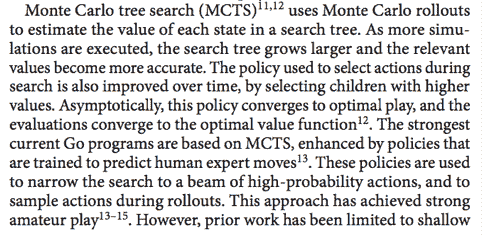***

***第一行不言自明。在 MCTS，你可以从不熟练的 Foma 和不熟练的 Lusha 开始。你玩得越多，他们就越能准确预测结果和行动。“将搜索范围缩小到一束高概率动作”只是一种复杂的说法，“露莎通过指定专家会玩这些动作的概率来帮助你缩小你需要推出的动作的范围”。先前的工作已经使用这种技术来实现强大的业余水平的人工智能玩家，即使是简单的(或者他们称之为“肤浅的”)策略函数。***

***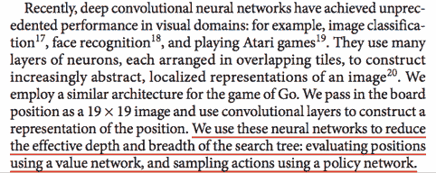***

***是的，卷积神经网络非常适合图像处理。由于神经网络接受特定的输入并给出输出，它本质上是一个函数，对吗？所以你可以用神经网络变成一个复杂的函数。所以你可以传入棋盘位置的图像，让神经网络自己找出发生了什么。这意味着有可能创建像非常精确的政策和价值函数一样运行的神经网络。剩下的就不言自明了。***

***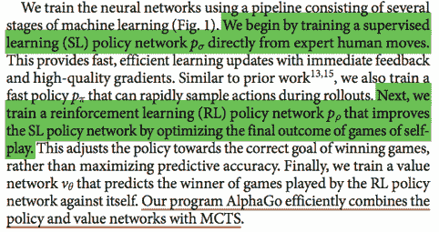***

***这里我们讨论一下福马和露莎是如何被训练的。为了训练政策网络(预测专家会选择的给定位置的移动)，你只需使用人类游戏的例子，并将它们用作良好的旧监督学习的数据。***

***并且您想要训练该策略网络的另一个稍微不同的版本以用于展开；这个会更小更快。这么说吧，既然露莎这么有经验，她每个位置都要花点时间处理。她很适合开始缩小范围的过程，但是如果你试图让她重复这个过程，她还是会花太多时间。所以你为推广过程训练了一个*更快的政策网络(我就叫它…露莎的弟弟杰瑞？我知道我知道，这些名字已经够多了)。在那之后，一旦你使用人类棋手数据训练了足够多的慢速和快速策略网络，你可以试着让露莎在围棋棋盘上和自己对弈几天，并获得更多的练习。这是强化学习的一部分——创建一个更好的政策网络。***

***然后，你训练 Foma 进行价值预测:决定你赢的概率。你让人工智能通过在模拟环境中一次又一次地玩自己来练习，观察每次的最终结果，并从它的错误中学习，以变得越来越好。***

****这些网络是如何训练的我就不赘述了。您可以在本文的后面部分(“方法”)阅读更多的技术细节，我在这里没有涉及到。事实上，这篇特定论文的真正目的不是向*展示*他们如何在这些神经网络上使用强化学习。DeepMind 之前的一篇论文中，他们教 AI 玩 ATARI 游戏，已经深入讨论了一些强化学习技术(我已经在这里[写了那篇论文的解释](https://medium.freecodecamp.org/explained-simply-how-deepmind-taught-ai-to-play-video-games-9eb5f38c89ee))。对于这篇论文，正如我在摘要中轻轻提到的，也在上面的截图中强调的，最大的创新是*他们使用 RL 和神经网络*来改进已经流行的游戏算法 MCTS。RL 是工具箱中的一个很酷的工具，在常规的监督训练之后，他们用它来微调策略和价值函数神经网络。这篇研究论文是关于证明这个工具是多么的多才多艺和优秀，而不是教你如何使用它。**在电视行话中，雅达利的论文是 RL 电视广告，而 AlphaGo 的论文是商业广告。******

#### ****好了，我们终于完成了“介绍”部分。到目前为止，您已经对 AlphaGo 有了很好的了解。****

#### ****接下来，我们将稍微深入一下我们上面讨论的每一件事。你可能会看到一些丑陋而危险的数学方程式和表达式，但它们很简单(我会一一解释)。放松点。****

****在您继续之前，请注意一点。你愿意帮我多写几篇这样的文章解释很酷的研究论文吗？如果你是认真的，我很乐意和你一起工作。请留下评论，我会和你联系。****

****

A photo of two Japanese women playing Go, placed here in case you’re already sick of looking at long slabs of text.**** ****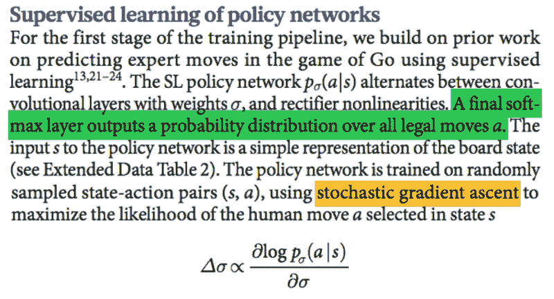****

****因此，第一步是训练我们的策略 NN (Lusha ),以预测专家可能会下哪些棋。这个神经网络的目标是让人工智能像专家一样玩。这是一个卷积神经网络(正如我之前提到的，它是一种特殊的神经网络，在图像处理中非常有用)，它接受电路板排列的简化图像。“整流器非线性”是可以添加到网络架构中的层。他们赋予它学习更复杂事物的能力。如果你以前训练过神经网络，你可能用过“ReLU”层。这就是这些。****

****这里的训练数据是以随机的棋盘位置对的形式，标签是人类在这些位置上选择的动作。只是常规的监督学习。****

****这里他们使用“随机梯度上升”。这是一个反向传播的算法。在这里，你试图*最大化*一个奖励函数。而奖励函数只是人类专家预测的行动的概率；你想增加这个概率。但是，嘿——你真的不需要考虑太多。通常你训练网络，使其*最小化*一个损失函数，本质上是预测结果和实际标签之间的误差/差异。这就是所谓的梯度下降。在这篇研究论文的实际实现中，他们确实使用了常规梯度**下降**。你可以很容易地找到一个与回报函数相反的损失函数，这样最小化这个损失将会最大化回报。****

****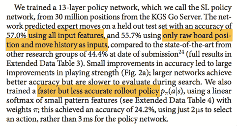****

****策略网络有 13 层，称为“SL 策略”网络(SL =监督学习)。数据来自一个…我只能说这是一个受欢迎的网站，有数百万人在上面玩围棋。这个 SL 政策网络表现如何？****

****这比其他研究人员之前所做的更准确。这一段的其余部分不言自明。至于“首次展示策略”,你应该还记得前几段中提到的，SL 策略网络速度很慢，所以不能很好地与 MCTS 算法集成。我们训练了另一个更快版本的露莎，叫杰瑞，是她的弟弟？这里指的是杰瑞。如你所见，Jerry 的精度只有 Lusha 的一半，但速度却快了数千倍！当我们应用 MCTS 时，它将真正有助于更快地完成对未来的模拟。****

****对于下一部分，你不需要了解强化学习，但是你必须假设我说的都是有效的。如果你真的想深入细节并确保一切，你可能想先读一点关于 RL 的书。****

****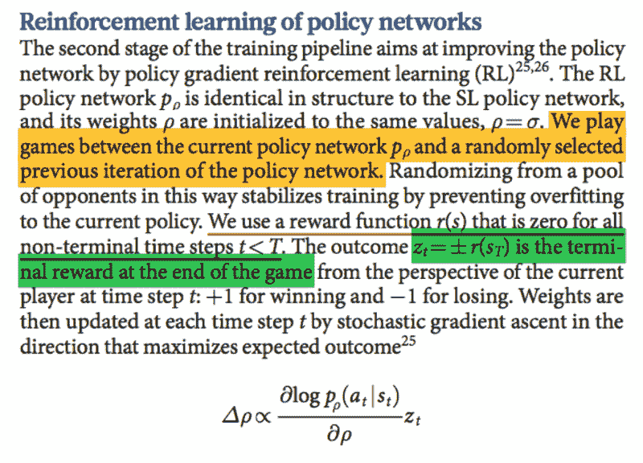****

****一旦你有了 SL 网络，就像我之前说的，你必须让她自己练习并变得更好。这就是我们在这里做的。因此，您只需将 SL 策略网络保存在一个文件中，并制作另一个副本。****

****然后你用强化学习来微调。在这里，你让网络与自己对抗，并从结果中学习。****

****但是这种训练方式有一个问题。****

****如果你永远只和一个对手练习，而那个对手也只和你一起练习，你就不会学到很多新东西。你只是在训练如何打败那个玩家。你猜对了，这是过度适应:你的技术对一个对手很有效，但对其他对手却不适用。那么如何解决这个问题呢？****

****好吧，每次你微调一个神经网络，它就变成了一种稍微不同的播放器。所以你可以将这个版本的神经网络保存在一个“玩家”列表中，他们的行为都略有不同，对吗？很好——现在在训练神经网络时，你可以随机让它与从列表中选择的许多不同版本的旧版本和新版本的对手进行比赛。他们是同一名球员的版本，但他们都略有不同。你训练得越多，你就能和越多的球员一起训练！答对了。****

****在这种训练中，指导训练过程的唯一东西是最终目标，即赢或输。你不需要特别训练网络去做一些事情，比如在板上捕捉更多的区域等等。你只需要给它所有可能的合法手段，然后说，“你必须赢”。这也是 RL 如此全能的原因；它可以用于训练任何游戏的策略或价值网络，而不仅仅是围棋。****

****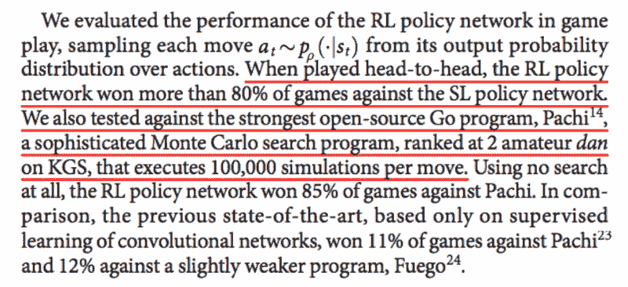****

****在这里，他们测试了这个 RL 策略网络有多精确，仅仅是它自己没有任何 MCTS 算法。正如你所记得的，这个网络可以直接占据一个棋盘位置，并决定一个专家将如何玩它——所以你可以用它来独自玩游戏。
好吧，结果是 RL 微调网络战胜了只对人类动作进行训练的 SL 网络。它还战胜了其他强大的围棋程序。****

****这里必须注意的是*甚至在训练这个 RL 策略网络之前，SL 策略网络就已经比最先进的网络要好了——现在，它已经进一步改进了*！我们甚至还没有进入这个过程的其他部分，比如价值网络。****

****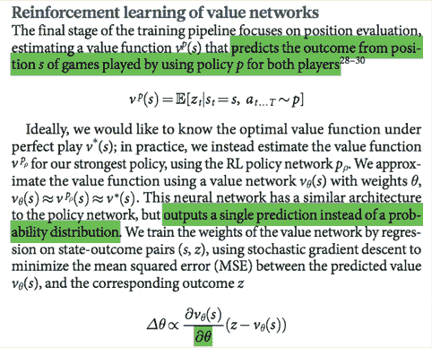****

****你知道小企鹅打喷嚏的声音比狗叫的声音还大吗？事实上，这不是真的，但我想你会喜欢这里的一个小笑话，从上面看起来可怕的方程转移注意力。再来说说这篇文章:我们在这里完成了对露莎的训练。现在回到 Foma——还记得“最优价值函数”吗:v*(s) ->它只能告诉你，如果两位玩家都从那一点开始完美发挥，你在当前的棋盘位置上获胜的可能性有多大？因此，很明显，要训练一个神经网络成为我们的价值函数，我们需要一个完美的玩家……但我们没有。因此，我们刚刚在 T2 展示了我们最强的计划，这恰好是我们的 RL 策略网络。****

****它获取当前的棋盘状态，并输出你赢得游戏的概率。你玩一个游戏，了解结果(赢或输)。每个游戏状态充当一个数据样本，游戏的结果充当标签。所以玩一个 50 步的游戏，你有 50 个数据样本用于价值预测。****

****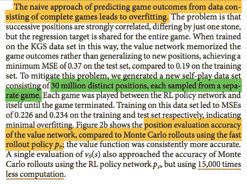****

****哈哈，不。这种方法是幼稚的。你不能使用游戏中的所有 50 步棋，然后将它们添加到数据集中。****

****必须仔细选择训练数据集以避免过度拟合。游戏中的每一步都和下一步非常相似，因为你只走一步，这会给你一个新的位置，对吗？如果你把所有 50 个动作的状态用相同的标签加到训练数据中，你基本上有很多“有点重复”的数据，这导致过度拟合。为了防止这种情况，你只选择看起来非常独特的游戏状态。因此，举例来说，而不是所有的 50 个动作的游戏，你只选择其中的 5 个，并将其添加到训练集。DeepMind 从 3000 万个不同的游戏中提取了 3000 万个位置，以减少出现重复数据的可能性。而且成功了！****

*******现在，这里有一些概念性的东西*** :有两种方法可以评估一个董事会职位的价值。一个选项是一个神奇的最优值函数(就像上面你训练的那个)。另一个选择是简单地使用你们当前的政策(路萨)向未来推出，并看看这一推出的最终结果。显然，真正的游戏很少会按照你的计划进行。但是 DeepMind 比较了这两种选择的效果。您也可以混合使用这两种方法。我们稍后将学习这个“混合参数”,所以请记住这个概念！****

****好吧，你的单个神经网络试图逼近最优值函数甚至比使用首次展示策略进行成千上万次心理模拟更好！Foma 真的很厉害。当他们用两倍精确(但缓慢)的 RL 策略 Lusha 取代快速部署策略，并用那个 T1 做了数千次模拟时，它比 Foma 做得更好。但只是稍微好一点，而且太慢了。所以 Foma 是这场比赛的赢家，她已经证明了自己是不可替代的。****

****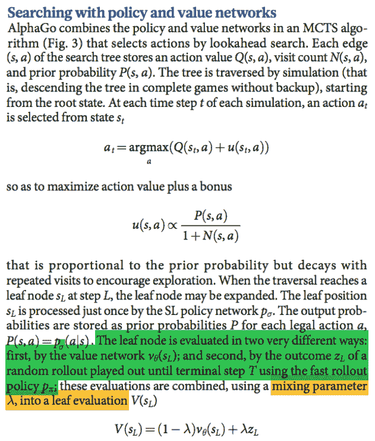****

****现在我们已经训练了策略和价值函数，我们可以将它们与 MCTS 结合，并产生我们的前世界冠军，大师赛的破坏者，一代人的突破，体重二百六十八磅，唯一的 *Alphaaaaa GO！*****

****在这一部分，理想情况下，你应该对 MCTS 算法的内部工作原理有一个稍微深入的了解，但是到目前为止你所学的应该足以让你对这里发生的事情有一个好的感觉。你唯一应该注意的是*我们如何*使用政策概率和价值估计。我们在推出时将它们结合起来，以减少我们希望在每一步推出的移动数量。Q(s，a)表示值函数，u(s，a)是该位置的存储概率。我会解释的。****

****还记得政策网络使用监督学习来预测专家的行动吗？它不仅给出了最可能的走法，而且给出了每一个可能走法的*概率，告诉你这是一个专家走法的可能性有多大。可以为这些动作中的每一个存储这个概率。在这里，他们称之为“先验概率”，他们显然在选择探索哪些行动时使用它。所以基本上，要决定是否探索某一步棋，你要考虑两件事:第一，下这步棋，你赢的可能性有多大？是的，我们已经有了我们的“价值网络”来回答第一个问题。第二个问题是，专家选择这一步的可能性有多大？(如果一招超级不可能被专家选中，为什么还要浪费时间考虑呢。这是我们从策略网络获得的)*****

*****然后我们来谈谈“混合参数”(见后面说到它！).如前所述，要评估职位，你有两个选择:一，简单地使用你一直用来评估状态的价值网络。第二，你可以试着用你目前的策略快速玩一个游戏(假设其他玩家也会玩类似的游戏)，看看你是赢还是输。我们看到了价值函数比一般的展开要好。这里他们将两者结合起来。你试着给每个预测 50-50 的重要性，或者 40-60，或者 0-100，等等。如果你在第一个上附加一个% X，你就必须在第二个上附加 100-X。这就是这个混合参数的意思。您将在本文后面看到这些点击和试验结果。*****

*****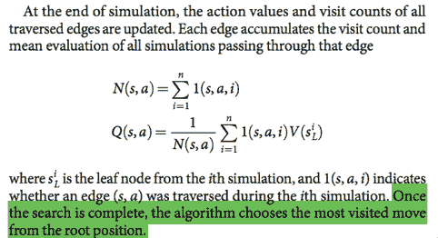*****

*****每次推出后，您都可以使用在模拟过程中获得的信息更新搜索树，以便您的下一次模拟更加智能。在所有模拟的最后，你只需要选择最好的一步。*****

*****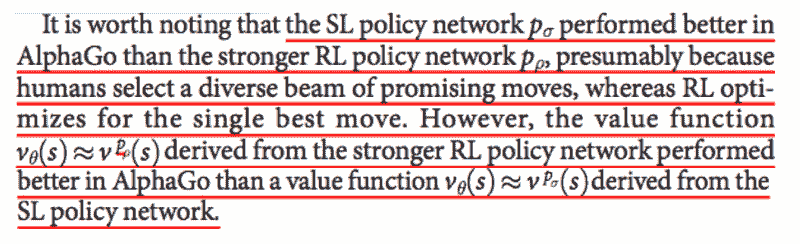*****

*****有趣的见解！*****

*****还记得 RL 微调策略神经网络比 SL 人工训练策略神经网络更好吗？但是当你把它们放在 AlphaGo 的 MCTS 算法中时，使用人类训练的神经网络被证明是比微调神经网络更好的选择。但是在价值函数的情况下(你应该记得使用一个强大的玩家来近似一个完美的玩家)，使用 RL 策略训练 Foma 比使用 SL 策略训练她效果更好。*****

*****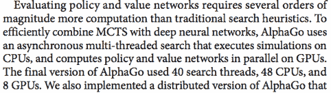*****

*****“进行所有这些评估需要大量的计算能力。我们真的必须拿出大枪才能运行这些该死的程序。”*****

*****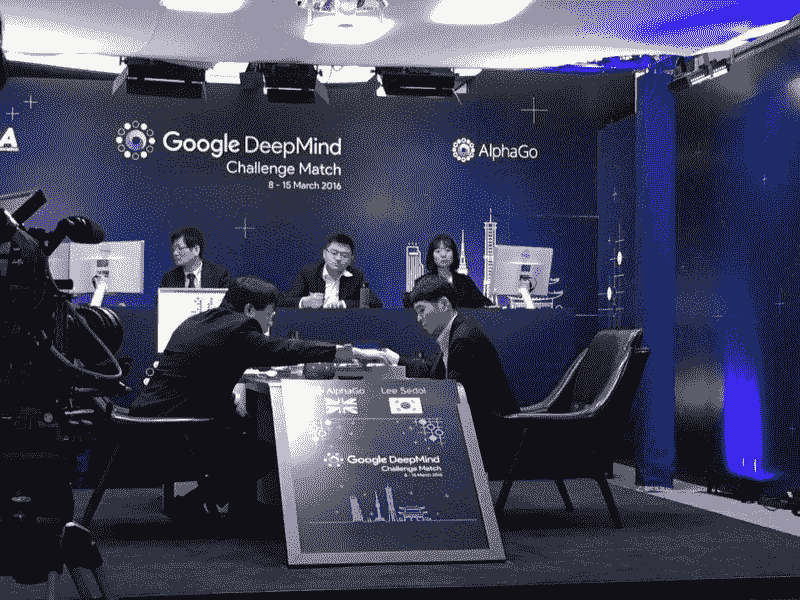

Another photo, from the first AlphaGo vs Lee Sedol game.***** *****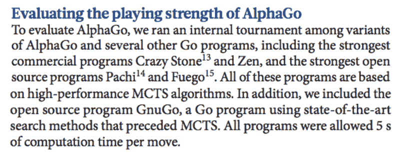*****

*****不言自明。*****

*****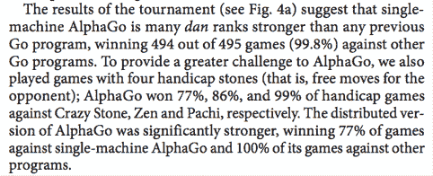*****

*****“哈哈，我们的程序简直把我们之前的所有程序都炸飞了”*****

*****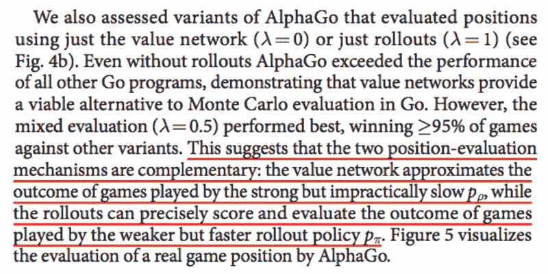*****

*****这又回到了那个“混合参数”。在评估职位时，同等重视价值函数和展开比只使用其中一个表现得更好。其余的是不言自明的，并揭示了一个有趣的见解！*****

*****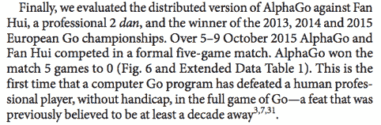*****

*****不言自明。*****

*****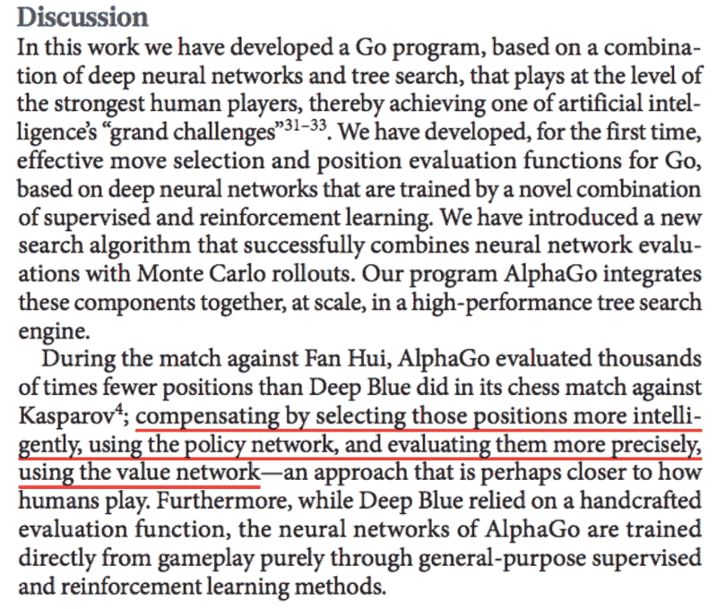*****

*****不言自明。但是再读一遍那个红色下划线的句子。我希望你现在能清楚地看到，这里的这条线基本上是整个研究项目的总结。*****

*****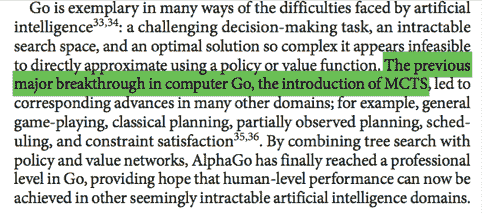*****

*****结束段落。“让我们在这里多吹嘘一点，因为这是我们应得的！”:)*****

*****哦，如果你是一名科学家或科技公司的人，在向非技术人员解释你的科学时需要一些帮助，比如营销、公关或培训等，我可以帮你。在推特上给我留言:@mngrwl*****